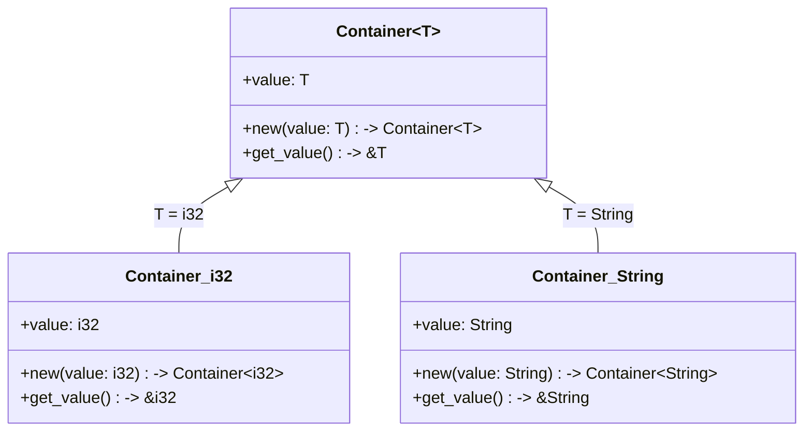

# Rust Generic Methods

## Introduction

In Rust programming, generic methods provide a powerful way to write flexible, reusable code. While we've seen how generics work with functions and structs, generic methods take this concept further by allowing you to define methods that work with different types within the context of a struct or enum implementation.

Generic methods enable you to write code that:
- Works with multiple data types
- Maintains type safety at compile time
- Reduces code duplication
- Creates more flexible APIs

In this tutorial, we'll explore how to define and use generic methods, understand their syntax, and see practical examples of how they can solve real programming problems.

## Generic Methods Basics

### What Are Generic Methods?

Generic methods are methods implemented for a struct or enum that can operate on different types. Unlike regular methods that have fixed parameter and return types, generic methods allow you to parameterize these types.

### Syntax for Generic Methods

Let's start with a simple example of a generic method:

```rust
struct Container<T> {
    value: T,
}

impl<T> Container<T> {
    // Generic constructor method
    fn new(value: T) -> Container<T> {
        Container { value }
    }
    
    // Generic getter method
    fn get_value(&self) -> &T {
        &self.value
    }
}

fn main() {
    // Create a Container with an integer
    let int_container = Container::new(42);
    println!("Integer value: {}", int_container.get_value());
    
    // Create a Container with a string
    let string_container = Container::new(String::from("Hello, Rust!"));
    println!("String value: {}", string_container.get_value());
}
```

Output:
```
Integer value: 42
String value: Hello, Rust!
```

Let's break down the syntax:

1. `struct Container<T>` - We define a generic struct with a type parameter `T`
2. `impl<T> Container<T>` - We implement methods for all instances of Container regardless of what `T` is
3. `fn new(value: T) -> Container<T>` - A generic constructor method that accepts any type `T`
4. `fn get_value(&self) -> &T` - A method that returns a reference to the contained value

## Method-Specific Type Parameters

Generic methods can also define their own type parameters, separate from the struct's type parameters:

```rust
struct Data<T> {
    value: T,
}

impl<T> Data<T> {
    // Method with its own type parameter U
    fn convert<U>(&self, converter: fn(&T) -> U) -> U {
        converter(&self.value)
    }
}

fn main() {
    let num = Data { value: 42 };
    
    // Convert the integer to a string
    let as_string = num.convert(|n| n.to_string());
    println!("As string: {}", as_string);
    
    // Convert the integer to a boolean (true if even)
    let is_even = num.convert(|n| n % 2 == 0);
    println!("Is even: {}", is_even);
}
```

Output:
```
As string: 42
Is even: true
```

In this example:
1. `Data<T>` is a generic struct with type parameter `T`
2. The `convert<U>` method has its own type parameter `U`
3. This allows the method to transform the contained value of type `T` into any other type `U`

## Conditional Method Implementation with Trait Bounds

One of the most powerful features of generic methods is the ability to conditionally implement methods based on trait bounds:

```rust
struct Pair<T> {
    first: T,
    second: T,
}

// Implementation for all types
impl<T> Pair<T> {
    fn new(first: T, second: T) -> Self {
        Pair { first, second }
    }
}

// Implementation only for types that implement PartialOrd + Display
impl<T: PartialOrd + std::fmt::Display> Pair<T> {
    fn cmp_display(&self) {
        if self.first >= self.second {
            println!("The largest member is {}", self.first);
        } else {
            println!("The largest member is {}", self.second);
        }
    }
}

fn main() {
    let pair_of_nums = Pair::new(10, 5);
    pair_of_nums.cmp_display();
    
    let pair_of_chars = Pair::new('a', 'z');
    pair_of_chars.cmp_display();
}
```

Output:
```
The largest member is 10
The largest member is z
```

In this example:
1. `Pair<T>` has a `new` method available for all types
2. The `cmp_display` method is only available when `T` implements both `PartialOrd` and `Display` traits
3. This means we can only call `cmp_display` on `Pair` instances where the type can be compared and displayed

## Generic Methods with Different Type Parameters

You can also implement methods for specific instances of generic types:

```rust
struct Value<T> {
    data: T,
}

// Implementation for all Value<T>
impl<T> Value<T> {
    fn get(&self) -> &T {
        &self.data
    }
}

// Implementation specifically for Value<String>
impl Value<String> {
    fn length(&self) -> usize {
        self.data.len()
    }
}

// Implementation specifically for Value<i32>
impl Value<i32> {
    fn is_positive(&self) -> bool {
        self.data > 0
    }
}

fn main() {
    let text = Value { data: String::from("Hello, Rust!") };
    let number = Value { data: 42 };
    
    // Method available on all Value<T>
    println!("Text: {}", text.get());
    println!("Number: {}", number.get());
    
    // Method only available on Value<String>
    println!("Text length: {}", text.length());
    
    // Method only available on Value<i32>
    println!("Number is positive: {}", number.is_positive());
}
```

Output:
```
Text: Hello, Rust!
Number: 42
Text length: 12
Number is positive: true
```

This pattern allows you to provide specialized behavior for specific types while maintaining generic behavior for all types.

## Generic Methods with Associated Types

Rust also allows you to use associated types from traits in your generic methods:

```rust
use std::iter::Iterator;

struct Collection<T> {
    items: Vec<T>,
}

impl<T> Collection<T> {
    fn new() -> Self {
        Collection { items: Vec::new() }
    }
    
    fn add(&mut self, item: T) {
        self.items.push(item);
    }
    
    // Method using iterator's associated type
    fn process_items<F, R>(&self, processor: F) -> Vec<R>
    where
        F: Fn(&T) -> R,
    {
        self.items.iter().map(processor).collect()
    }
}

fn main() {
    let mut nums = Collection::new();
    nums.add(1);
    nums.add(2);
    nums.add(3);
    
    // Process items, doubling each one
    let doubled = nums.process_items(|n| n * 2);
    println!("Doubled: {:?}", doubled);
    
    // Process items, converting to strings
    let as_strings = nums.process_items(|n| n.to_string());
    println!("As strings: {:?}", as_strings);
}
```

Output:
```
Doubled: [2, 4, 6]
As strings: ["1", "2", "3"]
```

In this example, the `process_items` method works with any function that transforms items of type `T` into any other type `R`.

## Practical Example: A Generic Result Handling Wrapper

Here's a more practical example showing how generic methods can be used to create a wrapper for handling operation results:

```rust
#[derive(Debug)]
enum Status {
    Success,
    Warning,
    Error,
}

struct OperationResult<T> {
    data: Option<T>,
    status: Status,
    message: String,
}

impl<T> OperationResult<T> {
    fn success(data: T, message: &str) -> Self {
        OperationResult {
            data: Some(data),
            status: Status::Success,
            message: message.to_string(),
        }
    }
    
    fn warning(data: T, message: &str) -> Self {
        OperationResult {
            data: Some(data),
            status: Status::Warning,
            message: message.to_string(),
        }
    }
    
    fn error(message: &str) -> Self {
        OperationResult {
            data: None,
            status: Status::Error,
            message: message.to_string(),
        }
    }
    
    fn is_success(&self) -> bool {
        matches!(self.status, Status::Success)
    }
    
    fn unwrap(self) -> T {
        match self.data {
            Some(data) => data,
            None => panic!("Called unwrap on an error result: {}", self.message),
        }
    }
    
    // Generic map method
    fn map<U, F>(self, mapper: F) -> OperationResult<U>
    where
        F: FnOnce(T) -> U,
    {
        match self.data {
            Some(data) => OperationResult {
                data: Some(mapper(data)),
                status: self.status,
                message: self.message,
            },
            None => OperationResult {
                data: None,
                status: self.status,
                message: self.message,
            },
        }
    }
}

// Example functions that return operation results
fn divide(a: i32, b: i32) -> OperationResult<f64> {
    if b == 0 {
        OperationResult::error("Division by zero")
    } else if b < 0 {
        OperationResult::warning(a as f64 / b as f64, "Dividing by a negative number")
    } else {
        OperationResult::success(a as f64 / b as f64, "Division successful")
    }
}

fn main() {
    let result1 = divide(10, 2);
    let result2 = divide(10, 0);
    let result3 = divide(10, -2);
    
    println!("Result 1 success: {}, data: {:?}, message: {}", 
        result1.is_success(), result1.data, result1.message);
    println!("Result 2 success: {}, data: {:?}, message: {}", 
        result2.is_success(), result2.data, result2.message);
    println!("Result 3 success: {}, data: {:?}, message: {}", 
        result3.is_success(), result3.data, result3.message);
    
    // Using the map method to transform successful results
    let formatted = divide(10, 2).map(|value| format!("The result is {:.2}", value));
    println!("Formatted result: {:?}", formatted.unwrap());
}
```

Output:
```
Result 1 success: true, data: Some(5.0), message: Division successful
Result 2 success: false, data: None, message: Division by zero
Result 3 success: false, data: Some(-5.0), message: Dividing by a negative number
Formatted result: The result is 5.00
```

This example demonstrates how generic methods can create a powerful and flexible API for error handling, with methods that:
1. Create different result states (success, warning, error)
2. Check result status
3. Extract data safely
4. Transform data with the `map` method while preserving the result context

## Visualizing Generic Methods

Here's a diagram that visualizes how generic methods work with different types:



This diagram shows how the generic `Container<T>` struct is instantiated with different types, resulting in specific implementations of the methods for each type.

## Common Patterns and Best Practices

When working with generic methods in Rust, consider these best practices:

1. **Use meaningful type parameter names**:
   - Use `T` for general types
   - Use more specific names like `K` and `V` for key-value pairs
   - Use descriptive names like `Item` or `Output` for domain-specific types

2. **Apply trait bounds appropriately**:
   - Only require the traits that are actually needed
   - Use `where` clauses for complex trait bounds to improve readability

3. **Consider type inference**:
   - Rust can often infer generic types, making your API easier to use
   - Test your methods to ensure they work well with type inference

4. **Document type parameters**:
   - Clearly explain what each type parameter represents
   - Document any assumptions about the types

5. **Separate generic and non-generic methods**:
   - Sometimes it makes sense to have separate `impl` blocks for generic and non-generic methods

## Summary

In this tutorial, we've explored Rust generic methods - a powerful feature that allows for flexible, reusable code. We've covered:

- Basic syntax for implementing generic methods
- Adding method-specific type parameters
- Conditionally implementing methods with trait bounds
- Implementing methods for specific types
- Working with associated types
- Building a practical example with generic methods

Generic methods are a fundamental tool in Rust for building flexible APIs and abstractions. By parameterizing your methods with type variables, you can write code that works across many types while maintaining Rust's strong type safety guarantees.

## Exercises

To solidify your understanding of generic methods, try these exercises:

1. Implement a generic `Stack<T>` struct with `push`, `pop`, and `peek` methods.

2. Create a `Result<T, E>` wrapper with methods for transforming and combining results.

3. Implement a `Pair<T, U>` struct with generic methods that work when both types implement specific traits.

4. Design a generic `Cache<K, V>` with methods for adding, retrieving, and removing items.

5. Create a collection type with methods that only become available when the contained type implements specific traits.

## Additional Resources

- [Rust Book: Generic Data Types](https://doc.rust-lang.org/book/ch10-01-syntax.html)
- [Rust By Example: Generics](https://doc.rust-lang.org/rust-by-example/generics.html)
- [Rust API Guidelines: Flexibility](https://rust-lang.github.io/api-guidelines/flexibility.html)
- [The Rust Standard Library Documentation](https://doc.rust-lang.org/std/index.html) - Many examples of generic methods