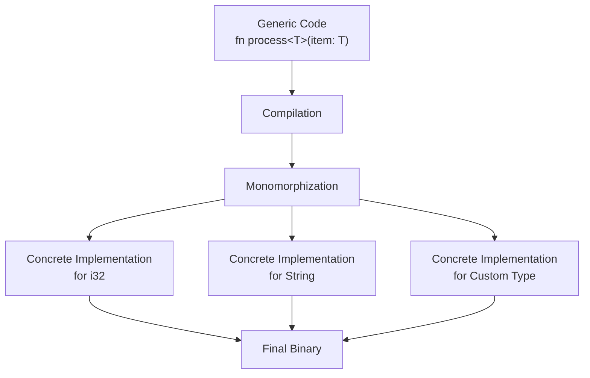

# Rust Type Parameters

## Introduction

Type parameters are a core feature of Rust's generics system that allows you to write flexible, reusable code that works with different data types. Instead of writing separate functions or structs for each data type, you can use type parameters to define a single implementation that works across multiple types.

In this guide, we'll explore how type parameters work in Rust, how to implement them in your code, and see real-world examples of their applications.

## What Are Type Parameters?

Type parameters act as placeholders for concrete types that will be specified later when the code is used. They enable you to write generic functions, structs, enums, and implementations that can operate on different types while maintaining Rust's strong type safety.

Let's start with a simple example:

```rust
// Without type parameters (specific to i32)
fn largest_i32(list: &[i32]) -> i32 {
    let mut largest = list[0];
    
    for &item in list {
        if item > largest {
            largest = item;
        }
    }
    
    largest
}

// With type parameters (works for any type that implements PartialOrd)
fn largest<T: PartialOrd>(list: &[T]) -> &T {
    let mut largest = &list[0];
    
    for item in list {
        if item > largest {
            largest = item;
        }
    }
    
    largest
}
```

In the second function, `<T: PartialOrd>` introduces a type parameter `T` with a constraint that it must implement the `PartialOrd` trait (which allows comparison with `>`).

## Syntax of Type Parameters

Type parameters are specified within angle brackets `<>` after the function name or before the struct/enum definition:

```rust
// Function with type parameter
fn function_name<T>(parameter: T) -> T {
    // function body
}

// Struct with type parameter
struct Point<T> {
    x: T,
    y: T,
}

// Enum with type parameter
enum Option<T> {
    Some(T),
    None,
}

// Method implementation with type parameter
impl<T> Point<T> {
    fn x(&self) -> &T {
        &self.x
    }
}
```

## Using Multiple Type Parameters

You can specify multiple type parameters by separating them with commas:

```rust
// A struct that can have different types for x and y
struct Point<T, U> {
    x: T,
    y: U,
}

// Create instances with different type combinations
let integer_and_float = Point { x: 5, y: 4.0 };
let both_strings = Point { x: "Hello", y: "World" };
```

Let's implement a method for this struct:

```rust
impl<T, U> Point<T, U> {
    fn mixup<V, W>(self, other: Point<V, W>) -> Point<T, W> {
        Point {
            x: self.x,
            y: other.y,
        }
    }
}
```

Example usage:

```rust
let p1 = Point { x: 5, y: 10.4 };
let p2 = Point { x: "Hello", y: 'c' };

let p3 = p1.mixup(p2);

println!("p3.x = {}, p3.y = {}", p3.x, p3.y);
// Output: p3.x = 5, p3.y = c
```

## Type Parameter Constraints

In many cases, you'll want to constrain what types can be used with your generic code. This is done by specifying trait bounds:

```rust
// T must implement both Display and PartialOrd traits
fn print_and_compare<T: std::fmt::Display + PartialOrd>(t: T, u: T) {
    println!("The largest value is: {}", if t > u { t } else { u });
}
```

For multiple or complex constraints, you can use the `where` clause for clarity:

```rust
fn complicated_function<T, U>(t: T, u: U) -> i32
    where T: std::fmt::Display + Clone,
          U: Clone + std::fmt::Debug
{
    // function body
    0
}
```

## Generic Type Parameters vs. Concrete Types

To understand the difference between generic and concrete types, let's visualize the compilation process:



When your code compiles, Rust performs a process called *monomorphization*, which creates specific implementations for each concrete type used with your generic code.

## Default Type Parameters

Rust allows you to specify default types for your type parameters:

```rust
struct Queue<T=String> {
    items: Vec<T>,
}

// No type specified, uses the default (String)
let string_queue = Queue { items: vec![] };

// Explicitly specify a different type
let integer_queue: Queue<i32> = Queue { items: vec![] };
```

## Real-world Application: A Generic Cache

Let's build a simple but practical example - a generic cache that can store any type that can be cloned:

```rust
struct Cache<T: Clone> {
    data: Option<T>,
}

impl<T: Clone> Cache<T> {
    fn new() -> Self {
        Cache { data: None }
    }
    
    fn set(&mut self, value: T) {
        self.data = Some(value);
    }
    
    fn get(&self) -> Option<T> {
        self.data.clone()
    }
    
    fn clear(&mut self) {
        self.data = None;
    }
}
```

Example usage:

```rust
// Integer cache
let mut int_cache = Cache::new();
int_cache.set(42);
println!("Cached integer: {:?}", int_cache.get());  // Output: Cached integer: Some(42)

// String cache
let mut string_cache = Cache::<String>::new();
string_cache.set("Hello, Rust!".to_string());
println!("Cached string: {:?}", string_cache.get());  // Output: Cached string: Some("Hello, Rust!")
```

## Type Parameters with Associated Types

Type parameters can be used alongside associated types from traits:

```rust
use std::iter::Iterator;

fn process_iterator<T, I>(mut iterator: I) -> Vec<T>
where
    I: Iterator<Item = T>,
{
    let mut result = Vec::new();
    while let Some(item) = iterator.next() {
        result.push(item);
    }
    result
}

// Usage
let numbers = vec![1, 2, 3, 4, 5];
let collected = process_iterator(numbers.iter().map(|x| x * 2));
println!("{:?}", collected);  // Output: [2, 4, 6, 8, 10]
```

## Type Parameters vs. Trait Objects

Type parameters provide static dispatch (resolved at compile time), while trait objects provide dynamic dispatch (resolved at runtime). Here's a comparison:

```rust
// Using type parameters (static dispatch)
fn process_static<T: std::fmt::Display>(item: T) {
    println!("Static: {}", item);
}

// Using trait objects (dynamic dispatch)
fn process_dynamic(item: &dyn std::fmt::Display) {
    println!("Dynamic: {}", item);
}

// Usage
process_static(42);              // Generates code specific to i32
process_static("Hello");         // Generates code specific to &str
process_dynamic(&42);            // Uses runtime polymorphism
process_dynamic(&"Hello");       // Uses runtime polymorphism
```

## Common Pitfalls and Solutions

### 1. Unimplemented Traits

If you try to use operations that aren't available for your type parameter, you'll get compile-time errors:

```rust
// This won't compile!
fn add_numbers<T>(a: T, b: T) -> T {
    a + b  // Error: the `+` operation is not defined for all possible T
}

// Solution: Add a trait bound
fn add_numbers<T: std::ops::Add<Output = T>>(a: T, b: T) -> T {
    a + b  // Now this works for any type that implements Add
}
```

### 2. Returning References to Generic Types

Be careful when returning references to generic values, as they may have different lifetimes:

```rust
// This won't compile without lifetime parameters
fn largest<T: PartialOrd>(list: &[T]) -> &T {
    // ...
}

// Solution: Add a lifetime parameter
fn largest<'a, T: PartialOrd>(list: &'a [T]) -> &'a T {
    // ...
}
```

## Exercises

1. Implement a `Pair<T>` struct that holds two values of the same type, with a method to return the larger value if the type implements `PartialOrd`.

2. Create a generic `Stack<T>` struct with `push`, `pop`, and `peek` methods.

3. Write a function that takes two different collections implementing `IntoIterator` and returns a vector containing all elements from both collections.

4. Implement a generic `Result` processor that can handle different error types.

## Summary

Type parameters are a powerful feature in Rust that allow you to write flexible, reusable code without sacrificing type safety. Key points to remember:

- Type parameters are specified with angle brackets `<T>` and can be used in functions, structs, enums, and implementations
- Constraints are added with trait bounds (`T: Trait`)
- Multiple type parameters can be used together (`<T, U>`)
- Type parameters enable compile-time polymorphism through monomorphization
- Generic code with type parameters has zero runtime cost compared to hand-written specialized code

By mastering type parameters, you'll be able to write more concise, maintainable, and reusable Rust code.

## Additional Resources

- [The Rust Book - Generic Data Types](https://doc.rust-lang.org/book/ch10-01-syntax.html)
- [Rust by Example - Generics](https://doc.rust-lang.org/rust-by-example/generics.html)
- [Rust API Guidelines - Generics](https://rust-lang.github.io/api-guidelines/about.html)
- [The Rustonomicon - Subtyping and Variance](https://doc.rust-lang.org/nomicon/subtyping.html)