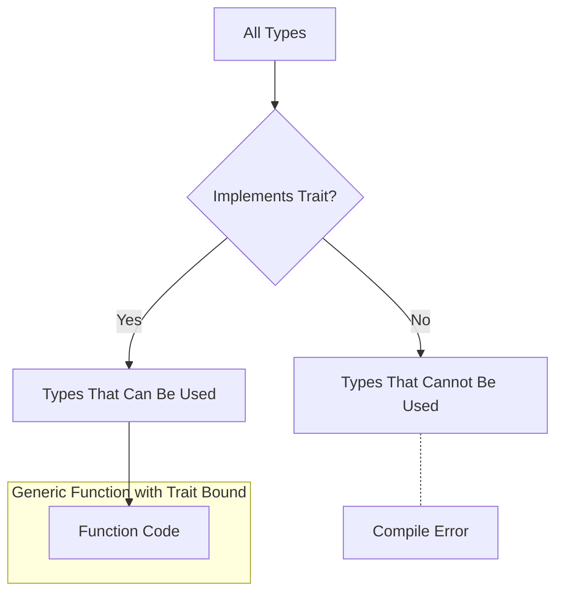

# Rust Trait Bounds

## Introduction

When working with generic types in Rust, you'll often want to specify that these types must have certain capabilities or behaviors. This is where **trait bounds** come into play. Trait bounds allow you to constrain generic types to only those that implement specific traits, giving you more control and flexibility in your code.

In this tutorial, you'll learn:
- What trait bounds are and why they're useful
- How to use trait bounds with generic functions and structs
- Different ways to specify trait bounds in Rust
- Real-world examples and common patterns

## Understanding Trait Bounds

### What Are Trait Bounds?

Trait bounds are constraints that you can place on generic type parameters to ensure they implement specific traits. They let you tell the Rust compiler: "This generic type must implement these specific traits."

For example, if you want to write a function that works with any type that can be printed to the console, you would use the `Display` trait as a bound.

### Why Use Trait Bounds?

Trait bounds provide several benefits:

1. **Type Safety**: They ensure that generic code only works with types that have the required functionality
2. **Better Error Messages**: Compile-time errors happen when you try to use a type that doesn't meet the requirements
3. **Self-documenting Code**: They make it clear what capabilities a type needs to have
4. **Code Reuse**: They allow you to write flexible code that works with many different types

## Basic Syntax for Trait Bounds

Let's look at the different ways to specify trait bounds in Rust:

### Using the `where` Clause

```rust
fn print_information<T>(item: T)
where
    T: Display,
{
    println!("Information: {}", item);
}
```

### Using the Inline Syntax

```rust
fn print_information<T: Display>(item: T) {
    println!("Information: {}", item);
}
```

Both approaches accomplish the same thing, but the `where` clause is often preferred for more complex bounds as it's more readable.

## Examples of Trait Bounds in Action

Let's explore some practical examples to understand how trait bounds work:

### Example 1: Simple Trait Bound

```rust
fn largest<T: PartialOrd>(list: &[T]) -> &T {
    let mut largest = &list[0];

    for item in list {
        if item > largest {
            largest = item;
        }
    }

    largest
}

fn main() {
    let number_list = vec![34, 50, 25, 100, 65];
    let result = largest(&number_list);
    println!("The largest number is {}", result);
    // Output: The largest number is 100

    let char_list = vec!['y', 'm', 'a', 'q'];
    let result = largest(&char_list);
    println!("The largest char is {}", result);
    // Output: The largest char is y
}
```

In this example, the `largest` function works with any type `T` that implements the `PartialOrd` trait (which allows for comparison with the `>` operator).

### Example 2: Multiple Trait Bounds

Sometimes you need a type to implement multiple traits. You can specify multiple trait bounds using the `+` syntax:

```rust
use std::fmt::{Display, Debug};

fn print_and_debug<T: Display + Debug>(item: T) {
    println!("Display: {}", item);
    println!("Debug: {:?}", item);
}

fn main() {
    print_and_debug(42);
    // Output:
    // Display: 42
    // Debug: 42
}
```

Here, the type `T` must implement both the `Display` and `Debug` traits.

### Example 3: Trait Bounds with Structs and Implementations

Trait bounds are also useful when defining generic structs and their implementations:

```rust
struct Pair<T> {
    first: T,
    second: T,
}

impl<T> Pair<T> {
    fn new(first: T, second: T) -> Self {
        Self { first, second }
    }
}

// This implementation only exists for types that implement Display and PartialOrd
impl<T: Display + PartialOrd> Pair<T> {
    fn compare_and_print(&self) {
        if self.first >= self.second {
            println!("The largest member is {}", self.first);
        } else {
            println!("The largest member is {}", self.second);
        }
    }
}

fn main() {
    let pair = Pair::new(42, 27);
    pair.compare_and_print();
    // Output: The largest member is 42
}
```

In this example, all `Pair<T>` instances have the `new` method, but only pairs where `T` implements both `Display` and `PartialOrd` have the `compare_and_print` method.

## Advanced Trait Bounds

### Conditional Implementation with Trait Bounds

One powerful feature in Rust is conditional implementation, also known as blanket implementations:

```rust
// Implement the ToString trait for any type that implements Display
impl<T: Display> ToString for T {
    // implementation details...
}
```

This is how the standard library implements `ToString` for any type that already implements `Display`.

### Using Associated Types in Trait Bounds

Some traits have associated types, and you can specify requirements for those as well:

```rust
fn process_items<I>(items: I)
where
    I: Iterator,
    I::Item: Display,
{
    for item in items {
        println!("Item: {}", item);
    }
}

fn main() {
    let numbers = vec![1, 2, 3, 4, 5];
    process_items(numbers.iter());
    // Output:
    // Item: 1
    // Item: 2
    // Item: 3
    // Item: 4
    // Item: 5
}
```

Here, we require that `I` implements `Iterator` and that its associated type `Item` implements `Display`.

## Real-World Application: A Generic Data Repository

Let's see how trait bounds can be used in a more realistic scenario - building a simple data repository:

```rust
use std::fmt::Debug;

// Define a trait for database entities
trait Entity {
    fn id(&self) -> u64;
    fn display_info(&self);
}

// A generic repository that works with any type that implements Entity
struct Repository<T: Entity + Debug> {
    items: Vec<T>,
}

impl<T: Entity + Debug> Repository<T> {
    fn new() -> Self {
        Self { items: Vec::new() }
    }

    fn add(&mut self, item: T) {
        self.items.push(item);
    }

    fn find_by_id(&self, id: u64) -> Option<&T> {
        self.items.iter().find(|item| item.id() == id)
    }

    fn list_all(&self) {
        println!("Repository contents:");
        for item in &self.items {
            item.display_info();
        }
    }
}

// Example usage with a concrete type
#[derive(Debug)]
struct User {
    id: u64,
    name: String,
    email: String,
}

impl Entity for User {
    fn id(&self) -> u64 {
        self.id
    }

    fn display_info(&self) {
        println!("User: {} ({})", self.name, self.email);
    }
}

fn main() {
    let mut user_repo = Repository::<User>::new();
    
    user_repo.add(User {
        id: 1,
        name: String::from("Alice"),
        email: String::from("alice@example.com"),
    });
    
    user_repo.add(User {
        id: 2,
        name: String::from("Bob"),
        email: String::from("bob@example.com"),
    });
    
    user_repo.list_all();
    
    if let Some(user) = user_repo.find_by_id(1) {
        println!("Found user: {:?}", user);
    }
}

// Output:
// Repository contents:
// User: Alice (alice@example.com)
// User: Bob (bob@example.com)
// Found user: User { id: 1, name: "Alice", email: "alice@example.com" }
```

In this example, the `Repository<T>` struct is generic over any type `T` that implements both the `Entity` and `Debug` traits. This allows us to create repositories for different entity types while reusing the same implementation.

## Understanding Trait Bound Errors

When you're starting with trait bounds, you might encounter compile-time errors. Let's look at a common error and how to fix it:

```rust
fn main() {
    let numbers = vec![1, 2, 3];
    let result = largest(&numbers);
    println!("The largest number is {}", result);
}

fn largest<T>(list: &[T]) -> &T {
    let mut largest = &list[0];

    for item in list {
        if item > largest { // Error: binary operation `>` cannot be applied to type `&T`
            largest = item;
        }
    }

    largest
}
```

The compiler error would tell you that `T` doesn't implement the `PartialOrd` trait. To fix this, add the trait bound:

```rust
fn largest<T: PartialOrd>(list: &[T]) -> &T {
    // implementation remains the same
}
```

## Visual Representation of Trait Bounds

Here's a diagram showing how trait bounds constrain generic types:



## Summary

Trait bounds are a powerful feature in Rust's type system that allow you to constrain generic types based on the traits they implement. They help you write code that is both flexible and safe, allowing for code reuse without sacrificing compile-time checks.

Key takeaways:
- Trait bounds ensure generic types have the necessary functionality
- You can specify trait bounds using the `where` clause or the inline syntax
- Multiple trait bounds can be combined using the `+` operator
- Trait bounds can be used with functions, structs, and implementations
- Conditional implementations allow you to implement traits based on other trait bounds

## Additional Resources

- [The Rust Book: Traits as Parameters](https://doc.rust-lang.org/book/ch10-02-traits.html)
- [Rust by Example: Bounds](https://doc.rust-lang.org/rust-by-example/generics/bounds.html)
- [Rust API Guidelines](https://rust-lang.github.io/api-guidelines/)

## Exercises

1. Write a function `sum` that calculates the sum of all elements in a slice, with a trait bound that ensures the elements can be added together.

2. Create a generic `Sorter<T>` struct that can sort any collection of items that implement the `PartialOrd` trait.

3. Implement a `JsonSerializable` trait and a function that converts any type implementing this trait to a JSON string.

4. Create a function that works with any iterator yielding items that can be converted to strings.

5. Implement a `Logger<T>` struct that logs information about items, but only if they implement both `Debug` and a custom `LogInfo` trait.