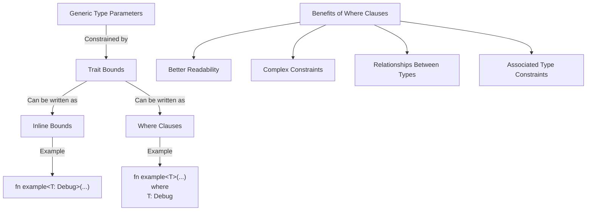

# Rust Where Clauses

## Introduction

When working with generics in Rust, you'll often need to specify trait bounds to constrain what types can be used with your generic functions and structures. While you can specify these constraints directly in the angle brackets (`<>`), Rust provides a more elegant solution: `where` clauses.

In this tutorial, we'll explore how `where` clauses work, why they're useful, and how to use them effectively in your Rust code.

## What Are Where Clauses?

A `where` clause is a Rust feature that allows you to specify trait bounds for generic types in a cleaner, more readable format. Instead of putting all your constraints inside angle brackets, you can move them to a separate `where` clause after the function signature or struct definition.

Let's compare the two approaches:

### Without Where Clause:

```rust
fn process_data<T: Clone + Debug, U: Display + PartialEq>(data: T, output: U) -> String {
    // Function implementation
    format!("{:?} - {}", data, output)
}
```

### With Where Clause:

```rust
fn process_data<T, U>(data: T, output: U) -> String 
where
    T: Clone + Debug,
    U: Display + PartialEq,
{
    // Function implementation
    format!("{:?} - {}", data, output)
}
```

Notice how the second version is much easier to read, especially when dealing with multiple generic parameters and trait bounds.

## When to Use Where Clauses

You should consider using `where` clauses when:

1. You have multiple generic types with multiple trait bounds
2. You need to specify complex relationships between generic types
3. You want to improve code readability
4. You need to use more advanced trait bounds that can't be expressed easily in angle brackets

## Basic Syntax

The basic syntax for a `where` clause is:

```rust
fn function_name<T1, T2, ...>(parameters) -> return_type
where
    T1: Trait1 + Trait2,
    T2: Trait3 + Trait4,
    // More constraints...
{
    // Function body
}
```

For structs and enums:

```rust
struct StructName<T1, T2, ...>
where
    T1: Trait1 + Trait2,
    T2: Trait3 + Trait4,
    // More constraints...
{
    // Struct fields
}
```

## Examples of Where Clauses

Let's look at some practical examples of using `where` clauses in Rust code.

### Example 1: Basic Function with Where Clause

```rust
use std::fmt::Display;

fn print_pair<T, U>(first: T, second: U)
where
    T: Display,
    U: Display,
{
    println!("Pair: {} and {}", first, second);
}

fn main() {
    print_pair(42, "hello");
    print_pair(3.14, true);
}
```

**Output:**
```
Pair: 42 and hello
Pair: 3.14 and true
```

In this example, we're using a `where` clause to specify that both generic types `T` and `U` must implement the `Display` trait, allowing them to be printed with the `{}` formatter.

### Example 2: Generic Struct with Where Clause

```rust
use std::fmt::Debug;

struct Pair<T, U>
where
    T: Debug,
    U: Debug,
{
    first: T,
    second: U,
}

impl<T, U> Pair<T, U>
where
    T: Debug,
    U: Debug,
{
    fn new(first: T, second: U) -> Self {
        Pair { first, second }
    }
    
    fn debug_print(&self) {
        println!("Pair contains {:?} and {:?}", self.first, self.second);
    }
}

fn main() {
    let pair = Pair::new(42, "hello");
    pair.debug_print();
}
```

**Output:**
```
Pair contains 42 and "hello"
```

Here, we've created a generic `Pair` struct with a `where` clause that requires both types to implement `Debug`. We also use the same constraint in the `impl` block.

## Advanced Where Clause Examples

### Example 3: Associated Types in Where Clauses

```rust
use std::iter::Iterator;

fn find_max<I>(iterator: I) -> Option<I::Item>
where
    I: Iterator,
    I::Item: Ord,
{
    iterator.max()
}

fn main() {
    let numbers = vec![1, 5, 3, 9, 2];
    let max = find_max(numbers.into_iter());
    println!("Maximum value: {:?}", max);
}
```

**Output:**
```
Maximum value: Some(9)
```

In this example, we're using a `where` clause with an associated type constraint. We specify that `I` must be an `Iterator`, and its associated `Item` type must implement the `Ord` trait (for ordering).

### Example 4: Complex Relationships Between Types

```rust
use std::hash::Hash;
use std::collections::HashMap;

fn count_occurrences<T, C>(collection: C) -> HashMap<T, usize>
where
    T: Eq + Hash + Clone,
    C: IntoIterator<Item = T>,
{
    let mut counts = HashMap::new();
    
    for item in collection {
        *counts.entry(item).or_insert(0) += 1;
    }
    
    counts
}

fn main() {
    let words = vec!["apple", "banana", "apple", "cherry", "banana", "apple"];
    let word_counts = count_occurrences(words);
    
    for (word, count) in word_counts {
        println!("{}: {}", word, count);
    }
}
```

**Output:**
```
cherry: 1
banana: 2
apple: 3
```

This example uses a `where` clause to specify complex relationships: the item type `T` must implement `Eq`, `Hash`, and `Clone`, while the collection `C` must implement `IntoIterator` with `Item` being of type `T`.

## Where Clauses vs. Inline Trait Bounds

Let's compare where clauses with inline trait bounds to understand when each approach might be preferable.

### When to Use Inline Trait Bounds

```rust
// Simple cases with few constraints
fn simple_function<T: Clone>(item: T) -> T {
    item.clone()
}
```

### When to Use Where Clauses

```rust
// Complex cases with multiple constraints
fn complex_function<T, U, V>(t: T, u: U) -> V
where
    T: Clone + std::fmt::Debug,
    U: AsRef<str> + std::fmt::Display,
    V: From<T> + From<String>,
{
    // Implementation
    let debug_t = format!("{:?}", t);
    let string_u = u.to_string();
    
    V::from(string_u)
}
```

The main advantages of `where` clauses are:

1. **Readability**: They separate type parameters from their constraints
2. **Flexibility**: They allow for more complex trait bounds
3. **Maintainability**: They make it easier to add, remove, or modify constraints

## Real-World Example: A Generic Data Processor

Let's build a more comprehensive example that demonstrates where clauses in a real-world scenario:

```rust
use std::fmt::{Debug, Display};
use std::str::FromStr;
use std::error::Error;

// A generic data processor that can convert between different types
struct DataProcessor<T, U>
where
    T: Debug + Clone,
    U: Display + FromStr,
    <U as FromStr>::Err: Error,
{
    source_data: Vec<T>,
    phantom: std::marker::PhantomData<U>,
}

impl<T, U> DataProcessor<T, U>
where
    T: Debug + Clone + Display,
    U: Display + FromStr,
    <U as FromStr>::Err: Error,
{
    fn new(source_data: Vec<T>) -> Self {
        DataProcessor {
            source_data,
            phantom: std::marker::PhantomData,
        }
    }
    
    fn process(&self) -> Vec<Result<U, Box<dyn Error>>> {
        self.source_data
            .iter()
            .map(|item| {
                // Convert T to string
                let item_str = item.to_string();
                
                // Try to parse the string to U
                let result = U::from_str(&item_str)
                    .map_err(|e| Box::new(e) as Box<dyn Error>);
                
                result
            })
            .collect()
    }
    
    fn display_all(&self) {
        println!("Source data:");
        for item in &self.source_data {
            println!("  {:?}", item);
        }
    }
}

fn main() {
    // Process integers to floats
    let int_processor = DataProcessor::<i32, f64>::new(vec![1, 2, 3, 4, 5]);
    int_processor.display_all();
    
    let results = int_processor.process();
    println!("Processed results:");
    for result in results {
        match result {
            Ok(val) => println!("  Success: {}", val),
            Err(e) => println!("  Error: {}", e),
        }
    }
    
    // Process strings to integers with potential errors
    let string_processor = DataProcessor::<String, i32>::new(
        vec![
            "123".to_string(),
            "456".to_string(),
            "not_a_number".to_string(),
            "789".to_string(),
        ]
    );
    string_processor.display_all();
    
    let results = string_processor.process();
    println!("Processed results:");
    for result in results {
        match result {
            Ok(val) => println!("  Success: {}", val),
            Err(e) => println!("  Error: {}", e),
        }
    }
}
```

**Output:**
```
Source data:
  1
  2
  3
  4
  5
Processed results:
  Success: 1
  Success: 2
  Success: 3
  Success: 4
  Success: 5
Source data:
  "123"
  "456"
  "not_a_number"
  "789"
Processed results:
  Success: 123
  Success: 456
  Error: invalid digit found in string
  Success: 789
```

In this example, we create a generic `DataProcessor` that can convert between different types. We use where clauses to specify complex relationships between the generic types:

1. `T` must implement `Debug` and `Clone`
2. `U` must implement `Display` and `FromStr`
3. The associated error type for `U`'s `FromStr` implementation must implement `Error`

This would be much harder to express and read without where clauses!

## Where Clauses with Lifetime Parameters

Where clauses can also be used with lifetime parameters, allowing you to specify relationships between lifetimes:

```rust
fn longest_with_announcement<'a, T>(
    x: &'a str,
    y: &'a str,
    ann: T,
) -> &'a str
where
    T: Display,
{
    println!("Announcement! {}", ann);
    if x.len() > y.len() {
        x
    } else {
        y
    }
}

fn main() {
    let string1 = String::from("abcd");
    let string2 = "xyz";
    
    let result = longest_with_announcement(
        &string1,
        string2,
        "I'm comparing these strings!"
    );
    
    println!("The longest string is {}", result);
}
```

**Output:**
```
Announcement! I'm comparing these strings!
The longest string is abcd
```

## Visual Representation of Where Clauses

Here's a visual representation of how where clauses fit into Rust's type system:



## Summary

In this tutorial, we explored Rust's `where` clauses, a powerful feature that helps make generic code more readable and expressive. Key takeaways include:

1. Where clauses allow you to move trait bounds from angle brackets to a separate clause after the function or type signature
2. They're especially useful when dealing with multiple generic types or complex constraints
3. Where clauses can express relationships between types that would be difficult to represent inline
4. They work with lifetime parameters as well as type parameters
5. They help keep your code organized and maintainable

## Exercises

To solidify your understanding of where clauses, try the following exercises:

1. Convert a function with inline trait bounds to use a where clause instead
2. Create a generic struct with a where clause that requires its type parameter to implement at least two traits
3. Write a function with a where clause that constrains an associated type
4. Create a function that uses where clauses with lifetime parameters
5. Implement a real-world example that processes data with multiple type constraints

## Additional Resources

- [Rust Book: Traits: Specifying Multiple Trait Bounds with the + Syntax](https://doc.rust-lang.org/book/ch10-02-traits.html#specifying-multiple-trait-bounds-with-the--syntax)
- [Rust by Example: Where Clauses](https://doc.rust-lang.org/rust-by-example/generics/where.html)
- [Rust Reference: Where Clauses](https://doc.rust-lang.org/reference/trait-bounds.html#where-clauses)
- [The Rustonomicon: Higher-Rank Trait Bounds](https://doc.rust-lang.org/nomicon/hrtb.html)

Happy coding with Rust where clauses!