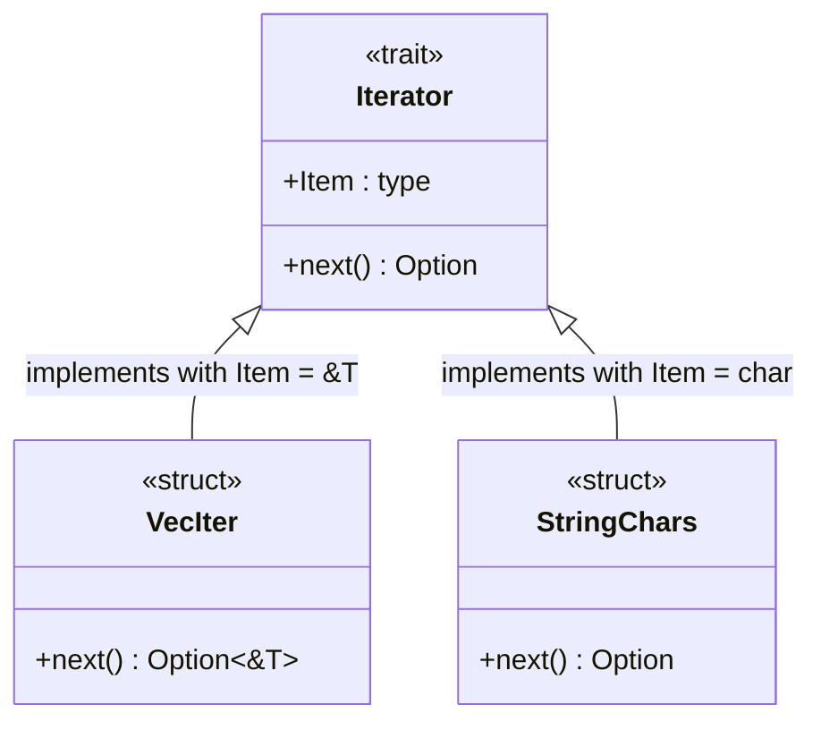

# Rust Associated Types

## Introduction

When working with Rust's trait system, you'll often need to define relationships between types. Associated types provide a powerful way to specify related types within traits, making your code more concise and maintainable. Unlike generic type parameters, associated types allow you to define a specific output type for a trait implementation, creating cleaner APIs and more ergonomic code.

In this guide, we'll explore how associated types work in Rust, why they're useful, and how to implement them in your own code.

## What Are Associated Types?

Associated types are a way to declare type placeholders in a trait definition. When a struct or enum implements that trait, it must specify concrete types for those placeholders. This creates a one-to-one relationship between the implementing type and the associated type.

Let's look at a simple example:

```rust
trait Container {
    // This is an associated type
    type Item;
    
    fn add(&mut self, item: Self::Item);
    fn get(&self) -> Option<&Self::Item>;
}
```

In this `Container` trait, `Item` is an associated type. Any type implementing this trait must specify what the `Item` type will be.

## Associated Types vs Generic Type Parameters

Before diving deeper, let's understand how associated types differ from generic type parameters:

```rust
// Using generic type parameters
trait ContainerWithGeneric<T> {
    fn add(&mut self, item: T);
    fn get(&self) -> Option<&T>;
}

// Using associated types
trait ContainerWithAssociatedType {
    type Item;
    fn add(&mut self, item: Self::Item);
    fn get(&self) -> Option<&Self::Item>;
}
```

The key differences are:

1. **Implementation Relationship**: With generics, you can implement a trait multiple times for the same type with different type parameters. With associated types, you can only implement a trait once for a given type.

2. **API Ergonomics**: Associated types lead to cleaner function signatures when using traits as bounds.

3. **Intent Communication**: Associated types express "this type has an associated type" while generics express "this works with any type."

## Implementing Traits with Associated Types

Let's implement our `Container` trait for a simple `Box` type:

```rust
struct MyBox<T>(T);

impl<T> Container for MyBox<T> {
    // We specify what the associated type is
    type Item = T;
    
    fn add(&mut self, item: T) {
        self.0 = item;
    }
    
    fn get(&self) -> Option<&T> {
        Some(&self.0)
    }
}

fn main() {
    let mut box_of_int = MyBox(42);
    println!("Original value: {:?}", box_of_int.get()); // Output: Original value: Some(42)
    
    box_of_int.add(100);
    println!("New value: {:?}", box_of_int.get()); // Output: New value: Some(100)
}
```

In this implementation, we've specified that for `MyBox<T>`, the associated type `Item` is `T`. This creates a clear, one-to-one relationship between the container type and its contents.

## When to Use Associated Types

Associated types are particularly useful in the following scenarios:

### 1. When a Trait Has a Natural Output Type

The `Iterator` trait is a perfect example:

```rust
trait Iterator {
    type Item;
    fn next(&mut self) -> Option<Self::Item>;
    // other methods...
}
```

An iterator naturally produces values of a specific type. Using an associated type makes this relationship clear.

### 2. Creating More Ergonomic APIs

Consider a function that works with any container:

```rust
// With generic type parameters
fn process<T, C: ContainerWithGeneric<T>>(container: &C) -> Option<&T> {
    container.get()
}

// With associated types
fn process<C: ContainerWithAssociatedType>(container: &C) -> Option<&C::Item> {
    container.get()
}
```

The associated type version requires fewer type parameters, making the API cleaner.

## Practical Example: A Custom Collection

Let's build a more realistic example - a custom collection with an iterator:

```rust
struct MyCollection<T> {
    items: Vec<T>,
}

impl<T> MyCollection<T> {
    fn new() -> Self {
        MyCollection { items: Vec::new() }
    }
    
    fn add(&mut self, item: T) {
        self.items.push(item);
    }
    
    fn iter(&self) -> MyIter<'_, T> {
        MyIter { 
            collection: self, 
            index: 0 
        }
    }
}

struct MyIter<'a, T> {
    collection: &'a MyCollection<T>,
    index: usize,
}

impl<'a, T> Iterator for MyIter<'a, T> {
    type Item = &'a T;
    
    fn next(&mut self) -> Option<Self::Item> {
        if self.index < self.collection.items.len() {
            let item = &self.collection.items[self.index];
            self.index += 1;
            Some(item)
        } else {
            None
        }
    }
}

fn main() {
    let mut collection = MyCollection::new();
    collection.add(1);
    collection.add(2);
    collection.add(3);
    
    for item in collection.iter() {
        println!("Item: {}", item);
    }
    // Output:
    // Item: 1
    // Item: 2
    // Item: 3
}
```

In this example, our iterator implementation specifies `&'a T` as its associated `Item` type, making it clear what type of values the iterator produces.

## Multiple Associated Types

Traits can have multiple associated types:

```rust
trait Graph {
    type Node;
    type Edge;
    
    fn has_edge(&self, from: &Self::Node, to: &Self::Node) -> bool;
    fn edges(&self, from: &Self::Node) -> Vec<Self::Edge>;
}

struct MyGraph {
    // implementation details
}

impl Graph for MyGraph {
    type Node = String;
    type Edge = (String, String, i32); // (from, to, weight)
    
    fn has_edge(&self, from: &Self::Node, to: &Self::Node) -> bool {
        // implementation
        true
    }
    
    fn edges(&self, from: &Self::Node) -> Vec<Self::Edge> {
        // implementation
        vec![]
    }
}
```

This approach works well when a trait has multiple related types.

## Associated Types with Bounds

You can also add trait bounds to associated types:

```rust
trait Container {
    type Item: Display + Clone;
    
    fn get_item(&self) -> Self::Item;
    fn print_item(&self) {
        let item = self.get_item();
        println!("{}", item);
    }
}
```

This ensures that the associated type must implement the specified traits.

## Visualizing Associated Types

Here's a diagram that shows the relationship between a trait with associated types and implementing types:



## Default Associated Types

Starting in Rust 1.62, you can provide default types for associated types:

```rust
trait Container {
    type Item = String; // Default type is String
    
    fn add(&mut self, item: Self::Item);
    fn get(&self) -> Option<&Self::Item>;
}

// Implementation can use the default
struct DefaultContainer {
    value: Option<String>,
}

impl Container for DefaultContainer {
    // No need to specify type Item = String, as it uses the default
    
    fn add(&mut self, item: String) {
        self.value = Some(item);
    }
    
    fn get(&self) -> Option<&String> {
        self.value.as_ref()
    }
}
```

This feature makes traits more flexible and easier to use.

## Common Pitfalls and Solutions

### 1. Trying to Implement a Trait Multiple Times

With associated types, you can only implement a trait once for a type:

```rust
struct MyType;

// Error: cannot implement trait with associated type more than once
impl Container for MyType {
    type Item = i32;
    // implementation
}

impl Container for MyType {
    type Item = String; // Error: conflicting implementations
    // implementation
}
```

Solution: Use generics if you need multiple implementations or create wrapper types.

### 2. Complex Type Relationships

Sometimes the relationship between types is complex. In such cases, you might need to combine associated types with generics:

```rust
trait Converter<Input> {
    type Output;
    
    fn convert(&self, input: Input) -> Self::Output;
}

struct StringConverter;

impl Converter<i32> for StringConverter {
    type Output = String;
    
    fn convert(&self, input: i32) -> String {
        input.to_string()
    }
}

impl Converter<f64> for StringConverter {
    type Output = String;
    
    fn convert(&self, input: f64) -> String {
        input.to_string()
    }
}
```

## Summary

Associated types are a powerful feature in Rust's trait system that allow you to:

1. Define type relationships within traits
2. Create cleaner, more maintainable APIs
3. Express one-to-one type relationships
4. Improve code readability and ergonomics

They work particularly well when a trait has natural "output" types or when you want to enforce a specific type relationship. When combined with other Rust features like generics and trait bounds, associated types provide a flexible and type-safe way to design your code.

## Exercises

1. Implement a `Serializer` trait with an associated `Output` type. Create implementations that serialize to JSON, XML, and a binary format.

2. Create a `Collection` trait with associated `Item` and `Iterator` types. Implement it for a custom collection type.

3. Extend the `Graph` trait from our example with methods for finding paths between nodes. How do associated types make this easier to work with?

## Additional Resources

- [Rust Book Chapter on Traits](https://doc.rust-lang.org/book/ch10-02-traits.html)
- [Rust Reference on Associated Types](https://doc.rust-lang.org/reference/items/associated-items.html#associated-types)
- [RFC 195: Associated Types](https://github.com/rust-lang/rfcs/blob/master/text/0195-associated-items.md)
- [Rust By Example: Associated Types](https://doc.rust-lang.org/rust-by-example/generics/assoc_items/types.html)

By mastering associated types, you'll be able to design more expressive and ergonomic Rust APIs while maintaining the language's strong type safety guarantees.