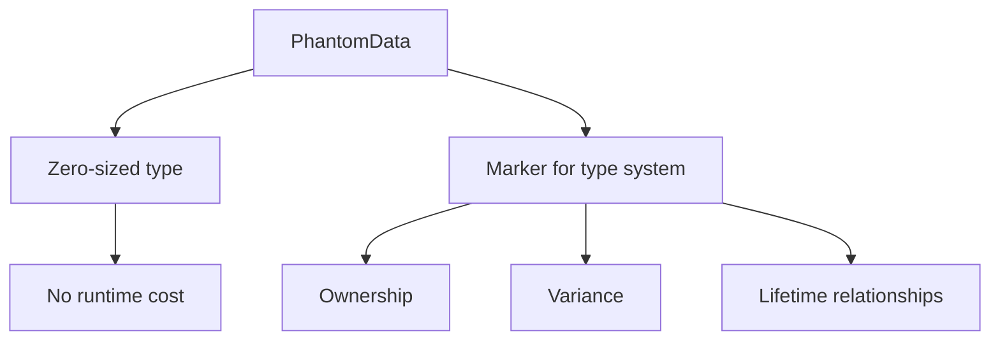

# Rust PhantomData

Have you ever encountered a situation in Rust where you defined a generic type parameter but never actually used it in your struct? If you tried to compile such code, the Rust compiler probably complained about unused type parameters. This is where `PhantomData` comes to the rescue!

## Introduction to PhantomData

`PhantomData` is a zero-sized type provided by Rust's standard library that allows you to "mark" a data structure as if it owns or uses a particular type, even when it doesn't actually store any data of that type.

Here's the key insight: `PhantomData<T>` is a marker that:
- Takes up no space at runtime (it's a zero-sized type)
- Tells the compiler that your type is conceptually associated with `T`
- Helps satisfy Rust's type system rules, particularly around variance and drop checking

Let's explore why this matters and how to use it effectively.

## The Need for PhantomData

To understand why `PhantomData` exists, let's look at a common scenario:

```rust
struct Identifier<T> {
    id: usize,
    // We want this to be associated with type T, 
    // but we don't actually store a T
}
```

The problem with this code is that the type parameter `T` is not used anywhere in the struct, which Rust considers suspicious. The compiler will generate a warning because:

1. Unused type parameters could indicate a design flaw
2. The compiler can't determine the proper variance for `T`
3. There's ambiguity about how `T` should be treated for drop checking

### Compile Error Example

If we try to use our `Identifier` struct:

```rust
struct Identifier<T> {
    id: usize,
}

fn main() {
    let user_id = Identifier::<String> { id: 42 };
    println!("ID: {}", user_id.id);
}
```

We'll get a warning:

```
warning: unused type parameter
 --> src/main.rs:1:19
  |
1 | struct Identifier<T> {
  |                   ^
  |
  = note: `#[warn(unused_type_parameters)]` on by default
  = help: consider removing `T` or using a marker such as `std::marker::PhantomData`
```

## Solving the Problem with PhantomData

Let's fix our example by adding `PhantomData`:

```rust
use std::marker::PhantomData;

struct Identifier<T> {
    id: usize,
    _marker: PhantomData<T>,
}

fn main() {
    let user_id = Identifier::<String> { id: 42, _marker: PhantomData };
    println!("ID: {}", user_id.id);
}

// Output:
// ID: 42
```

Now the compiler is satisfied because:
- We've indicated that `Identifier<T>` is conceptually associated with type `T`
- The type parameter is being "used" in the struct

## Practical Uses of PhantomData

### 1. Type-Parameterized IDs

One common use case is creating type-safe identifiers:

```rust
use std::marker::PhantomData;

// Define marker types
struct User;
struct Product;

// Generic ID type
struct Id<T> {
    value: u64,
    _marker: PhantomData<T>,
}

// Now we can have distinct types
fn main() {
    let user_id = Id::<User> { value: 1, _marker: PhantomData };
    let product_id = Id::<Product> { value: 1, _marker: PhantomData };
    
    process_user(user_id);
    // This line would cause a compile error:
    // process_user(product_id);
}

fn process_user(id: Id<User>) {
    println!("Processing user with ID: {}", id.value);
}

// Output:
// Processing user with ID: 1
```

This pattern ensures that we can't accidentally mix up different types of IDs, even though they have the same underlying data structure.

### 2. Lifetime Parameters

`PhantomData` can also be used to indicate that a type conceptually contains a reference with a particular lifetime:

```rust
use std::marker::PhantomData;

struct Slice<'a, T> {
    start: *const T,
    length: usize,
    _marker: PhantomData<&'a T>,
}

fn main() {
    let data = vec![1, 2, 3, 4, 5];
    
    // Create a slice that "borrows" the data
    let slice = Slice {
        start: data.as_ptr(),
        length: data.len(),
        _marker: PhantomData,
    };
    
    // This tells Rust that `slice` conceptually borrows from `data`
    println!("Slice length: {}", slice.length);
}

// Output:
// Slice length: 5
```

### 3. Custom Smart Pointers

When implementing custom smart pointers, `PhantomData` helps accurately represent ownership relationships:

```rust
use std::marker::PhantomData;
use std::ptr::NonNull;

struct MyBox<T> {
    ptr: NonNull<T>,
    // This tells Rust that we own a T
    _marker: PhantomData<T>,
}

impl<T> MyBox<T> {
    fn new(value: T) -> Self {
        let ptr = Box::into_raw(Box::new(value));
        MyBox {
            ptr: unsafe { NonNull::new_unchecked(ptr) },
            _marker: PhantomData,
        }
    }
}

// Implement Drop to free the memory
impl<T> Drop for MyBox<T> {
    fn drop(&mut self) {
        unsafe {
            Box::from_raw(self.ptr.as_ptr());
        }
    }
}

fn main() {
    let boxed = MyBox::new(42);
    // Memory is automatically freed when `boxed` goes out of scope
}
```

## Different Phantom Types for Different Relationships

The way you use `PhantomData` changes depending on what relationship you want to express:

```rust
use std::marker::PhantomData;

// 1. Express that we own a T
struct OwnsT<T> {
    _marker: PhantomData<T>,
}

// 2. Express that we own a Box<T>
struct OwnsBoxT<T> {
    _marker: PhantomData<Box<T>>,
}

// 3. Express that we borrow a T
struct BorrowsT<'a, T: 'a> {
    _marker: PhantomData<&'a T>,
}

// 4. Express a T that might have references
struct MaybeHasReferences<T: ?Sized> {
    _marker: PhantomData<*const T>,
}
```

## Visualizing PhantomData

Here's a diagram to help visualize the concept:



## Common PhantomData Patterns

### Type-Safe Builder Pattern

```rust
use std::marker::PhantomData;

// Marker states
struct Unconfigured;
struct Configured;

struct Builder<State = Unconfigured> {
    name: Option<String>,
    age: Option<u32>,
    _marker: PhantomData<State>,
}

impl Builder<Unconfigured> {
    fn new() -> Self {
        Builder {
            name: None,
            age: None,
            _marker: PhantomData,
        }
    }
    
    fn name(mut self, name: &str) -> Self {
        self.name = Some(name.to_string());
        self
    }
    
    fn age(mut self, age: u32) -> Builder<Configured> {
        self.age = Some(age);
        Builder {
            name: self.name,
            age: Some(age),
            _marker: PhantomData,
        }
    }
}

impl Builder<Configured> {
    fn build(self) -> Person {
        Person {
            name: self.name.unwrap_or_else(|| "Anonymous".to_string()),
            age: self.age.unwrap(),
        }
    }
}

struct Person {
    name: String,
    age: u32,
}

fn main() {
    // Valid construction path:
    let person = Builder::new()
        .name("Alice")
        .age(30)
        .build();
    
    println!("{} is {} years old", person.name, person.age);
    
    // This would not compile because we haven't called .age():
    // let invalid = Builder::new().name("Bob").build();
}

// Output:
// Alice is 30 years old
```

### Type-Level State Machines

```rust
use std::marker::PhantomData;

// State types
struct Off;
struct On;

struct LightSwitch<State> {
    _marker: PhantomData<State>,
}

impl LightSwitch<Off> {
    fn new() -> Self {
        LightSwitch { _marker: PhantomData }
    }
    
    fn turn_on(self) -> LightSwitch<On> {
        println!("Turning light on!");
        LightSwitch { _marker: PhantomData }
    }
}

impl LightSwitch<On> {
    fn turn_off(self) -> LightSwitch<Off> {
        println!("Turning light off!");
        LightSwitch { _marker: PhantomData }
    }
}

fn main() {
    let light = LightSwitch::<Off>::new();
    let light = light.turn_on();
    
    // This wouldn't compile because we can't turn on an already-on light:
    // light.turn_on();
    
    let light = light.turn_off();
    
    // This wouldn't compile because we can't turn off an already-off light:
    // light.turn_off();
}

// Output:
// Turning light on!
// Turning light off!
```

## Common Pitfalls and Best Practices

### 1. Forgetting PhantomData

The most common mistake is simply forgetting to use `PhantomData` when you have a type parameter that isn't used in fields. Always add `PhantomData` for unused type parameters.

### 2. Using the Wrong PhantomData Relationship

Different phantoms express different relationships:
- `PhantomData<T>` - ownership of a `T`
- `PhantomData<&'a T>` - borrowing a `T`
- `PhantomData<*const T>` - for potentially having references to `T`

Choose the right one for your specific case.

### 3. Naming Conventions

It's common to prefix the PhantomData field with an underscore to indicate that it's unused in the code:

```rust
struct Example<T> {
    // The underscore tells readers this is intentionally unused
    _marker: PhantomData<T>,
}
```

## Summary

`PhantomData` is a powerful but subtle feature of Rust's type system that allows you to:

1. Create generic types where the type parameter isn't directly used in fields
2. Express ownership and borrowing relationships
3. Build type-safe abstractions without runtime overhead
4. Satisfy the compiler's requirements for variance and drop checking

While `PhantomData` may seem like a strange concept at first, it enables many advanced type-safe patterns in Rust and is a key part of how Rust maintains memory safety guarantees even with complex generic code.

## Exercises

1. Create a type-safe ID system for a library application with `Book`, `Author`, and `User` types.
2. Implement a `Buffer<T>` that owns a raw pointer to heap memory but is generic over the type stored.
3. Create a state machine using phantom types that models a traffic light with states `Red`, `Yellow`, and `Green`.
4. Implement a `TypedKey<T>` and `Registry` system where a key can only retrieve values of its associated type.

## Additional Resources

- [Rust Documentation on PhantomData](https://doc.rust-lang.org/std/marker/struct.PhantomData.html)
- [The Rustonomicon chapter on PhantomData](https://doc.rust-lang.org/nomicon/phantom-data.html)
- [Rust RFC 738: Variance](https://github.com/rust-lang/rfcs/blob/master/text/0738-variance.md)