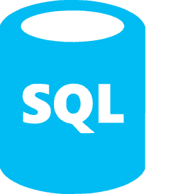
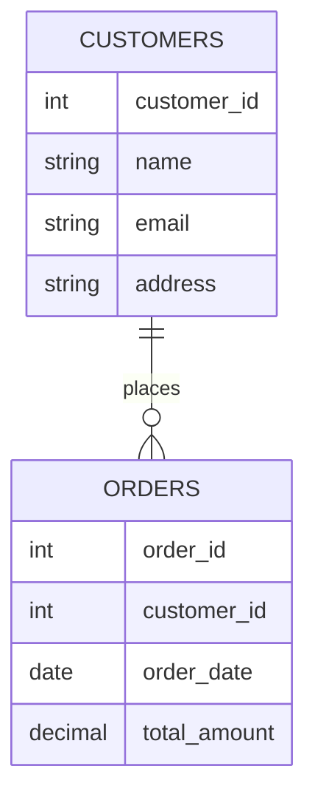

# SQL Introduction

## What is SQL?

<div style={{
    "width": "20%",
    "margin": "0 auto",
    "text-align": "center"
}}>
    
</div>

SQL (pronounced "sequel" or "S-Q-L") stands for **Structured Query Language**. It is the standard language used to communicate with and manipulate databases. If you've ever wondered how applications store, retrieve, and manage large amounts of data, SQL is often the answer.

Think of SQL as a specialized language that allows you to have conversations with databases. You can ask questions (queries) to retrieve information, give commands to update or delete data, and establish rules for how data should be structured.

## Why Learn SQL?

SQL is an essential skill for many reasons:

- **Widespread Use**: Almost every application that stores data uses SQL in some form
- **Career Opportunities**: SQL skills are in high demand for roles like data analyst, database administrator, and backend developer
- **Data Analysis**: SQL lets you extract meaningful insights from large datasets
- **Standardized Language**: The basic SQL syntax is similar across different database systems

## Database Basics

Before diving into SQL, let's understand some fundamental concepts:

### What is a Database?

A database is an organized collection of data stored in a computer system. Think of it as a digital filing cabinet where information is stored in a structured way.

### Relational Databases

The most common type of database used with SQL is a **relational database**. In this model, data is organized into tables with relationships between them.

Here are the key components:

- **Tables**: Similar to spreadsheets with rows and columns
- **Columns (Fields)**: Define the type of data stored (e.g., text, numbers, dates)
- **Rows (Records)**: Contain the actual data values
- **Primary Keys**: Unique identifiers for each row
- **Foreign Keys**: Create relationships between tables

Let's visualize the structure:



This diagram shows two tables: `CUSTOMERS` and `ORDERS`. One customer can place many orders (one-to-many relationship).

## Getting Started with SQL

### SQL Database Systems

Several popular database management systems (DBMS) use SQL:

- **MySQL**: Open-source, great for web applications
- **PostgreSQL**: Feature-rich open-source database with advanced capabilities
- **SQLite**: Lightweight database excellent for mobile and small applications
- **Microsoft SQL Server**: Enterprise-level database system
- **Oracle Database**: Popular for large enterprise applications

While there are differences between these systems, the fundamental SQL syntax remains similar.

### Setting Up a Practice Environment

To follow along with the examples, you can:

1. Install a database like SQLite (easiest to set up)
2. Use an online SQL playground like [SQLFiddle](http://sqlfiddle.com/) or [DB Fiddle](https://www.db-fiddle.com/)
3. Use a database visualization tool like [DBeaver](https://dbeaver.io/) (free and supports multiple database types)

## Basic SQL Syntax

Let's start with the most common SQL operations, known as CRUD:
- **C**reate
- **R**ead
- **U**pdate
- **D**elete

### Creating a Table

To create a new table, we use the `CREATE TABLE` statement:

```sql
CREATE TABLE students (
    student_id INT PRIMARY KEY,
    first_name VARCHAR(50),
    last_name VARCHAR(50),
    email VARCHAR(100),
    enrollment_date DATE
);
```

This creates a table called `students` with columns for ID, name, email, and enrollment date.

### Inserting Data

To add data to our table, we use the `INSERT INTO` statement:

```sql
INSERT INTO students (student_id, first_name, last_name, email, enrollment_date)
VALUES (1, 'John', 'Doe', 'john.doe@example.com', '2023-09-01');
```

You can insert multiple rows at once:

```sql
INSERT INTO students (student_id, first_name, last_name, email, enrollment_date)
VALUES 
    (2, 'Jane', 'Smith', 'jane.smith@example.com', '2023-09-05'),
    (3, 'Bob', 'Johnson', 'bob.johnson@example.com', '2023-08-30');
```

### Querying Data

The `SELECT` statement is used to retrieve data:

```sql
-- Get all columns and all rows
SELECT * FROM students;
```

Output:
```
student_id | first_name | last_name | email                    | enrollment_date
-----------+------------+-----------+--------------------------+----------------
1          | John       | Doe       | john.doe@example.com     | 2023-09-01
2          | Jane       | Smith     | jane.smith@example.com   | 2023-09-05
3          | Bob        | Johnson   | bob.johnson@example.com  | 2023-08-30
```

You can select specific columns:

```sql
-- Get only specific columns
SELECT first_name, last_name FROM students;
```

Output:
```
first_name | last_name
-----------+----------
John       | Doe
Jane       | Smith
Bob        | Johnson
```

### Filtering Data

The `WHERE` clause allows you to filter results:

```sql
-- Get students who enrolled on or after September 1, 2023
SELECT * FROM students 
WHERE enrollment_date >= '2023-09-01';
```

Output:
```
student_id | first_name | last_name | email                  | enrollment_date
-----------+------------+-----------+------------------------+----------------
1          | John       | Doe       | john.doe@example.com   | 2023-09-01
2          | Jane       | Smith     | jane.smith@example.com | 2023-09-05
```

### Updating Data

To modify existing data, use the `UPDATE` statement:

```sql
-- Update John's email
UPDATE students
SET email = 'john.d@example.com'
WHERE student_id = 1;
```

After running this query, John's email will be updated:

```
student_id | first_name | last_name | email                  | enrollment_date
-----------+------------+-----------+------------------------+----------------
1          | John       | Doe       | john.d@example.com     | 2023-09-01
2          | Jane       | Smith     | jane.smith@example.com | 2023-09-05
3          | Bob        | Johnson   | bob.johnson@example.com| 2023-08-30
```

### Deleting Data

To remove data, use the `DELETE` statement:

```sql
-- Delete Bob's record
DELETE FROM students
WHERE student_id = 3;
```

After execution:

```
student_id | first_name | last_name | email                  | enrollment_date
-----------+------------+-----------+------------------------+----------------
1          | John       | Doe       | john.d@example.com     | 2023-09-01
2          | Jane       | Smith     | jane.smith@example.com | 2023-09-05
```

## Real-World Example: Building a Simple Library Database

Let's apply what we've learned to create a simple library database.

### Step 1: Create the Tables

```sql
-- Books table
CREATE TABLE books (
    book_id INT PRIMARY KEY,
    title VARCHAR(100),
    author VARCHAR(100),
    publication_year INT,
    isbn VARCHAR(20)
);

-- Members table
CREATE TABLE members (
    member_id INT PRIMARY KEY,
    first_name VARCHAR(50),
    last_name VARCHAR(50),
    join_date DATE
);

-- Loans table to track borrowed books
CREATE TABLE loans (
    loan_id INT PRIMARY KEY,
    book_id INT,
    member_id INT,
    loan_date DATE,
    return_date DATE,
    FOREIGN KEY (book_id) REFERENCES books(book_id),
    FOREIGN KEY (member_id) REFERENCES members(member_id)
);
```

### Step 2: Insert Sample Data

```sql
-- Add some books
INSERT INTO books (book_id, title, author, publication_year, isbn)
VALUES 
    (1, 'The Great Gatsby', 'F. Scott Fitzgerald', 1925, '9780743273565'),
    (2, 'To Kill a Mockingbird', 'Harper Lee', 1960, '9780060935467'),
    (3, '1984', 'George Orwell', 1949, '9780451524935');

-- Add some members
INSERT INTO members (member_id, first_name, last_name, join_date)
VALUES
    (1, 'Sarah', 'Johnson', '2023-01-15'),
    (2, 'Michael', 'Williams', '2023-02-20');

-- Record a book loan
INSERT INTO loans (loan_id, book_id, member_id, loan_date, return_date)
VALUES
    (1, 1, 1, '2023-03-10', '2023-03-24'),
    (2, 3, 2, '2023-03-15', NULL);
```

### Step 3: Query for Useful Information

Find all books currently on loan (not returned):

```sql
SELECT b.title, m.first_name, m.last_name, l.loan_date
FROM loans l
JOIN books b ON l.book_id = b.book_id
JOIN members m ON l.member_id = m.member_id
WHERE l.return_date IS NULL;
```

Output:
```
title | first_name | last_name | loan_date
------+------------+-----------+------------
1984  | Michael    | Williams  | 2023-03-15
```

This query joins three tables to show which books are checked out, by whom, and when they were borrowed.

## SQL Operators and Functions

SQL provides various operators and functions to work with data:

### Comparison Operators

- `=` (equal to)
- `<>` or `!=` (not equal to)
- `>` (greater than)
- `<` (less than)
- `>=` (greater than or equal to)
- `<=` (less than or equal to)

### Logical Operators

- `AND`: Both conditions must be true
- `OR`: At least one condition must be true
- `NOT`: Negates a condition

Example:

```sql
-- Find books published between 1940 and 1960
SELECT title, publication_year
FROM books
WHERE publication_year >= 1940 AND publication_year <= 1960;
```

Output:
```
title                  | publication_year
-----------------------+------------------
To Kill a Mockingbird  | 1960
1984                   | 1949
```

### String Operators

The `LIKE` operator is particularly useful for string pattern matching:

```sql
-- Find books with titles containing 'the'
SELECT title
FROM books
WHERE title LIKE '%the%';
```

Output:
```
title
----------------------
The Great Gatsby
```

The `%` is a wildcard that matches any sequence of characters.

### Aggregate Functions

SQL provides functions to perform calculations on data:

- `COUNT()`: Counts the number of rows
- `SUM()`: Calculates the sum of values
- `AVG()`: Calculates the average of values
- `MIN()`: Finds the minimum value
- `MAX()`: Finds the maximum value

Example:

```sql
-- Count how many books were published after 1940
SELECT COUNT(*) AS books_after_1940
FROM books
WHERE publication_year > 1940;
```

Output:
```
books_after_1940
----------------
2
```

## Summary

In this introduction to SQL, we've covered:

- What SQL is and why it's important
- Basic database concepts and relational database structure
- How to create tables and define their structure
- CRUD operations: Creating, Reading, Updating, and Deleting data
- How to filter and sort data
- Using operators and functions to manipulate data
- A real-world example of a library database

SQL is a powerful language with many more features to explore. As you continue your journey, you'll learn about more complex queries, database normalization, performance optimization, and much more.

## Exercises

To practice what you've learned, try these exercises:

1. Create a table called `courses` with columns for course ID, name, instructor, and credits.
2. Insert at least 3 different courses into your table.
3. Write a query to select all courses taught by a specific instructor.
4. Update the credits for one of your courses.
5. Delete a course from your table.
6. Write a query that counts how many courses are in your table.

## Additional Resources

- [W3Schools SQL Tutorial](https://www.w3schools.com/sql/) - Interactive tutorials with examples
- [SQLZoo](https://sqlzoo.net/) - SQL exercises and tutorials
- [PostgreSQL Documentation](https://www.postgresql.org/docs/) - Comprehensive reference for PostgreSQL
- [MySQL Documentation](https://dev.mysql.com/doc/) - Official MySQL reference manual
- [Mode Analytics SQL Tutorial](https://mode.com/sql-tutorial/) - SQL tutorial focused on data analysis