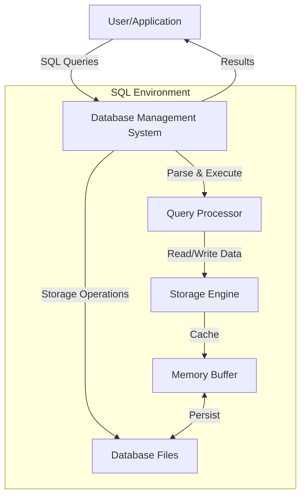

# SQL Environment Setup

## Introduction

Before you can start writing SQL queries and managing databases, you need to set up a proper SQL environment. This guide will walk you through the process of setting up your SQL environment from scratch, making it easy for beginners to get started with database management.

SQL (Structured Query Language) is a standardized programming language used for managing relational databases. Setting up your SQL environment involves installing a database management system (DBMS) that will allow you to create, access, and manipulate databases through SQL commands.

## What You'll Need

Before we begin, make sure you have:
- A computer with Windows, macOS, or Linux operating system
- Administrative privileges to install software
- At least 1GB of free disk space
- Internet connection for downloading software

## Choosing a Database Management System

There are several popular database management systems available. Each has its strengths and is suitable for different purposes:

### Popular SQL Database Management Systems

| DBMS                 | Description               | Best For                                      |
|----------------------|---------------------------|-----------------------------------------------|
| MySQL                | Open-source, widely used  | Web applications, general purpose             |
| PostgreSQL           | Open-source, feature-rich | Complex applications, advanced features       |
| SQLite               | Lightweight, serverless   | Mobile apps, embedded systems, learning       |
| Microsoft SQL Server | Enterprise-grade          | Windows environments, enterprise applications |
| Oracle Database      | Enterprise-grade          | Large organizations, high-performance needs   |

For beginners, we recommend starting with either **MySQL** or **SQLite** as they are:
- Free and open-source
- Easy to install and configure
- Well-documented with large community support
- Sufficient for learning SQL fundamentals

In this guide, we'll cover the setup process for MySQL and SQLite, two of the most beginner-friendly options.

## Setting Up MySQL

MySQL is one of the most popular database management systems in the world. Here's how to set it up:

### Step 1: Download MySQL

1. Go to the [MySQL Downloads page](https://dev.mysql.com/downloads/mysql/)
2. Select your operating system
3. Download the MySQL Community Server edition (free)

### Step 2: Install MySQL

#### On Windows:

1. Run the downloaded installer
2. Choose the "Developer Default" setup type
3. Click "Next" through the installation wizard
4. Create a root password when prompted (remember this password!)
5. Complete the installation

#### On macOS:

1. Open the downloaded DMG file
2. Run the package installer
3. Follow the installation wizard
4. Set a root password when prompted
5. Complete the installation

#### On Linux (Ubuntu):

```bash
sudo apt update
sudo apt install mysql-server
sudo mysql_secure_installation
```

### Step 3: Verify MySQL Installation

To verify that MySQL was installed correctly, open your terminal or command prompt and run:

```bash
mysql --version
```

You should see output showing the installed MySQL version.

### Step 4: Connect to MySQL

To connect to MySQL using the command line:

```bash
mysql -u root -p
```

Enter the password you created during installation. If successful, you'll see the MySQL command prompt:

```
mysql>
```

This means you're now connected to the MySQL server and can start executing SQL commands!

### Step 5: Install a GUI Client (Optional)

While you can use MySQL from the command line, a graphical user interface (GUI) can make database management easier. Here are some popular free options:

- [MySQL Workbench](https://dev.mysql.com/downloads/workbench/) (Official GUI tool)
- [HeidiSQL](https://www.heidisql.com/) (Windows)
- [DBeaver](https://dbeaver.io/) (Cross-platform)

## Setting Up SQLite

SQLite is a lightweight, file-based database system that doesn't require a server process.

### Step 1: Download SQLite

#### On Windows:

1. Go to the [SQLite Download Page](https://www.sqlite.org/download.html)
2. Download the "Precompiled Binaries for Windows" section:
   - The command-line shell program (`sqlite-tools-win32-*.zip`)
   - The DLL file (`sqlite-dll-win32-*.zip`)

#### On macOS:

SQLite comes pre-installed on macOS. You can access it through Terminal.

#### On Linux:

```bash
sudo apt update
sudo apt install sqlite3
```

### Step 2: Set Up SQLite (Windows)

1. Create a folder named `sqlite` in your C: drive
2. Extract the downloaded ZIP files into this folder
3. Add the folder to your system's PATH environment variable:
   - Right-click on 'This PC' → Properties → Advanced system settings
   - Click on 'Environment Variables'
   - Under 'System variables', select 'Path' and click 'Edit'
   - Click 'New' and add `C:\sqlite`
   - Click 'OK' on all dialogs

### Step 3: Verify SQLite Installation

Open a command prompt or terminal and type:

```bash
sqlite3 --version
```

You should see the SQLite version displayed.

### Step 4: Create Your First SQLite Database

To create and connect to a new SQLite database, run:

```bash
sqlite3 mydatabase.db
```

This will create a new file called `mydatabase.db` and open the SQLite command prompt:

```
sqlite>
```

### Step 5: Install a GUI Client (Optional)

Some user-friendly SQLite GUI tools include:

- [DB Browser for SQLite](https://sqlitebrowser.org/) (Cross-platform)
- [SQLiteStudio](https://sqlitestudio.pl/) (Cross-platform)
- [SQLite Expert](http://www.sqliteexpert.com/) (Windows)

## Setting Up an Online SQL Environment (No Installation)

If you don't want to install software on your computer, several online platforms offer SQL environments:

1. **DB Fiddle**: [https://www.db-fiddle.com/](https://www.db-fiddle.com/)
2. **SQL Fiddle**: [http://sqlfiddle.com/](http://sqlfiddle.com/)
3. **W3Schools SQL Tryit Editor**: [https://www.w3schools.com/sql/trysql.asp?filename=trysql_select_all](https://www.w3schools.com/sql/trysql.asp?filename=trysql_select_all)

These online tools are excellent for quick practice and learning without any setup.

## Creating Your First Database and Table

Let's create a simple database and table to verify your setup works. We'll use a basic example of a "Students" table.

### Using MySQL:

Connect to MySQL and run the following commands:

```sql
-- Create a new database
CREATE DATABASE practice_db;

-- Use the new database
USE practice_db;

-- Create a table for students
CREATE TABLE students (
    id INT PRIMARY KEY AUTO_INCREMENT,
    first_name VARCHAR(50) NOT NULL,
    last_name VARCHAR(50) NOT NULL,
    email VARCHAR(100) UNIQUE,
    enrollment_date DATE
);

-- Insert a sample record
INSERT INTO students (first_name, last_name, email, enrollment_date) 
VALUES ('John', 'Doe', 'john.doe@example.com', '2023-09-01');

-- Verify the record was inserted
SELECT * FROM students;
```

Expected output:

```
+----+------------+-----------+----------------------+----------------+
| id | first_name | last_name | email                | enrollment_date |
+----+------------+-----------+----------------------+----------------+
|  1 | John       | Doe       | john.doe@example.com | 2023-09-01      |
+----+------------+-----------+----------------------+----------------+
1 row in set (0.00 sec)
```

### Using SQLite:

Connect to SQLite and run the following commands:

```sql
-- Create a table for students
CREATE TABLE students (
    id INTEGER PRIMARY KEY AUTOINCREMENT,
    first_name TEXT NOT NULL,
    last_name TEXT NOT NULL,
    email TEXT UNIQUE,
    enrollment_date TEXT
);

-- Insert a sample record
INSERT INTO students (first_name, last_name, email, enrollment_date) 
VALUES ('John', 'Doe', 'john.doe@example.com', '2023-09-01');

-- Verify the record was inserted
SELECT * FROM students;
```

Expected output:

```
id          first_name  last_name   email                 enrollment_date
----------  ----------  ----------  --------------------  --------------
1           John        Doe         john.doe@example.com  2023-09-01
```

## Understanding the SQL Environment Architecture

The SQL environment consists of several components working together:



## Common Environment Setup Issues and Solutions

| Issue                    | Possible Solution                                         |
|--------------------------|-----------------------------------------------------------|
| "Access denied" error    | Check your username and password; verify user permissions |
| Can't connect to server  | Ensure the database service is running                    |
| Port conflicts           | Change the default port in configuration files            |
| Missing dependencies     | Install required system libraries                         |
| Insufficient permissions | Run installer as administrator/root                       |

## SQL Environment Configuration

Most database systems have configuration files where you can adjust settings:

- **MySQL**: `my.cnf` or `my.ini`
- **PostgreSQL**: `postgresql.conf`
- **SQLite**: Settings are typically specified at connection time

For beginners, the default configurations are usually sufficient. As you advance, you might want to adjust settings like:

- Memory allocation
- Connection limits
- Character encoding
- Logging options

## Summary

Setting up a SQL environment is the crucial first step in your database learning journey. In this guide, you've learned:

- How to choose the right database management system for your needs
- Step-by-step installation of MySQL and SQLite
- Creating your first database and table
- Basic architecture of a SQL environment
- Troubleshooting common setup issues

With your SQL environment now configured, you're ready to start writing queries and building databases!

## Additional Resources

- [MySQL Documentation](https://dev.mysql.com/doc/)
- [SQLite Documentation](https://www.sqlite.org/docs.html)
- [Database Design Fundamentals](https://www.tutorialspoint.com/dbms/index.htm)
- [W3Schools SQL Tutorial](https://www.w3schools.com/sql/)

## Practice Exercises

1. Create a new database called `library_db`
2. Create tables for `books`, `authors`, and `genres`
3. Add at least 5 records to each table
4. Write a query to list all books with their author names
5. Modify the configuration of your database to use UTF-8 encoding

By completing these exercises, you'll gain practical experience with your new SQL environment and be ready to tackle more advanced topics in SQL Fundamentals.