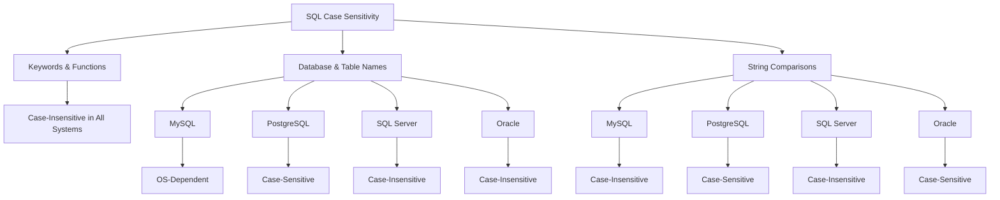

# SQL Case Sensitivity

## Introduction

When working with SQL, understanding case sensitivity is crucial for writing reliable and portable code. Case sensitivity refers to whether uppercase and lowercase letters are treated as distinct (case-sensitive) or equivalent (case-insensitive). In SQL, case sensitivity rules vary across different elements of the language and different database management systems.

This guide will help you understand:
- When SQL is and isn't case-sensitive
- How case sensitivity differs across popular database systems
- Best practices for writing consistent SQL code

## SQL Case Sensitivity Rules

SQL case sensitivity can be divided into several categories:

### 1. SQL Keywords and Functions

SQL keywords (like `SELECT`, `FROM`, `WHERE`) and built-in functions (like `COUNT()`, `SUM()`) are **case-insensitive** in virtually all database systems.

```sql
-- All of these statements are equivalent
SELECT * FROM customers;
select * from customers;
SeLeCt * FrOm customers;
```

While the statements above will work identically, the standard convention is to write SQL keywords in uppercase for better readability.

### 2. Database, Table, and Column Names (Identifiers)

This is where things get tricky - case sensitivity for identifiers varies by database system:

| Database System | Case Sensitivity for Identifiers |
|-----------------|----------------------------------|
| MySQL           | Case-sensitive on Linux/Unix, case-insensitive on Windows |
| PostgreSQL      | Case-sensitive (unless identifiers are quoted) |
| SQL Server      | Case-insensitive by default |
| Oracle          | Case-insensitive by default |
| SQLite          | Case-insensitive for ASCII characters |

#### Examples in Different Database Systems

**PostgreSQL** (case-sensitive):
```sql
-- Creates two different tables
CREATE TABLE Customers (id INT);
CREATE TABLE customers (id INT);

-- This query will only access the "customers" table, not "Customers"
SELECT * FROM customers;
```

**SQL Server** (case-insensitive):
```sql
-- Creates only one table (second statement will error)
CREATE TABLE Customers (id INT);
CREATE TABLE customers (id INT); -- Error: Table already exists

-- Both queries access the same table
SELECT * FROM Customers;
SELECT * FROM customers;
```

### 3. Data Values in Queries

String comparisons in `WHERE` clauses also have varying case sensitivity:

| Database System | String Comparison Case Sensitivity |
|-----------------|-----------------------------------|
| MySQL           | Case-insensitive by default |
| PostgreSQL      | Case-sensitive |
| SQL Server      | Case-insensitive by default |
| Oracle          | Case-sensitive by default |
| SQLite          | Case-sensitive by default |

#### Examples of Data Value Comparisons

**PostgreSQL** (case-sensitive):
```sql
-- These two queries will return different results
SELECT * FROM customers WHERE name = 'John';
SELECT * FROM customers WHERE name = 'john';
```

**MySQL** (case-insensitive by default):
```sql
-- These two queries will return the same results
SELECT * FROM customers WHERE name = 'John';
SELECT * FROM customers WHERE name = 'john';
```

## Controlling Case Sensitivity

Most database systems provide ways to control case sensitivity behavior:

### Using Quotes for Identifiers

In most SQL databases, you can force case sensitivity by using quotes around identifiers:

```sql
-- In PostgreSQL, this creates a table with a case-sensitive name
CREATE TABLE "CaseSensitiveTable" (id INT);

-- You must use quotes to access it with the exact case
SELECT * FROM "CaseSensitiveTable";
```

### Case-Sensitive String Comparisons

To perform case-sensitive or case-insensitive string comparisons regardless of database defaults:

#### Case-Insensitive Comparison:
```sql
-- PostgreSQL (using ILIKE)
SELECT * FROM customers WHERE name ILIKE 'john';

-- Most databases (using UPPER or LOWER)
SELECT * FROM customers WHERE UPPER(name) = UPPER('John');
```

#### Case-Sensitive Comparison:
```sql
-- MySQL (using BINARY)
SELECT * FROM customers WHERE name BINARY = 'John';

-- Oracle (using CASE)
SELECT * FROM customers WHERE name = 'John' CASE SENSITIVE;
```

## Visual Representation of Case Sensitivity Across Databases



## Real-World Applications and Best Practices

### Portable SQL Code

To write SQL that works consistently across different database systems:

1. **Be consistent with case**: Choose a convention and stick to it
2. **Avoid relying on case sensitivity**: Don't create objects that differ only by case
3. **Use explicit case conversion in queries**: Use `UPPER()` or `LOWER()` for string comparisons

### Example: Building a User Authentication System

Let's look at a real-world scenario where case sensitivity matters - user authentication:

```sql
-- BAD: This is database-dependent for case sensitivity
SELECT * FROM users WHERE username = 'john_doe' AND password = 'Secret123';

-- GOOD: This works consistently across databases
SELECT * FROM users WHERE LOWER(username) = LOWER('john_doe') AND password = 'Secret123';
```

In this example, consistently using `LOWER()` ensures that usernames are compared case-insensitively regardless of the database system.

### Common Case Sensitivity Pitfalls

1. **Database Migration Issues**:
   ```sql
   -- Works in SQL Server but fails in PostgreSQL
   SELECT * FROM Customers; -- PostgreSQL: "Customers" vs. "customers"
   ```

2. **Inconsistent Query Results**:
   ```sql
   -- Might return different results across databases
   SELECT * FROM products WHERE category = 'Electronics';
   ```

3. **Script Failures**:
   ```sql
   -- Script containing mixed-case references may fail unexpectedly
   CREATE TABLE Products (...);
   INSERT INTO products VALUES (...); -- May fail in case-sensitive systems
   ```

## Summary

Understanding SQL case sensitivity is essential for writing reliable database code:

- SQL keywords and functions are generally case-insensitive
- Database, table, and column names have different case sensitivity rules across systems
- String comparisons in WHERE clauses vary in case sensitivity by database
- Use consistent casing conventions in your SQL code
- When portability matters, explicitly handle case with functions like UPPER() or LOWER()
- Be aware of how quoted identifiers affect case sensitivity

By following consistent conventions and being aware of case sensitivity differences, you can write SQL code that works predictably across different database environments.

## Additional Resources

- [PostgreSQL Documentation on Case Sensitivity](https://www.postgresql.org/docs/current/sql-syntax-lexical.html#SQL-SYNTAX-IDENTIFIERS)
- [MySQL Documentation on Identifier Case Sensitivity](https://dev.mysql.com/doc/refman/8.0/en/identifier-case-sensitivity.html)
- [SQL Server Case Sensitivity Configuration](https://learn.microsoft.com/en-us/sql/t-sql/statements/alter-database-transact-sql?view=sql-server-ver16)

## Exercises

1. **Basic Case Sensitivity Test**: Create a table and test whether you can access it using different cases of the table name in your specific database system.

2. **Cross-Database Query**: Write a query that would work consistently across PostgreSQL, MySQL, and SQL Server to find customers with the name "John" or "john".

3. **Case Sensitivity Debugging**: Debug the following SQL script to make it work across different database systems:
   ```sql
   CREATE TABLE Products (ProductID INT, ProductName VARCHAR(100));
   INSERT INTO products VALUES (1, 'Laptop');
   SELECT * FROM PRODUCTS WHERE productname = 'Laptop';
   ```