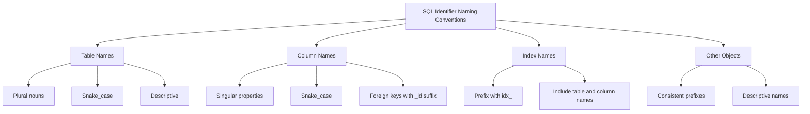

# SQL Identifiers

## Introduction

When working with databases, you need a way to name and reference different objects like tables, columns, and views. In SQL, these names are called **identifiers**. SQL identifiers are similar to variable names in programming languages—they give unique names to database objects so you can reference them in your queries.

Understanding SQL identifiers is essential for anyone learning SQL because they form the foundation of how you interact with your database. In this article, we'll explore what SQL identifiers are, the rules for creating them, and best practices for naming your database objects.

## What Are SQL Identifiers?

SQL identifiers are names assigned to database objects such as:

- Tables
- Columns
- Indexes
- Views
- Stored procedures
- Triggers
- Constraints
- Databases
- Schemas

Every database object needs a unique identifier within its scope. For example, two tables in the same database can't share the same name, but a column in one table can have the same name as a column in another table.

## Regular and Delimited Identifiers

SQL supports two types of identifiers:

1. **Regular Identifiers**: Follow standard naming rules without requiring special delimiters
2. **Delimited Identifiers**: Enclosed in quotation marks, allowing you to use reserved words or special characters

### Regular Identifiers

Regular identifiers must follow these rules:

- Begin with a letter (a-z, A-Z) or underscore (_)
- Subsequent characters can be letters, numbers (0-9), or underscores
- Cannot be SQL reserved words (like SELECT, FROM, WHERE)
- Case sensitivity depends on the database system

Let's see some examples of valid regular identifiers:

```sql
customer_table
product_inventory
order_id
first_name
_temporary_data
```

### Delimited Identifiers

Delimited identifiers are enclosed in double quotation marks (or square brackets in some systems like SQL Server). They allow you to:

- Use SQL reserved words as identifiers
- Include spaces and special characters
- Preserve case sensitivity

Examples of delimited identifiers:

```sql
"customer table"
"Order Details"
"first-name"
"SELECT"
"my.column"
```

In SQL Server, you might see square brackets instead:

```sql
[customer table]
[Order Details]
[SELECT]
```

## Case Sensitivity of Identifiers

The case sensitivity of SQL identifiers varies depending on the database system:

- **PostgreSQL**: Case-sensitive for delimited identifiers; converts regular identifiers to lowercase
- **MySQL**: Case-sensitive or insensitive depending on the operating system and configuration
- **SQL Server**: Case-insensitive by default
- **Oracle**: Converts regular identifiers to uppercase; delimited identifiers are case-sensitive
- **SQLite**: Case-insensitive for most operations

Let's look at how this works in practice with PostgreSQL:

```sql
-- These refer to the same table in PostgreSQL (regular identifiers)
CREATE TABLE customers (...);
SELECT * FROM Customers;  -- Works! PostgreSQL converts to lowercase

-- These are different tables (delimited identifiers)
CREATE TABLE "Customers" (...);
CREATE TABLE "customers" (...);  -- This creates a different table
```

## Identifier Length Limitations

Most modern database systems allow lengthy identifiers, but there are limits:

- PostgreSQL: 63 bytes
- MySQL: 64 characters
- SQL Server: 128 characters
- Oracle: 30 bytes (12c and earlier), 128 bytes (12c and later)
- SQLite: No explicit limit, but practical limits apply

It's good practice to keep identifiers reasonably short for readability while still making them descriptive.

## Practical Examples

Let's look at some practical examples of creating and using SQL identifiers in real-world scenarios.

### Creating a Table with Various Identifiers

```sql
-- Creating a table with regular identifiers
CREATE TABLE customer_orders (
    order_id INT PRIMARY KEY,
    customer_name VARCHAR(100),
    order_date DATE,
    total_amount DECIMAL(10, 2)
);

-- Creating a table with some delimited identifiers
CREATE TABLE "Product Inventory" (
    "Product ID" INT PRIMARY KEY,
    "Product Name" VARCHAR(100),
    "Price" DECIMAL(10, 2),
    "in-stock" BOOLEAN
);
```

### Querying Tables with Different Identifier Types

```sql
-- Using regular identifiers
SELECT order_id, customer_name 
FROM customer_orders 
WHERE total_amount > 100;

-- Using delimited identifiers
SELECT "Product ID", "Product Name" 
FROM "Product Inventory"
WHERE "in-stock" = TRUE;
```

### Working with Reserved Words as Identifiers

If you need to use a SQL reserved word as an identifier, you must use delimited identifiers:

```sql
-- This would cause an error:
CREATE TABLE order (
    id INT,
    date DATE
);

-- This works correctly:
CREATE TABLE "order" (
    "id" INT,
    "date" DATE
);

-- Then query it like this:
SELECT "id", "date" FROM "order";
```

## Naming Best Practices

Following good naming conventions makes your database more maintainable and easier to understand. Here are some best practices:

1. **Be descriptive**: Use names that clearly indicate what the object represents.
   ```sql
   -- Good
   customer_address
   
   -- Not as good
   cust_addr
   ```

2. **Be consistent**: Choose a naming convention and stick to it.
   ```sql
   -- Example of consistent snake_case naming
   customer_orders
   product_inventory
   order_items
   ```

3. **Avoid reserved words**: Even though you can use them with delimiters, it's best to avoid SQL reserved words.

4. **Use singular or plural consistently**: Decide whether table names will be singular or plural.
   ```sql
   -- Plural convention
   customers, orders, products
   
   -- Singular convention
   customer, order, product
   ```

5. **Use prefixes for specific object types**: Some teams use prefixes to indicate object types.
   ```sql
   -- Tables with tbl_ prefix
   tbl_customers
   
   -- Views with vw_ prefix
   vw_customer_orders
   ```

The following diagram illustrates a typical naming convention structure:



## Common Errors with Identifiers

Understanding common errors with SQL identifiers can help you avoid them:

### 1. Forgetting delimiters for special identifiers

```sql
-- This will cause an error:
SELECT order date FROM orders;

-- Correct approach:
SELECT "order date" FROM orders;
```

### 2. Inconsistent case usage

```sql
-- Creating with one case:
CREATE TABLE CustomerData (...);

-- Then trying to access with a different case (may fail in case-sensitive systems):
SELECT * FROM customerdata;
```

### 3. Using reserved words without delimiters

```sql
-- This will error because ORDER is a reserved word:
CREATE TABLE ORDER (...);

-- Correct approach:
CREATE TABLE "ORDER" (...);
```

### 4. Name collisions in the same scope

```sql
-- First table
CREATE TABLE customers (...);

-- This will fail if in the same schema:
CREATE TABLE customers (...);
```

## Summary

SQL identifiers are the names you give to database objects like tables and columns. They come in two forms: regular identifiers that follow standard naming rules, and delimited identifiers that are enclosed in quotes and allow more flexibility.

Understanding the rules and best practices for SQL identifiers will help you create a well-organized, maintainable database. Remember to keep your naming conventions consistent, use descriptive names, and be aware of the specific rules of your database system.

## Exercises

To reinforce your understanding of SQL identifiers, try these exercises:

1. Create a table named `user_profiles` with columns for user_id, first_name, last_name, and email.
2. Create a table with a reserved word as its name (like "table" or "select") using proper delimiter syntax.
3. Write a query that joins two tables using delimited identifiers.
4. Identify which of these identifiers would require delimiters: ProductID, order-details, SELECT, user_name, 123data.
5. Create a naming convention for your own database project and document it.

## Additional Resources

- [SQL Standard Documentation](https://www.iso.org/standard/63555.html)
- [PostgreSQL Documentation on Identifiers](https://www.postgresql.org/docs/current/sql-syntax-lexical.html#SQL-SYNTAX-IDENTIFIERS)
- [MySQL Documentation on Identifiers](https://dev.mysql.com/doc/refman/8.0/en/identifiers.html)
- [SQL Server Documentation on Identifiers](https://docs.microsoft.com/en-us/sql/relational-databases/databases/database-identifiers)