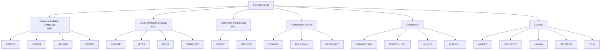

# SQL Keywords

## Introduction

SQL (Structured Query Language) is the standard language for interacting with relational databases. At the core of SQL are **keywords** - reserved words that have special meaning within the language. These keywords form the building blocks of SQL statements and help you communicate with databases to store, retrieve, and manipulate data.

SQL keywords are not case-sensitive (though they are often written in uppercase by convention to distinguish them from table and column names). Understanding these keywords is essential for writing effective database queries and becoming proficient in SQL.

## Categories of SQL Keywords

SQL keywords can be organized into several functional categories based on their purpose:



Let's explore each category and its important keywords in detail.

## Data Manipulation Language (DML)

DML keywords allow you to manipulate data stored in your database tables.

### SELECT

The `SELECT` statement is used to retrieve data from a database.

#### Basic Syntax:

```sql
SELECT column1, column2, ... 
FROM table_name;
```

#### Example:

```sql
SELECT first_name, last_name, email
FROM customers;
```

Output:
```
first_name | last_name | email
-----------|-----------|-----------------
John       | Smith     | john@example.com
Maria      | Garcia    | maria@example.com
Robert     | Johnson   | robert@example.com
```

#### Selecting All Columns:

```sql
SELECT * FROM customers;
```

### INSERT

The `INSERT` statement adds new rows to a table.

#### Basic Syntax:

```sql
INSERT INTO table_name (column1, column2, ...)
VALUES (value1, value2, ...);
```

#### Example:

```sql
INSERT INTO customers (first_name, last_name, email)
VALUES ('Sarah', 'Wilson', 'sarah@example.com');
```

### UPDATE

The `UPDATE` statement modifies existing data in a table.

#### Basic Syntax:

```sql
UPDATE table_name
SET column1 = value1, column2 = value2, ...
WHERE condition;
```

#### Example:

```sql
UPDATE customers
SET email = 'sarah.wilson@example.com'
WHERE customer_id = 4;
```

### DELETE

The `DELETE` statement removes rows from a table.

#### Basic Syntax:

```sql
DELETE FROM table_name
WHERE condition;
```

#### Example:

```sql
DELETE FROM customers
WHERE customer_id = 4;
```

## Data Definition Language (DDL)

DDL keywords define and modify database structures rather than the data itself.

### CREATE

The `CREATE` statement creates new database objects like tables, views, indexes, etc.

#### Creating a Table:

```sql
CREATE TABLE products (
    product_id INT PRIMARY KEY,
    product_name VARCHAR(100) NOT NULL,
    price DECIMAL(10, 2),
    category VARCHAR(50),
    in_stock BOOLEAN
);
```

### ALTER

The `ALTER` statement modifies existing database objects.

#### Adding a Column:

```sql
ALTER TABLE products
ADD COLUMN description TEXT;
```

#### Modifying a Column:

```sql
ALTER TABLE products
MODIFY COLUMN price DECIMAL(12, 2);
```

### DROP

The `DROP` statement removes existing database objects.

#### Dropping a Table:

```sql
DROP TABLE products;
```

### TRUNCATE

The `TRUNCATE` statement quickly removes all rows from a table, but keeps the table structure intact.

```sql
TRUNCATE TABLE order_history;
```

## Data Control Language (DCL)

DCL keywords control access permissions to database objects.

### GRANT

The `GRANT` statement gives specific privileges to users.

```sql
GRANT SELECT, INSERT ON customers TO user_name;
```

### REVOKE

The `REVOKE` statement takes away previously granted privileges.

```sql
REVOKE INSERT ON customers FROM user_name;
```

## Transaction Control

These keywords manage transactions (groups of SQL statements that are treated as a single unit).

### COMMIT

The `COMMIT` statement saves all changes made during the current transaction.

```sql
BEGIN TRANSACTION;
UPDATE accounts SET balance = balance - 100 WHERE account_id = 123;
UPDATE accounts SET balance = balance + 100 WHERE account_id = 456;
COMMIT;
```

### ROLLBACK

The `ROLLBACK` statement undoes all changes made during the current transaction.

```sql
BEGIN TRANSACTION;
UPDATE accounts SET balance = balance - 100 WHERE account_id = 123;
-- Something went wrong
ROLLBACK;
```

### SAVEPOINT

The `SAVEPOINT` statement creates points within a transaction to which you can roll back.

```sql
BEGIN TRANSACTION;
UPDATE inventory SET quantity = quantity - 1 WHERE item_id = 1001;
SAVEPOINT inventory_updated;

UPDATE orders SET status = 'shipped' WHERE order_id = 5002;
-- If something goes wrong with the order update
ROLLBACK TO inventory_updated;

COMMIT;
```

## Important Clauses

Clauses are components of SQL statements that filter, group, or order your results.

### WHERE

The `WHERE` clause filters rows based on specified conditions.

```sql
SELECT product_name, price
FROM products
WHERE category = 'Electronics' AND price < 500;
```

#### Comparison Operators:
- `=` Equal to
- `<>` or `!=` Not equal to
- `>` Greater than
- `<` Less than
- `>=` Greater than or equal to
- `<=` Less than or equal to

#### Logical Operators:
- `AND` Both conditions must be true
- `OR` Either condition can be true
- `NOT` Negates a condition

#### Special Operators:
- `BETWEEN` Within a range
- `IN` Matches any value in a list
- `LIKE` Pattern matching with wildcards
- `IS NULL` / `IS NOT NULL` Checks for NULL values

### GROUP BY

The `GROUP BY` clause groups rows that have the same values in specified columns.

```sql
SELECT category, COUNT(*) as product_count, AVG(price) as avg_price
FROM products
GROUP BY category;
```

Output:
```
category    | product_count | avg_price
------------|---------------|----------
Electronics | 15            | 425.99
Clothing    | 22            | 49.95
Home        | 18            | 78.50
```

### HAVING

The `HAVING` clause filters groups based on specified conditions (used with `GROUP BY`).

```sql
SELECT category, COUNT(*) as product_count
FROM products
GROUP BY category
HAVING COUNT(*) > 10;
```

### ORDER BY

The `ORDER BY` clause sorts the result set.

```sql
SELECT product_name, price
FROM products
ORDER BY price DESC, product_name ASC;
```

### JOIN

`JOIN` clauses combine rows from two or more tables based on a related column.

#### INNER JOIN:

```sql
SELECT orders.order_id, customers.first_name, customers.last_name
FROM orders
INNER JOIN customers ON orders.customer_id = customers.customer_id;
```

#### LEFT JOIN:

```sql
SELECT customers.first_name, orders.order_id
FROM customers
LEFT JOIN orders ON customers.customer_id = orders.customer_id;
```

## Constraints

Constraints are rules enforced on table columns to maintain data integrity.

### PRIMARY KEY

Uniquely identifies each record in a table.

```sql
CREATE TABLE students (
    student_id INT PRIMARY KEY,
    first_name VARCHAR(50),
    last_name VARCHAR(50)
);
```

### FOREIGN KEY

Establishes relationships between tables.

```sql
CREATE TABLE enrollments (
    enrollment_id INT PRIMARY KEY,
    student_id INT,
    course_id INT,
    enrollment_date DATE,
    FOREIGN KEY (student_id) REFERENCES students(student_id),
    FOREIGN KEY (course_id) REFERENCES courses(course_id)
);
```

### UNIQUE

Ensures all values in a column are different.

```sql
CREATE TABLE users (
    user_id INT PRIMARY KEY,
    username VARCHAR(50) UNIQUE,
    email VARCHAR(100) UNIQUE
);
```

### NOT NULL

Ensures a column cannot have NULL values.

```sql
CREATE TABLE products (
    product_id INT PRIMARY KEY,
    product_name VARCHAR(100) NOT NULL,
    price DECIMAL(10, 2) NOT NULL
);
```

## Real-World Application Example

Let's put everything together to create a simple online store database and perform common operations:

### Creating the Database Structure

```sql
-- Create customers table
CREATE TABLE customers (
    customer_id INT PRIMARY KEY,
    first_name VARCHAR(50) NOT NULL,
    last_name VARCHAR(50) NOT NULL,
    email VARCHAR(100) UNIQUE NOT NULL,
    registration_date DATE
);

-- Create products table
CREATE TABLE products (
    product_id INT PRIMARY KEY,
    product_name VARCHAR(100) NOT NULL,
    description TEXT,
    price DECIMAL(10, 2) NOT NULL,
    category VARCHAR(50),
    stock_quantity INT NOT NULL DEFAULT 0
);

-- Create orders table
CREATE TABLE orders (
    order_id INT PRIMARY KEY,
    customer_id INT NOT NULL,
    order_date DATETIME NOT NULL,
    total_amount DECIMAL(12, 2) NOT NULL,
    status VARCHAR(20) DEFAULT 'Pending',
    FOREIGN KEY (customer_id) REFERENCES customers(customer_id)
);

-- Create order_items table (junction table)
CREATE TABLE order_items (
    order_id INT,
    product_id INT,
    quantity INT NOT NULL,
    unit_price DECIMAL(10, 2) NOT NULL,
    PRIMARY KEY (order_id, product_id),
    FOREIGN KEY (order_id) REFERENCES orders(order_id),
    FOREIGN KEY (product_id) REFERENCES products(product_id)
);
```

### Inserting Sample Data

```sql
-- Insert customers
INSERT INTO customers (customer_id, first_name, last_name, email, registration_date)
VALUES 
(1, 'John', 'Smith', 'john@example.com', '2023-01-15'),
(2, 'Maria', 'Garcia', 'maria@example.com', '2023-02-20'),
(3, 'Robert', 'Johnson', 'robert@example.com', '2023-03-10');

-- Insert products
INSERT INTO products (product_id, product_name, description, price, category, stock_quantity)
VALUES
(101, 'Smartphone X', 'Latest smartphone with advanced features', 699.99, 'Electronics', 50),
(102, 'Laptop Pro', '15-inch laptop for professionals', 1299.99, 'Electronics', 30),
(103, 'Wireless Headphones', 'Noise-cancelling wireless headphones', 199.99, 'Electronics', 100),
(104, 'Cotton T-shirt', 'Comfortable cotton t-shirt', 24.99, 'Clothing', 200);

-- Insert an order
INSERT INTO orders (order_id, customer_id, order_date, total_amount, status)
VALUES (1001, 1, '2023-05-10 14:30:00', 899.98, 'Shipped');

-- Insert order items
INSERT INTO order_items (order_id, product_id, quantity, unit_price)
VALUES 
(1001, 101, 1, 699.99),
(1001, 103, 1, 199.99);
```

### Common Queries

#### Find all products in a specific category:

```sql
SELECT product_name, price, stock_quantity
FROM products
WHERE category = 'Electronics'
ORDER BY price DESC;
```

#### Get customer order history:

```sql
SELECT o.order_id, o.order_date, o.total_amount, o.status
FROM orders o
JOIN customers c ON o.customer_id = c.customer_id
WHERE c.email = 'john@example.com'
ORDER BY o.order_date DESC;
```

#### View detailed order contents:

```sql
SELECT p.product_name, oi.quantity, oi.unit_price, (oi.quantity * oi.unit_price) AS subtotal
FROM order_items oi
JOIN products p ON oi.product_id = p.product_id
WHERE oi.order_id = 1001;
```

#### Find bestselling products:

```sql
SELECT p.product_name, SUM(oi.quantity) AS units_sold
FROM order_items oi
JOIN products p ON oi.product_id = p.product_id
GROUP BY p.product_id, p.product_name
ORDER BY units_sold DESC
LIMIT 5;
```

#### Update product inventory after a purchase:

```sql
BEGIN TRANSACTION;

-- Add order
INSERT INTO orders (order_id, customer_id, order_date, total_amount, status)
VALUES (1002, 2, CURRENT_TIMESTAMP, 1299.99, 'Processing');

-- Add order item
INSERT INTO order_items (order_id, product_id, quantity, unit_price)
VALUES (1002, 102, 1, 1299.99);

-- Update inventory
UPDATE products
SET stock_quantity = stock_quantity - 1
WHERE product_id = 102;

COMMIT;
```

## Summary

SQL keywords are the foundation of database interaction, allowing you to create database structures, manipulate data, control access, and manage transactions. The keywords we've covered fall into these main categories:

- **DML (Data Manipulation Language)**: SELECT, INSERT, UPDATE, DELETE
- **DDL (Data Definition Language)**: CREATE, ALTER, DROP, TRUNCATE
- **DCL (Data Control Language)**: GRANT, REVOKE
- **Transaction Control**: COMMIT, ROLLBACK, SAVEPOINT
- **Constraints**: PRIMARY KEY, FOREIGN KEY, UNIQUE, NOT NULL
- **Clauses**: WHERE, GROUP BY, HAVING, ORDER BY, JOIN

Understanding these keywords and their proper usage is essential for effective database management and querying. As you progress in your SQL journey, you'll become more familiar with combining these keywords to create complex queries that solve real-world data problems.

## Practice Exercises

1. Create a table named `employees` with columns for ID, first name, last name, department, and salary.
2. Insert at least 5 employee records into your table.
3. Write a query to find all employees in a specific department.
4. Update the salary of one employee.
5. Write a query to find the average salary by department.
6. Delete an employee record.
7. Create a new table for `departments` and establish a foreign key relationship with the `employees` table.

## Additional Resources

- [W3Schools SQL Tutorial](https://www.w3schools.com/sql/)
- [SQL Zoo - Interactive SQL Exercises](https://sqlzoo.net/)
- [Mode Analytics SQL Tutorial](https://mode.com/sql-tutorial/)
- [PostgreSQL Documentation](https://www.postgresql.org/docs/)
- [MySQL Documentation](https://dev.mysql.com/doc/)