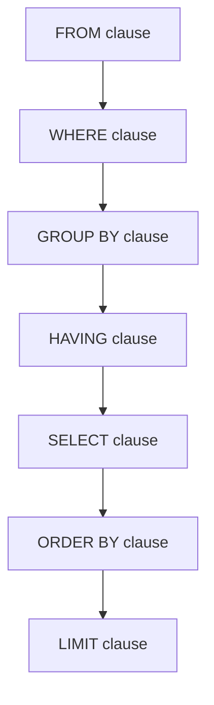

# SQL First Query

## Introduction

Welcome to the world of databases! In this tutorial, you'll write your first SQL query. SQL (Structured Query Language) is the standard language used to communicate with relational databases. Whether you're building a simple website or a complex application, understanding how to retrieve data using SQL is an essential skill for any programmer.

By the end of this lesson, you'll be able to:
- Understand what a SQL query is
- Write your first SELECT statement
- Retrieve data from a database table
- Filter results using basic conditions

## What is a SQL Query?

A SQL query is a request for data from a database. Think of a database as a collection of tables, similar to spreadsheets, with rows and columns of data. SQL queries allow you to:

1. Retrieve specific data (SELECT)
2. Insert new data (INSERT)
3. Update existing data (UPDATE)
4. Delete data (DELETE)

We'll focus on the SELECT statement, which is the most common type of query and the first one you'll need to learn.

## The SELECT Statement

The basic syntax for a SQL SELECT statement is:

```sql
SELECT column1, column2, ...
FROM table_name;
```

This tells the database:
- Which columns of data you want to retrieve
- Which table you want to get the data from

Let's break down the components:

- `SELECT`: The command that tells the database you want to retrieve data
- `column1, column2, ...`: The specific columns you want to see
- `FROM`: Specifies which table to query
- `table_name`: The name of the table containing your data
- `;`: Semicolon that ends the statement (required in most database systems)

## Your First Query: Retrieving All Columns

Let's say we have a table called `employees` with information about people who work at a company. Here's how to retrieve all columns for all employees:

```sql
SELECT * FROM employees;
```

The asterisk (`*`) is a wildcard that means "all columns." This query will return every column for every row in the table.

### Example Input and Output

For our examples, let's assume the `employees` table looks like this:

| id | first_name | last_name | department | hire_date  | salary |
|----|------------|-----------|------------|------------|--------|
| 1  | John       | Smith     | Marketing  | 2020-06-15 | 65000  |
| 2  | Sarah      | Johnson   | Engineering| 2019-03-20 | 78000  |
| 3  | Michael    | Williams  | Sales      | 2021-01-10 | 60000  |
| 4  | Jessica    | Brown     | Engineering| 2018-07-05 | 82000  |
| 5  | David      | Miller    | Marketing  | 2022-02-28 | 62000  |

When you run the query `SELECT * FROM employees;`, you'll get the entire table as shown above.

## Selecting Specific Columns

Often, you don't need all the data from a table. You can specify exactly which columns you want:

```sql
SELECT first_name, last_name, department
FROM employees;
```

### Example Output

| first_name | last_name | department  |
|------------|-----------|-------------|
| John       | Smith     | Marketing   |
| Sarah      | Johnson   | Engineering |
| Michael    | Williams  | Sales       |
| Jessica    | Brown     | Engineering |
| David      | Miller    | Marketing   |

This is more efficient than retrieving all columns when you only need specific data.

## Filtering Results with WHERE

To retrieve only specific rows that match certain criteria, use the WHERE clause:

```sql
SELECT first_name, last_name, salary
FROM employees
WHERE department = 'Engineering';
```

### Example Output

| first_name | last_name | salary |
|------------|-----------|--------|
| Sarah      | Johnson   | 78000  |
| Jessica    | Brown     | 82000  |

The WHERE clause acts as a filter, only showing rows where the department is 'Engineering'.

## Sorting Results with ORDER BY

You can sort your results using the ORDER BY clause:

```sql
SELECT first_name, last_name, hire_date
FROM employees
ORDER BY hire_date ASC;
```

### Example Output

| first_name | last_name | hire_date  |
|------------|-----------|------------|
| Jessica    | Brown     | 2018-07-05 |
| Sarah      | Johnson   | 2019-03-20 |
| John       | Smith     | 2020-06-15 |
| Michael    | Williams  | 2021-01-10 |
| David      | Miller    | 2022-02-28 |

- `ASC` stands for ascending order (oldest to newest)
- You could use `DESC` for descending order (newest to oldest)

## Limiting the Number of Results

In many database systems, you can limit the number of results:

```sql
SELECT first_name, last_name, salary
FROM employees
ORDER BY salary DESC
LIMIT 3;
```

### Example Output

| first_name | last_name | salary |
|------------|-----------|--------|
| Jessica    | Brown     | 82000  |
| Sarah      | Johnson   | 78000  |
| John       | Smith     | 65000  |

This returns the three highest-paid employees.

## Real-World Application: Building a Dashboard

Imagine you're building a company dashboard that shows department information. You might need:

1. Count of employees per department:

```sql
SELECT department, COUNT(*) as employee_count
FROM employees
GROUP BY department
ORDER BY employee_count DESC;
```

### Example Output

| department  | employee_count |
|-------------|----------------|
| Marketing   | 2              |
| Engineering | 2              |
| Sales       | 1              |

2. Average salary by department:

```sql
SELECT department, AVG(salary) as average_salary
FROM employees
GROUP BY department
ORDER BY average_salary DESC;
```

### Example Output

| department  | average_salary |
|-------------|----------------|
| Engineering | 80000          |
| Marketing   | 63500          |
| Sales       | 60000          |

These queries demonstrate how SQL can quickly analyze data to provide valuable business insights.

## SQL Query Execution Flow

Understanding how a query is processed helps you write more efficient queries:



This diagram shows that even though `SELECT` appears first in your query, the database actually processes the `FROM` clause first to determine which table to use.

## Summary

Congratulations! You've written your first SQL queries. You've learned:

- The basic structure of a SQL SELECT statement
- How to retrieve all or specific columns from a table
- How to filter data using the WHERE clause
- How to sort results with ORDER BY
- How to limit the number of results
- Some real-world applications of SQL queries

SQL is powerful because it allows you to extract exactly the data you need from a database in a structured way. The queries we've covered form the foundation of more complex database interactions you'll learn in future lessons.

## Exercises

Practice what you've learned with these exercises:

1. Write a query to select all employees hired in 2020 or later.
2. Write a query to find the employee with the highest salary.
3. Write a query to count how many employees have a salary greater than 70000.
4. Write a query to select all employees, ordered alphabetically by last name.

## Additional Resources

- [W3Schools SQL Tutorial](https://www.w3schools.com/sql/)
- [SQL Fiddle](http://sqlfiddle.com/) - An online tool to practice SQL queries
- [Mode Analytics SQL Tutorial](https://mode.com/sql-tutorial/)
- [PostgreSQL Documentation](https://www.postgresql.org/docs/)
- [MySQL Documentation](https://dev.mysql.com/doc/)