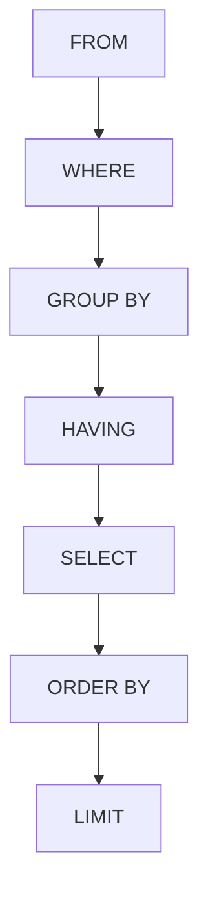

# SQL Syntax

## Introduction

SQL (Structured Query Language) is the standard language for interacting with relational databases. Whether you're retrieving data, inserting new records, updating existing information, or deleting data, SQL provides a consistent syntax to communicate with your database. This guide will walk you through the fundamental syntax elements of SQL, providing you with the building blocks needed to write effective database queries.

## SQL Statements Basics

SQL commands are composed of statements that perform specific tasks. Each statement typically ends with a semicolon (`;`), although some database systems don't strictly require it for single statements.

### Key Characteristics of SQL Syntax

- SQL is **not** case-sensitive for keywords (SELECT is the same as select)
- SQL statements end with a semicolon (;)
- Whitespace is generally ignored in SQL statements
- SQL comments use `--` for single line or `/* */` for multi-line comments

## SELECT Statement

The SELECT statement is one of the most commonly used SQL commands, allowing you to retrieve data from a database.

### Basic Syntax

```sql
SELECT column1, column2, ...
FROM table_name;
```

### Example

```sql
SELECT first_name, last_name
FROM employees;
```

**Output:**
```
first_name | last_name
-----------|-----------
John       | Smith
Sarah      | Johnson
Michael    | Williams
...
```

### Selecting All Columns

To retrieve all columns from a table, use the asterisk (`*`) wildcard character:

```sql
SELECT *
FROM employees;
```

### Filtering Data with WHERE

The WHERE clause filters records based on a specific condition:

```sql
SELECT column1, column2, ...
FROM table_name
WHERE condition;
```

**Example:**

```sql
SELECT first_name, last_name, salary
FROM employees
WHERE salary > 50000;
```

## INSERT Statement

The INSERT statement adds new records to a table.

### Basic Syntax

```sql
INSERT INTO table_name (column1, column2, ...)
VALUES (value1, value2, ...);
```

### Example

```sql
INSERT INTO employees (first_name, last_name, email, hire_date)
VALUES ('Jane', 'Doe', 'jane.doe@example.com', '2023-01-15');
```

You can also insert multiple rows at once:

```sql
INSERT INTO employees (first_name, last_name, email)
VALUES 
  ('John', 'Smith', 'john.smith@example.com'),
  ('Mary', 'Johnson', 'mary.johnson@example.com');
```

## UPDATE Statement

The UPDATE statement modifies existing records in a table.

### Basic Syntax

```sql
UPDATE table_name
SET column1 = value1, column2 = value2, ...
WHERE condition;
```

### Example

```sql
UPDATE employees
SET salary = 60000, department = 'Marketing'
WHERE employee_id = 1001;
```

**Important:** If you omit the WHERE clause, the UPDATE will modify ALL rows in the table!

## DELETE Statement

The DELETE statement removes records from a table.

### Basic Syntax

```sql
DELETE FROM table_name
WHERE condition;
```

### Example

```sql
DELETE FROM employees
WHERE employment_status = 'Terminated';
```

**Important:** If you omit the WHERE clause, the DELETE will remove ALL rows from the table!

## Common SQL Operators

SQL provides various operators to create conditions and filter data:

### Comparison Operators

- `=` : Equal to
- `>` : Greater than
- `<` : Less than
- `>=` : Greater than or equal to
- `<=` : Less than or equal to
- `<>` or `!=` : Not equal to

### Logical Operators

- `AND` : Returns true if both conditions are true
- `OR` : Returns true if either condition is true
- `NOT` : Negates a condition

### Example with Multiple Conditions

```sql
SELECT first_name, last_name, department, salary
FROM employees
WHERE department = 'Sales' AND salary >= 60000;
```

## ORDER BY Clause

The ORDER BY clause sorts the result set in ascending (ASC) or descending (DESC) order.

### Basic Syntax

```sql
SELECT column1, column2, ...
FROM table_name
ORDER BY column1 [ASC|DESC], column2 [ASC|DESC], ...;
```

### Example

```sql
SELECT first_name, last_name, hire_date
FROM employees
ORDER BY hire_date DESC;
```

This returns employees ordered from the most recently hired to the earliest hired.

## LIMIT Clause

The LIMIT clause restricts the number of rows returned in a result set.

### Basic Syntax

```sql
SELECT column1, column2, ...
FROM table_name
LIMIT number;
```

### Example

```sql
SELECT first_name, last_name, email
FROM employees
LIMIT 5;
```

This returns only the first 5 employees from the result set.

## SQL Functions

SQL includes built-in functions that perform operations on data.

### Aggregate Functions

- `COUNT()` : Counts the number of rows
- `SUM()` : Calculates the sum of numeric values
- `AVG()` : Calculates the average of numeric values
- `MIN()` : Returns the minimum value
- `MAX()` : Returns the maximum value

### Example

```sql
SELECT 
  department,
  COUNT(*) AS employee_count,
  AVG(salary) AS average_salary
FROM employees
GROUP BY department;
```

**Output:**
```
department  | employee_count | average_salary
------------|----------------|---------------
Engineering | 42             | 75000.00
Marketing   | 18             | 65000.00
Sales       | 24             | 68000.00
...
```

## SQL Clauses: The Order of Execution

SQL statements are processed in a specific order, regardless of how you write them:



Understanding this order is important when writing complex queries.

## Common SQL Mistakes to Avoid

1. **Missing WHERE clause** in UPDATE or DELETE statements
2. **Using incorrect quotes** - Use single quotes for string values: `'text'`
3. **Case sensitivity issues** with data (while SQL keywords aren't case-sensitive, data values often are)
4. **Forgetting to terminate statements** with semicolons in multi-statement scripts
5. **Using incorrect join syntax** leading to unintended cross joins

## Practical Example: Building a Complete Query

Let's build a practical query step by step to find the top-performing sales representatives:

```sql
-- Find the top 3 sales representatives by total order value
SELECT 
    e.first_name,
    e.last_name,
    COUNT(o.order_id) AS total_orders,
    SUM(o.order_value) AS total_sales
FROM 
    employees e
JOIN 
    orders o ON e.employee_id = o.sales_rep_id
WHERE 
    e.department = 'Sales'
    AND o.order_date >= '2023-01-01'
GROUP BY 
    e.employee_id, e.first_name, e.last_name
HAVING 
    COUNT(o.order_id) > 5
ORDER BY 
    total_sales DESC
LIMIT 3;
```

This query:
1. Selects employees and their associated orders
2. Filters for sales department employees and recent orders
3. Groups by employee to calculate totals
4. Only includes employees with more than 5 orders
5. Orders by total sales in descending order
6. Limits to the top 3 performers

## Summary

SQL syntax follows a logical structure that allows you to communicate with databases effectively. The key components we've covered include:

- Basic SQL statements: SELECT, INSERT, UPDATE, DELETE
- Filtering data with WHERE clause and conditions
- Sorting results with ORDER BY
- Limiting results with LIMIT
- Using functions to analyze data
- Building complex queries by combining multiple SQL elements

With these fundamentals, you now have the building blocks to start writing your own SQL queries. Remember that SQL syntax is mostly consistent across different database systems, but some specific features might vary.

## Exercises

1. Write a SELECT query to retrieve all products that cost more than $50.
2. Create an INSERT statement to add a new customer to a customers table.
3. Write an UPDATE statement to change the email address of a specific user.
4. Create a query that finds the average price of products by category, showing only categories with an average price above $100.
5. Write a query to find the 5 most recent orders in the system.

## Additional Resources

- [W3Schools SQL Tutorial](https://www.w3schools.com/sql/)
- [SQL Zoo - Interactive SQL Exercises](https://sqlzoo.net/)
- [Mode Analytics SQL Tutorial](https://mode.com/sql-tutorial/)
- [PostgreSQL Documentation](https://www.postgresql.org/docs/)
- [MySQL Documentation](https://dev.mysql.com/doc/)

Remember, the best way to learn SQL is through practice! Try working with a sample database to apply these syntax rules in real-world scenarios.