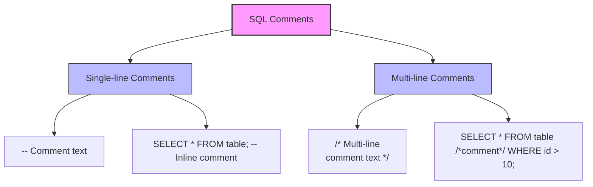

# SQL Comments

## Introduction

Comments are non-executable text added to SQL code to provide explanations, document functionality, or temporarily disable code. They are essential for code maintenance, collaboration, and troubleshooting. Well-commented SQL code is easier to understand, modify, and debug, making it a fundamental best practice in database development.

In this tutorial, you'll learn:
- Different types of SQL comments
- When and how to use comments effectively
- Best practices for SQL documentation

## Types of SQL Comments

SQL supports two main types of comments:

### 1. Single-line Comments

Single-line comments begin with two hyphens (`--`) and continue until the end of the line. Everything after the double hyphen is ignored by the SQL interpreter.

```sql
-- This is a single-line comment
SELECT first_name, last_name FROM employees; -- This retrieves user names
```

### 2. Multi-line Comments

Multi-line comments begin with `/*` and end with `*/`. Everything between these delimiters is ignored by the SQL interpreter, even if it spans multiple lines.

```sql
/* This is a multi-line comment
   that spans several lines and can be
   used for longer explanations */
SELECT
    first_name,
    last_name,
    email
FROM employees;
```

## When to Use Comments

### Documenting Code Purpose

Use comments to explain what your SQL query is trying to accomplish:

```sql
-- Find all customers who haven't placed an order in the last 6 months
SELECT customer_id, first_name, last_name, email
FROM customers
WHERE customer_id NOT IN (
    SELECT DISTINCT customer_id 
    FROM orders 
    WHERE order_date > DATE_SUB(CURRENT_DATE, INTERVAL 6 MONTH)
);
```

### Explaining Complex Logic

When writing complex queries, comments help others (and future you) understand your thought process:

```sql
/* This query calculates the average order value by:
   1. Joining the orders and order_items tables
   2. Grouping by order_id
   3. Calculating the sum of item prices per order
   4. Finding the average of those sums */
SELECT AVG(order_total) AS average_order_value
FROM (
    SELECT o.order_id, SUM(oi.price * oi.quantity) AS order_total
    FROM orders o
    JOIN order_items oi ON o.order_id = oi.order_id
    GROUP BY o.order_id
) AS order_summaries;
```

### Temporarily Disabling Code

Comments can be used to "comment out" code for testing or debugging:

```sql
SELECT 
    product_id,
    product_name,
    price,
    /* Temporarily removing category filtering for testing
    WHERE category = 'Electronics'
    */
    stock_quantity
FROM products;
```

## Real-World Examples

### Example 1: Database Schema Documentation

```sql
/* 
 * Table: customers
 * -----------------
 * Stores information about registered customers.
 *
 * Columns:
 * customer_id (INT): Primary key, auto-incrementing
 * first_name (VARCHAR): Customer's first name
 * last_name (VARCHAR): Customer's last name
 * email (VARCHAR): Unique email address
 * created_at (TIMESTAMP): Account creation date
 */
CREATE TABLE customers (
    customer_id INT PRIMARY KEY AUTO_INCREMENT,
    first_name VARCHAR(50) NOT NULL,
    last_name VARCHAR(50) NOT NULL,
    email VARCHAR(100) UNIQUE NOT NULL,
    created_at TIMESTAMP DEFAULT CURRENT_TIMESTAMP
);
```

### Example 2: Stored Procedure Documentation

```sql
/*
 * Procedure: get_customer_order_history
 * -------------------------------------
 * Purpose: Retrieves complete order history for a specific customer
 * 
 * Parameters:
 * @customer_id (INT): The ID of the customer to retrieve orders for
 * 
 * Returns:
 * - order_id
 * - order_date
 * - total_amount
 * - order_status
 */
CREATE PROCEDURE get_customer_order_history (
    IN customer_id INT
)
BEGIN
    -- Validate customer exists
    IF EXISTS (SELECT 1 FROM customers WHERE customer_id = customer_id) THEN
        -- Retrieve complete order history
        SELECT
            o.order_id,
            o.order_date,
            o.total_amount,
            o.status AS order_status
        FROM orders o
        WHERE o.customer_id = customer_id
        ORDER BY o.order_date DESC;
    ELSE
        -- Return empty result if customer doesn't exist
        SELECT 'Customer not found' AS message;
    END IF;
END;
```

### Example 3: Query Optimization Documentation

```sql
/* 
 * Performance optimization query for monthly sales report
 *
 * Original query was: 
 *   SELECT * FROM sales JOIN customers ON ... JOIN products ON ...
 *   (Full table scan taking 15+ seconds)
 *
 * Optimizations:
 * 1. Limited columns to only those needed for the report
 * 2. Added indexed date filtering before joins
 * 3. Created covering index for frequent filters
 * 
 * New execution time: ~200ms
 */
SELECT 
    s.sale_date,
    c.customer_name,
    p.product_name,
    s.quantity,
    s.total_price
FROM 
    sales s
    -- Using indexed date column first
    WHERE s.sale_date BETWEEN '2023-01-01' AND '2023-01-31'
    -- Joining only after filtering
    JOIN customers c ON s.customer_id = c.customer_id
    JOIN products p ON s.product_id = p.product_id
ORDER BY s.sale_date;
```

## SQL Comment Best Practices

1. **Be Clear and Concise**: Write comments that add value without being overly verbose.

2. **Use Consistent Formatting**:
   ```sql
   -- Section: Customer Filtering
   
   /* Major query components:
    * - Customer selection
    * - Order filtering
    * - Result limiting
    */
   ```

3. **Update Comments When Code Changes**: Outdated comments can be more confusing than no comments.

4. **Comment "Why" not just "What"**: The code shows what happens; comments should explain the reasoning.

5. **Document Assumptions and Constraints**:
   ```sql
   -- Assumes 'status' column contains only 'active' or 'inactive'
   -- This query will need modification if new statuses are added
   ```

6. **Add Version Information For Critical Scripts**:
   ```sql
   /* 
    * Migration Script: Add user_preferences table
    * Version: 1.2.0
    * Author: J. Smith
    * Date: 2023-06-15
    */
   ```

## Interactive Diagram: SQL Comment Types



## Summary

SQL comments are a powerful tool for documenting your database code and improving its maintainability. By using single-line comments (`--`) for brief explanations and multi-line comments (`/* */`) for more detailed documentation, you can make your SQL code more understandable and easier to manage.

Remember that good comments explain the "why" behind your code rather than just restating what the code does. They provide context, document assumptions, and help future developers (including yourself) understand your thought process.

## Exercises

1. Add appropriate comments to the following query:
   ```sql
   SELECT u.username, COUNT(o.order_id) 
   FROM users u 
   LEFT JOIN orders o ON u.user_id = o.user_id 
   WHERE u.signup_date > '2023-01-01' 
   GROUP BY u.username 
   HAVING COUNT(o.order_id) < 5;
   ```

2. Convert this single-line commented code to use multi-line comments:
   ```sql
   -- This function calculates the discount
   -- It takes the original price as input
   -- And returns the discounted price
   -- The discount is 10% for amounts less than 100
   -- And 15% for amounts 100 or greater
   CREATE FUNCTION calculate_discount(price DECIMAL) ...
   ```

3. Write a well-commented CREATE TABLE statement for a blog application's "posts" table that includes columns for title, content, author, publication date, and tags.

## Additional Resources

- [SQL Style Guide](https://www.sqlstyle.guide/) - Industry standards for SQL formatting, including comment styles
- [Database Documentation Best Practices](https://www.red-gate.com/simple-talk/databases/sql-server/database-documentation-the-missing-manual/) - Comprehensive guide to documenting databases
- [SQL Comment Generators](https://dbdocs.io/) - Tools that can help automate documentation