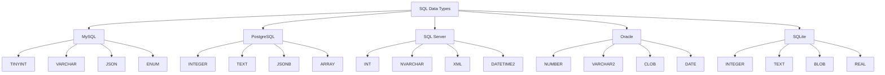

# SQL Data Types

## Introduction

When creating databases, one of the most fundamental decisions you'll make is choosing the appropriate data types for your columns. SQL data types define what kind of data can be stored in a particular column and how the database system handles and processes that data.

Choosing the right data type is crucial because it affects:
- Storage efficiency
- Query performance
- Data integrity
- Application functionality

In this guide, we'll explore the common SQL data types, their purposes, and how to use them effectively in your database designs.

## Numeric Data Types

Numeric data types store numbers and allow mathematical operations. SQL provides several numeric types to accommodate different ranges and precision requirements.

### Integer Types

Integer types store whole numbers without decimal places.

| Data Type | Storage Size | Range | Description |
|-----------|--------------|-------|-------------|
| TINYINT | 1 byte | 0 to 255 (unsigned) | Very small integers |
| SMALLINT | 2 bytes | -32,768 to 32,767 | Small integers |
| INT | 4 bytes | -2,147,483,648 to 2,147,483,647 | Standard integers |
| BIGINT | 8 bytes | -9,223,372,036,854,775,808 to 9,223,372,036,854,775,807 | Large integers |

#### Example: Creating a table with integer types

```sql
CREATE TABLE product_inventory (
    product_id INT PRIMARY KEY,
    item_count SMALLINT,
    warehouse_bin TINYINT,
    total_units_sold BIGINT
);
```

### Decimal/Numeric Types

For numbers that require decimal places, SQL provides:

| Data Type | Format | Description |
|-----------|--------|-------------|
| DECIMAL(p,s) | Precision, Scale | Exact decimal numbers with user-defined precision |
| NUMERIC(p,s) | Precision, Scale | Functionally identical to DECIMAL in most systems |
| FLOAT | Variable | Approximate floating-point number |
| REAL | Variable | Approximate floating-point number (less precision than FLOAT) |

The `p` (precision) represents the total number of digits, and `s` (scale) represents the number of digits after the decimal point.

#### Example: Using decimal types

```sql
CREATE TABLE financial_transactions (
    transaction_id INT PRIMARY KEY,
    amount DECIMAL(10,2),  -- Can store up to 10 digits with 2 after decimal point
    exchange_rate FLOAT,
    calculated_value NUMERIC(12,4)
);

-- Inserting values
INSERT INTO financial_transactions (transaction_id, amount, exchange_rate, calculated_value)
VALUES (1, 1250.75, 1.3265, 1659.12);
```

## String Data Types

String data types store text and alphanumeric data. The common types include:

### Fixed and Variable Length Strings

| Data Type | Format | Description |
|-----------|--------|-------------|
| CHAR(n) | Fixed length | Stores exactly n characters, padding with spaces if necessary |
| VARCHAR(n) | Variable length | Stores up to n characters, using only the space needed |
| TEXT | Variable length | Stores large amounts of text data |

#### Example: Using string types

```sql
CREATE TABLE user_profiles (
    user_id INT PRIMARY KEY,
    username VARCHAR(50),         -- Variable length, up to 50 characters
    country_code CHAR(2),         -- Always exactly 2 characters (ISO country codes)
    bio TEXT                      -- Can store lengthy text
);

-- Inserting values
INSERT INTO user_profiles (user_id, username, country_code, bio)
VALUES (1, 'johndoe', 'US', 'John is a software developer with over 10 years of experience...');
```

### Unicode String Types

For international character support:

| Data Type | Description |
|-----------|-------------|
| NCHAR | Fixed-length Unicode character data |
| NVARCHAR | Variable-length Unicode character data |
| NTEXT | Large Unicode text data (deprecated in newer SQL versions) |

#### Example: Supporting multiple languages

```sql
CREATE TABLE product_descriptions (
    product_id INT PRIMARY KEY,
    name NVARCHAR(100),           -- Can store characters from any language
    description NVARCHAR(MAX)     -- Maximum allowed length for variable description
);

-- Example with international characters
INSERT INTO product_descriptions (product_id, name, description)
VALUES (1, N'Café Espresso', N'高品質のエスプレッソ。Rich and aromatic espresso coffee.');
```

## Date and Time Data Types

Date and time data types store temporal information.

| Data Type | Format | Description |
|-----------|--------|-------------|
| DATE | YYYY-MM-DD | Date only |
| TIME | HH:MM:SS | Time only |
| DATETIME | YYYY-MM-DD HH:MM:SS | Date and time |
| TIMESTAMP | System-dependent | Date and time, often used for row versioning |
| INTERVAL | Varied | Stores a period of time |

#### Example: Working with dates and times

```sql
CREATE TABLE appointments (
    appointment_id INT PRIMARY KEY,
    appointment_date DATE,
    start_time TIME,
    end_time TIME,
    created_at DATETIME,
    last_modified TIMESTAMP
);

-- Inserting date/time values
INSERT INTO appointments (appointment_id, appointment_date, start_time, end_time, created_at)
VALUES (1, '2023-11-15', '14:30:00', '15:30:00', '2023-11-10 09:15:32');

-- Querying date ranges
SELECT * FROM appointments 
WHERE appointment_date BETWEEN '2023-11-01' AND '2023-11-30';
```

## Boolean Data Type

The BOOLEAN (or BOOL) type stores true/false values. However, implementation varies between database systems.

### Example: Using boolean data

```sql
CREATE TABLE tasks (
    task_id INT PRIMARY KEY,
    task_name VARCHAR(100),
    is_completed BOOLEAN
);

-- In MySQL, BOOLEAN is actually TINYINT(1)
INSERT INTO tasks (task_id, task_name, is_completed)
VALUES 
    (1, 'Update documentation', TRUE),
    (2, 'Fix login bug', FALSE);
    
-- Querying for completed tasks
SELECT * FROM tasks WHERE is_completed = TRUE;
```

## Binary Data Types

Binary data types store binary data like files, images, or any binary content.

| Data Type | Description |
|-----------|-------------|
| BINARY(n) | Fixed-length binary data |
| VARBINARY(n) | Variable-length binary data |
| BLOB | Binary Large Object for large binary data |

### Example: Storing binary data

```sql
CREATE TABLE user_documents (
    document_id INT PRIMARY KEY,
    user_id INT,
    filename VARCHAR(255),
    file_data BLOB,
    file_type VARBINARY(50)
);
```

## Special Data Types

### JSON Data Type

Modern database systems support JSON as a native data type.

```sql
CREATE TABLE user_preferences (
    user_id INT PRIMARY KEY,
    preferences JSON
);

-- Inserting a JSON object
INSERT INTO user_preferences (user_id, preferences)
VALUES (1, '{"theme": "dark", "notifications": true, "language": "en-US"}');

-- Querying JSON properties (syntax varies by database system)
SELECT user_id FROM user_preferences
WHERE JSON_EXTRACT(preferences, '$.theme') = 'dark';
```

### XML Data Type

Some database systems like SQL Server support XML as a data type.

```sql
-- SQL Server example
CREATE TABLE product_specs (
    product_id INT PRIMARY KEY,
    specifications XML
);
```

### Array Data Type

PostgreSQL supports arrays:

```sql
-- PostgreSQL example
CREATE TABLE student_scores (
    student_id INT PRIMARY KEY,
    scores INTEGER[]
);

INSERT INTO student_scores (student_id, scores)
VALUES (1, ARRAY[85, 92, 78, 90]);
```

### Enum Data Type

MySQL supports enumerations:

```sql
-- MySQL example
CREATE TABLE tickets (
    ticket_id INT PRIMARY KEY,
    status ENUM('open', 'in progress', 'resolved', 'closed')
);

INSERT INTO tickets (ticket_id, status)
VALUES (1, 'open');
```

## Data Types Across Different Database Systems

It's important to note that data types can vary between different database management systems:



## Best Practices for Choosing Data Types

1. **Choose the smallest data type that can reliably store your data**
   - This optimizes storage and improves query performance

2. **Use CHAR for fixed-length codes**
   - Example: Country codes, state abbreviations

3. **Use appropriate numeric types for calculations**
   - DECIMAL for financial calculations where precision matters
   - INT for counts and IDs

4. **Be consistent across tables**
   - Use the same data types for columns that may be joined

5. **Consider future requirements**
   - Allow room for growth (but don't go overboard)

## Practical Example: Building a Complete Schema

Let's put it all together with a practical example of a simple e-commerce database:

```sql
CREATE TABLE customers (
    customer_id INT PRIMARY KEY,
    first_name VARCHAR(50) NOT NULL,
    last_name VARCHAR(50) NOT NULL,
    email VARCHAR(100) UNIQUE NOT NULL,
    phone_number VARCHAR(20),
    date_registered DATE NOT NULL,
    is_active BOOLEAN DEFAULT TRUE
);

CREATE TABLE products (
    product_id INT PRIMARY KEY,
    product_name VARCHAR(100) NOT NULL,
    description TEXT,
    price DECIMAL(10,2) NOT NULL,
    stock_quantity INT NOT NULL,
    category VARCHAR(50),
    tags JSON,
    product_image BLOB
);

CREATE TABLE orders (
    order_id INT PRIMARY KEY,
    customer_id INT,
    order_date DATETIME NOT NULL,
    status VARCHAR(20) DEFAULT 'pending',
    total_amount DECIMAL(12,2) NOT NULL,
    shipping_address TEXT NOT NULL,
    FOREIGN KEY (customer_id) REFERENCES customers(customer_id)
);

CREATE TABLE order_items (
    order_item_id INT PRIMARY KEY,
    order_id INT,
    product_id INT,
    quantity SMALLINT NOT NULL,
    price_per_unit DECIMAL(10,2) NOT NULL,
    FOREIGN KEY (order_id) REFERENCES orders(order_id),
    FOREIGN KEY (product_id) REFERENCES products(product_id)
);
```

## Data Type Conversion

Sometimes you need to convert between data types. This is called casting:

```sql
-- Casting examples
SELECT CAST('100' AS INT);
SELECT CAST(product_id AS VARCHAR) FROM products;

-- Converting date to string
SELECT CAST(order_date AS VARCHAR) FROM orders;

-- Alternative syntax in some systems
SELECT order_id::VARCHAR FROM orders;  -- PostgreSQL style
```

## Summary

Choosing the right SQL data types is fundamental to good database design. The correct data types will:

- Ensure data integrity
- Optimize storage space
- Improve query performance
- Enable appropriate operations on your data

Remember these key points:
- Use numeric types for numbers that need calculation
- Choose appropriate string types based on content length and character requirements
- Select specific date/time types for temporal data
- Consider specialized types like JSON for structured data
- Be aware of differences between database systems

## Exercises

1. Design a schema for a library management system. Choose appropriate data types for books, members, and borrowing records.

2. Given this table:
   ```sql
   CREATE TABLE sales (
       id INT,
       sale_date VARCHAR(50),
       amount VARCHAR(20)
   );
   ```
   Write a query to convert `sale_date` to a proper DATE type and `amount` to a DECIMAL.

3. Create a table schema for storing user profiles including name, email, password (hashed), birthday, profile picture, and preferences.

## Additional Resources

- [MySQL Data Types Documentation](https://dev.mysql.com/doc/refman/8.0/en/data-types.html)
- [PostgreSQL Data Types](https://www.postgresql.org/docs/current/datatype.html)
- [SQL Server Data Types](https://learn.microsoft.com/en-us/sql/t-sql/data-types/data-types-transact-sql)
- [W3Schools SQL Data Types](https://www.w3schools.com/sql/sql_datatypes.asp)

Remember that while SQL is standardized, each database management system may have variations in data type implementation. Always consult the specific documentation for your database system.