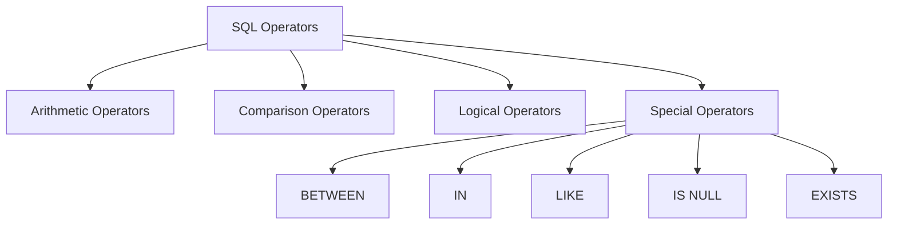

# SQL Operators

SQL operators are special symbols or keywords that are used to perform operations in SQL statements. They serve as the building blocks for creating conditions, performing calculations, and combining logical expressions in your database queries.

## Introduction

When working with databases, you'll frequently need to:
- Compare values
- Perform calculations
- Combine conditions with logical operations
- Test if values belong to sets or match patterns

SQL operators make all of these tasks possible and are essential tools for filtering, transforming, and analyzing your data.

## Types of SQL Operators

SQL operators can be categorized into several types:



Let's explore each type in detail.

## Arithmetic Operators

Arithmetic operators perform mathematical calculations on numeric data.

| Operator | Description | Example | Result |
|----------|-------------|---------|--------|
| + | Addition | `5 + 3` | `8` |
| - | Subtraction | `5 - 3` | `2` |
| * | Multiplication | `5 * 3` | `15` |
| / | Division | `15 / 3` | `5` |
| % | Modulo (remainder) | `17 % 5` | `2` |

### Example: Using Arithmetic Operators

Imagine we have a `products` table with `price` and `quantity` columns. We can use arithmetic operators to calculate the total value:

```sql
SELECT 
    product_name,
    price,
    quantity,
    price * quantity AS total_value
FROM 
    products;
```

Output:
```
| product_name | price | quantity | total_value |
|--------------|-------|----------|-------------|
| Keyboard     | 29.99 | 10       | 299.90      |
| Mouse        | 15.50 | 20       | 310.00      |
| Monitor      | 199.99| 5        | 999.95      |
```

## Comparison Operators

Comparison operators compare values and return a Boolean result (TRUE or FALSE).

| Operator | Description | Example | Result |
|----------|-------------|---------|--------|
| `=` | Equal to | `5 = 5` | `TRUE` |
| `<>` or `!=` | Not equal to | `5 <> 3` | `TRUE` |
| `<` | Less than | `3 < 5` | `TRUE` |
| `>` | Greater than | `5 > 3` | `TRUE` |
| `<=` | Less than or equal to | `3 <= 3` | `TRUE` |
| `>=` | Greater than or equal to | `5 >= 3` | `TRUE` |

### Example: Using Comparison Operators

Let's filter our `products` table to find products with a price greater than $50:

```sql
SELECT 
    product_name,
    price
FROM 
    products
WHERE 
    price > 50;
```

Output:
```
| product_name | price  |
|--------------|--------|
| Monitor      | 199.99 |
```

## Logical Operators

Logical operators combine multiple conditions.

| Operator | Description | Example | Result |
|----------|-------------|---------|--------|
| AND | TRUE if both conditions are TRUE | `5 > 3 AND 6 > 4` | `TRUE` |
| OR | TRUE if at least one condition is TRUE | `5 < 3 OR 6 > 4` | `TRUE` |
| NOT | Reverses the result | `NOT(5 < 3)` | `TRUE` |

### Example: Using Logical Operators

Finding products that are either expensive or low in stock:

```sql
SELECT 
    product_name,
    price,
    quantity
FROM 
    products
WHERE 
    price > 100 OR quantity < 10;
```

Output:
```
| product_name | price  | quantity |
|--------------|--------|----------|
| Monitor      | 199.99 | 5        |
```

## Special Operators

### BETWEEN Operator

The BETWEEN operator checks if a value falls within a range.

```sql
SELECT 
    product_name,
    price
FROM 
    products
WHERE 
    price BETWEEN 10 AND 30;
```

Output:
```
| product_name | price |
|--------------|-------|
| Keyboard     | 29.99 |
| Mouse        | 15.50 |
```

### IN Operator

The IN operator checks if a value matches any value in a list.

```sql
SELECT 
    product_name,
    category
FROM 
    products
WHERE 
    category IN ('Peripherals', 'Accessories');
```

Output:
```
| product_name | category    |
|--------------|-------------|
| Keyboard     | Peripherals |
| Mouse        | Peripherals |
```

### LIKE Operator

The LIKE operator searches for a specified pattern in a column.

Wildcards used with LIKE:
- `%` - Represents zero, one, or multiple characters
- `_` - Represents a single character

```sql
SELECT 
    product_name
FROM 
    products
WHERE 
    product_name LIKE 'M%';
```

Output:
```
| product_name |
|--------------|
| Mouse        |
| Monitor      |
```

### IS NULL Operator

The IS NULL operator checks if a column value is NULL (missing or undefined).

```sql
SELECT 
    product_name,
    description
FROM 
    products
WHERE 
    description IS NULL;
```

Output:
```
| product_name | description |
|--------------|-------------|
| Mouse        | NULL        |
```

### EXISTS Operator

The EXISTS operator tests for the existence of records in a subquery.

```sql
SELECT 
    department_name
FROM 
    departments d
WHERE 
    EXISTS (
        SELECT 1
        FROM employees e
        WHERE e.department_id = d.id
    );
```

This returns departments that have at least one employee.

## String Concatenation Operator

In many SQL dialects, you can concatenate strings using the `||` operator or the `CONCAT()` function.

```sql
-- Using || (in SQLite, PostgreSQL, Oracle)
SELECT first_name || ' ' || last_name AS full_name FROM employees;

-- Using CONCAT() (in MySQL, SQL Server)
SELECT CONCAT(first_name, ' ', last_name) AS full_name FROM employees;
```

## Practical Examples

### Example 1: E-commerce Order Analysis

Imagine you're analyzing orders from an e-commerce database:

```sql
SELECT 
    o.order_id,
    o.order_date,
    c.customer_name,
    SUM(oi.quantity * p.price) AS order_total,
    CASE 
        WHEN SUM(oi.quantity * p.price) > 1000 THEN 'High Value'
        WHEN SUM(oi.quantity * p.price) BETWEEN 500 AND 1000 THEN 'Medium Value'
        ELSE 'Low Value'
    END AS order_category
FROM 
    orders o
JOIN 
    customers c ON o.customer_id = c.customer_id
JOIN 
    order_items oi ON o.order_id = oi.order_id
JOIN 
    products p ON oi.product_id = p.product_id
WHERE 
    o.order_date BETWEEN '2023-01-01' AND '2023-12-31'
    AND c.country IN ('USA', 'Canada')
GROUP BY 
    o.order_id, o.order_date, c.customer_name
HAVING 
    order_total > 100
ORDER BY 
    order_total DESC;
```

This query demonstrates:
- Arithmetic operators for calculating `order_total`
- Comparison operators in the CASE expression
- BETWEEN operator for date ranges
- IN operator for filtering countries
- Logical operators (AND) for combining conditions

### Example 2: Employee Search

Finding employees based on multiple criteria:

```sql
SELECT 
    employee_id,
    first_name,
    last_name,
    hire_date,
    salary
FROM 
    employees
WHERE 
    (department_id = 10 OR department_id = 20)
    AND (salary > 50000 OR job_title LIKE '%Manager%')
    AND hire_date < '2020-01-01'
    AND email IS NOT NULL
ORDER BY 
    salary DESC;
```

This query combines multiple operators to create complex filtering conditions.

## Operator Precedence

SQL has specific rules for the order in which operators are evaluated:

1. Parentheses `()`
2. Multiplication/division `*`, `/`, `%`
3. Addition/subtraction `+`, `-`
4. Comparison operators `=`, `<>`, `<`, `>`, `<=`, `>=`
5. NOT
6. AND
7. OR

To ensure your expressions are evaluated in the desired order, use parentheses to explicitly group operations.

## Summary

SQL operators are fundamental tools for working with databases. They allow you to:

- Perform mathematical calculations with arithmetic operators
- Compare values using comparison operators
- Combine conditions using logical operators
- Test for values in ranges, lists, or patterns using special operators

Understanding these operators is essential for writing effective SQL queries that can filter, transform, and analyze your data.

## Exercises

1. Write a query that finds all products with prices between $20 and $100.
2. Create a query that calculates a 10% discount on all products and shows both the original and discounted prices.
3. Find all customers whose names start with 'J' and who live in either 'New York' or 'California'.
4. Write a query that identifies orders placed in the last 30 days that have a total value greater than $500.
5. Create a query that finds employees who have been with the company for more than 5 years and either earn more than $60,000 or have a job title containing the word 'Senior'.

## Additional Resources

- [SQL Operators in W3Schools](https://www.w3schools.com/sql/sql_operators.asp)
- [PostgreSQL Operators Documentation](https://www.postgresql.org/docs/current/functions.html)
- [MySQL Operators Reference](https://dev.mysql.com/doc/refman/8.0/en/non-typed-operators.html)
- [Interactive SQL Exercises on HackerRank](https://www.hackerrank.com/domains/sql)
- [SQL Practice on LeetCode](https://leetcode.com/problemset/database/)