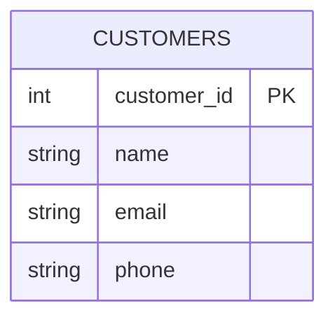
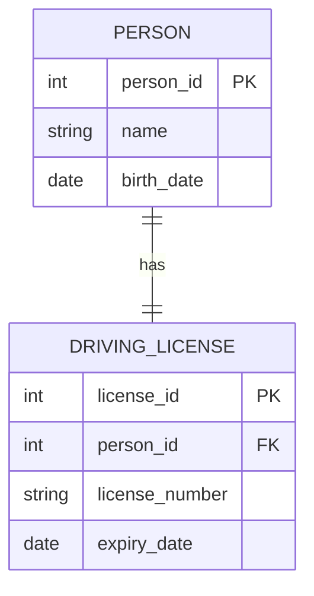
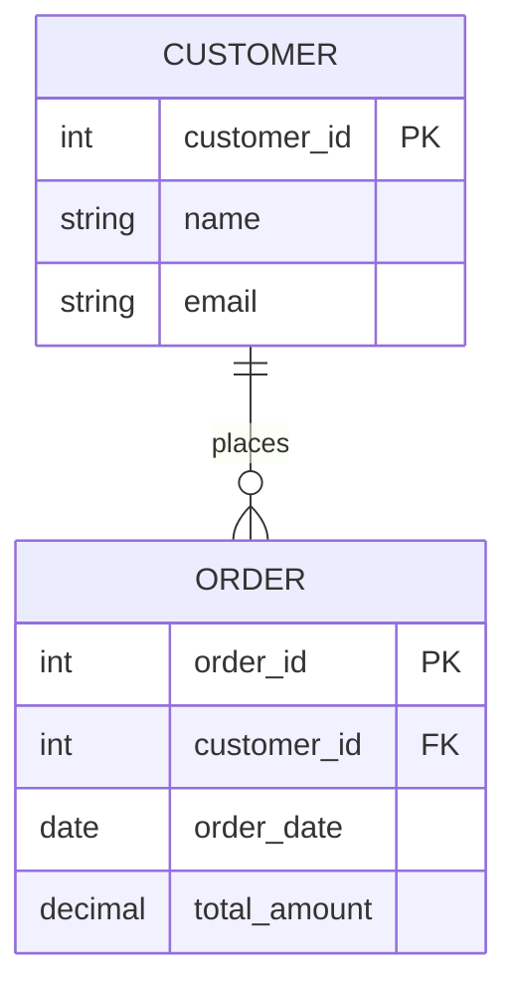
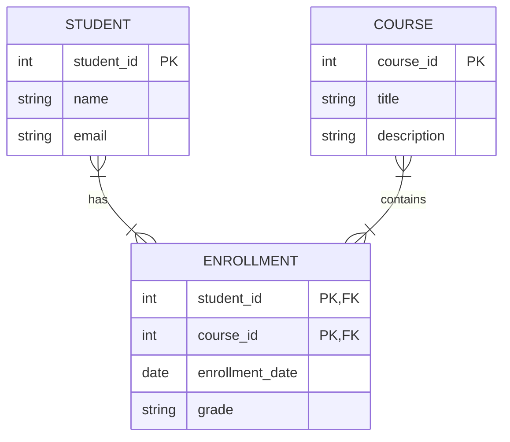
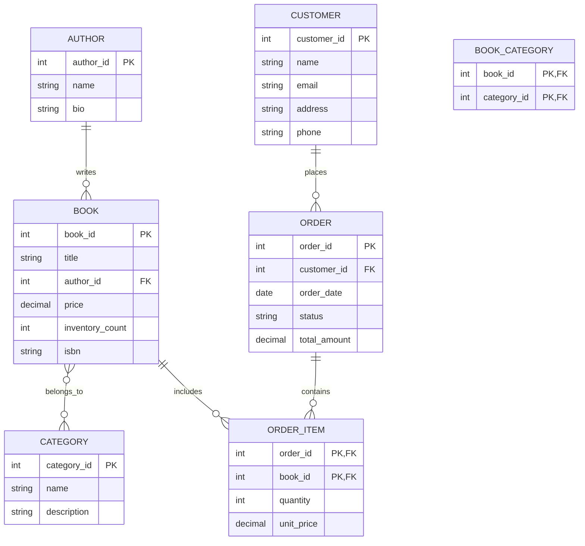

# SQL Database Concepts

## Introduction

Databases are the backbone of most modern applications, from simple websites to complex enterprise systems. SQL (Structured Query Language) is the standard language for interacting with relational databases. Before diving into SQL syntax and queries, it's essential to understand the fundamental concepts that make up database systems.

In this guide, we'll explore the core concepts of relational databases that will serve as your foundation for working with SQL. Whether you're building your first application or expanding your programming skills, understanding these principles will help you design efficient and maintainable database systems.

## What is a Database?

A database is an organized collection of data stored and accessed electronically. Think of it as a digital filing system that allows you to store, retrieve, and manipulate information in a structured way.

### Types of Databases

While we focus on relational databases in this guide, it's worth knowing there are several types:

- **Relational Databases**: Organize data in tables with rows and columns (MySQL, PostgreSQL, SQL Server)
- **NoSQL Databases**: Store data in formats other than tables (MongoDB, Cassandra, Redis)
- **Object-Oriented Databases**: Store data as objects (ObjectDB, db4o)
- **Graph Databases**: Focus on relationships between data points (Neo4j, ArangoDB)

## Relational Database Concepts

### Tables

Tables are the fundamental building blocks of relational databases. A table is a collection of related data organized in rows and columns.



In the example above:
- The table name is CUSTOMERS
- It has columns for customer_id, name, email, and phone
- Each row would represent a single customer with values for each column

### Columns and Data Types

Each column in a table has:
- A unique name within that table
- A specific data type that determines what kind of data can be stored

Common SQL data types include:

| Data Type    | Description                                                      | Example       |
|--------------|------------------------------------------------------------------|---------------|
| INTEGER      | Whole numbers                                                    | 42, -7, 0     |
| VARCHAR(n)   | Variable-length text (up to n characters)                        | "Hello World" |
| DATE         | Calendar date                                                    | 2023-09-15    |
| DECIMAL(p,s) | Precise decimal numbers with p total digits and s decimal places | 123.45        |
| BOOLEAN      | True/false values                                                | TRUE, FALSE   |

### Rows (Records)

Each row in a table represents a single instance or record of the entity that the table models. For example, in a CUSTOMERS table, each row would represent one customer with specific values for name, email, etc.

### Primary Keys

A primary key is a column (or combination of columns) that uniquely identifies each record in a table. Good primary keys should be:
- Unique (no duplicates allowed)
- Not null (must always have a value)
- Unchanging (stable over time)

Example: In a table of students, a student ID would make a good primary key.

```sql
CREATE TABLE students (
    student_id INTEGER PRIMARY KEY,
    first_name VARCHAR(50),
    last_name VARCHAR(50),
    email VARCHAR(100)
);
```

### Foreign Keys

Foreign keys establish relationships between tables by referencing the primary key of another table. They ensure referential integrity in your database.

```sql
CREATE TABLE orders (
    order_id INTEGER PRIMARY KEY,
    order_date DATE,
    customer_id INTEGER,
    total_amount DECIMAL(10,2),
    FOREIGN KEY (customer_id) REFERENCES customers(customer_id)
);
```

In this example, the `customer_id` in the `orders` table references the `customer_id` in the `customers` table, creating a relationship between the two tables.

## Database Relationships

Relationships define how tables are connected to each other. There are three main types:

### One-to-One Relationships

Each record in the first table is related to exactly one record in the second table, and vice versa.

Example: A person and their driving license - each person has one license, and each license belongs to one person.



### One-to-Many Relationships

Each record in the first table can be related to multiple records in the second table, but each record in the second table is related to only one record in the first table.

Example: A customer and their orders - each customer can have many orders, but each order belongs to only one customer.



### Many-to-Many Relationships

Records in the first table can be related to multiple records in the second table, and vice versa. This is implemented using a junction table (also called a bridge or linking table).

Example: Students and courses - each student can enroll in multiple courses, and each course can have multiple students.



## Database Normalization

Normalization is the process of organizing database tables to minimize redundancy and dependency issues. It involves dividing large tables into smaller ones and defining relationships between them.

### First Normal Form (1NF)

- Eliminate repeating groups
- Create separate tables for each set of related data
- Identify each set of related data with a primary key

**Before 1NF:**

| Order_ID | Customer | Products |
|----------|----------|----------|
| 1001 | John Smith | Laptop, Mouse, Keyboard |
| 1002 | Jane Doe | Monitor, Headphones |

**After 1NF:**

Orders Table:
| Order_ID | Customer |
|----------|----------|
| 1001 | John Smith |
| 1002 | Jane Doe |

Order_Items Table:
| Order_ID | Product |
|----------|---------|
| 1001 | Laptop |
| 1001 | Mouse |
| 1001 | Keyboard |
| 1002 | Monitor |
| 1002 | Headphones |

### Second Normal Form (2NF)

- Meet all requirements of 1NF
- Remove subsets of data that apply to multiple rows and place them in separate tables
- Create relationships between these new tables and their predecessors through foreign keys

### Third Normal Form (3NF)

- Meet all requirements of 2NF
- Remove columns that are not dependent on the primary key

Normalizing your database helps prevent:
- Update anomalies (inconsistent data after an update)
- Insertion anomalies (inability to add data due to missing information)
- Deletion anomalies (unintentional loss of data when a record is deleted)

## Schema Design Example

Let's walk through a practical example of designing a simple database for an online bookstore:



In this design:
1. Authors write books (one-to-many)
2. Books can belong to multiple categories, and categories can contain multiple books (many-to-many with a junction table)
3. Customers place orders (one-to-many)
4. Orders contain order items (one-to-many)
5. Order items reference specific books (many-to-one)

This schema follows the normalization principles we discussed and provides a solid foundation for an online bookstore database.

## Database Management Systems (DBMS)

A Database Management System is software that manages databases. Popular SQL-based DBMS include:

- **MySQL**: Open-source, widely used for web applications
- **PostgreSQL**: Open-source, known for robustness and advanced features
- **SQL Server**: Microsoft's enterprise database solution
- **SQLite**: Lightweight, file-based database, great for mobile applications
- **Oracle**: Enterprise-level database system with extensive features

Each DBMS has its own advantages, but they all implement SQL with slight variations. The concepts you learn here will apply to all of them, though specific syntax might differ slightly.

## Summary

In this guide, we've covered the fundamental concepts of SQL databases:

- Tables as the core structure for organizing data
- Columns and data types for defining what data can be stored
- Primary and foreign keys for establishing identity and relationships
- Different types of relationships (one-to-one, one-to-many, many-to-many)
- Database normalization principles to optimize your database design
- A practical schema design example

Understanding these concepts provides the foundation you need before diving into SQL queries and database operations. With this knowledge, you'll be able to design efficient, maintainable database structures for your applications.

## Exercises

To reinforce your understanding:

1. Design a database schema for a simple blog with users, posts, comments, and categories.
2. Identify the primary and foreign keys in your design and specify the relationships.
3. Take an unnormalized table with redundant data and normalize it to 3NF.
4. For an e-commerce scenario, sketch the tables you would need and how they would relate to each other.

## Additional Resources

- [Database Design for Mere Mortals](https://www.amazon.com/Database-Design-Mere-Mortals-Hands/dp/0321884493) - An excellent book for beginners
- [Vertabelo's Database Modeling Course](https://www.vertabelo.com/blog/all-about-database-modeling/)
- [W3Schools SQL Tutorial](https://www.w3schools.com/sql/) - Practice basic SQL commands
- [Mode Analytics SQL Tutorial](https://mode.com/sql-tutorial/) - For more advanced concepts

In the next section, we'll explore how to use SQL to interact with the database structures we've discussed here.