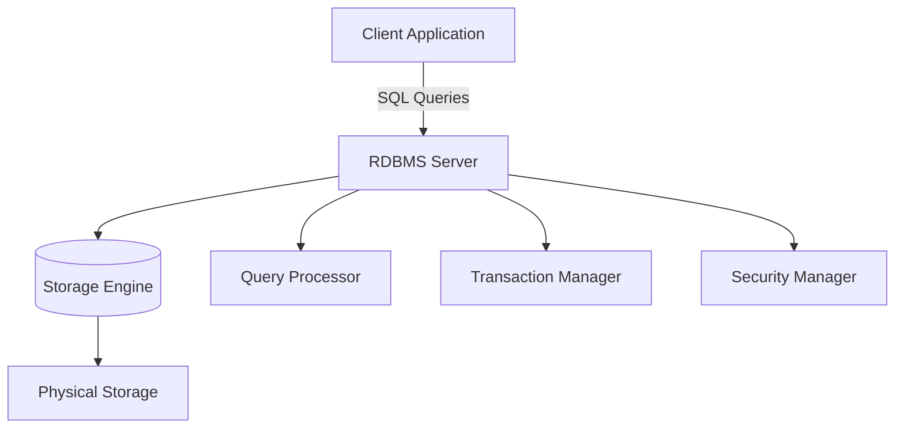
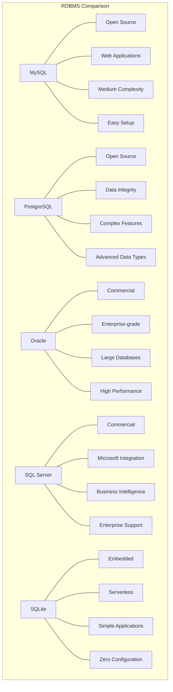
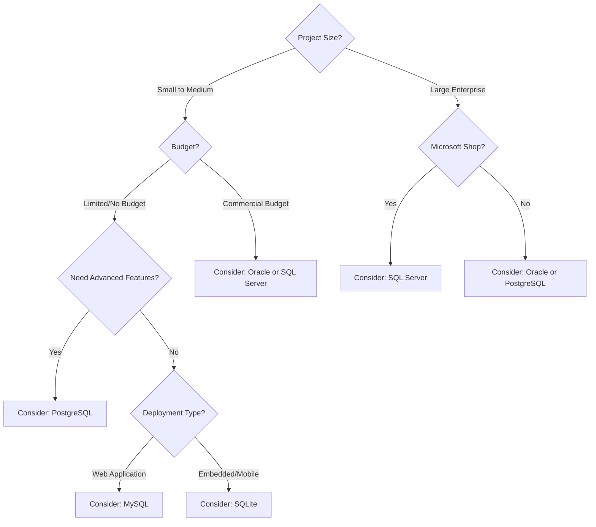

# SQL RDBMS Platforms

## Introduction

Relational Database Management Systems (RDBMS) are the backbone of most data-driven applications today. They provide the foundation for storing, organizing, and retrieving data using Structured Query Language (SQL). While all RDBMS platforms support standard SQL, each comes with unique features, advantages, and trade-offs that make them suitable for different use cases.

In this tutorial, we'll explore the most popular SQL RDBMS platforms, understand their key characteristics, and help you determine which one might be the best fit for your projects.

## What is an RDBMS?

An RDBMS is software that:
- Stores data in structured tables with rows and columns
- Enforces relationships between tables using foreign keys
- Ensures data integrity through constraints
- Provides a query language (SQL) for data manipulation
- Supports transactions with ACID properties (Atomicity, Consistency, Isolation, Durability)

Let's visualize the general architecture of an RDBMS:



## Popular RDBMS Platforms

### MySQL

MySQL is one of the most widely used open-source RDBMS platforms, particularly popular for web applications and part of the famous LAMP stack (Linux, Apache, MySQL, PHP/Python/Perl).

**Key Features:**
- Open-source with community and commercial editions
- Excellent performance for read-heavy operations
- Simple to set up and use
- Strong community support
- Cross-platform compatibility

**Example: Creating a table in MySQL**

```sql
CREATE TABLE employees (
    employee_id INT PRIMARY KEY AUTO_INCREMENT,
    first_name VARCHAR(50) NOT NULL,
    last_name VARCHAR(50) NOT NULL,
    hire_date DATE NOT NULL,
    salary DECIMAL(10, 2),
    department VARCHAR(50)
);
```

**Example: Inserting data**

```sql
INSERT INTO employees (first_name, last_name, hire_date, salary, department)
VALUES ('John', 'Doe', '2023-01-15', 65000.00, 'Engineering');
```

**Real-world Use Case:** MySQL is the database behind many popular websites and applications including WordPress, Facebook (for certain data storage needs), and Twitter (historically).

### PostgreSQL

PostgreSQL (often called "Postgres") is a powerful, open-source object-relational database system with a strong reputation for reliability, feature robustness, and performance.

**Key Features:**
- Fully ACID compliant
- Advanced data types (arrays, JSON, hstore)
- Powerful indexing capabilities
- Support for stored procedures in multiple languages
- Extensible architecture
- Strong support for geographical data with PostGIS

**Example: Creating a table with JSON data type in PostgreSQL**

```sql
CREATE TABLE product_catalog (
    product_id SERIAL PRIMARY KEY,
    name VARCHAR(100) NOT NULL,
    description TEXT,
    price DECIMAL(10, 2),
    attributes JSONB
);
```

**Example: Inserting and querying JSON data**

```sql
-- Insert data with JSON attributes
INSERT INTO product_catalog (name, description, price, attributes)
VALUES (
    'Smartphone X', 
    'Latest smartphone model', 
    999.99,
    '{"color": "black", "storage": "128GB", "camera": "48MP"}'
);

-- Query based on JSON attributes
SELECT name, price 
FROM product_catalog 
WHERE attributes->>'color' = 'black';
```

**Real-world Use Case:** PostgreSQL is used by organizations requiring robust data integrity and complex queries, including Instagram, Reddit, and Spotify.

### Oracle Database

Oracle Database is a commercial, enterprise-grade RDBMS known for its reliability, scalability, and comprehensive feature set.

**Key Features:**
- High performance and scalability
- Advanced security features
- Robust backup and recovery options
- Extensive management tools
- Support for very large databases (VLDB)
- Grid computing capabilities

**Example: Creating a table with identity column in Oracle**

```sql
CREATE TABLE customers (
    customer_id NUMBER GENERATED ALWAYS AS IDENTITY PRIMARY KEY,
    customer_name VARCHAR2(100) NOT NULL,
    email VARCHAR2(100) UNIQUE,
    registration_date DATE DEFAULT SYSDATE,
    status VARCHAR2(20) CHECK (status IN ('Active', 'Inactive', 'Suspended'))
);
```

**Real-world Use Case:** Oracle Database is commonly used in enterprise environments including banking, finance, healthcare, and government sectors where high reliability and performance are critical.

### Microsoft SQL Server

SQL Server is Microsoft's RDBMS offering, tightly integrated with their technology stack and widely used in enterprises with Microsoft-based infrastructure.

**Key Features:**
- Strong integration with Microsoft ecosystem
- Advanced business intelligence and reporting tools
- In-memory processing capabilities
- Comprehensive security features
- User-friendly management tools

**Example: Using a stored procedure in SQL Server**

```sql
CREATE PROCEDURE GetEmployeesByDepartment
    @DepartmentName VARCHAR(50)
AS
BEGIN
    SELECT employee_id, first_name, last_name, hire_date, salary
    FROM employees
    WHERE department = @DepartmentName
    ORDER BY salary DESC;
END;
```

**Example: Executing the stored procedure**

```sql
EXEC GetEmployeesByDepartment @DepartmentName = 'Engineering';
```

**Real-world Use Case:** SQL Server is commonly used in organizations leveraging Microsoft technologies, including enterprise resource planning (ERP) systems, customer relationship management (CRM) applications, and data warehouses.

### SQLite

SQLite is a lightweight, file-based database engine that requires minimal setup and is embedded directly into applications.

**Key Features:**
- Self-contained, serverless architecture
- Zero configuration required
- Cross-platform file format
- Small footprint (less than 600KB)
- ACID compliant
- Suitable for edge computing and IoT applications

**Example: Creating a simple SQLite database in Python**

```python
import sqlite3

# Connect to database (creates file if it doesn't exist)
conn = sqlite3.connect('example.db')
cursor = conn.cursor()

# Create table
cursor.execute('''
CREATE TABLE notes (
    id INTEGER PRIMARY KEY,
    title TEXT NOT NULL,
    content TEXT,
    created_at TIMESTAMP DEFAULT CURRENT_TIMESTAMP
)
''')

# Insert a record
cursor.execute('''
INSERT INTO notes (title, content) 
VALUES (?, ?)
''', ('First Note', 'This is my first note in SQLite'))

# Commit changes and close
conn.commit()
conn.close()
```

**Real-world Use Case:** SQLite is embedded in numerous applications including web browsers (for local storage), mobile apps, desktop applications, and small websites. It's also used in many IoT devices and as an application file format.

## Comparing RDBMS Platforms

Let's compare these platforms across several important dimensions:



## Choosing the Right RDBMS

When selecting an RDBMS for your project, consider these factors:

1. **Project Requirements:**
   - Scale of data (GB vs TB)
   - Number of concurrent users
   - Transaction volume
   - Complexity of queries

2. **Technical Considerations:**
   - Existing technology stack
   - Development team expertise
   - Required features (spatial data, JSON support, etc.)
   - Performance needs

3. **Business Factors:**
   - Budget (open-source vs commercial)
   - Support requirements
   - Compliance and security needs
   - Long-term maintainability

Here's a simple decision tree to help you start narrowing down options:



## Practical Example: Database Selection for a Web Application

Let's walk through a practical example of selecting an RDBMS for a web application:

**Project Requirements:**
- Medium-sized e-commerce website
- Needs to store product catalog, customer data, and orders
- Anticipates moderate traffic (1000 daily users)
- Requires transaction support for orders
- Will need to store some semi-structured data about products

**Analysis:**
1. **Data volume**: Moderate (GB range)
2. **Concurrency**: Moderate
3. **Semi-structured data needs**: Product attributes vary by category
4. **Budget**: Limited, preferring open-source solutions
5. **Team expertise**: Developers familiar with standard SQL

**Recommendation**: PostgreSQL would be an excellent choice because:
- It handles semi-structured data well with its JSON support
- Provides strong transaction support for order processing
- Offers good performance at medium scale
- Is open-source with no licensing costs
- Has a large community and extensive documentation

**Implementation Example:**

```sql
-- Create tables for our e-commerce application
CREATE TABLE customers (
    customer_id SERIAL PRIMARY KEY,
    email VARCHAR(100) UNIQUE NOT NULL,
    password_hash VARCHAR(255) NOT NULL,
    first_name VARCHAR(50),
    last_name VARCHAR(50),
    created_at TIMESTAMP DEFAULT CURRENT_TIMESTAMP
);

CREATE TABLE product_categories (
    category_id SERIAL PRIMARY KEY,
    name VARCHAR(100) NOT NULL,
    description TEXT
);

CREATE TABLE products (
    product_id SERIAL PRIMARY KEY,
    category_id INTEGER REFERENCES product_categories(category_id),
    name VARCHAR(100) NOT NULL,
    description TEXT,
    price DECIMAL(10, 2) NOT NULL,
    stock_quantity INTEGER NOT NULL DEFAULT 0,
    attributes JSONB, -- Using JSONB for flexible product attributes
    created_at TIMESTAMP DEFAULT CURRENT_TIMESTAMP
);

CREATE TABLE orders (
    order_id SERIAL PRIMARY KEY,
    customer_id INTEGER REFERENCES customers(customer_id),
    order_date TIMESTAMP DEFAULT CURRENT_TIMESTAMP,
    status VARCHAR(20) CHECK (status IN ('Pending', 'Processing', 'Shipped', 'Delivered', 'Cancelled')),
    total_amount DECIMAL(10, 2) NOT NULL
);

CREATE TABLE order_items (
    order_item_id SERIAL PRIMARY KEY,
    order_id INTEGER REFERENCES orders(order_id),
    product_id INTEGER REFERENCES products(product_id),
    quantity INTEGER NOT NULL,
    unit_price DECIMAL(10, 2) NOT NULL
);
```

This schema leverages PostgreSQL's features including:
- Foreign key constraints for data integrity
- JSONB data type for flexible product attributes
- Check constraints for order status validation
- Default timestamps for audit trails

## Summary

Selecting the right RDBMS platform is a crucial decision that can significantly impact your project's success. In this tutorial, we've explored:

- The fundamentals of RDBMS and their importance
- Key features of popular RDBMS platforms including MySQL, PostgreSQL, Oracle, SQL Server, and SQLite
- How to compare different platforms based on project requirements
- A practical example of database selection and implementation

Each RDBMS has its strengths and ideal use cases. By understanding these differences, you can make an informed decision that aligns with your project's technical requirements, budget constraints, and long-term goals.

## Additional Resources

To deepen your understanding of different RDBMS platforms, consider these resources:

- **MySQL**: [Official Documentation](https://dev.mysql.com/doc/)
- **PostgreSQL**: [PostgreSQL Tutorial](https://www.postgresql.org/docs/)
- **Oracle Database**: [Getting Started Guide](https://docs.oracle.com/en/database/)
- **SQL Server**: [Microsoft SQL Documentation](https://docs.microsoft.com/en-us/sql/)
- **SQLite**: [SQLite Documentation](https://www.sqlite.org/docs.html)

## Exercises

1. **Comparison Exercise**: Create a simple table in two different RDBMS systems and compare the syntax differences.

2. **Selection Exercise**: For each of the following scenarios, identify which RDBMS would be most appropriate and explain why:
   - A mobile application that needs to store user preferences locally
   - A large enterprise with existing Microsoft infrastructure needing a new CRM system
   - A startup building a data-intensive web application with limited budget
   - A government agency requiring maximum data security and reliability

3. **Implementation Exercise**: Design a database schema for a library management system that would work across different RDBMS platforms, noting any platform-specific adaptations needed.

4. **Research Exercise**: Select one RDBMS platform and research its latest version's features. How do these new features address modern application development challenges?