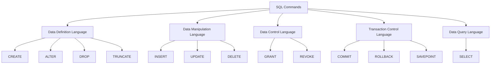

# SQL Command Categories

## Introduction

Structured Query Language (SQL) is the standard language for managing and manipulating relational databases. SQL commands are grouped into different categories based on their functionality and purpose. Understanding these categories helps organize your knowledge of SQL and clarifies when to use specific commands.

In this guide, we'll explore the five main categories of SQL commands:

1. **Data Definition Language (DDL)** - Commands that define database structure
2. **Data Manipulation Language (DML)** - Commands that manipulate data within tables
3. **Data Control Language (DCL)** - Commands that control access permissions
4. **Transaction Control Language (TCL)** - Commands that manage transactions
5. **Data Query Language (DQL)** - Commands that retrieve data from the database

Let's dive into each category to understand its purpose, common commands, and usage examples.

## SQL Command Categories Overview

Here's a visual overview of the SQL command categories and their relationships:



## Data Definition Language (DDL)

### What is DDL?

Data Definition Language (DDL) consists of commands used to define, modify, and remove database objects like tables, indexes, and schemas. These commands change the structure of the database rather than the data stored within it.

### Common DDL Commands

#### 1. CREATE

The `CREATE` command is used to create new database objects such as tables, views, indexes, and databases.

**Example: Creating a Database**

```sql
CREATE DATABASE bookstore;
```

**Example: Creating a Table**

```sql
CREATE TABLE books (
    book_id INT PRIMARY KEY,
    title VARCHAR(100) NOT NULL,
    author VARCHAR(50),
    publication_year INT,
    price DECIMAL(6,2)
);
```

#### 2. ALTER

The `ALTER` command modifies existing database objects.

**Example: Adding a Column to a Table**

```sql
ALTER TABLE books
ADD COLUMN genre VARCHAR(30);
```

**Example: Modifying a Column's Data Type**

```sql
ALTER TABLE books
MODIFY COLUMN title VARCHAR(150);
```

#### 3. DROP

The `DROP` command removes an existing database object.

**Example: Dropping a Table**

```sql
DROP TABLE books;
```

**Example: Dropping a Database**

```sql
DROP DATABASE bookstore;
```

#### 4. TRUNCATE

The `TRUNCATE` command removes all records from a table but preserves the table structure.

**Example: Truncating a Table**

```sql
TRUNCATE TABLE books;
```

### Practical DDL Application

Let's create a complete database schema for a simple bookstore application:

```sql
-- Create the database
CREATE DATABASE bookstore;

-- Use the database
USE bookstore;

-- Create authors table
CREATE TABLE authors (
    author_id INT PRIMARY KEY,
    first_name VARCHAR(50) NOT NULL,
    last_name VARCHAR(50) NOT NULL,
    birth_year INT
);

-- Create books table with foreign key
CREATE TABLE books (
    book_id INT PRIMARY KEY,
    title VARCHAR(100) NOT NULL,
    author_id INT,
    publication_year INT,
    price DECIMAL(6,2),
    FOREIGN KEY (author_id) REFERENCES authors(author_id)
);

-- Add a new column to books table
ALTER TABLE books
ADD COLUMN genre VARCHAR(30);

-- Create an index on the title column
CREATE INDEX idx_title ON books(title);
```

## Data Manipulation Language (DML)

### What is DML?

Data Manipulation Language (DML) consists of commands used to manipulate data stored within database objects. These commands are used to insert, update, delete, and retrieve data from database tables.

### Common DML Commands

#### 1. INSERT

The `INSERT` command adds new records to a table.

**Example: Inserting a Single Record**

```sql
INSERT INTO authors (author_id, first_name, last_name, birth_year)
VALUES (1, 'Jane', 'Austen', 1775);
```

**Example: Inserting Multiple Records**

```sql
INSERT INTO authors (author_id, first_name, last_name, birth_year)
VALUES 
    (2, 'George', 'Orwell', 1903),
    (3, 'J.K.', 'Rowling', 1965);
```

#### 2. UPDATE

The `UPDATE` command modifies existing records in a table.

**Example: Updating a Record**

```sql
UPDATE authors
SET birth_year = 1965
WHERE author_id = 3;
```

#### 3. DELETE

The `DELETE` command removes records from a table.

**Example: Deleting a Record**

```sql
DELETE FROM authors
WHERE author_id = 2;
```

### Practical DML Application

Let's populate our bookstore database with data:

```sql
-- Insert authors
INSERT INTO authors (author_id, first_name, last_name, birth_year)
VALUES 
    (1, 'Jane', 'Austen', 1775),
    (2, 'George', 'Orwell', 1903),
    (3, 'J.K.', 'Rowling', 1965);

-- Insert books
INSERT INTO books (book_id, title, author_id, publication_year, price, genre)
VALUES
    (101, 'Pride and Prejudice', 1, 1813, 9.99, 'Classic'),
    (102, '1984', 2, 1949, 12.50, 'Dystopian'),
    (103, 'Animal Farm', 2, 1945, 8.75, 'Political Satire'),
    (104, 'Harry Potter and the Philosopher''s Stone', 3, 1997, 15.99, 'Fantasy');

-- Update a book's price
UPDATE books
SET price = 10.99
WHERE book_id = 101;

-- Delete a book
DELETE FROM books
WHERE book_id = 103;
```

## Data Control Language (DCL)

### What is DCL?

Data Control Language (DCL) consists of commands used to manage database security, controlling user access and permissions for database objects.

### Common DCL Commands

#### 1. GRANT

The `GRANT` command gives specific privileges to users or roles.

**Example: Granting SELECT Privilege**

```sql
GRANT SELECT ON books TO user1;
```

**Example: Granting Multiple Privileges**

```sql
GRANT SELECT, INSERT, UPDATE ON books TO user2;
```

#### 2. REVOKE

The `REVOKE` command removes specific privileges from users or roles.

**Example: Revoking UPDATE Privilege**

```sql
REVOKE UPDATE ON books FROM user2;
```

### Practical DCL Application

Let's set up permissions for different users in our bookstore database:

```sql
-- Create users (syntax may vary by database system)
CREATE USER 'store_manager'@'localhost' IDENTIFIED BY 'password123';
CREATE USER 'sales_rep'@'localhost' IDENTIFIED BY 'password456';
CREATE USER 'customer'@'localhost' IDENTIFIED BY 'password789';

-- Grant permissions to store manager (full access)
GRANT ALL PRIVILEGES ON bookstore.* TO 'store_manager'@'localhost';

-- Grant limited permissions to sales representative
GRANT SELECT, INSERT, UPDATE ON bookstore.books TO 'sales_rep'@'localhost';
GRANT SELECT ON bookstore.authors TO 'sales_rep'@'localhost';

-- Grant minimal permissions to customer
GRANT SELECT ON bookstore.books TO 'customer'@'localhost';

-- Revoke a permission
REVOKE UPDATE ON bookstore.books FROM 'sales_rep'@'localhost';
```

## Transaction Control Language (TCL)

### What is TCL?

Transaction Control Language (TCL) consists of commands used to manage transactions within a database. Transactions are sequences of operations performed as a single logical unit of work.

### Common TCL Commands

#### 1. COMMIT

The `COMMIT` command permanently saves all changes made during the current transaction.

**Example: Committing a Transaction**

```sql
BEGIN TRANSACTION;
    UPDATE books SET price = price * 1.1 WHERE genre = 'Fantasy';
    DELETE FROM books WHERE publication_year < 1900;
COMMIT;
```

#### 2. ROLLBACK

The `ROLLBACK` command undoes all changes made during the current transaction.

**Example: Rolling Back a Transaction**

```sql
BEGIN TRANSACTION;
    UPDATE books SET price = price * 2;
    -- Oops, we didn't mean to double all prices!
ROLLBACK;
```

#### 3. SAVEPOINT

The `SAVEPOINT` command creates a point within a transaction to which you can later roll back.

**Example: Using Savepoints**

```sql
BEGIN TRANSACTION;
    UPDATE authors SET last_name = 'AUSTEN' WHERE author_id = 1;
    
    SAVEPOINT update_authors;
    
    DELETE FROM books WHERE author_id = 1;
    -- We want to keep the author update but not delete their books
    ROLLBACK TO update_authors;
    
COMMIT;
```

### Practical TCL Application

Let's apply transaction control to ensure data integrity during a price update:

```sql
-- Start a transaction for a seasonal promotion
BEGIN TRANSACTION;

-- Apply 20% discount to all classic books
UPDATE books 
SET price = price * 0.8
WHERE genre = 'Classic';

-- Check if any book price falls below minimum threshold
IF EXISTS (SELECT 1 FROM books WHERE price < 5.00) THEN
    -- Rollback if prices are too low
    ROLLBACK;
ELSE
    -- Otherwise, commit the changes
    COMMIT;
END IF;
```

## Data Query Language (DQL)

### What is DQL?

Data Query Language (DQL) consists of commands used to retrieve data from the database. Some consider DQL a subset of DML, but it's often classified separately due to its importance.

### Common DQL Command

#### 1. SELECT

The `SELECT` command retrieves data from one or more tables.

**Example: Basic SELECT Query**

```sql
SELECT * FROM books;
```

**Example: SELECT with Conditions**

```sql
SELECT title, price 
FROM books 
WHERE publication_year > 2000;
```

**Example: SELECT with JOIN**

```sql
SELECT b.title, CONCAT(a.first_name, ' ', a.last_name) AS author_name
FROM books b
JOIN authors a ON b.author_id = a.author_id;
```

### Practical DQL Application

Let's explore our bookstore database with various queries:

```sql
-- Get all books with their authors
SELECT b.title, b.price, b.genre, 
       CONCAT(a.first_name, ' ', a.last_name) AS author
FROM books b
JOIN authors a ON b.author_id = a.author_id;

-- Find the average price of books by genre
SELECT genre, AVG(price) AS average_price
FROM books
GROUP BY genre;

-- Find books published after 1950, ordered by price
SELECT title, publication_year, price
FROM books
WHERE publication_year > 1950
ORDER BY price DESC;

-- Get a count of books by each author
SELECT a.first_name, a.last_name, COUNT(b.book_id) AS book_count
FROM authors a
LEFT JOIN books b ON a.author_id = b.author_id
GROUP BY a.author_id;
```

## Command Category Comparison

Let's compare the key differences between the SQL command categories:

| Category | Purpose | Affects | Common Commands |
|----------|---------|---------|-----------------|
| DDL | Define data structures | Database schema | CREATE, ALTER, DROP, TRUNCATE |
| DML | Manipulate data | Table contents | INSERT, UPDATE, DELETE |
| DCL | Control database access | User permissions | GRANT, REVOKE |
| TCL | Manage transactions | Transaction state | COMMIT, ROLLBACK, SAVEPOINT |
| DQL | Retrieve data | None (read-only) | SELECT |

## Summary

In this guide, we've explored the five main categories of SQL commands:

1. **Data Definition Language (DDL)** commands like CREATE, ALTER, DROP, and TRUNCATE help you define and modify database structures.
2. **Data Manipulation Language (DML)** commands like INSERT, UPDATE, and DELETE allow you to manage the data within those structures.
3. **Data Control Language (DCL)** commands like GRANT and REVOKE help you control who can access and modify your database.
4. **Transaction Control Language (TCL)** commands like COMMIT, ROLLBACK, and SAVEPOINT ensure the integrity of your database operations.
5. **Data Query Language (DQL)** commands, primarily SELECT, help you retrieve and analyze your data.

Understanding these categories helps organize your SQL knowledge and clarifies which commands to use for specific database tasks. As you become more comfortable with SQL, you'll naturally start thinking about your database operations in terms of these categories.

## Practice Exercises

1. Write a DDL command to create a new table named `orders` with columns for order_id, customer_id, book_id, order_date, and quantity.
2. Write a DML command to insert three sample records into the `orders` table.
3. Write a DCL command to grant SELECT and INSERT privileges on the `orders` table to a user named 'analyst'.
4. Write a TCL sequence that adds a new author and their books, but rolls back if the author's birth year is unknown.
5. Write a DQL command to find all customers who have ordered more than 3 books, sorted by the total amount spent.

## Additional Resources

- [SQL Syntax Reference](https://www.w3schools.com/sql/sql_syntax.asp)
- [SQL Joins Explained](https://www.w3schools.com/sql/sql_join.asp)
- [Database Normalization](https://www.guru99.com/database-normalization.html)
- [SQL Transaction Management](https://www.tutorialspoint.com/sql/sql-transactions.htm)
- [Advanced SQL Queries](https://mode.com/sql-tutorial/advanced-sql-queries/)