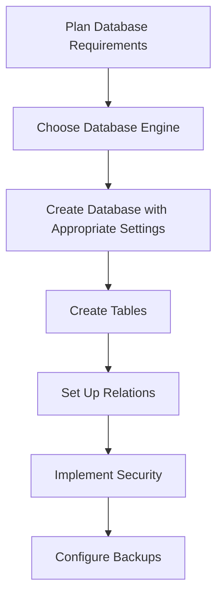

# SQL Create Database

## Introduction

A database is an organized collection of structured information stored electronically in a computer system. In SQL (Structured Query Language), creating a database is one of the first steps in building a data storage solution. This guide will walk you through the process of creating databases in SQL, a fundamental skill for any database developer or administrator.

Whether you're building a small application or an enterprise solution, understanding how to properly create and manage databases is essential. This tutorial will cover the syntax for creating databases across different SQL database management systems, best practices, and real-world applications.

## Basic Syntax for Creating a Database

The most basic way to create a database in SQL is by using the `CREATE DATABASE` statement. The general syntax is:

```sql
CREATE DATABASE database_name;
```

### Example: Creating a Simple Database

```sql
CREATE DATABASE online_store;
```

**Output:**
```
Database 'online_store' created successfully.
```

This simple command creates a new empty database called "online_store" with default settings.

## Creating Databases with Specific Options

Different database management systems offer various options when creating databases. Let's explore some common ones:

### MySQL/MariaDB Specific Options

In MySQL or MariaDB, you can specify character sets and collations:

```sql
CREATE DATABASE ecommerce
CHARACTER SET utf8mb4
COLLATE utf8mb4_unicode_ci;
```

**Output:**
```
Database 'ecommerce' created successfully.
```

This creates a database that properly supports multilingual content and emoji characters.

### SQL Server Specific Options

SQL Server allows you to specify file locations and sizes:

```sql
CREATE DATABASE customer_records
ON PRIMARY 
(
    NAME = customer_records_data,
    FILENAME = 'C:\SQLData\customer_records_data.mdf',
    SIZE = 100MB,
    MAXSIZE = 1GB,
    FILEGROWTH = 10%
)
LOG ON
(
    NAME = customer_records_log,
    FILENAME = 'C:\SQLData\customer_records_log.ldf',
    SIZE = 50MB,
    MAXSIZE = 500MB,
    FILEGROWTH = 5MB
);
```

**Output:**
```
Database 'customer_records' created successfully.
```

This example creates a database with specific file locations, initial sizes, maximum sizes, and growth patterns.

### PostgreSQL Specific Options

In PostgreSQL, you can specify the owner and template:

```sql
CREATE DATABASE blog_platform
WITH
    OWNER = admin_user
    TEMPLATE = template0
    ENCODING = 'UTF8'
    LC_COLLATE = 'en_US.UTF-8'
    LC_CTYPE = 'en_US.UTF-8'
    CONNECTION LIMIT = 100;
```

**Output:**
```
Database 'blog_platform' created successfully.
```

This creates a blog platform database with a specific owner, character encoding, and connection limit.

## Conditional Database Creation

Sometimes you want to check if a database exists before creating it to avoid errors:

### In MySQL/MariaDB

```sql
CREATE DATABASE IF NOT EXISTS project_management;
```

**Output:**
```
Database 'project_management' created successfully.
```

If the database already exists, the command won't throw an error.

### In SQL Server

```sql
IF NOT EXISTS (SELECT name FROM sys.databases WHERE name = 'inventory_system')
BEGIN
    CREATE DATABASE inventory_system;
END
```

**Output:**
```
Database 'inventory_system' created successfully.
```

### In PostgreSQL

```sql
SELECT 'CREATE DATABASE learning_portal'
WHERE NOT EXISTS (SELECT FROM pg_database WHERE datname = 'learning_portal')\gexec
```

**Output:**
```
Database 'learning_portal' created successfully.
```

## Practical Database Creation Workflow

Let's walk through a real-world example of setting up a database for a small e-commerce application:



### Step 1: Planning Your Database

Before creating your database, consider:
- Estimated size and growth
- Character set requirements
- Collation needs
- Security requirements
- Backup strategy

### Step 2: Creating the E-commerce Database

```sql
-- For MySQL/MariaDB
CREATE DATABASE ecommerce_shop
CHARACTER SET utf8mb4
COLLATE utf8mb4_unicode_ci;

-- Select the database for use
USE ecommerce_shop;

-- Create a simple products table
CREATE TABLE products (
    product_id INT AUTO_INCREMENT PRIMARY KEY,
    name VARCHAR(100) NOT NULL,
    description TEXT,
    price DECIMAL(10, 2) NOT NULL,
    stock_quantity INT NOT NULL DEFAULT 0,
    created_at TIMESTAMP DEFAULT CURRENT_TIMESTAMP
);
```

**Output:**
```
Database 'ecommerce_shop' created successfully.
Database changed to 'ecommerce_shop'.
Table 'products' created successfully.
```

## Best Practices for Database Creation

1. **Use descriptive names**: Choose clear, meaningful database names that reflect their purpose.
2. **Consider character encoding**: UTF-8 (or UTF8MB4 in MySQL) is recommended for international applications.
3. **Plan for growth**: Set appropriate initial sizes and growth parameters if your system allows it.
4. **Document your database**: Keep track of the database purpose, schema, and important settings.
5. **Use consistent naming conventions**: Establish naming patterns for all your databases.
6. **Implement proper security**: Set up appropriate user permissions immediately after creation.
7. **Create databases in non-production environments first**: Test in development before deploying to production.

## Common Issues and Troubleshooting

### Permission Denied

```sql
CREATE DATABASE analytics_platform;
```

**Error Output:**
```
ERROR 1044 (42000): Access denied for user 'user'@'localhost' to database 'analytics_platform'
```

**Solution**: Ensure you have sufficient privileges. You may need to use:

```sql
-- In MySQL
GRANT CREATE ON *.* TO 'user'@'localhost';
```

### Database Already Exists

```sql
CREATE DATABASE customer_data;
```

**Error Output:**
```
ERROR 1007 (HY000): Can't create database 'customer_data'; database exists
```

**Solution**: Use the conditional creation syntax mentioned earlier or drop the existing database if appropriate:

```sql
DROP DATABASE IF EXISTS customer_data;
CREATE DATABASE customer_data;
```

## Database Creation in Different Environments

### Using Command Line Tools

**MySQL:**
```bash
mysql -u root -p -e "CREATE DATABASE inventory_tracking CHARACTER SET utf8mb4 COLLATE utf8mb4_unicode_ci;"
```

**PostgreSQL:**
```bash
createdb -U postgres -O owner_name learning_system
```

**SQL Server:**
```bash
sqlcmd -S serverName -Q "CREATE DATABASE user_management"
```

### Using Programming Languages

**PHP:**
```php
<?php
$conn = new mysqli("localhost", "username", "password");
if ($conn->connect_error) {
    die("Connection failed: " . $conn->connect_error);
}
$sql = "CREATE DATABASE IF NOT EXISTS crm_system";
if ($conn->query($sql) === TRUE) {
    echo "Database created successfully";
} else {
    echo "Error creating database: " . $conn->error;
}
$conn->close();
?>
```

**Python:**
```python
import mysql.connector

mydb = mysql.connector.connect(
  host="localhost",
  user="username",
  password="password"
)

mycursor = mydb.cursor()
mycursor.execute("CREATE DATABASE IF NOT EXISTS ticket_system")
print("Database created successfully")
```

## Summary

Creating a database is the first crucial step in building any data-driven application. We've covered:

- Basic syntax for creating databases in SQL
- System-specific options for MySQL, SQL Server, and PostgreSQL
- Conditional database creation to avoid errors
- Best practices for planning and implementing databases
- Troubleshooting common issues
- Creating databases through different interfaces

Remember that a well-planned database structure forms the foundation of efficient data management. Take time to consider your requirements before creating a database, and follow the best practices outlined in this guide.

## Additional Resources

- [MySQL Documentation: CREATE DATABASE Statement](https://dev.mysql.com/doc/refman/8.0/en/create-database.html)
- [PostgreSQL Documentation: CREATE DATABASE](https://www.postgresql.org/docs/current/sql-createdatabase.html)
- [SQL Server Documentation: CREATE DATABASE](https://docs.microsoft.com/en-us/sql/t-sql/statements/create-database-transact-sql)

## Exercises

1. Create a database for a library management system with appropriate character encoding.
2. Write a script that checks if a database exists, and if not, creates it with specific size parameters.
3. Create a database for an international application that needs to store customer names in multiple languages and emojis.
4. Plan and create a database for a blog platform with the appropriate settings for your chosen database system.
5. Research and implement a database creation script that includes creating a default user with limited permissions.