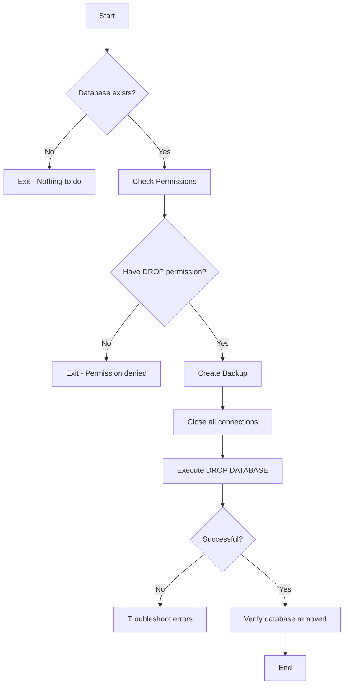

# SQL DROP DATABASE

## Introduction

The `DROP DATABASE` statement is a powerful SQL command that allows you to permanently remove a database from your database management system (DBMS). This command is an essential part of database administration, enabling you to delete databases that are no longer needed, freeing up system resources and storage space.

In this tutorial, we'll explore how to use the `DROP DATABASE` statement safely and effectively. We'll cover the syntax, potential pitfalls, best practices, and practical examples to help you understand when and how to use this command.

:::caution
The `DROP DATABASE` command **permanently deletes** all data, tables, views, stored procedures, triggers, and other objects within the database. This action cannot be undone unless you have a backup. Always proceed with extreme caution when using this command.
:::

## Syntax

The basic syntax for the `DROP DATABASE` statement is straightforward:

```sql
DROP DATABASE [IF EXISTS] database_name;
```

Let's break down the components:

- `DROP DATABASE`: The SQL command to remove a database
- `[IF EXISTS]`: An optional clause that prevents errors if the database doesn't exist
- `database_name`: The name of the database you want to delete

## Basic Usage

### Example 1: Dropping a Database

To delete a database named `test_db`, you would use:

```sql
DROP DATABASE test_db;
```

**Output:**
```
Database 'test_db' dropped successfully.
```

If the database doesn't exist, you'll receive an error:

```
Error: Database 'test_db' does not exist.
```

### Example 2: Using IF EXISTS Clause

To avoid errors when dropping a database that might not exist:

```sql
DROP DATABASE IF EXISTS test_db;
```

**Output if database exists:**
```
Database 'test_db' dropped successfully.
```

**Output if database doesn't exist:**
```
Notice: Database 'test_db' does not exist. No action taken.
```

The `IF EXISTS` clause is particularly useful in scripts where you want to ensure the database is removed if it exists, but don't want the script to fail if it doesn't.

## Important Considerations

### Permission Requirements

To drop a database, you typically need administrative privileges. In most database systems:

1. You must have the `DROP` privilege on the database
2. You might need to be the database owner or have system administrator privileges
3. You cannot drop a database that is currently in use

Here's how permission errors might appear:

```
Error: Access denied for user 'username'@'localhost' to database 'test_db'
```

### Database Connection Status

You cannot drop a database while it's being used. Before dropping a database:

1. Disconnect all users from the database
2. Close all active connections to the database

In many systems, you can force disconnections, but the specific method varies by DBMS.

## DBMS-Specific Variations

Different database management systems might have slight variations in the `DROP DATABASE` syntax or behavior.

### MySQL

```sql
DROP DATABASE [IF EXISTS] database_name;
```

### SQL Server

```sql
DROP DATABASE [IF EXISTS] database_name;
-- Or for multiple databases:
DROP DATABASE database1, database2, database3;
```

### PostgreSQL

```sql
DROP DATABASE [IF EXISTS] database_name;
-- PostgreSQL adds optional WITH clause:
DROP DATABASE [IF EXISTS] database_name [WITH (FORCE)];
```

### SQLite

SQLite doesn't have a direct `DROP DATABASE` command since each database is a file. Instead, you delete the file:

```sql
-- Not available in SQLite
-- Instead, delete the file using your operating system
-- or use the SQLite API functions
```

## Best Practices

### 1. Always Back Up Before Dropping

Before executing a `DROP DATABASE` command, ensure you have a recent backup:

```sql
-- In MySQL
BACKUP DATABASE test_db TO DISK = '/path/to/backup/test_db.bak';

-- In SQL Server
BACKUP DATABASE test_db TO DISK = 'C:\backups\test_db.bak';
```

### 2. Verify Database Contents

Check what's in the database before dropping it:

```sql
-- List all tables in database
SELECT table_name FROM information_schema.tables 
WHERE table_schema = 'test_db';
```

### 3. Use Transactions When Possible

Some DBMS allow you to wrap the `DROP DATABASE` in a transaction:

```sql
-- Not all systems support this
BEGIN TRANSACTION;
  DROP DATABASE test_db;
COMMIT; -- or ROLLBACK to cancel
```

### 4. Script the Process

For important operations, script the entire process including verification steps:

```sql
-- Example script pattern
-- 1. Check if database exists
-- 2. Verify it's the correct database (check for expected tables/data)
-- 3. Backup database
-- 4. Drop database
-- 5. Verify database is gone
```

## Real-World Applications

### Scenario 1: Development Environment Cleanup

When working in development environments, you might create temporary databases for testing:

```sql
-- Create test database
CREATE DATABASE test_project_v1;

-- Run tests and development...

-- Clean up when done
DROP DATABASE IF EXISTS test_project_v1;
```

### Scenario 2: Database Migration

When upgrading a system and migrating to a new database structure:

```sql
-- Back up old database
BACKUP DATABASE old_customer_db TO DISK = '/backups/old_customer_db.bak';

-- Create new database with improved structure
CREATE DATABASE new_customer_db;

-- Migrate data from old to new (using appropriate migration tools/scripts)
-- ...migration code here...

-- After verifying successful migration, remove old database
DROP DATABASE old_customer_db;
```

### Scenario 3: Automated Database Rotation

For systems that create daily or weekly snapshots:

```sql
-- Create today's database
CREATE DATABASE logs_20230601;

-- After a week, we might want to clean up:
DROP DATABASE logs_20230525;
```

## Database Removal Flow

Here's a visual representation of the typical database removal process:



## Common Errors and Troubleshooting

### Error: Database in Use

```
Error: Cannot drop database 'test_db' because it is currently in use.
```

**Solution:**
1. Identify connections:
```sql
-- In MySQL
SHOW PROCESSLIST;

-- In SQL Server
SELECT * FROM sys.dm_exec_sessions WHERE database_id = DB_ID('test_db');
```

2. Kill connections:
```sql
-- In MySQL
KILL connection_id;

-- In SQL Server
KILL session_id;
```

### Error: Permission Denied

```
Error: Access denied for user 'user'@'localhost' to database 'test_db'
```

**Solution:** Use an account with administrative privileges or request the necessary permissions.

## Summary

The `DROP DATABASE` statement is a powerful but potentially dangerous SQL command that permanently removes a database and all its contents. When using this command:

- Always ensure you have a backup before proceeding
- Use the `IF EXISTS` clause to avoid errors with non-existent databases
- Verify you have the necessary permissions
- Make sure no one is connected to the database
- Follow best practices to prevent accidental data loss

Understanding how to safely drop databases is an important skill for database administration and maintenance, allowing you to manage your database environment effectively.

## Additional Resources

- [MySQL DROP DATABASE Documentation](https://dev.mysql.com/doc/refman/8.0/en/drop-database.html)
- [SQL Server DROP DATABASE Documentation](https://docs.microsoft.com/en-us/sql/t-sql/statements/drop-database-transact-sql)
- [PostgreSQL DROP DATABASE Documentation](https://www.postgresql.org/docs/current/sql-dropdatabase.html)

## Practice Exercises

1. Create a test database, add a simple table, then safely drop the database.
2. Write a script that checks if a database exists before attempting to drop it.
3. Create a backup strategy that includes backing up a database before dropping it.
4. Research how to recover a dropped database in your specific DBMS (if possible).
5. Compare how different database systems handle the DROP DATABASE command.