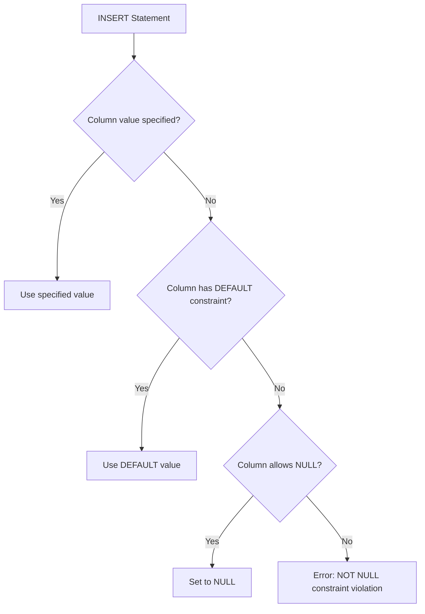

# SQL Default Value

## Introduction

When designing database tables, you often need to ensure that columns have appropriate values even when users don't explicitly provide them. SQL's `DEFAULT` constraint allows you to specify a default value that will be automatically assigned to a column when a new record is inserted without a value for that column. This feature is essential for maintaining data integrity and simplifying database operations.

Default values can be literals (like numbers or strings), expressions (like datetime functions), or even system-defined values. They help streamline data entry processes and ensure consistency in your database.

## Understanding DEFAULT Constraints

### What is a DEFAULT Constraint?

A DEFAULT constraint is a rule that provides a backup value for a column when no value is explicitly specified during an INSERT operation. When you define a default value for a column, SQL will automatically use that value if the column is omitted in an INSERT statement or if NULL is explicitly provided for that column.

### Syntax for Adding DEFAULT Constraints

The basic syntax for adding a DEFAULT constraint when creating a new table is:

```sql
CREATE TABLE table_name (
    column_name data_type DEFAULT default_value,
    ...
);
```

You can also add a DEFAULT constraint to an existing table:

```sql
ALTER TABLE table_name
ALTER COLUMN column_name SET DEFAULT default_value;
```

Or when adding a new column to an existing table:

```sql
ALTER TABLE table_name
ADD COLUMN column_name data_type DEFAULT default_value;
```

## Common Types of Default Values

### Literal Values

You can use literals like numbers, strings, or boolean values as default values:

```sql
CREATE TABLE products (
    product_id INT PRIMARY KEY,
    product_name VARCHAR(100),
    price DECIMAL(10, 2) DEFAULT 0.00,
    in_stock BOOLEAN DEFAULT TRUE,
    category VARCHAR(50) DEFAULT 'Uncategorized'
);
```

### Functions and Expressions

You can use functions as default values, especially for timestamps:

```sql
CREATE TABLE orders (
    order_id INT PRIMARY KEY,
    customer_id INT,
    order_date TIMESTAMP DEFAULT CURRENT_TIMESTAMP,
    status VARCHAR(20) DEFAULT 'Pending'
);
```

### System Values

Some databases allow you to use special system values as defaults:

```sql
CREATE TABLE users (
    user_id INT PRIMARY KEY,
    username VARCHAR(50),
    created_by VARCHAR(50) DEFAULT USER,  -- Current database user
    created_at TIMESTAMP DEFAULT CURRENT_TIMESTAMP
);
```

## Practical Examples

Let's explore some practical examples to see how DEFAULT constraints work in real-world scenarios.

### Example 1: User Registration System

Consider a user registration system where you want to track when users register and set their default status:

```sql
CREATE TABLE users (
    user_id SERIAL PRIMARY KEY,
    username VARCHAR(50) NOT NULL,
    email VARCHAR(100) NOT NULL,
    registration_date TIMESTAMP DEFAULT CURRENT_TIMESTAMP,
    is_active BOOLEAN DEFAULT TRUE,
    account_type VARCHAR(20) DEFAULT 'Free'
);
```

Now, let's insert a new user without specifying all values:

```sql
INSERT INTO users (username, email)
VALUES ('johndoe', 'john@example.com');
```

The result would be:

| user_id | username | email | registration_date | is_active | account_type |
|---------|----------|-------|-------------------|-----------|--------------|
| 1 | johndoe | john@example.com | 2023-05-10 14:30:00 | TRUE | Free |

The system automatically filled in the missing values with our defaults.

### Example 2: Product Inventory System

For a product inventory system, we might want default values for inventory status and creation dates:

```sql
CREATE TABLE inventory (
    product_id SERIAL PRIMARY KEY,
    product_name VARCHAR(100) NOT NULL,
    quantity INT DEFAULT 0,
    reorder_level INT DEFAULT 10,
    last_updated TIMESTAMP DEFAULT CURRENT_TIMESTAMP,
    discontinued BOOLEAN DEFAULT FALSE
);
```

If we insert a new product:

```sql
INSERT INTO inventory (product_name)
VALUES ('Wireless Mouse');
```

The result would be:

| product_id | product_name | quantity | reorder_level | last_updated | discontinued |
|------------|--------------|----------|---------------|--------------|--------------|
| 1 | Wireless Mouse | 0 | 10 | 2023-05-10 14:35:00 | FALSE |

### Example 3: Blog Post System

For a blog system, we might want default values for post status and publication date:

```sql
CREATE TABLE blog_posts (
    post_id SERIAL PRIMARY KEY,
    title VARCHAR(200) NOT NULL,
    content TEXT,
    author_id INT NOT NULL,
    created_at TIMESTAMP DEFAULT CURRENT_TIMESTAMP,
    updated_at TIMESTAMP DEFAULT CURRENT_TIMESTAMP,
    status VARCHAR(20) DEFAULT 'Draft',
    view_count INT DEFAULT 0
);
```

Let's insert a new blog post:

```sql
INSERT INTO blog_posts (title, content, author_id)
VALUES ('Getting Started with SQL', 'This is a beginner guide to SQL...', 5);
```

The result would be:

| post_id | title | content | author_id | created_at | updated_at | status | view_count |
|---------|-------|---------|-----------|------------|------------|--------|------------|
| 1 | Getting Started with SQL | This is a beginner guide to SQL... | 5 | 2023-05-10 14:40:00 | 2023-05-10 14:40:00 | Draft | 0 |

## Database-Specific Default Value Features

Different database systems have some variations in how they handle default values.

### MySQL

MySQL supports all standard default values and additionally offers:

```sql
CREATE TABLE logs (
    log_id INT AUTO_INCREMENT PRIMARY KEY,
    event_type VARCHAR(50),
    event_date TIMESTAMP DEFAULT CURRENT_TIMESTAMP,
    updated_at TIMESTAMP DEFAULT CURRENT_TIMESTAMP ON UPDATE CURRENT_TIMESTAMP
);
```

The `ON UPDATE CURRENT_TIMESTAMP` is unique to MySQL and automatically updates the timestamp when the row is modified.

### PostgreSQL

PostgreSQL offers powerful default expressions including:

```sql
CREATE TABLE documents (
    doc_id SERIAL PRIMARY KEY,
    title VARCHAR(100),
    content TEXT,
    created_at TIMESTAMP DEFAULT CURRENT_TIMESTAMP,
    doc_uuid UUID DEFAULT gen_random_uuid()  -- PostgreSQL function
);
```

### SQLite

SQLite supports standard default values and has a special `CURRENT_TIMESTAMP` function:

```sql
CREATE TABLE events (
    event_id INTEGER PRIMARY KEY,
    event_name TEXT NOT NULL,
    created_at TEXT DEFAULT CURRENT_TIMESTAMP
);
```

## Default Values and NULL Values

It's important to understand the relationship between DEFAULT constraints and NULL values:

1. If a column allows NULL values and you INSERT NULL explicitly, the NULL value will be used instead of the default value.
2. If a column has a NOT NULL constraint and a DEFAULT value, when no value is provided, the DEFAULT will be used.

Example:

```sql
CREATE TABLE example (
    id SERIAL PRIMARY KEY,
    name VARCHAR(50) DEFAULT 'Unnamed',
    description VARCHAR(200) DEFAULT 'No description provided'
);

-- This uses the default values
INSERT INTO example (id) VALUES (1);

-- This uses NULL for description, not the default
INSERT INTO example (id, description) VALUES (2, NULL);
```

Results:

| id | name | description |
|----|------|-------------|
| 1 | Unnamed | No description provided |
| 2 | Unnamed | NULL |

## Modifying Default Values

You can change default values for columns after creating a table:

```sql
-- To add or change a default value
ALTER TABLE products
ALTER COLUMN category SET DEFAULT 'Electronics';

-- To remove a default value
ALTER TABLE products
ALTER COLUMN category DROP DEFAULT;
```

## Visual Representation of Default Value Usage



## Best Practices for Using Default Values

1. **Use defaults for common values**: Apply defaults to columns that frequently have the same value to simplify data entry.

2. **Consider database performance**: Complex default expressions might impact performance for high-volume insert operations.

3. **Be careful with date/time defaults**: Consider whether you want them fixed at table creation time or evaluated at insert time.

4. **Document your defaults**: Make sure your database documentation includes information about default values.

5. **Consistency across tables**: Use consistent default values for similar columns across different tables.

6. **Test defaults thoroughly**: Ensure default values work as expected in all insertion scenarios.

## Summary

SQL DEFAULT constraints provide a powerful way to ensure data consistency and simplify database operations by automatically assigning values to columns when none are specified. They can be used with various data types and can include literal values, functions, or expressions.

Key points to remember:
- DEFAULT values are used when no value is specified for a column in an INSERT statement
- They can be simple literals or complex expressions
- Each database system has some unique features for default values
- Defaults can be modified after table creation
- The relationship between DEFAULT and NULL constraints is important to understand

By using DEFAULT constraints effectively, you can improve your database design, ensure data consistency, and simplify application development.

## Additional Resources

- [SQL DEFAULT Constraint on W3Schools](https://www.w3schools.com/sql/sql_default.asp)
- [PostgreSQL DEFAULT Clause Documentation](https://www.postgresql.org/docs/current/ddl-default.html)
- [MySQL DEFAULT Value Documentation](https://dev.mysql.com/doc/refman/8.0/en/data-type-defaults.html)

## Exercises

1. Create a table for a library management system with appropriate default values for book status, borrow dates, and availability.

2. Design a customer relationship management table that automatically tracks when customer records are created and last updated.

3. Modify an existing table to add a default value for a 'status' column that sets all new records to 'Active'.

4. Create a database trigger that overrides a default value under certain conditions.

5. Design a table that uses different types of default values (literals, functions, expressions) for at least three columns.