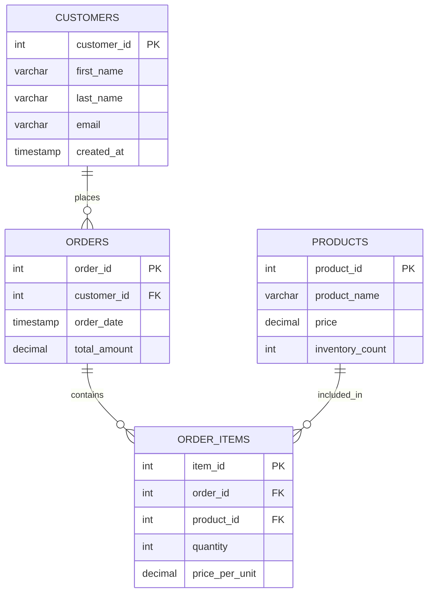

# SQL Auto Increment

## Introduction

When creating databases, one of the most common requirements is to have a unique identifier for each record in a table. Instead of manually assigning these values, SQL provides a powerful feature called **Auto Increment** that automatically generates and increments unique values whenever a new record is added to a table.

Auto increment is especially useful for creating primary keys, which are essential for:
- Uniquely identifying each record
- Creating relationships between tables
- Optimizing database performance
- Ensuring data integrity

In this tutorial, we'll explore how to use auto increment in SQL, along with practical examples and best practices.

## What is Auto Increment?

Auto increment is a column attribute that automatically generates a unique numeric value for new records. When you insert a new record without specifying a value for the auto-increment column, the database automatically assigns the next sequential value.

Key characteristics of auto-increment columns:
- They are typically used for primary key columns
- The values are automatically generated and incremented
- Once a value is assigned, it is not reused even if the record is deleted
- The data type is usually an integer (INT, BIGINT, etc.)

## Syntax for Different Database Systems

The syntax for creating auto-increment columns varies slightly between different database management systems:

### MySQL

```sql
CREATE TABLE customers (
    customer_id INT AUTO_INCREMENT PRIMARY KEY,
    first_name VARCHAR(50),
    last_name VARCHAR(50),
    email VARCHAR(100)
);
```

### SQL Server

```sql
CREATE TABLE customers (
    customer_id INT IDENTITY(1,1) PRIMARY KEY,
    first_name VARCHAR(50),
    last_name VARCHAR(50),
    email VARCHAR(100)
);
```

### PostgreSQL

```sql
CREATE TABLE customers (
    customer_id SERIAL PRIMARY KEY,
    first_name VARCHAR(50),
    last_name VARCHAR(50),
    email VARCHAR(100)
);
```

### SQLite

```sql
CREATE TABLE customers (
    customer_id INTEGER PRIMARY KEY AUTOINCREMENT,
    first_name TEXT,
    last_name TEXT,
    email TEXT
);
```

## Creating Tables with Auto Increment

Let's walk through creating a table with an auto-increment column in MySQL:

```sql
-- Creating a products table with an auto-increment product_id
CREATE TABLE products (
    product_id INT AUTO_INCREMENT PRIMARY KEY,
    product_name VARCHAR(100) NOT NULL,
    price DECIMAL(10, 2) NOT NULL,
    category VARCHAR(50),
    in_stock BOOLEAN DEFAULT TRUE
);
```

### Inserting Records

When inserting records, you can omit the auto-increment column value, and it will be generated automatically:

```sql
-- Inserting records without specifying the product_id
INSERT INTO products (product_name, price, category)
VALUES ('Laptop', 899.99, 'Electronics');

INSERT INTO products (product_name, price, category)
VALUES ('Desk Chair', 149.99, 'Furniture');

INSERT INTO products (product_name, price, category)
VALUES ('Coffee Maker', 79.99, 'Kitchen Appliances');
```

### Result

| product_id | product_name  | price   | category           | in_stock |
|------------|---------------|---------|-------------------|----------|
| 1          | Laptop        | 899.99  | Electronics       | TRUE     |
| 2          | Desk Chair    | 149.99  | Furniture         | TRUE     |
| 3          | Coffee Maker  | 79.99   | Kitchen Appliances| TRUE     |

## Auto Increment Starting Value

You can also specify the starting value for the auto-increment sequence:

### MySQL

```sql
-- Creating a table with auto_increment starting at 1000
CREATE TABLE orders (
    order_id INT AUTO_INCREMENT PRIMARY KEY,
    customer_id INT,
    order_date DATE,
    total_amount DECIMAL(10, 2)
) AUTO_INCREMENT = 1000;
```

### SQL Server

```sql
CREATE TABLE orders (
    order_id INT IDENTITY(1000,1) PRIMARY KEY,
    customer_id INT,
    order_date DATE,
    total_amount DECIMAL(10, 2)
);
```

### PostgreSQL

```sql
CREATE TABLE orders (
    order_id SERIAL PRIMARY KEY,
    customer_id INT,
    order_date DATE,
    total_amount DECIMAL(10, 2)
);

-- Then alter the sequence
ALTER SEQUENCE orders_order_id_seq RESTART WITH 1000;
```

## Changing Auto Increment Values

Sometimes you might need to modify the next auto-increment value:

### MySQL

```sql
-- Reset the auto_increment value to 100
ALTER TABLE customers AUTO_INCREMENT = 100;
```

### PostgreSQL

```sql
-- Reset the sequence to 100
ALTER SEQUENCE customers_customer_id_seq RESTART WITH 100;
```

### SQL Server

```sql
-- This requires resetting identity values
DBCC CHECKIDENT ('customers', RESEED, 100);
```

## Real-World Example: Order Management System

Let's create a simple order management system with auto-increment columns:

```sql
-- Customers table
CREATE TABLE customers (
    customer_id INT AUTO_INCREMENT PRIMARY KEY,
    first_name VARCHAR(50) NOT NULL,
    last_name VARCHAR(50) NOT NULL,
    email VARCHAR(100) UNIQUE,
    created_at TIMESTAMP DEFAULT CURRENT_TIMESTAMP
);

-- Products table
CREATE TABLE products (
    product_id INT AUTO_INCREMENT PRIMARY KEY,
    product_name VARCHAR(100) NOT NULL,
    price DECIMAL(10, 2) NOT NULL,
    inventory_count INT NOT NULL DEFAULT 0
);

-- Orders table
CREATE TABLE orders (
    order_id INT AUTO_INCREMENT PRIMARY KEY,
    customer_id INT NOT NULL,
    order_date TIMESTAMP DEFAULT CURRENT_TIMESTAMP,
    total_amount DECIMAL(10, 2) NOT NULL,
    FOREIGN KEY (customer_id) REFERENCES customers(customer_id)
);

-- Order items table
CREATE TABLE order_items (
    item_id INT AUTO_INCREMENT PRIMARY KEY,
    order_id INT NOT NULL,
    product_id INT NOT NULL,
    quantity INT NOT NULL,
    price_per_unit DECIMAL(10, 2) NOT NULL,
    FOREIGN KEY (order_id) REFERENCES orders(order_id),
    FOREIGN KEY (product_id) REFERENCES products(product_id)
);
```

In this system:
- Each customer, product, order, and order item has a unique auto-incremented ID
- These IDs are used to create relationships between tables
- When a new order is created, the `order_id` is automatically generated
- Each item in an order gets a unique `item_id`

Here's a diagram showing the relationships:



## Best Practices for Auto Increment

To use auto-increment effectively:

1. **Use appropriate data types**
   - Use `INT` for tables with fewer than 2 billion records
   - Use `BIGINT` for larger tables to avoid overflow

2. **Plan for scale**
   - Consider starting with a higher value if you might be importing data later
   - Remember that auto-increment values don't get reused when records are deleted

3. **Don't rely on sequential values**
   - Auto-increment values might have gaps due to failed transactions or deleted records
   - Don't use them for anything other than unique identification

4. **Consider performance**
   - Auto-increment fields are optimized for inserts
   - They help reduce index fragmentation
   
5. **Backup considerations**
   - When restoring data, be aware that auto-increment counters might need to be reset

## Common Issues and Troubleshooting

### Gaps in Auto-Increment Values

Gaps can appear in auto-increment values due to:
- Deleted records
- Failed transactions
- Table alterations

This is normal and should not be a concern unless your application specifically depends on sequential values without gaps.

### Reaching Maximum Value

Auto-increment columns have maximum values based on their data type:
- `TINYINT`: 127 (or 255 for unsigned)
- `SMALLINT`: 32,767 (or 65,535 for unsigned)
- `INT`: 2,147,483,647 (or 4,294,967,295 for unsigned)
- `BIGINT`: 9,223,372,036,854,775,807 (or 18,446,744,073,709,551,615 for unsigned)

When you're close to reaching these limits, consider migrating to a larger data type.

### Reusing Auto-Increment Values

In some cases, you might want to reset auto-increment values:

```sql
-- For MySQL: Reset the auto_increment value
TRUNCATE TABLE products;
-- This also deletes all data and resets auto_increment to its initial value

-- For SQL Server: Reset the identity counter
DBCC CHECKIDENT ('products', RESEED, 0);
```

## Summary

Auto increment is an essential SQL feature that simplifies the creation of unique identifiers for database records. It helps maintain data integrity, improves performance, and simplifies database design.

Key takeaways:
- Auto increment automatically generates unique numeric values for new records
- The syntax varies between different database systems
- It's primarily used for primary key columns
- You can customize the starting value and increment step
- Auto-increment values are not reused when records are deleted
- Use appropriate data types based on expected table size

## Exercises

1. Create a table named `students` with an auto-increment primary key and fields for name, age, and enrollment date.
2. Insert five records into the table without specifying the primary key.
3. Delete the record with ID 3, then insert another record. What ID is assigned to the new record?
4. Modify the auto-increment value to start from 1000, then add a new record.
5. Create two related tables with auto-increment primary keys and a foreign key relationship between them.

## Additional Resources

- [MySQL AUTO_INCREMENT Documentation](https://dev.mysql.com/doc/refman/8.0/en/example-auto-increment.html)
- [PostgreSQL SERIAL Documentation](https://www.postgresql.org/docs/current/datatype-numeric.html#DATATYPE-SERIAL)
- [SQL Server IDENTITY Documentation](https://learn.microsoft.com/en-us/sql/t-sql/statements/create-table-transact-sql-identity-property)
- [SQLite AUTOINCREMENT Documentation](https://www.sqlite.org/autoinc.html)