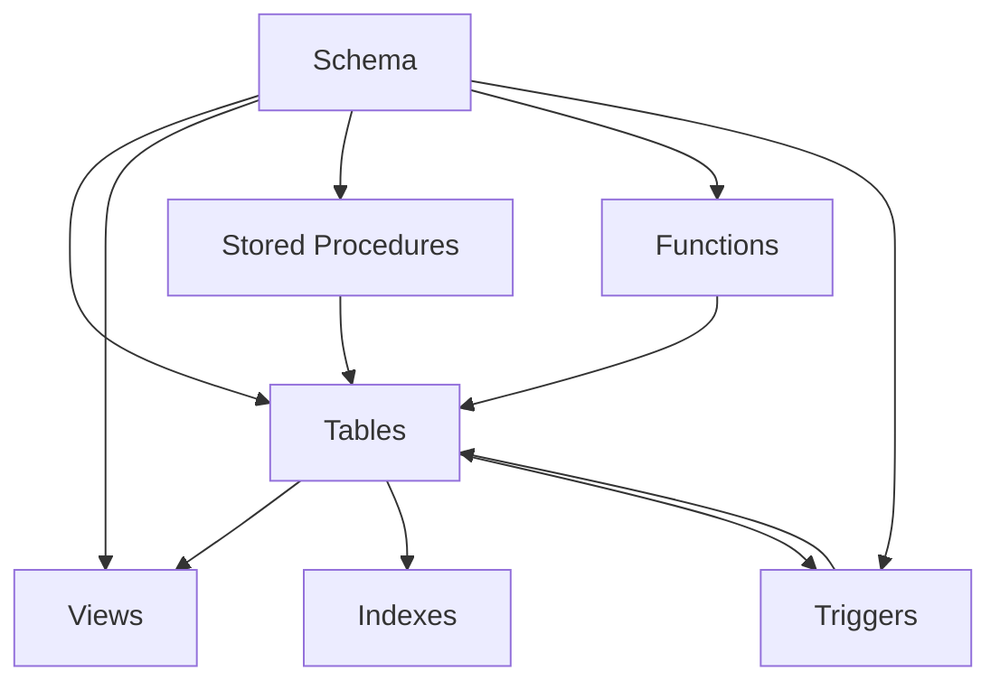

# SQL Schema Objects

## Introduction

When working with SQL databases, you'll encounter various objects that help organize, store, and manipulate your data. These objects collectively form what we call a **schema** - the blueprint of your database structure. Think of a schema as a container that holds related objects, providing both organization and security boundaries.

In this guide, we'll explore the fundamental schema objects in SQL databases, how to create them, and how they work together to form a functional database system. Whether you're building a simple application or a complex data warehouse, understanding these building blocks is essential.

## What is a Schema?

A schema is a logical collection of database objects that belong to a specific user or application. It serves as a namespace, allowing you to:

- Organize related objects together
- Control access permissions as a group
- Avoid naming conflicts with other database objects

Before diving into specific objects, let's first look at how to create a schema:

```sql
-- Creating a new schema
CREATE SCHEMA inventory;

-- Creating a schema with authorization
CREATE SCHEMA finance AUTHORIZATION finance_admin;

-- Using a specific schema
USE inventory;
```

Now that we understand what a schema is, let's explore the various objects that can exist within it.

## Tables: The Foundation of Data Storage

Tables are the primary objects used to store data in a relational database. They organize data into rows and columns, similar to a spreadsheet.

### Creating Tables

```sql
CREATE TABLE inventory.products (
    product_id INT PRIMARY KEY,
    product_name VARCHAR(100) NOT NULL,
    category VARCHAR(50),
    price DECIMAL(10,2) NOT NULL,
    stock_quantity INT DEFAULT 0,
    last_updated TIMESTAMP DEFAULT CURRENT_TIMESTAMP
);
```

The above statement creates a table with various column types and constraints:
- `INT` for integer values
- `VARCHAR` for variable-length text
- `DECIMAL` for precise numeric values
- `TIMESTAMP` for date and time values

### Constraints

Constraints enforce rules on your data to maintain integrity:

```sql
CREATE TABLE inventory.orders (
    order_id INT PRIMARY KEY,
    customer_id INT NOT NULL,
    order_date DATE DEFAULT CURRENT_DATE,
    total_amount DECIMAL(12,2),
    status VARCHAR(20) CHECK (status IN ('pending', 'shipped', 'delivered', 'cancelled')),
    FOREIGN KEY (customer_id) REFERENCES customers(customer_id)
);
```

Common constraints include:
- **PRIMARY KEY**: Uniquely identifies each row
- **FOREIGN KEY**: Ensures referential integrity between tables
- **CHECK**: Validates data against specific conditions
- **UNIQUE**: Prevents duplicate values
- **NOT NULL**: Ensures a column cannot contain NULL values
- **DEFAULT**: Provides a default value when none is specified

### Altering Tables

You can modify existing tables using the ALTER TABLE statement:

```sql
-- Adding a new column
ALTER TABLE inventory.products ADD COLUMN description TEXT;

-- Modifying a column
ALTER TABLE inventory.products ALTER COLUMN product_name VARCHAR(150);

-- Adding a constraint
ALTER TABLE inventory.products ADD CONSTRAINT unique_product_name UNIQUE (product_name);
```

## Views: Virtual Tables for Simplified Data Access

Views are virtual tables based on the result set of a SQL statement. They don't store data themselves but provide a way to:
- Simplify complex queries
- Restrict access to specific columns or rows
- Present the same data in different ways

### Creating Views

```sql
CREATE VIEW inventory.product_inventory AS
SELECT p.product_id, p.product_name, p.category, p.price, p.stock_quantity
FROM inventory.products p
WHERE p.stock_quantity > 0;
```

Now users can query this view as if it were a regular table:

```sql
SELECT * FROM inventory.product_inventory WHERE category = 'Electronics';
```

### Advantages of Views

- **Simplicity**: Hide complex joins and calculations
- **Security**: Limit access to specific data
- **Consistency**: Ensure all applications use the same logic

## Indexes: Speeding Up Data Retrieval

Indexes are special lookup structures that improve the speed of data retrieval operations. Like an index in a book, database indexes help the database find data quickly without scanning the entire table.

### Creating Indexes

```sql
-- Creating a basic index
CREATE INDEX idx_product_category ON inventory.products(category);

-- Creating a unique index
CREATE UNIQUE INDEX idx_unique_product_sku ON inventory.products(sku);

-- Creating a composite index (multiple columns)
CREATE INDEX idx_order_customer_date ON inventory.orders(customer_id, order_date);
```

### When to Use Indexes

- Columns used frequently in WHERE clauses
- Columns used in JOIN conditions
- Columns used in ORDER BY or GROUP BY operations

Keep in mind that indexes speed up data retrieval but can slow down data modification operations (INSERT, UPDATE, DELETE).

## Stored Procedures: Reusable Code Blocks

Stored procedures are prepared SQL code that you can save and reuse. They can accept parameters, perform operations, and return results.

### Creating a Stored Procedure

```sql
CREATE PROCEDURE inventory.update_product_price(
    IN product_id_param INT,
    IN new_price DECIMAL(10,2)
)
BEGIN
    UPDATE inventory.products
    SET price = new_price, last_updated = CURRENT_TIMESTAMP
    WHERE product_id = product_id_param;
    
    SELECT 'Price updated successfully' AS result;
END;
```

### Executing a Stored Procedure

```sql
CALL inventory.update_product_price(101, 29.99);
```

### Benefits of Stored Procedures

- **Code reusability**: Write once, use many times
- **Security**: Grant execution permissions without direct table access
- **Performance**: Pre-compiled execution plan
- **Reduced network traffic**: Only send the procedure call, not the entire query

## Functions: Returning Values

Functions are similar to stored procedures but designed to return a single value. They can be used in SELECT statements, WHERE clauses, and more.

### Creating a Function

```sql
CREATE FUNCTION inventory.get_product_value(product_id_param INT)
RETURNS DECIMAL(15,2)
BEGIN
    DECLARE total_value DECIMAL(15,2);
    
    SELECT price * stock_quantity INTO total_value
    FROM inventory.products
    WHERE product_id = product_id_param;
    
    RETURN total_value;
END;
```

### Using a Function

```sql
SELECT 
    product_id,
    product_name,
    inventory.get_product_value(product_id) AS inventory_value
FROM inventory.products;
```

## Triggers: Automatic Reactions to Events

Triggers are special stored procedures that automatically execute in response to certain events on a table or view.

### Creating a Trigger

```sql
CREATE TRIGGER inventory.after_product_update
AFTER UPDATE ON inventory.products
FOR EACH ROW
BEGIN
    INSERT INTO inventory.product_audit_log (
        product_id,
        action,
        old_price,
        new_price,
        changed_by,
        change_date
    )
    VALUES (
        NEW.product_id,
        'UPDATE',
        OLD.price,
        NEW.price,
        CURRENT_USER(),
        CURRENT_TIMESTAMP
    );
END;
```

This trigger automatically logs price changes whenever a product is updated.

### Trigger Types

- **BEFORE**: Executes before the triggering event
- **AFTER**: Executes after the triggering event
- **INSTEAD OF**: Used with views to override default behavior

Triggers can respond to INSERT, UPDATE, and DELETE operations.

## Sequences: Generating Unique Values

Sequences (or auto-increment columns in some databases) generate unique numerical values automatically.

### Creating a Sequence

```sql
-- In PostgreSQL/Oracle syntax
CREATE SEQUENCE inventory.order_id_seq
    START WITH 1000
    INCREMENT BY 1
    NO MINVALUE
    NO MAXVALUE
    CACHE 20;

-- In MySQL, you typically use AUTO_INCREMENT on a column
CREATE TABLE inventory.orders (
    order_id INT AUTO_INCREMENT PRIMARY KEY,
    -- other columns
);
```

### Using a Sequence

```sql
-- PostgreSQL/Oracle
INSERT INTO inventory.orders (order_id, customer_id, total_amount)
VALUES (NEXTVAL('inventory.order_id_seq'), 101, 259.99);

-- MySQL (auto-increment is automatic)
INSERT INTO inventory.orders (customer_id, total_amount)
VALUES (101, 259.99);
```

## How Schema Objects Work Together

Let's visualize how these schema objects interact in a database system:



In a real-world scenario, you might have:

1. **Tables** storing your core data
2. **Indexes** to speed up common queries
3. **Views** providing simplified access to complex data
4. **Stored Procedures** and **Functions** for business logic
5. **Triggers** ensuring data consistency

## Practical Example: E-commerce Database

Let's build a simplified e-commerce database to demonstrate how these objects work together:

```sql
-- Create schema
CREATE SCHEMA ecommerce;

-- Create tables
CREATE TABLE ecommerce.customers (
    customer_id INT PRIMARY KEY,
    first_name VARCHAR(50) NOT NULL,
    last_name VARCHAR(50) NOT NULL,
    email VARCHAR(100) UNIQUE NOT NULL,
    created_at TIMESTAMP DEFAULT CURRENT_TIMESTAMP
);

CREATE TABLE ecommerce.products (
    product_id INT PRIMARY KEY,
    name VARCHAR(100) NOT NULL,
    description TEXT,
    price DECIMAL(10,2) NOT NULL,
    stock_quantity INT NOT NULL DEFAULT 0
);

CREATE TABLE ecommerce.orders (
    order_id INT PRIMARY KEY,
    customer_id INT NOT NULL,
    order_date TIMESTAMP DEFAULT CURRENT_TIMESTAMP,
    status VARCHAR(20) DEFAULT 'pending',
    FOREIGN KEY (customer_id) REFERENCES ecommerce.customers(customer_id)
);

CREATE TABLE ecommerce.order_items (
    order_id INT,
    product_id INT,
    quantity INT NOT NULL,
    price_at_purchase DECIMAL(10,2) NOT NULL,
    PRIMARY KEY (order_id, product_id),
    FOREIGN KEY (order_id) REFERENCES ecommerce.orders(order_id),
    FOREIGN KEY (product_id) REFERENCES ecommerce.products(product_id)
);

-- Create indexes
CREATE INDEX idx_orders_customer ON ecommerce.orders(customer_id);
CREATE INDEX idx_order_items_product ON ecommerce.order_items(product_id);

-- Create view
CREATE VIEW ecommerce.order_summary AS
SELECT 
    o.order_id,
    c.customer_id,
    CONCAT(c.first_name, ' ', c.last_name) AS customer_name,
    o.order_date,
    o.status,
    COUNT(oi.product_id) AS total_items,
    SUM(oi.quantity * oi.price_at_purchase) AS total_amount
FROM ecommerce.orders o
JOIN ecommerce.customers c ON o.customer_id = c.customer_id
JOIN ecommerce.order_items oi ON o.order_id = oi.order_id
GROUP BY o.order_id, c.customer_id, customer_name, o.order_date, o.status;

-- Create function
CREATE FUNCTION ecommerce.calculate_order_total(order_id_param INT)
RETURNS DECIMAL(12,2)
BEGIN
    DECLARE total DECIMAL(12,2);
    
    SELECT SUM(quantity * price_at_purchase) INTO total
    FROM ecommerce.order_items
    WHERE order_id = order_id_param;
    
    RETURN COALESCE(total, 0);
END;

-- Create stored procedure
CREATE PROCEDURE ecommerce.place_order(
    IN customer_id_param INT,
    IN product_id_param INT,
    IN quantity_param INT,
    OUT order_id_out INT
)
BEGIN
    DECLARE product_price DECIMAL(10,2);
    DECLARE current_stock INT;
    
    -- Get product details
    SELECT price, stock_quantity 
    INTO product_price, current_stock
    FROM ecommerce.products
    WHERE product_id = product_id_param;
    
    -- Check stock
    IF current_stock < quantity_param THEN
        SIGNAL SQLSTATE '45000' SET MESSAGE_TEXT = 'Not enough stock available';
    END IF;
    
    -- Create order
    INSERT INTO ecommerce.orders (customer_id) 
    VALUES (customer_id_param);
    
    SET order_id_out = LAST_INSERT_ID();
    
    -- Add order item
    INSERT INTO ecommerce.order_items (order_id, product_id, quantity, price_at_purchase)
    VALUES (order_id_out, product_id_param, quantity_param, product_price);
    
    -- Update stock
    UPDATE ecommerce.products
    SET stock_quantity = stock_quantity - quantity_param
    WHERE product_id = product_id_param;
    
    COMMIT;
END;

-- Create trigger
CREATE TRIGGER ecommerce.after_order_item_insert
AFTER INSERT ON ecommerce.order_items
FOR EACH ROW
BEGIN
    -- Update order status when items are added
    UPDATE ecommerce.orders
    SET status = 'processing'
    WHERE order_id = NEW.order_id;
END;
```

In this example:
1. Tables store customers, products, orders, and order items
2. Indexes speed up customer and product lookups
3. A view provides a summary of each order
4. A function calculates order totals
5. A stored procedure handles the order placement logic
6. A trigger automatically updates the order status

## Summary

SQL schema objects provide the structure and functionality for your database applications. By understanding how to create and use these objects, you can build efficient, maintainable database systems:

- **Schemas** organize and group related objects
- **Tables** store your data in structured formats
- **Views** simplify access to complex data
- **Indexes** improve query performance
- **Stored Procedures** and **Functions** encapsulate business logic
- **Triggers** automate reactions to data changes
- **Sequences** generate unique identifiers

Each object type has its purpose and best practices. By combining them effectively, you can create powerful database applications that are both performant and maintainable.

## Exercises

1. Create a schema for a library management system with tables for books, authors, members, and loans.
2. Design an index strategy for the library system to optimize common queries.
3. Create a view that shows all overdue books and the members who borrowed them.
4. Write a stored procedure to check out a book that validates availability and updates inventory.
5. Implement a trigger that maintains a history of all book loans.

## Additional Resources

- [SQL Schema Documentation](https://www.postgresql.org/docs/current/ddl-schemas.html)
- [Database Design Best Practices](https://www.sqlshack.com/database-design-best-practices/)
- [Indexing Strategies](https://use-the-index-luke.com/)
- [Understanding Database Normalization](https://www.essentialsql.com/get-ready-to-learn-sql-database-normalization-explained-in-simple-english/)