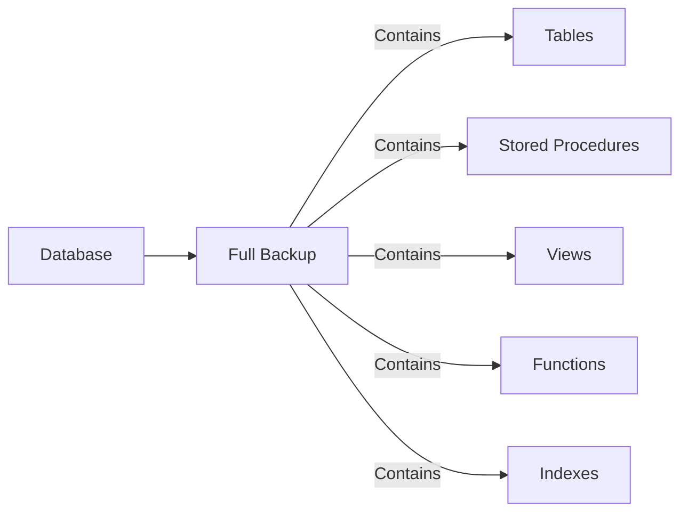
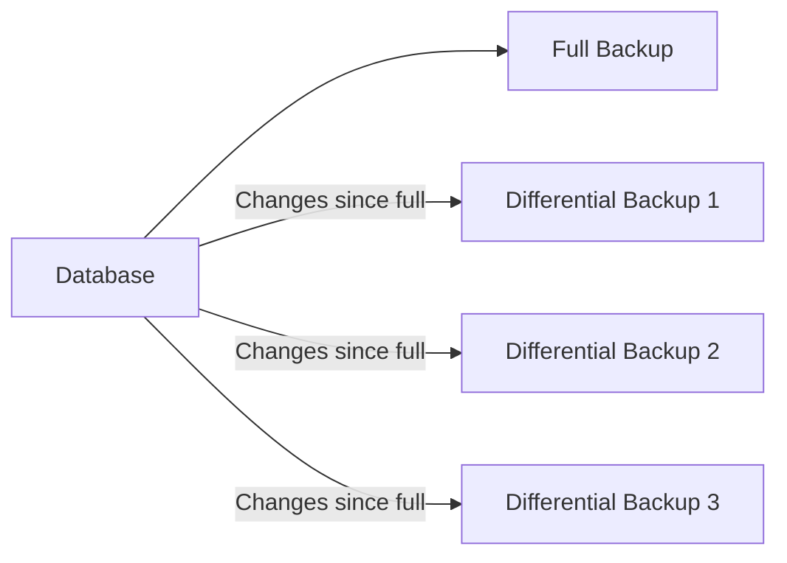
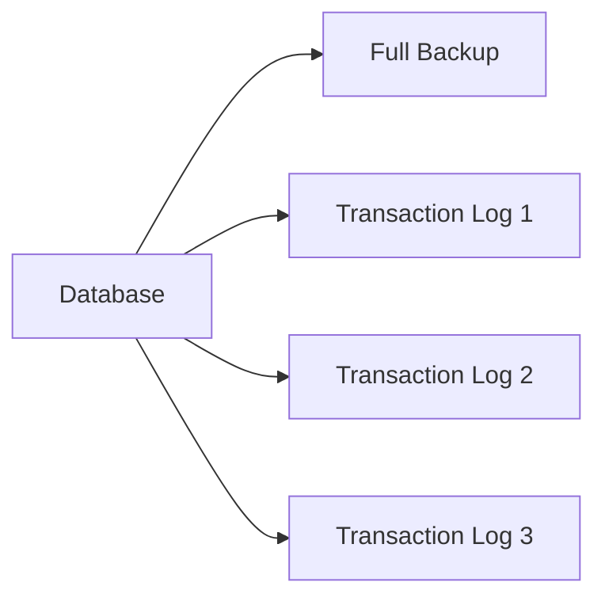
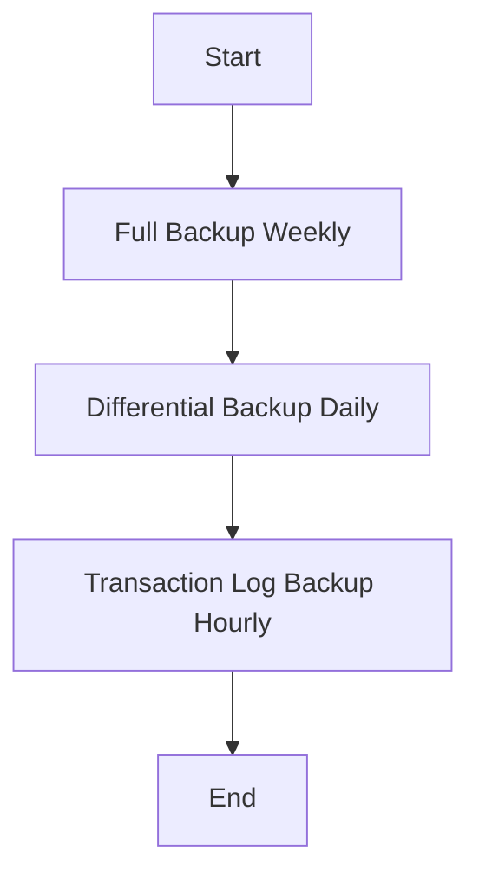

# SQL Backup Database

## Introduction

Database backups are one of the most critical aspects of database administration. They protect your valuable data from accidental deletion, hardware failures, software corruption, and other disasters. For businesses, proper database backups can mean the difference between a minor inconvenience and a catastrophic data loss that threatens the entire operation.

In this guide, we'll explore how to create and manage SQL database backups. We'll cover different backup types, learn essential commands, and walk through practical scenarios to help you implement a robust backup strategy for your SQL databases.

## Why Database Backups Matter

Before diving into how to back up a database, let's understand why backups are so important:

- **Data Protection**: Safeguards against accidental deletion or corruption
- **Business Continuity**: Ensures operations can continue after system failures
- **Regulatory Compliance**: Many industries require data retention and protection
- **Migration Support**: Facilitates moving databases between servers
- **Development Environments**: Enables creation of test databases with production-like data

## Types of SQL Database Backups

SQL databases generally support several types of backups, each with specific use cases:

### 1. Full Backup

A full backup contains all the data in a database at the time the backup was created.



**Advantages**:
- Complete copy of the database
- Simplest to restore from

**Disadvantages**:
- Takes the most time and storage space
- Not practical for frequent backups of large databases

### 2. Differential Backup

A differential backup contains only the data that has changed since the last full backup.



**Advantages**:
- Smaller and faster than full backups
- Requires only the last full backup and the most recent differential backup to restore

**Disadvantages**:
- Takes longer to restore than a transaction log backup
- Grows larger over time since the last full backup

### 3. Transaction Log Backup

A transaction log backup contains all the transaction log records that have been created since the last transaction log backup.



**Advantages**:
- Captures all transactions
- Allows point-in-time recovery
- Smallest and fastest backup type

**Disadvantages**:
- Requires more complex restore process
- Needs a sequence of backups to restore fully

## Backup Commands in Different SQL Systems

Let's look at how to create backups in different SQL database systems:

### SQL Server Backup Commands

SQL Server uses the `BACKUP` statement for creating database backups:

#### Full Backup Example

```sql
-- Full backup of the AdventureWorks database to a file
BACKUP DATABASE AdventureWorks
TO DISK = 'C:\Backups\AdventureWorks_Full.bak'
WITH FORMAT, 
    NAME = 'AdventureWorks Full Backup',
    DESCRIPTION = 'Full backup of AdventureWorks database';
```

**Output**:
```
The backup of database 'AdventureWorks' completed successfully.
```

#### Differential Backup Example

```sql
-- Differential backup of the AdventureWorks database
BACKUP DATABASE AdventureWorks
TO DISK = 'C:\Backups\AdventureWorks_Diff.bak'
WITH DIFFERENTIAL,
    NAME = 'AdventureWorks Differential Backup',
    DESCRIPTION = 'Differential backup of AdventureWorks database';
```

**Output**:
```
The differential backup of database 'AdventureWorks' completed successfully.
```

#### Transaction Log Backup Example

```sql
-- Transaction log backup of the AdventureWorks database
BACKUP LOG AdventureWorks
TO DISK = 'C:\Backups\AdventureWorks_Log.trn'
WITH NAME = 'AdventureWorks Log Backup',
    DESCRIPTION = 'Transaction log backup of AdventureWorks database';
```

**Output**:
```
The transaction log backup of database 'AdventureWorks' completed successfully.
```

### MySQL/MariaDB Backup Commands

MySQL and MariaDB use the `mysqldump` command-line utility for creating database backups:

#### Full Backup Example

```bash
# Full backup of the employeedb database
mysqldump -u username -p employeedb > employeedb_backup.sql
```

To restore this backup:

```bash
mysql -u username -p employeedb < employeedb_backup.sql
```

### PostgreSQL Backup Commands

PostgreSQL uses the `pg_dump` utility for creating database backups:

#### Full Backup Example

```bash
# Full backup of the customerdb database
pg_dump -U username -W -F p customerdb > customerdb_backup.sql
```

To restore this backup:

```bash
psql -U username -W customerdb < customerdb_backup.sql
```

### SQLite Backup Commands

SQLite provides several ways to backup databases:

#### Using .backup Command

```bash
# Open the SQLite shell
sqlite3 original.db

# Create a backup
.backup 'backup.db'

# Exit the shell
.exit
```

#### Using SQL Commands

```sql
-- Attach a new database file
ATTACH DATABASE 'backup.db' AS backup;

-- Copy all data to the backup
BEGIN;
CREATE TABLE backup.products AS SELECT * FROM main.products;
-- Repeat for all tables
COMMIT;

-- Detach the backup database
DETACH DATABASE backup;
```

## Practical Backup Strategies

Now that we understand the commands, let's explore some practical backup strategies for different scenarios:

### 1. Daily Production Backup Strategy

For a business-critical database:



Implementation for SQL Server:

```sql
-- Weekly full backup (Sunday at midnight)
BACKUP DATABASE ProductionDB
TO DISK = 'D:\Backups\ProductionDB_Full_@(REPLACE(CONVERT(VARCHAR, GETDATE(), 112), 'T', '_')).bak'
WITH FORMAT;

-- Daily differential backup (Weekdays at midnight)
BACKUP DATABASE ProductionDB
TO DISK = 'D:\Backups\ProductionDB_Diff_@(REPLACE(CONVERT(VARCHAR, GETDATE(), 112), 'T', '_')).bak'
WITH DIFFERENTIAL;

-- Hourly transaction log backup
BACKUP LOG ProductionDB
TO DISK = 'D:\Backups\ProductionDB_Log_@(REPLACE(CONVERT(VARCHAR(19), GETDATE(), 112), 'T', '_')).trn';
```

These commands would typically be scheduled using SQL Agent jobs or another scheduling tool.

### 2. Development Database Strategy

For a development database where point-in-time recovery isn't critical:

```sql
-- Weekly full backup only
BACKUP DATABASE DevDB
TO DISK = 'D:\Backups\DevDB_Full_@(REPLACE(CONVERT(VARCHAR, GETDATE(), 112), 'T', '_')).bak'
WITH FORMAT;
```

### 3. Automating Backups

Most production environments automate database backups. Here's a simple example of a PowerShell script that could be used to back up a SQL Server database:

```powershell
# PowerShell script to back up a SQL Server database
$server = "SQLSERVER01"
$database = "CustomerDB"
$backupPath = "D:\Backups\"
$date = Get-Date -Format "yyyyMMdd_HHmmss"
$backupFile = "$backupPath$database`_$date.bak"

# Create the backup
$query = "BACKUP DATABASE [$database] TO DISK = N'$backupFile' WITH FORMAT"
Invoke-Sqlcmd -ServerInstance $server -Database "master" -Query $query

# Write to log
Write-Output "Backup of $database completed at $(Get-Date) to $backupFile"
```

## Best Practices for Database Backups

To ensure your backups are reliable and useful when needed:

1. **Test Restores Regularly**: A backup is only useful if it can be restored. Test your restore process periodically.

2. **Store Backups Offsite**: Keep copies of backups in a different physical location or cloud storage to protect against site-wide disasters.

3. **Monitor Backup Jobs**: Set up alerts to notify you of backup failures.

4. **Document Your Strategy**: Maintain clear documentation of your backup strategy and restore procedures.

5. **Secure Backup Files**: Ensure backup files are protected with appropriate permissions and consider encryption for sensitive data.

6. **Validate Backups**: Use `RESTORE VERIFYONLY` or similar commands to validate backup integrity.

7. **Retention Policy**: Establish how long to keep different types of backups and automate cleanup of old backups.

## Backup Compression

Most modern database systems support backup compression, which can significantly reduce backup size and speed up backup operations:

```sql
-- SQL Server compressed backup example
BACKUP DATABASE AdventureWorks
TO DISK = 'C:\Backups\AdventureWorks_Compressed.bak'
WITH COMPRESSION;
```

## Restoring Databases

Understanding how to restore is just as important as knowing how to back up. Here's a basic SQL Server restore example:

```sql
-- Restore a full backup
RESTORE DATABASE AdventureWorks
FROM DISK = 'C:\Backups\AdventureWorks_Full.bak'
WITH RECOVERY;
```

For a point-in-time recovery scenario:

```sql
-- Restore full backup with NORECOVERY
RESTORE DATABASE AdventureWorks
FROM DISK = 'C:\Backups\AdventureWorks_Full.bak'
WITH NORECOVERY;

-- Restore differential backup with NORECOVERY
RESTORE DATABASE AdventureWorks
FROM DISK = 'C:\Backups\AdventureWorks_Diff.bak'
WITH NORECOVERY;

-- Restore transaction logs up to a specific point in time
RESTORE LOG AdventureWorks
FROM DISK = 'C:\Backups\AdventureWorks_Log1.trn'
WITH NORECOVERY;

RESTORE LOG AdventureWorks
FROM DISK = 'C:\Backups\AdventureWorks_Log2.trn'
WITH RECOVERY, STOPAT = '2023-06-15T14:30:00';
```

## Summary

Database backups are an essential part of database administration. In this guide, we've covered:

- Different types of backups (full, differential, transaction log)
- Backup commands for various SQL database systems
- Practical backup strategies for different scenarios
- Best practices for maintaining reliable backups
- Basic restore operations

By implementing a well-planned backup strategy, you can protect your data from loss and ensure business continuity in the event of system failures or data corruption.

## Exercises

1. Create a full backup of a sample database using your database system of choice.
2. Set up a weekly full backup and daily differential backup schedule for a test database.
3. Practice restoring a database from backups to a different database name.
4. Research and document the backup options specific to your production database system.
5. Create a disaster recovery plan that includes your backup strategy and restore procedures.

## Additional Resources

- [SQL Server Backup and Restore Documentation](https://learn.microsoft.com/en-us/sql/relational-databases/backup-restore/backup-and-restore-of-sql-server-databases)
- [MySQL Backup and Recovery](https://dev.mysql.com/doc/refman/8.0/en/backup-and-recovery.html)
- [PostgreSQL Backup and Restore](https://www.postgresql.org/docs/current/backup.html)
- [SQLite Backup API](https://www.sqlite.org/backup.html)
- [Database Backup Security Best Practices](https://www.cisa.gov/sites/default/files/publications/data_backup_options.pdf)