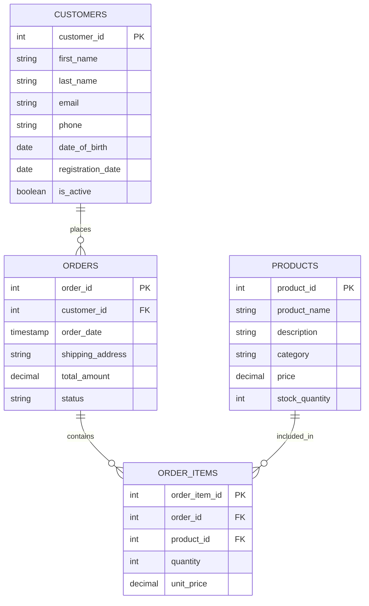

# SQL Create Table

## Introduction

Tables are the fundamental building blocks of any relational database. They store your data in a structured format consisting of rows and columns. In SQL, the `CREATE TABLE` statement is used to define a new table with its structure, data types, and constraints. This tutorial will guide you through creating tables in SQL from basic examples to more advanced use cases.

## Basic Syntax

The basic syntax for creating a table in SQL is:

```sql
CREATE TABLE table_name (
    column1 datatype constraints,
    column2 datatype constraints,
    column3 datatype constraints,
    ...
);
```

Let's break down each part:

- `CREATE TABLE`: The SQL command that tells the database you want to create a new table
- `table_name`: The name you want to give your table
- `column1, column2, column3`: The names of the columns in your table
- `datatype`: The type of data the column will store (e.g., INTEGER, VARCHAR, DATE)
- `constraints`: Optional rules for the data in the column (e.g., NOT NULL, UNIQUE)

## Common Data Types

SQL supports various data types. Here are the most common ones you'll use:

| Data Type | Description | Example |
|-----------|-------------|---------|
| INTEGER | Whole numbers | 1, 42, -99 |
| DECIMAL(p,s) | Decimal numbers with p digits and s decimal places | 10.5, 3.14159 |
| VARCHAR(n) | Variable-length character string with maximum length n | 'Hello', 'SQL' |
| CHAR(n) | Fixed-length character string of length n | 'A', 'US' |
| DATE | Date (year, month, day) | '2023-03-15' |
| TIME | Time (hour, minute, second) | '14:30:00' |
| BOOLEAN | True or false values | TRUE, FALSE |
| TEXT | Long text data | 'Long paragraph...' |

Different database systems may have slight variations in data type names and functionality.

## Simple Table Creation Example

Let's create a simple table to store information about books:

```sql
CREATE TABLE books (
    book_id INTEGER,
    title VARCHAR(100),
    author VARCHAR(50),
    publication_year INTEGER,
    price DECIMAL(6,2),
    is_available BOOLEAN
);
```

## Adding Constraints

Constraints are rules enforced on data columns to maintain data integrity. Common constraints include:

### 1. PRIMARY KEY

A primary key uniquely identifies each record in a table. It must contain unique values and cannot be NULL.

```sql
CREATE TABLE students (
    student_id INTEGER PRIMARY KEY,
    first_name VARCHAR(50),
    last_name VARCHAR(50),
    email VARCHAR(100)
);
```

### 2. NOT NULL

Ensures a column cannot have a NULL value.

```sql
CREATE TABLE employees (
    employee_id INTEGER PRIMARY KEY,
    first_name VARCHAR(50) NOT NULL,
    last_name VARCHAR(50) NOT NULL,
    hire_date DATE
);
```

### 3. UNIQUE

Ensures all values in a column are different.

```sql
CREATE TABLE users (
    user_id INTEGER PRIMARY KEY,
    username VARCHAR(50) UNIQUE,
    email VARCHAR(100) UNIQUE,
    password VARCHAR(100)
);
```

### 4. DEFAULT

Provides a default value for a column when no value is specified.

```sql
CREATE TABLE products (
    product_id INTEGER PRIMARY KEY,
    name VARCHAR(100) NOT NULL,
    price DECIMAL(8,2) NOT NULL,
    created_at TIMESTAMP DEFAULT CURRENT_TIMESTAMP,
    is_available BOOLEAN DEFAULT TRUE
);
```

### 5. FOREIGN KEY

Creates a link between tables by referencing the primary key of another table.

```sql
CREATE TABLE orders (
    order_id INTEGER PRIMARY KEY,
    customer_id INTEGER,
    order_date DATE,
    total_amount DECIMAL(10,2),
    FOREIGN KEY (customer_id) REFERENCES customers(customer_id)
);
```

## Complete Example with Multiple Constraints

Let's create a more comprehensive example that combines multiple constraints:

```sql
CREATE TABLE customers (
    customer_id INTEGER PRIMARY KEY,
    first_name VARCHAR(50) NOT NULL,
    last_name VARCHAR(50) NOT NULL,
    email VARCHAR(100) UNIQUE NOT NULL,
    phone VARCHAR(20),
    date_of_birth DATE,
    registration_date DATE DEFAULT CURRENT_DATE,
    is_active BOOLEAN DEFAULT TRUE
);

CREATE TABLE products (
    product_id INTEGER PRIMARY KEY,
    product_name VARCHAR(100) NOT NULL,
    description TEXT,
    category VARCHAR(50),
    price DECIMAL(8,2) NOT NULL CHECK (price > 0),
    stock_quantity INTEGER DEFAULT 0
);

CREATE TABLE orders (
    order_id INTEGER PRIMARY KEY,
    customer_id INTEGER NOT NULL,
    order_date TIMESTAMP DEFAULT CURRENT_TIMESTAMP,
    shipping_address TEXT NOT NULL,
    total_amount DECIMAL(10,2) NOT NULL,
    status VARCHAR(20) DEFAULT 'Pending',
    FOREIGN KEY (customer_id) REFERENCES customers(customer_id)
);

CREATE TABLE order_items (
    order_item_id INTEGER PRIMARY KEY,
    order_id INTEGER NOT NULL,
    product_id INTEGER NOT NULL,
    quantity INTEGER NOT NULL CHECK (quantity > 0),
    unit_price DECIMAL(8,2) NOT NULL,
    FOREIGN KEY (order_id) REFERENCES orders(order_id),
    FOREIGN KEY (product_id) REFERENCES products(product_id)
);
```

This schema represents a simple e-commerce database with customers, products, orders, and order items.

## Database Relationships Visualization

Here's a diagram showing the relationships between these tables:



## Auto-Increment

Most database systems provide a way to automatically generate unique values for primary keys. The syntax varies by database system:

### MySQL / MariaDB

```sql
CREATE TABLE products (
    product_id INTEGER AUTO_INCREMENT PRIMARY KEY,
    product_name VARCHAR(100) NOT NULL,
    price DECIMAL(8,2)
);
```

### PostgreSQL

```sql
CREATE TABLE products (
    product_id SERIAL PRIMARY KEY,
    product_name VARCHAR(100) NOT NULL,
    price DECIMAL(8,2)
);
```

### SQLite

```sql
CREATE TABLE products (
    product_id INTEGER PRIMARY KEY AUTOINCREMENT,
    product_name VARCHAR(100) NOT NULL,
    price DECIMAL(8,2)
);
```

### SQL Server

```sql
CREATE TABLE products (
    product_id INTEGER IDENTITY(1,1) PRIMARY KEY,
    product_name VARCHAR(100) NOT NULL,
    price DECIMAL(8,2)
);
```

## Creating a Table from an Existing Table

You can create a new table using data from an existing table:

```sql
CREATE TABLE customers_backup AS
SELECT * FROM customers;
```

This will create a new table with the same structure and data as the original table.

To create a table with the same structure but no data:

```sql
CREATE TABLE customers_template AS
SELECT * FROM customers
WHERE 1 = 0;
```

## Table Creation Best Practices

1. **Use meaningful table and column names**: Choose names that clearly describe the data they contain.

2. **Apply proper constraints**: Use constraints like PRIMARY KEY, FOREIGN KEY, and NOT NULL to maintain data integrity.

3. **Choose appropriate data types**: Select data types that match your data needs while minimizing storage requirements.

4. **Use lowercase for table and column names**: This avoids issues with case sensitivity across different systems.

5. **Add comments**: Document your table design with comments for better understanding.

    ```sql
    CREATE TABLE transactions (
        transaction_id INTEGER PRIMARY KEY,
        amount DECIMAL(10,2) NOT NULL,
        transaction_date TIMESTAMP DEFAULT CURRENT_TIMESTAMP,
        description VARCHAR(200),
        COMMENT ON TABLE transactions IS 'Stores all financial transactions';
        COMMENT ON COLUMN transactions.amount IS 'Transaction amount - positive for income, negative for expenses';
    );
    ```

6. **Consider using schemas**: In larger databases, organize tables into schemas based on their function or domain.

7. **Plan for future changes**: Design your tables to accommodate potential future requirements.

## IF NOT EXISTS Clause

To avoid errors when creating a table that might already exist, use the `IF NOT EXISTS` clause:

```sql
CREATE TABLE IF NOT EXISTS customers (
    customer_id INTEGER PRIMARY KEY,
    first_name VARCHAR(50),
    last_name VARCHAR(50)
);
```

## Temporary Tables

Temporary tables are useful for storing intermediate results and are automatically deleted when your session ends:

```sql
CREATE TEMPORARY TABLE temp_results (
    id INTEGER,
    result VARCHAR(100)
);
```

## Real-World Example: Blog Database

Let's create a practical example of a simple blog database:

```sql
-- Users table
CREATE TABLE users (
    user_id INTEGER PRIMARY KEY,
    username VARCHAR(50) UNIQUE NOT NULL,
    email VARCHAR(100) UNIQUE NOT NULL,
    password_hash VARCHAR(255) NOT NULL,
    first_name VARCHAR(50),
    last_name VARCHAR(50),
    bio TEXT,
    profile_image VARCHAR(200),
    registration_date TIMESTAMP DEFAULT CURRENT_TIMESTAMP,
    last_login TIMESTAMP,
    is_admin BOOLEAN DEFAULT FALSE
);

-- Categories table
CREATE TABLE categories (
    category_id INTEGER PRIMARY KEY,
    name VARCHAR(50) UNIQUE NOT NULL,
    description TEXT,
    created_at TIMESTAMP DEFAULT CURRENT_TIMESTAMP
);

-- Posts table
CREATE TABLE posts (
    post_id INTEGER PRIMARY KEY,
    title VARCHAR(200) NOT NULL,
    slug VARCHAR(200) UNIQUE NOT NULL,
    content TEXT NOT NULL,
    user_id INTEGER NOT NULL,
    category_id INTEGER,
    featured_image VARCHAR(200),
    is_published BOOLEAN DEFAULT FALSE,
    view_count INTEGER DEFAULT 0,
    created_at TIMESTAMP DEFAULT CURRENT_TIMESTAMP,
    updated_at TIMESTAMP DEFAULT CURRENT_TIMESTAMP,
    published_at TIMESTAMP,
    FOREIGN KEY (user_id) REFERENCES users(user_id),
    FOREIGN KEY (category_id) REFERENCES categories(category_id)
);

-- Comments table
CREATE TABLE comments (
    comment_id INTEGER PRIMARY KEY,
    post_id INTEGER NOT NULL,
    user_id INTEGER NOT NULL,
    parent_comment_id INTEGER,
    content TEXT NOT NULL,
    created_at TIMESTAMP DEFAULT CURRENT_TIMESTAMP,
    is_approved BOOLEAN DEFAULT FALSE,
    FOREIGN KEY (post_id) REFERENCES posts(post_id),
    FOREIGN KEY (user_id) REFERENCES users(user_id),
    FOREIGN KEY (parent_comment_id) REFERENCES comments(comment_id)
);

-- Tags table
CREATE TABLE tags (
    tag_id INTEGER PRIMARY KEY,
    name VARCHAR(50) UNIQUE NOT NULL,
    created_at TIMESTAMP DEFAULT CURRENT_TIMESTAMP
);

-- Post-Tag relationship (junction table)
CREATE TABLE post_tags (
    post_id INTEGER NOT NULL,
    tag_id INTEGER NOT NULL,
    PRIMARY KEY (post_id, tag_id),
    FOREIGN KEY (post_id) REFERENCES posts(post_id),
    FOREIGN KEY (tag_id) REFERENCES tags(tag_id)
);
```

This blog database example demonstrates:
- Primary and foreign key relationships
- Junction tables for many-to-many relationships
- Default values
- Self-referencing foreign keys (for nested comments)
- Various constraints and data types

## Common Errors and Troubleshooting

When creating tables, you might encounter these common errors:

1. **Duplicate table name**: A table with the same name already exists.
   - Solution: Use `DROP TABLE table_name` first or use `IF NOT EXISTS`.

2. **Invalid column name**: Column names contain invalid characters or reserved keywords.
   - Solution: Avoid using reserved keywords as column names or enclose them in backticks/quotes.

3. **Data type mismatch**: Trying to assign an incompatible default value.
   - Solution: Ensure default values match the column data type.

4. **Missing referenced table**: Foreign key references a table that doesn't exist.
   - Solution: Create the referenced table first.

5. **Insufficient privileges**: You don't have permission to create tables.
   - Solution: Contact your database administrator for appropriate permissions.

## Summary

In this tutorial, you've learned:

- The basic syntax for creating tables in SQL
- How to choose appropriate data types
- How to apply constraints to maintain data integrity
- How to create relationships between tables
- Best practices for table design
- Real-world examples of database schemas

Creating well-structured tables is fundamental to building effective databases. By applying proper constraints, choosing appropriate data types, and designing thoughtful relationships between tables, you'll create a solid foundation for your applications.

## Exercises

1. Create a table to store information about movies, including title, director, release year, genre, and duration.

2. Design a database for a library with tables for books, authors, borrowers, and loans.

3. Create a table for tracking exercise workouts with appropriate columns and constraints.

4. Modify the blog database example to add a table for storing user subscriptions to categories.

5. Design a database schema for a simple online store with at least 5 related tables.

## Additional Resources

- [SQL Data Types Reference](https://www.w3schools.com/sql/sql_datatypes.asp)
- [SQL Constraints](https://www.tutorialspoint.com/sql/sql-constraints.htm)
- [Database Normalization](https://www.studytonight.com/dbms/database-normalization.php)
- [Entity Relationship Diagrams](https://www.lucidchart.com/pages/er-diagrams)