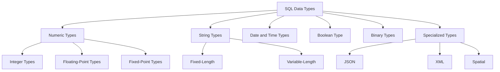

# SQL Data Types

## Introduction

When creating databases in SQL, understanding data types is essential. Data types define what kind of information can be stored in each column of your tables and how that data can be manipulated. Choosing the right data type is crucial for:

- **Data integrity**: Ensuring your data is stored accurately
- **Storage efficiency**: Optimizing how much space your database uses
- **Query performance**: Improving how quickly data can be retrieved
- **Application compatibility**: Making sure your database works well with other systems

In this guide, we'll explore the most common SQL data types, how to use them, and best practices for selecting the appropriate type for your data.

## Categories of SQL Data Types

SQL data types can be grouped into several categories:



Let's dive into each category to understand their specific types and applications.

## Numeric Data Types

Numeric data types store numbers that can be used in mathematical calculations.

### Integer Types

Integer types store whole numbers without decimals:

| Data Type | Storage | Range | Use Case |
|-----------|---------|-------|----------|
| TINYINT   | 1 byte  | 0 to 255 (unsigned) | Age, small counters |
| SMALLINT  | 2 bytes | -32,768 to 32,767 | Department IDs |
| INT       | 4 bytes | -2.1B to 2.1B | Product IDs, user IDs |
| BIGINT    | 8 bytes | -9.2E18 to 9.2E18 | Large unique identifiers |

#### Example: Creating a table with integer columns

```sql
CREATE TABLE products (
    product_id INT PRIMARY KEY,
    category_id SMALLINT,
    stock_quantity INT,
    rating TINYINT
);
```

### Floating-Point and Fixed-Point Types

These types store numbers with decimal places:

| Data Type | Storage | Precision | Use Case |
|-----------|---------|-----------|----------|
| FLOAT     | 4 bytes | ~7 digits | Scientific calculations |
| DOUBLE    | 8 bytes | ~15 digits | Higher precision scientific data |
| DECIMAL(p,s) | Variable | Exact precision | Financial data, currency |

The DECIMAL type takes two parameters:
- p: total number of digits (precision)
- s: number of digits after the decimal point (scale)

#### Example: Using decimal types for financial data

```sql
CREATE TABLE orders (
    order_id INT PRIMARY KEY,
    product_price DECIMAL(10,2),  -- Up to 10 digits, 2 after decimal point
    tax_amount DECIMAL(8,2),
    total_amount DECIMAL(10,2)
);

-- Insert sample data
INSERT INTO orders VALUES (1001, 299.99, 24.00, 323.99);

-- Query
SELECT * FROM orders;
```

Output:
```
order_id | product_price | tax_amount | total_amount
---------|---------------|------------|-------------
1001     | 299.99        | 24.00      | 323.99
```

## String Data Types

String data types store text and character data.

### Fixed-Length Strings

| Data Type | Description | Use Case |
|-----------|-------------|----------|
| CHAR(n)   | Fixed-length strings up to n characters | State codes, fixed-format codes |

### Variable-Length Strings

| Data Type | Description | Use Case |
|-----------|-------------|----------|
| VARCHAR(n) | Variable-length strings up to n characters | Names, addresses, most text |
| TEXT       | Variable-length strings with large capacity | Long descriptions, articles |

#### Example: Using different string types

```sql
CREATE TABLE employees (
    employee_id INT PRIMARY KEY,
    first_name VARCHAR(50),
    last_name VARCHAR(50),
    gender CHAR(1),           -- Single character: 'M', 'F', or 'O'
    ssn CHAR(9),              -- Social Security Number (fixed format)
    bio TEXT                  -- Longer text with variable length
);

-- Insert sample data
INSERT INTO employees 
VALUES (101, 'John', 'Smith', 'M', '123456789', 'John joined our company in 2020 and specializes in database development.');

-- Query
SELECT employee_id, first_name, last_name, gender FROM employees;
```

Output:
```
employee_id | first_name | last_name | gender
------------|------------|-----------|-------
101         | John       | Smith     | M
```

## Date and Time Data Types

Date and time types store temporal data:

| Data Type | Format | Description | Use Case |
|-----------|--------|-------------|----------|
| DATE      | YYYY-MM-DD | Date only | Birthdays, holidays |
| TIME      | HH:MM:SS | Time only | Schedule times |
| DATETIME  | YYYY-MM-DD HH:MM:SS | Date and time | Event timestamps |
| TIMESTAMP | YYYY-MM-DD HH:MM:SS | Date and time, auto-updates | Row modification tracking |

#### Example: Working with dates and times

```sql
CREATE TABLE appointments (
    appointment_id INT PRIMARY KEY,
    appointment_date DATE,
    start_time TIME,
    end_time TIME,
    created_at TIMESTAMP DEFAULT CURRENT_TIMESTAMP
);

-- Insert sample data
INSERT INTO appointments (appointment_id, appointment_date, start_time, end_time)
VALUES (1, '2023-11-15', '09:30:00', '10:30:00');

-- Query
SELECT * FROM appointments;
```

Output:
```
appointment_id | appointment_date | start_time | end_time  | created_at
---------------|-----------------|------------|-----------|----------------------
1              | 2023-11-15      | 09:30:00   | 10:30:00  | 2023-11-10 14:23:45
```

## Boolean Data Type

The BOOLEAN type (sometimes called BIT) stores true/false values:

```sql
CREATE TABLE subscriptions (
    user_id INT PRIMARY KEY,
    is_active BOOLEAN,
    email_notifications BOOLEAN DEFAULT TRUE
);

-- Insert sample data
INSERT INTO subscriptions (user_id, is_active)
VALUES (1001, TRUE), (1002, FALSE);

-- Query active subscriptions
SELECT * FROM subscriptions WHERE is_active = TRUE;
```

Output:
```
user_id | is_active | email_notifications
--------|-----------|--------------------
1001    | TRUE      | TRUE
```

## Binary Data Types

Binary types store binary data like files:

| Data Type | Description | Use Case |
|-----------|-------------|----------|
| BLOB      | Binary Large Object | Images, files, binary data |
| VARBINARY | Variable-length binary data | Small binary data |

> Note: While storing binary data in databases is possible, many applications store file paths instead and keep the actual files in a filesystem.

## Specialized Data Types

Many SQL databases support additional specialized types:

### JSON Type

Stores and validates JSON documents:

```sql
CREATE TABLE product_details (
    product_id INT PRIMARY KEY,
    specs JSON
);

-- Insert JSON data
INSERT INTO product_details VALUES 
(101, '{"color": "red", "weight": 10.5, "dimensions": {"length": 20, "width": 15, "height": 5}}');

-- Query JSON properties (syntax varies by database system)
SELECT product_id, specs->'$.color' AS color 
FROM product_details;
```

### Spatial Data Types

For geographical and spatial data (implementations vary by database):

```sql
CREATE TABLE stores (
    store_id INT PRIMARY KEY,
    location GEOMETRY,
    service_area POLYGON
);
```

## Real-World Example: Creating a Complete Database Table

Let's build a comprehensive example of a product catalog table using appropriate data types:

```sql
CREATE TABLE products (
    product_id INT PRIMARY KEY,
    sku CHAR(10) NOT NULL,
    name VARCHAR(100) NOT NULL,
    description TEXT,
    category_id SMALLINT,
    price DECIMAL(10,2) NOT NULL,
    weight DECIMAL(6,2),
    in_stock BOOLEAN DEFAULT TRUE,
    dimensions JSON,
    created_at TIMESTAMP DEFAULT CURRENT_TIMESTAMP,
    last_updated TIMESTAMP DEFAULT CURRENT_TIMESTAMP ON UPDATE CURRENT_TIMESTAMP
);

-- Insert sample data
INSERT INTO products 
(product_id, sku, name, description, category_id, price, weight, dimensions)
VALUES
(1001, 'TECH100123', 'Smartphone X1', 'Latest smartphone with advanced camera', 
 5, 699.99, 0.35, '{"length": 15.5, "width": 7.5, "height": 0.8}');

-- Query
SELECT product_id, name, price, in_stock FROM products;
```

Output:
```
product_id | name          | price   | in_stock
-----------|---------------|---------|----------
1001       | Smartphone X1 | 699.99  | TRUE
```

## Data Type Selection Best Practices

1. **Choose the smallest data type** that can reliably store your data
   - Using INT for a column that only needs TINYINT wastes space

2. **Use appropriate precision for DECIMAL types**
   - DECIMAL(10,2) is usually sufficient for most currencies 

3. **CHAR vs VARCHAR**
   - Use CHAR only when the length is fixed
   - For most text, VARCHAR is more appropriate

4. **Avoid TEXT/BLOB types in frequently used query columns**
   - These types can slow down queries when used in joins or WHERE clauses

5. **Use DATE/TIME types rather than storing dates as strings**
   - Enables proper date calculations and comparisons

## Common Data Type Gotchas

1. **Character encoding**: Be aware of character encoding (UTF-8, etc.) when storing international text
   
2. **Timezone awareness**: TIMESTAMP may behave differently with timezones than DATETIME

3. **Auto-increment behaviors**: These vary across database systems 

4. **NULL vs Empty String**: NULL and empty string ('') are different concepts

5. **Integer overflow**: When a number exceeds the range of its data type

## Summary

SQL data types form the foundation of your database structure. Choosing the right data type:

- Ensures data integrity
- Optimizes database performance
- Reduces storage requirements
- Enables proper data operations

As you design your databases, take time to analyze your data requirements and select the most appropriate types for each column. Start with the most restrictive type that can handle your data needs and adjust as necessary.

## Additional Resources and Exercises

### Exercises

1. Create a `users` table with appropriate data types for:
   - User ID, username, password (hashed), email, registration date, last login time

2. Design a `blog_posts` table with suitable data types for:
   - Post ID, title, content, author ID, publication date, tags, view count

3. Map the following fields to appropriate SQL data types:
   - Product color codes (e.g., #FF5733)
   - Phone numbers
   - ZIP/Postal codes
   - Credit card numbers
   - IP addresses

### Further Reading

- Database-specific documentation for MySQL, PostgreSQL, SQL Server, or Oracle
- Books: "SQL Antipatterns" by Bill Karwin
- Online courses: Look for beginner SQL courses on platforms like Coursera, Udemy, or edX

Remember that data types can vary slightly between different database management systems, so always consult the documentation for your specific database platform.