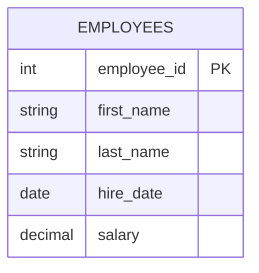

# SQL Primary Key

## Introduction

A primary key is one of the most fundamental concepts in database design. It uniquely identifies each record in a table, ensuring data integrity and providing a fast way to access specific rows. Think of a primary key as a unique identifier - similar to your social security number, student ID, or employee number - something that makes each record distinct from all others.

In this tutorial, we'll learn what primary keys are, why they're important, how to create and manage them, and best practices for their implementation in your SQL databases.

## What is a Primary Key?

A primary key is a column (or a combination of columns) in a table that serves as a unique identifier for each row. Primary keys have the following characteristics:

- **Uniqueness**: No two rows can have the same primary key value
- **Non-null**: Primary key values cannot be NULL
- **Stability**: Once assigned, a primary key value should rarely (if ever) change
- **Minimal**: A good primary key contains just enough information to uniquely identify a record

Let's visualize a table with a primary key:



In this diagram, `employee_id` is the primary key that uniquely identifies each employee record.

## Why Use Primary Keys?

Primary keys serve several important purposes in database design:

1. **Data Integrity**: They prevent duplicate records
2. **Relationships**: They allow tables to reference each other through foreign keys
3. **Performance**: Database systems create indexes on primary keys, making lookups faster
4. **Data Retrieval**: They provide a reliable way to identify and access specific records

## Creating Tables with Primary Keys

Let's look at different ways to define primary keys in SQL:

### Method 1: Using the PRIMARY KEY constraint inline

```sql
CREATE TABLE customers (
    customer_id INT PRIMARY KEY,
    first_name VARCHAR(50),
    last_name VARCHAR(50),
    email VARCHAR(100)
);
```

### Method 2: Using a separate PRIMARY KEY constraint

```sql
CREATE TABLE products (
    product_id INT,
    product_name VARCHAR(100),
    price DECIMAL(10,2),
    category VARCHAR(50),
    PRIMARY KEY (product_id)
);
```

### Method 3: Creating a composite primary key (using multiple columns)

```sql
CREATE TABLE order_items (
    order_id INT,
    product_id INT,
    quantity INT,
    price DECIMAL(10,2),
    PRIMARY KEY (order_id, product_id)
);
```

## Auto-incrementing Primary Keys

In many database systems, it's common to use auto-incrementing values for primary keys. Here's how you can implement this in different SQL database systems:

### MySQL

```sql
CREATE TABLE users (
    user_id INT AUTO_INCREMENT PRIMARY KEY,
    username VARCHAR(50) NOT NULL,
    email VARCHAR(100) NOT NULL
);
```

### PostgreSQL

```sql
CREATE TABLE users (
    user_id SERIAL PRIMARY KEY,
    username VARCHAR(50) NOT NULL,
    email VARCHAR(100) NOT NULL
);
```

### SQL Server

```sql
CREATE TABLE users (
    user_id INT IDENTITY(1,1) PRIMARY KEY,
    username VARCHAR(50) NOT NULL,
    email VARCHAR(100) NOT NULL
);
```

### SQLite

```sql
CREATE TABLE users (
    user_id INTEGER PRIMARY KEY AUTOINCREMENT,
    username TEXT NOT NULL,
    email TEXT NOT NULL
);
```

## Adding a Primary Key to an Existing Table

If you have an existing table without a primary key, you can add one using the ALTER TABLE statement:

```sql
ALTER TABLE employees 
ADD PRIMARY KEY (employee_id);
```

## Real-world Example: Building a Library Database

Let's design a small library database system to understand how primary keys work in a practical context:

```sql
-- Create Authors table
CREATE TABLE authors (
    author_id INT AUTO_INCREMENT PRIMARY KEY,
    first_name VARCHAR(50) NOT NULL,
    last_name VARCHAR(50) NOT NULL,
    birth_year INT
);

-- Create Books table
CREATE TABLE books (
    book_id INT AUTO_INCREMENT PRIMARY KEY,
    title VARCHAR(100) NOT NULL,
    author_id INT NOT NULL,
    publication_year INT,
    isbn VARCHAR(13) UNIQUE,
    FOREIGN KEY (author_id) REFERENCES authors(author_id)
);

-- Create Members table
CREATE TABLE members (
    member_id INT AUTO_INCREMENT PRIMARY KEY,
    first_name VARCHAR(50) NOT NULL,
    last_name VARCHAR(50) NOT NULL,
    join_date DATE NOT NULL,
    email VARCHAR(100) UNIQUE
);

-- Create Loans table with a composite primary key
CREATE TABLE loans (
    book_id INT,
    member_id INT,
    loan_date DATE NOT NULL,
    return_date DATE,
    PRIMARY KEY (book_id, member_id, loan_date),
    FOREIGN KEY (book_id) REFERENCES books(book_id),
    FOREIGN KEY (member_id) REFERENCES members(member_id)
);
```

Let's insert some sample data:

```sql
-- Insert authors
INSERT INTO authors (first_name, last_name, birth_year) VALUES
('Jane', 'Austen', 1775),
('George', 'Orwell', 1903),
('J.K.', 'Rowling', 1965);

-- Insert books
INSERT INTO books (title, author_id, publication_year, isbn) VALUES
('Pride and Prejudice', 1, 1813, '9780141439518'),
('1984', 2, 1949, '9780451524935'),
('Harry Potter and the Philosopher''s Stone', 3, 1997, '9780747532699');

-- Insert members
INSERT INTO members (first_name, last_name, join_date, email) VALUES
('John', 'Smith', '2023-01-15', 'john.smith@example.com'),
('Emily', 'Johnson', '2023-02-20', 'emily.j@example.com');

-- Insert loans
INSERT INTO loans (book_id, member_id, loan_date, return_date) VALUES
(1, 1, '2023-03-10', '2023-03-24'),
(2, 2, '2023-03-15', NULL);
```

Now we can query the database to see how primary keys help us retrieve data:

```sql
-- Find all books borrowed by a specific member
SELECT b.title, l.loan_date, l.return_date
FROM loans l
JOIN books b ON l.book_id = b.book_id
WHERE l.member_id = 1;

-- Find all members who have not returned their books
SELECT m.first_name, m.last_name, b.title, l.loan_date
FROM loans l
JOIN members m ON l.member_id = m.member_id
JOIN books b ON l.book_id = b.book_id
WHERE l.return_date IS NULL;
```

## Primary Key Best Practices

1. **Use surrogate keys instead of natural keys when possible**
   - Surrogate keys (like auto-increment IDs) don't change and are independent of business data
   - Natural keys (like email addresses or product codes) can change over time

2. **Keep primary keys simple**
   - Use integer or UUID types when possible
   - Avoid using strings or very complex composite keys unless necessary

3. **Be cautious with composite primary keys**
   - They can complicate queries and relationships
   - Consider using a surrogate key and then adding a unique constraint on the combination of fields

4. **Never use personally identifiable information (PII) as a primary key**
   - This creates both security and maintenance issues
   - Information like social security numbers should be protected, not exposed as identifiers

5. **Plan for scale**
   - Consider data types that can handle growth (e.g., BIGINT instead of INT for very large tables)
   - For distributed systems, consider UUIDs to avoid coordination issues

## Common Primary Key Issues and Solutions

### Issue: Running out of IDs in an auto-increment column

**Solution**: Use a larger data type like BIGINT instead of INT, or use UUIDs.

```sql
CREATE TABLE large_table (
    id BIGINT AUTO_INCREMENT PRIMARY KEY,
    -- other columns
);
```

### Issue: Need to merge data from multiple sources with conflicting IDs

**Solution**: Create a new surrogate key and preserve the original IDs in separate columns.

```sql
CREATE TABLE merged_customers (
    new_customer_id INT AUTO_INCREMENT PRIMARY KEY,
    source_system VARCHAR(10),
    original_id INT,
    -- other columns
    UNIQUE (source_system, original_id)
);
```

### Issue: Performance problems with string-based primary keys

**Solution**: Add an integer surrogate key as the primary key, and create a unique index on the string column.

```sql
-- Better approach
CREATE TABLE products (
    product_id INT AUTO_INCREMENT PRIMARY KEY,
    product_code VARCHAR(20) UNIQUE,
    -- other columns
);
```

## Summary

Primary keys are fundamental building blocks of relational database design. They ensure data integrity by uniquely identifying each record in a table. When designing your databases:

- Always include a primary key in every table
- Choose appropriate data types for your primary keys based on your data requirements
- Use auto-incrementing integers or UUIDs for most tables
- Consider all implications before using composite primary keys
- Remember that primary keys should never change once assigned

By following these guidelines, you'll build databases that are more robust, easier to query, and simpler to maintain over time.

## Exercises

1. Create a simple database for a school with tables for students, teachers, courses, and enrollments. Ensure each table has an appropriate primary key.

2. Design a database for an e-commerce site with tables for customers, products, orders, and order_items. Implement primary keys for each table.

3. Take an existing database design that lacks primary keys and modify it to include appropriate primary keys for each table.

## Additional Resources

- [Database Normalization](https://www.geeksforgeeks.org/normal-forms-in-dbms/)
- [SQL Constraints](https://www.w3schools.com/sql/sql_constraints.asp)
- [Understanding Database Keys](https://www.techopedia.com/definition/24799/database-key)
- [Using UUIDs as Primary Keys](https://www.percona.com/blog/2019/11/22/uuids-are-popular-but-bad-for-performance-lets-discuss/)