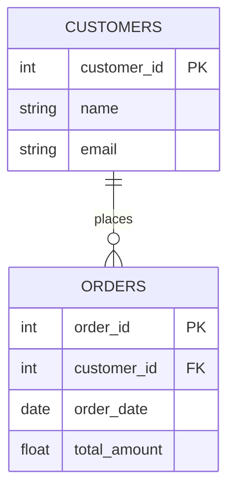

# SQL Foreign Key

## Introduction

A foreign key is one of the fundamental concepts in relational database design that helps maintain relationships between tables. It's a field (or collection of fields) in one table that refers to the primary key in another table. Foreign keys are essential for establishing and enforcing relationships between data in different tables, maintaining referential integrity, and preventing orphaned records.

In this tutorial, you'll learn:
- What foreign keys are and why they're important
- How to create foreign keys in SQL
- Different types of foreign key constraints
- Best practices for using foreign keys
- Real-world examples of foreign keys in action

## Understanding Foreign Keys

### What is a Foreign Key?

A foreign key is a column or group of columns in a table that provides a link between data in two tables. It acts as a cross-reference between tables because it references the primary key of another table, thereby establishing a link between them.

### Why Foreign Keys Matter

Foreign keys serve several critical purposes in database design:

1. **Maintain Referential Integrity**: Ensures that relationships between tables remain consistent
2. **Prevent Orphaned Records**: Stops records from being created that reference non-existent data
3. **Enable Joins**: Make it possible to combine data from multiple tables in meaningful ways
4. **Support Database Normalization**: Help eliminate data redundancy

### Visual Representation

Here's a simple illustration of how foreign keys work:



In this diagram, `customer_id` in the ORDERS table is a foreign key that references the `customer_id` primary key in the CUSTOMERS table.

## Creating Foreign Keys in SQL

### Basic Syntax

You can create a foreign key either when you're first creating a table or by altering an existing table.

#### When Creating a New Table:

```sql
CREATE TABLE orders (
    order_id INT PRIMARY KEY,
    customer_id INT,
    order_date DATE,
    total_amount DECIMAL(10, 2),
    FOREIGN KEY (customer_id) REFERENCES customers(customer_id)
);
```

#### Altering an Existing Table:

```sql
ALTER TABLE orders
ADD FOREIGN KEY (customer_id) REFERENCES customers(customer_id);
```

#### Naming a Foreign Key Constraint:

```sql
CREATE TABLE orders (
    order_id INT PRIMARY KEY,
    customer_id INT,
    order_date DATE,
    total_amount DECIMAL(10, 2),
    CONSTRAINT fk_customer
    FOREIGN KEY (customer_id) REFERENCES customers(customer_id)
);
```

### Foreign Key Options

When creating foreign keys, you can specify what should happen when the referenced data is updated or deleted:

#### ON DELETE Options:

- `ON DELETE CASCADE`: Automatically delete rows in the child table when the referenced row in the parent table is deleted
- `ON DELETE SET NULL`: Set the foreign key value to NULL when the referenced row is deleted
- `ON DELETE RESTRICT`: Prevent deletion of the referenced row
- `ON DELETE NO ACTION`: Similar to RESTRICT (default behavior in many databases)

#### ON UPDATE Options:

Similar options exist for what happens when a primary key is updated:
- `ON UPDATE CASCADE`
- `ON UPDATE SET NULL`
- `ON UPDATE RESTRICT`
- `ON UPDATE NO ACTION`

### Example with Options:

```sql
CREATE TABLE orders (
    order_id INT PRIMARY KEY,
    customer_id INT,
    order_date DATE,
    total_amount DECIMAL(10, 2),
    FOREIGN KEY (customer_id) 
    REFERENCES customers(customer_id)
    ON DELETE SET NULL
    ON UPDATE CASCADE
);
```

## Practical Examples

Let's work through a complete example of creating related tables with foreign keys to model a simple e-commerce database.

### Example: E-commerce Database

First, let's create a customers table:

```sql
CREATE TABLE customers (
    customer_id INT PRIMARY KEY,
    first_name VARCHAR(50) NOT NULL,
    last_name VARCHAR(50) NOT NULL,
    email VARCHAR(100) UNIQUE NOT NULL,
    phone VARCHAR(20),
    registration_date DATE DEFAULT CURRENT_DATE
);
```

Next, let's create an orders table with a foreign key to customers:

```sql
CREATE TABLE orders (
    order_id INT PRIMARY KEY,
    customer_id INT,
    order_date TIMESTAMP DEFAULT CURRENT_TIMESTAMP,
    status VARCHAR(20) DEFAULT 'pending',
    total_amount DECIMAL(10, 2),
    CONSTRAINT fk_customer_order
    FOREIGN KEY (customer_id) REFERENCES customers(customer_id)
    ON DELETE SET NULL
);
```

Finally, let's create an order_items table with foreign keys to both orders and products:

```sql
CREATE TABLE products (
    product_id INT PRIMARY KEY,
    name VARCHAR(100) NOT NULL,
    description TEXT,
    price DECIMAL(10, 2) NOT NULL,
    stock_quantity INT NOT NULL
);

CREATE TABLE order_items (
    item_id INT PRIMARY KEY,
    order_id INT NOT NULL,
    product_id INT NOT NULL,
    quantity INT NOT NULL,
    price DECIMAL(10, 2) NOT NULL,
    CONSTRAINT fk_order
    FOREIGN KEY (order_id) REFERENCES orders(order_id)
    ON DELETE CASCADE,
    CONSTRAINT fk_product
    FOREIGN KEY (product_id) REFERENCES products(product_id)
    ON DELETE RESTRICT
);
```

### Using the Database

Now let's see how our foreign keys maintain data integrity:

#### Inserting Data:

```sql
-- Add a customer
INSERT INTO customers (customer_id, first_name, last_name, email, phone)
VALUES (1, 'John', 'Doe', 'john.doe@example.com', '555-123-4567');

-- Add a product
INSERT INTO products (product_id, name, price, stock_quantity)
VALUES (101, 'Smartphone', 699.99, 50);

-- Create an order
INSERT INTO orders (order_id, customer_id, total_amount)
VALUES (1001, 1, 699.99);

-- Add an order item
INSERT INTO order_items (item_id, order_id, product_id, quantity, price)
VALUES (10001, 1001, 101, 1, 699.99);
```

#### Testing Foreign Key Constraints:

If we try to add an order for a non-existent customer:

```sql
-- This will fail due to foreign key constraint
INSERT INTO orders (order_id, customer_id, total_amount)
VALUES (1002, 999, 59.99);
```

The result would be an error like:

```
ERROR: insert or update on table "orders" violates foreign key constraint "fk_customer_order"
DETAIL: Key (customer_id)=(999) is not present in table "customers".
```

## Working with Foreign Keys in Practice

### Querying Related Tables

Foreign keys enable powerful JOINs between tables:

```sql
-- Get all orders with customer information
SELECT o.order_id, o.order_date, c.first_name, c.last_name, o.total_amount
FROM orders o
JOIN customers c ON o.customer_id = c.customer_id;

-- Get detailed order information including products
SELECT o.order_id, c.first_name, c.last_name, 
       p.name AS product_name, oi.quantity, oi.price
FROM orders o
JOIN customers c ON o.customer_id = c.customer_id
JOIN order_items oi ON o.order_id = oi.order_id
JOIN products p ON oi.product_id = p.product_id;
```

### Dropping Foreign Keys

Sometimes you need to remove a foreign key constraint:

```sql
-- Using constraint name
ALTER TABLE orders
DROP CONSTRAINT fk_customer_order;

-- In some database systems (like MySQL)
ALTER TABLE orders
DROP FOREIGN KEY fk_customer_order;
```

## Best Practices for Foreign Keys

1. **Always Name Your Constraints**: Using meaningful names makes maintenance easier.

2. **Choose Appropriate ON DELETE and ON UPDATE Actions**: Consider the business rules when deciding.

3. **Index Foreign Key Columns**: Foreign key columns are frequently used in joins, so indexing them can improve performance.
   ```sql
   CREATE INDEX idx_customer_id ON orders(customer_id);
   ```

4. **Consider Nullable vs. Non-nullable Foreign Keys**: Decide whether a relationship is mandatory (NOT NULL) or optional (NULL).

5. **Understand Performance Implications**: Foreign key constraints add overhead to INSERT, UPDATE, and DELETE operations.

6. **Document Your Database Relationships**: Create diagrams and documentation that clearly show relationships between tables.

## Common Issues and Troubleshooting

### Circular References

Be careful not to create circular references where tables directly or indirectly reference each other in a loop.

### Foreign Key Constraints Failing

If your foreign key constraints are failing, check:
- That the referenced value exists in the parent table
- That data types match exactly between the foreign key and the referenced primary key
- That character sets and collations match (for string columns)

### Performance Considerations

Foreign keys can impact performance, especially with large tables. Consider:
- Properly indexing foreign key columns
- Batching large operations that affect many rows
- Temporarily disabling constraints for bulk loads (but be very careful!)

## Summary

Foreign keys are a fundamental concept in relational database design that establish and enforce relationships between tables. They help maintain data integrity, prevent orphaned records, and enable joining related data.

Key points to remember:
- A foreign key in one table references a primary key in another table
- Foreign keys enforce referential integrity
- You can specify ON DELETE and ON UPDATE actions
- Foreign keys enable powerful queries through table joins
- Proper indexing of foreign key columns is important for performance

By using foreign keys effectively, you can build robust, well-structured databases that accurately represent the relationships in your data model.

## Additional Resources

### Further Reading
- [SQL Foreign Keys - W3Schools](https://www.w3schools.com/sql/sql_foreignkey.asp)
- [Database Design - Normalization and Foreign Keys](https://www.guru99.com/database-normalization.html)
- [MySQL Documentation - Foreign Keys](https://dev.mysql.com/doc/refman/8.0/en/create-table-foreign-keys.html)

### Exercises

1. **Basic Foreign Key Creation**:
   Create two tables - a `departments` table and an `employees` table - with a foreign key relationship.

2. **Multiple Foreign Keys**:
   Create a `projects` table that has foreign keys to both `departments` and `employees` tables.

3. **Cascading Actions**:
   Modify your `employees` table to cascade deletes to a new `employee_addresses` table.

4. **Querying Practice**:
   Write queries that join all three tables (departments, employees, projects) to display comprehensive project information.

5. **Foreign Key Troubleshooting**:
   Intentionally create situations that violate foreign key constraints and observe the errors. Then fix the issues.