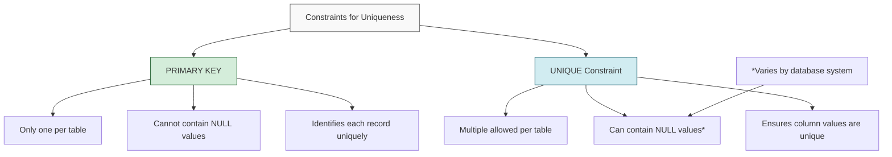

# SQL Unique Constraint

## Introduction

When designing a database, ensuring data integrity is essential. One common requirement is making sure certain values in your tables are unique. For example, in a user registration system, you wouldn't want two users to have the same email address or username.

This is where the **UNIQUE constraint** comes in. It's a rule you can add to your database tables that prevents duplicate values in specific columns or combinations of columns. Unlike the PRIMARY KEY constraint (which also enforces uniqueness), a table can have multiple UNIQUE constraints.

## Understanding Unique Constraints

### What is a Unique Constraint?

A UNIQUE constraint ensures that all values in a column or a combination of columns are different from each other. It provides a way to enforce the uniqueness of data without making the column a primary key.

### Key Characteristics

- Prevents duplicate values in the specified column(s)
- A table can have multiple UNIQUE constraints (unlike PRIMARY KEY)
- Can be applied to a single column or multiple columns together
- Allows NULL values (typically only one NULL, depending on the database system)
- Creates a unique index automatically for faster data retrieval

## Creating a Unique Constraint

There are several ways to add a unique constraint to your database tables:

### 1. When Creating a New Table

```sql
CREATE TABLE users (
    user_id INT PRIMARY KEY,
    username VARCHAR(50) UNIQUE,
    email VARCHAR(100) UNIQUE,
    full_name VARCHAR(100)
);
```

In this example, both `username` and `email` columns have UNIQUE constraints, meaning no two users can have the same username or email address.

### 2. Adding a Constraint to an Existing Table

```sql
ALTER TABLE customers
ADD CONSTRAINT unique_email UNIQUE (email);
```

Here we're adding a UNIQUE constraint to the `email` column in an existing table called `customers`. We've also named our constraint `unique_email` for easier reference later.

### 3. Creating a Multi-Column Unique Constraint

Sometimes you need a combination of columns to be unique, not just individual columns:

```sql
CREATE TABLE product_inventory (
    inventory_id INT PRIMARY KEY,
    product_id INT,
    warehouse_id INT,
    quantity INT,
    CONSTRAINT unique_product_warehouse UNIQUE (product_id, warehouse_id)
);
```

In this example, each product can exist in each warehouse only once (preventing duplicate inventory entries), but the same product can exist in different warehouses, and different products can exist in the same warehouse.

## Working with Unique Constraints

### Inserting Data

When you have UNIQUE constraints, INSERT statements will fail if they violate the constraint:

```sql
-- This will work for the first insert
INSERT INTO users (user_id, username, email, full_name)
VALUES (1, 'johndoe', 'john@example.com', 'John Doe');

-- This will FAIL because 'johndoe' username already exists
INSERT INTO users (user_id, username, email, full_name)
VALUES (2, 'johndoe', 'jane@example.com', 'Jane Smith');
```

The second INSERT statement would result in an error like:

```
ERROR: duplicate key value violates unique constraint "users_username_key"
DETAIL: Key (username)=(johndoe) already exists.
```

### Updating Data

UNIQUE constraints also affect UPDATE statements:

```sql
-- This will FAIL if any user already has the username 'newname'
UPDATE users
SET username = 'newname'
WHERE user_id = 1;
```

### Handling Unique Constraint Violations

Different database systems provide ways to handle potential constraint violations:

#### In PostgreSQL and MySQL:

```sql
-- Insert a record if it doesn't violate constraints,
-- otherwise do nothing
INSERT INTO users (user_id, username, email, full_name)
VALUES (3, 'sarahj', 'sarah@example.com', 'Sarah Johnson')
ON CONFLICT DO NOTHING;

-- Or update certain fields if there's a conflict
INSERT INTO users (user_id, username, email, full_name)
VALUES (4, 'mikeb', 'mike@example.com', 'Mike Brown')
ON CONFLICT (username) DO UPDATE 
SET email = EXCLUDED.email, full_name = EXCLUDED.full_name;
```

#### In SQL Server:

```sql
-- This uses a merge statement to handle conflicts
MERGE INTO users AS target
USING (SELECT 5 AS user_id, 'alexw' AS username, 'alex@example.com' AS email, 'Alex Wong' AS full_name) AS source
ON target.username = source.username
WHEN MATCHED THEN
    UPDATE SET email = source.email, full_name = source.full_name
WHEN NOT MATCHED THEN
    INSERT (user_id, username, email, full_name)
    VALUES (source.user_id, source.username, source.email, source.full_name);
```

## Differences Between Unique and Primary Key Constraints

While both UNIQUE and PRIMARY KEY constraints enforce uniqueness, they have important differences:



## Real-World Examples

### Example 1: User Registration System

```sql
CREATE TABLE users (
    user_id SERIAL PRIMARY KEY,
    username VARCHAR(50) UNIQUE NOT NULL,
    email VARCHAR(100) UNIQUE NOT NULL,
    phone_number VARCHAR(15) UNIQUE,
    password_hash VARCHAR(100) NOT NULL,
    registration_date TIMESTAMP DEFAULT CURRENT_TIMESTAMP
);
```

In this user table:
- `username` must be unique and not null
- `email` must be unique and not null
- `phone_number` is unique but can be null (some users might not provide a phone number)

### Example 2: Product Catalog

```sql
CREATE TABLE products (
    product_id SERIAL PRIMARY KEY,
    sku VARCHAR(20) UNIQUE NOT NULL,
    upc VARCHAR(12) UNIQUE,
    name VARCHAR(100) NOT NULL,
    price DECIMAL(10,2) NOT NULL,
    description TEXT
);
```

In this product catalog:
- `sku` (Stock Keeping Unit) is unique for internal tracking
- `upc` (Universal Product Code) is unique for each product but might not exist for all products

### Example 3: School Class Enrollment

```sql
CREATE TABLE enrollments (
    enrollment_id SERIAL PRIMARY KEY,
    student_id INT NOT NULL,
    course_id INT NOT NULL,
    semester VARCHAR(20) NOT NULL,
    enrollment_date DATE NOT NULL,
    grade CHAR(2),
    CONSTRAINT unique_enrollment UNIQUE (student_id, course_id, semester),
    FOREIGN KEY (student_id) REFERENCES students(student_id),
    FOREIGN KEY (course_id) REFERENCES courses(course_id)
);
```

In this enrollment system:
- The combination of `student_id`, `course_id`, and `semester` must be unique
- This prevents a student from enrolling in the same course twice in the same semester
- Students can take different courses in the same semester or the same course in different semesters

## Dropping a Unique Constraint

If you need to remove a unique constraint, you can use the ALTER TABLE statement:

```sql
-- If you named your constraint
ALTER TABLE users
DROP CONSTRAINT unique_email;

-- For automatically generated constraint names (PostgreSQL example)
ALTER TABLE users
DROP CONSTRAINT users_email_key;
```

## Common Challenges and Solutions

### Challenge 1: Enforcing Uniqueness with Case Insensitivity

For text columns like email addresses or usernames, you might want uniqueness regardless of case:

```sql
-- PostgreSQL solution
CREATE TABLE users (
    user_id SERIAL PRIMARY KEY,
    username VARCHAR(50),
    email VARCHAR(100),
    CONSTRAINT unique_username UNIQUE (LOWER(username)),
    CONSTRAINT unique_email UNIQUE (LOWER(email))
);
```

### Challenge 2: Unique Constraints on Nullable Columns

In most SQL implementations, multiple NULL values don't violate a UNIQUE constraint (since NULL is considered to mean "unknown" rather than a value).

If you need to ensure only one NULL value:

```sql
-- One approach is to add a CHECK constraint
ALTER TABLE products
ADD CONSTRAINT check_only_one_null_upc
CHECK (
    (SELECT COUNT(*) FROM products WHERE upc IS NULL) <= 1
);
```

## Summary

The SQL UNIQUE constraint is a powerful tool for maintaining data integrity in your database by preventing duplicate values. Key points to remember:

- UNIQUE constraints ensure all values in specified column(s) are different
- Unlike PRIMARY KEYs, tables can have multiple UNIQUE constraints
- Can be applied to single columns or combinations of columns
- Automatically creates an index for improved query performance
- Handles NULL values differently than PRIMARY KEYs
- Essential for real-world applications like user registration systems, product catalogs, and more

By properly implementing UNIQUE constraints, you can prevent data inconsistencies and build more robust database applications.

## Additional Resources and Exercises

### Additional Resources
- [PostgreSQL Documentation on Constraints](https://www.postgresql.org/docs/current/ddl-constraints.html)
- [MySQL Documentation on Constraints](https://dev.mysql.com/doc/refman/8.0/en/create-table-check-constraints.html)
- [SQL Server Documentation on Constraints](https://learn.microsoft.com/en-us/sql/relational-databases/tables/unique-constraints-and-check-constraints)

### Exercises

1. **Basic Constraint Creation**:
   Create a `books` table with columns for `book_id`, `isbn`, `title`, and `author`. Make the `isbn` column unique.

2. **Multi-Column Constraints**:
   Create an `employee_projects` table that tracks which employees are assigned to which projects. Ensure that an employee can only be assigned to a specific project once.

3. **Constraint Troubleshooting**:
   Write a query to identify all duplicate email addresses in an existing `customers` table before adding a UNIQUE constraint.

4. **Constraint Modification**:
   Given an existing `products` table with potentially duplicate `sku` values, write the SQL statements needed to clean up duplicates and then add a UNIQUE constraint.

5. **Advanced Uniqueness**:
   Create a table to store historical address information for customers, where the combination of `customer_id`, `address_type`, and `effective_date` must be unique.