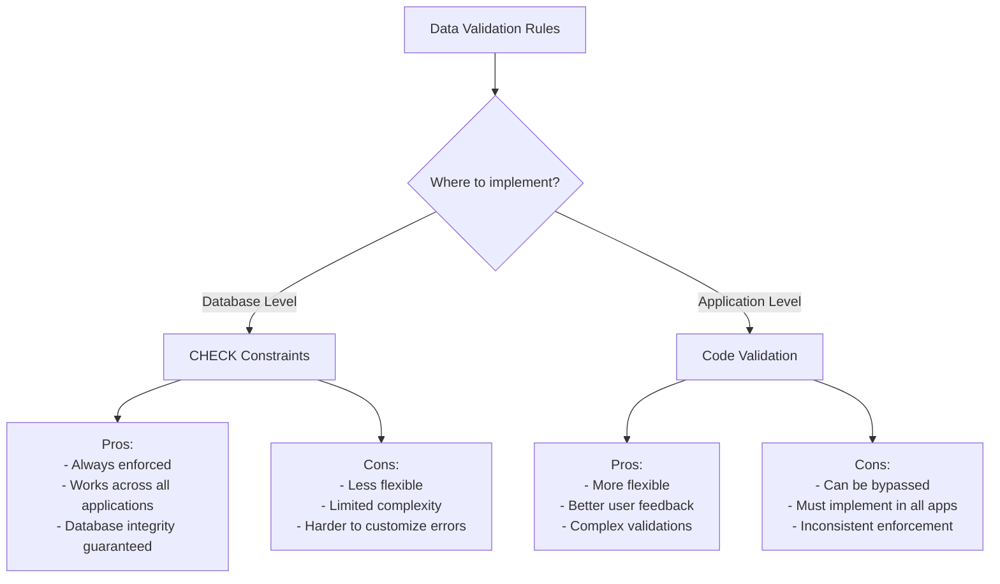

# SQL Check Constraint

## Introduction

When creating databases, ensuring data integrity is essential. While primary keys and foreign keys help maintain relational integrity, they don't enforce business rules about what values should be allowed in specific columns. This is where **CHECK constraints** come in.

A CHECK constraint is a rule that specifies the values that are acceptable for a column or multiple columns in a table. It acts as a gatekeeper, rejecting any data that doesn't meet the specified conditions. Using CHECK constraints helps maintain data quality by preventing invalid data from being inserted into your database.

## Basic Syntax

The basic syntax for adding a CHECK constraint to a table is:

```sql
-- When creating a new table
CREATE TABLE table_name (
    column1 datatype,
    column2 datatype,
    ...,
    CONSTRAINT constraint_name CHECK (condition)
);

-- Adding to an existing table
ALTER TABLE table_name
ADD CONSTRAINT constraint_name CHECK (condition);
```

The `condition` is a Boolean expression that must evaluate to TRUE for the data to be accepted.

## Simple CHECK Constraint Examples

### Example 1: Ensuring Positive Values

Let's create a `products` table where the price must be greater than zero:

```sql
CREATE TABLE products (
    product_id INT PRIMARY KEY,
    product_name VARCHAR(100) NOT NULL,
    price DECIMAL(10, 2),
    CONSTRAINT chk_price_positive CHECK (price > 0)
);
```

Now, if we try to insert a product with a negative price:

```sql
-- This will fail
INSERT INTO products (product_id, product_name, price)
VALUES (1, 'Keyboard', -29.99);

-- Error: Check constraint 'chk_price_positive' is violated.
```

```sql
-- This will succeed
INSERT INTO products (product_id, product_name, price)
VALUES (1, 'Keyboard', 29.99);

-- 1 row inserted
```

### Example 2: Validating a Range

We can ensure a value falls within a specific range:

```sql
CREATE TABLE students (
    student_id INT PRIMARY KEY,
    first_name VARCHAR(50) NOT NULL,
    last_name VARCHAR(50) NOT NULL,
    age INT,
    CONSTRAINT chk_age_valid CHECK (age >= 18 AND age <= 99)
);
```

This ensures all students in our database are between 18 and 99 years old.

## More Complex CHECK Constraints

### Using Multiple Columns

CHECK constraints can involve multiple columns:

```sql
CREATE TABLE orders (
    order_id INT PRIMARY KEY,
    order_date DATE NOT NULL,
    ship_date DATE,
    CONSTRAINT chk_ship_date_valid CHECK (ship_date >= order_date OR ship_date IS NULL)
);
```

This ensures that if a shipping date is provided, it cannot be earlier than the order date.

### Using Functions in CHECK Constraints

You can use SQL functions within your constraints:

```sql
CREATE TABLE employees (
    employee_id INT PRIMARY KEY,
    first_name VARCHAR(50) NOT NULL,
    last_name VARCHAR(50) NOT NULL,
    email VARCHAR(100),
    CONSTRAINT chk_email_format CHECK (email LIKE '%@%.%')
);
```

This simple check ensures that email addresses contain the '@' character and at least one period.

## CHECK Constraints Across Different Database Systems

While the basic functionality of CHECK constraints is similar across different database management systems, there are some differences in syntax and capabilities.

### MySQL

Prior to version 8.0.16, MySQL would accept CHECK constraints but would not enforce them. In newer versions, they work as expected:

```sql
CREATE TABLE products (
    product_id INT PRIMARY KEY,
    product_name VARCHAR(100) NOT NULL,
    price DECIMAL(10, 2) CHECK (price > 0)
);
```

### PostgreSQL

PostgreSQL fully supports CHECK constraints and allows you to reference other columns:

```sql
CREATE TABLE products (
    product_id SERIAL PRIMARY KEY,
    product_name VARCHAR(100) NOT NULL,
    regular_price DECIMAL(10, 2),
    discount_price DECIMAL(10, 2),
    CONSTRAINT chk_discount_valid CHECK (discount_price <= regular_price)
);
```

### SQL Server

SQL Server supports CHECK constraints and allows naming them explicitly:

```sql
CREATE TABLE employees (
    employee_id INT PRIMARY KEY,
    start_date DATE,
    end_date DATE,
    CONSTRAINT chk_employment_dates CHECK (end_date IS NULL OR end_date >= start_date)
);
```

## Real-World Applications

Let's explore some practical applications of CHECK constraints in real-world scenarios.

### E-commerce Database

```sql
CREATE TABLE products (
    product_id INT PRIMARY KEY,
    product_name VARCHAR(100) NOT NULL,
    price DECIMAL(10, 2),
    weight_kg DECIMAL(8, 3),
    in_stock INT DEFAULT 0,
    CONSTRAINT chk_price_positive CHECK (price > 0),
    CONSTRAINT chk_weight_positive CHECK (weight_kg > 0),
    CONSTRAINT chk_stock_non_negative CHECK (in_stock >= 0)
);
```

In this example, we're ensuring that:
- Products can't have negative prices
- Product weights must be positive
- In-stock quantities can't be negative

### HR System

```sql
CREATE TABLE employees (
    employee_id INT PRIMARY KEY,
    first_name VARCHAR(50) NOT NULL,
    last_name VARCHAR(50) NOT NULL,
    birth_date DATE,
    hire_date DATE,
    salary DECIMAL(10, 2),
    department CHAR(4),
    CONSTRAINT chk_birth_date CHECK (birth_date <= CURRENT_DATE - INTERVAL '18' YEAR),
    CONSTRAINT chk_hire_date CHECK (hire_date <= CURRENT_DATE),
    CONSTRAINT chk_salary_range CHECK (salary >= 15000 AND salary <= 150000),
    CONSTRAINT chk_department CHECK (department IN ('SALE', 'TECH', 'HR', 'FIN', 'MKTG'))
);
```

This creates several business rules:
- Employees must be at least 18 years old
- Hire dates cannot be in the future
- Salaries must be within a specific range
- Department codes must be one of the valid options

## When to Use CHECK Constraints vs. Application Validation

You might wonder when to implement validation rules at the database level using CHECK constraints versus handling them in your application code. Here's a comparison:



Best practice is to use both:
- Use CHECK constraints for fundamental business rules that should never be violated
- Use application validation for providing better user feedback and handling complex validations

## Best Practices

1. **Name your constraints meaningfully**: Use prefixes like `chk_` followed by what the constraint is checking.

2. **Keep constraints simple**: Complex constraints can be difficult to understand and maintain.

3. **Document your constraints**: Add comments explaining the business rule each constraint is enforcing.

4. **Test your constraints**: Verify that they reject invalid data and accept valid data.

5. **Use appropriate data types**: Choose the right data type for your columns before adding constraints.

## Common Pitfalls

### NULL Values

CHECK constraints evaluate to TRUE or FALSE, but they evaluate to "unknown" when a column contains NULL. This means NULL values will generally pass CHECK constraints unless you explicitly handle them:

```sql
-- This constraint doesn't prevent NULL values
CONSTRAINT chk_price_positive CHECK (price > 0)

-- This constraint prevents NULL values
CONSTRAINT chk_price_valid CHECK (price > 0 AND price IS NOT NULL)
```

### Performance Considerations

While CHECK constraints help maintain data integrity, very complex constraints can impact performance during data insertion and updates. For extremely complex validations, consider using triggers or application-level validation.

## Summary

CHECK constraints are powerful tools for maintaining data integrity in SQL databases. They:

- Enforce business rules at the database level
- Prevent invalid data from being inserted or updated
- Work across all applications that access the database
- Provide a declarative way to define data validation rules

By implementing appropriate CHECK constraints in your database design, you ensure that your data remains valid regardless of how it's accessed or modified.

## Exercises

1. Create a `bank_accounts` table with a CHECK constraint ensuring the balance is never negative.

2. Modify an existing `employees` table to add a CHECK constraint that ensures the email address contains an '@' character.

3. Create a `rentals` table with constraints ensuring the return date is after the rental date and the daily rate is positive.

4. Add multiple CHECK constraints to an `inventory` table to ensure quantities, reorder points, and prices are all valid.

5. Challenge: Create a table with a CHECK constraint that validates a custom format for a product code (e.g., 3 letters followed by 4 digits).

## Additional Resources

- [SQL Standard Documentation](https://www.iso.org/standard/63555.html)
- [PostgreSQL CHECK Constraints](https://www.postgresql.org/docs/current/ddl-constraints.html#DDL-CONSTRAINTS-CHECK-CONSTRAINTS)
- [MySQL CHECK Constraints](https://dev.mysql.com/doc/refman/8.0/en/create-table-check-constraints.html)
- [SQL Server CHECK Constraints](https://docs.microsoft.com/en-us/sql/relational-databases/tables/unique-constraints-and-check-constraints)