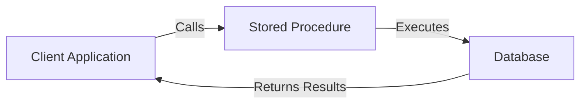

# SQL Stored Procedures Basics

## Introduction

Stored procedures are a powerful feature in database management systems that allow you to save and reuse SQL code. Think of stored procedures as functions or methods in programming languages - they are named collections of SQL statements that can be executed whenever needed, accept parameters, and return results.

In this guide, we'll explore the basics of SQL stored procedures, including:
- What they are and why they're useful
- How to create, execute, modify, and delete stored procedures
- How to work with parameters
- Real-world applications and best practices

## What Are Stored Procedures?

A stored procedure is a prepared SQL code that you can save and reuse. When you create a stored procedure, you're essentially storing a set of SQL statements in the database server with a name. Later, you can call this stored procedure by its name rather than rewriting all the SQL statements each time.



## Why Use Stored Procedures?

Stored procedures offer several advantages:

1. **Improved Performance**: Procedures are compiled once and stored in executable form, reducing query parsing and compilation on subsequent executions.

2. **Enhanced Security**: You can grant users permission to execute a procedure without giving them direct access to the underlying tables.

3. **Code Reusability**: Write once, use many times - procedures eliminate redundant code.

4. **Reduced Network Traffic**: Instead of sending multiple SQL statements across the network, you send one call to the procedure.

5. **Easier Maintenance**: When business logic changes, you modify the procedure in one place rather than updating multiple applications.

6. **Modular Programming**: Procedures allow you to build a library of SQL routines that make your database applications more modular and easier to maintain.

## Creating Your First Stored Procedure

The syntax for creating stored procedures varies slightly between database systems. We'll focus on the most common ones: MySQL, SQL Server, and PostgreSQL.

### MySQL Syntax

```sql
DELIMITER //
CREATE PROCEDURE procedure_name()
BEGIN
    -- SQL statements here
END //
DELIMITER ;
```

### SQL Server Syntax

```sql
CREATE PROCEDURE procedure_name
AS
BEGIN
    -- SQL statements here
END;
```

### PostgreSQL Syntax

```sql
CREATE OR REPLACE FUNCTION procedure_name()
RETURNS void AS $$
BEGIN
    -- SQL statements here
END;
$$ LANGUAGE plpgsql;
```

## Basic Example: Creating a Simple Stored Procedure

Let's create a simple stored procedure that retrieves all records from a `customers` table:

### MySQL Example

```sql
DELIMITER //
CREATE PROCEDURE GetAllCustomers()
BEGIN
    SELECT * FROM customers;
END //
DELIMITER ;
```

### SQL Server Example

```sql
CREATE PROCEDURE GetAllCustomers
AS
BEGIN
    SELECT * FROM customers;
END;
```

### PostgreSQL Example

```sql
CREATE OR REPLACE FUNCTION GetAllCustomers()
RETURNS TABLE (
    customer_id INT,
    customer_name VARCHAR(100),
    email VARCHAR(100),
    phone VARCHAR(20)
) AS $$
BEGIN
    RETURN QUERY SELECT * FROM customers;
END;
$$ LANGUAGE plpgsql;
```

## Executing a Stored Procedure

Once you've created a stored procedure, you can execute it with a simple command:

### MySQL and SQL Server

```sql
CALL GetAllCustomers();
```

### PostgreSQL

```sql
SELECT * FROM GetAllCustomers();
```

## Input Parameters

Stored procedures become more powerful when they can accept input parameters. This allows you to create flexible procedures that can behave differently based on the values passed to them.

### MySQL Example with Parameters

```sql
DELIMITER //
CREATE PROCEDURE GetCustomersByCity(IN cityName VARCHAR(50))
BEGIN
    SELECT * FROM customers WHERE city = cityName;
END //
DELIMITER ;
```

### SQL Server Example with Parameters

```sql
CREATE PROCEDURE GetCustomersByCity
    @cityName NVARCHAR(50)
AS
BEGIN
    SELECT * FROM customers WHERE city = @cityName;
END;
```

### PostgreSQL Example with Parameters

```sql
CREATE OR REPLACE FUNCTION GetCustomersByCity(cityName VARCHAR(50))
RETURNS TABLE (
    customer_id INT,
    customer_name VARCHAR(100),
    email VARCHAR(100),
    phone VARCHAR(20),
    city VARCHAR(50)
) AS $$
BEGIN
    RETURN QUERY SELECT * FROM customers WHERE city = cityName;
END;
$$ LANGUAGE plpgsql;
```

### Executing with Parameters

#### MySQL and SQL Server

```sql
CALL GetCustomersByCity('New York');
```

#### PostgreSQL

```sql
SELECT * FROM GetCustomersByCity('New York');
```

## Output Parameters

You can also use stored procedures to return values through output parameters.

### MySQL Example with Output Parameter

```sql
DELIMITER //
CREATE PROCEDURE GetCustomerCount(OUT total INT)
BEGIN
    SELECT COUNT(*) INTO total FROM customers;
END //
DELIMITER ;
```

### SQL Server Example with Output Parameter

```sql
CREATE PROCEDURE GetCustomerCount
    @total INT OUTPUT
AS
BEGIN
    SELECT @total = COUNT(*) FROM customers;
END;
```

### Executing with Output Parameters

#### MySQL

```sql
SET @total = 0;
CALL GetCustomerCount(@total);
SELECT @total AS TotalCustomers;
```

#### SQL Server

```sql
DECLARE @total INT;
EXEC GetCustomerCount @total OUTPUT;
SELECT @total AS TotalCustomers;
```

## Modifying Stored Procedures

To modify an existing stored procedure:

### MySQL

```sql
DELIMITER //
ALTER PROCEDURE GetAllCustomers()
BEGIN
    SELECT customer_id, customer_name, email FROM customers;
END //
DELIMITER ;
```

### SQL Server

```sql
ALTER PROCEDURE GetAllCustomers
AS
BEGIN
    SELECT customer_id, customer_name, email FROM customers;
END;
```

### PostgreSQL

```sql
CREATE OR REPLACE FUNCTION GetAllCustomers()
RETURNS TABLE (
    customer_id INT,
    customer_name VARCHAR(100),
    email VARCHAR(100)
) AS $$
BEGIN
    RETURN QUERY SELECT customer_id, customer_name, email FROM customers;
END;
$$ LANGUAGE plpgsql;
```

## Deleting Stored Procedures

To remove a stored procedure from the database:

### MySQL

```sql
DROP PROCEDURE IF EXISTS GetAllCustomers;
```

### SQL Server

```sql
DROP PROCEDURE IF EXISTS GetAllCustomers;
```

### PostgreSQL

```sql
DROP FUNCTION IF EXISTS GetAllCustomers();
```

## Practical Example: Order Management System

Let's look at a more comprehensive example for an order management system:

### Creating a Procedure to Process Orders

```sql
-- SQL Server Syntax
CREATE PROCEDURE ProcessOrder
    @customerId INT,
    @productId INT,
    @quantity INT,
    @orderSuccess BIT OUTPUT
AS
BEGIN
    -- Declare variables
    DECLARE @inStock INT;
    DECLARE @orderID INT;
    
    -- Check if we have enough stock
    SELECT @inStock = stock_quantity FROM products WHERE product_id = @productId;
    
    -- Begin transaction to ensure data integrity
    BEGIN TRANSACTION;
    
    IF @inStock >= @quantity
    BEGIN
        -- Update stock
        UPDATE products 
        SET stock_quantity = stock_quantity - @quantity 
        WHERE product_id = @productId;
        
        -- Create order record
        INSERT INTO orders (customer_id, order_date, status)
        VALUES (@customerId, GETDATE(), 'Processed');
        
        -- Get the new order ID
        SET @orderID = SCOPE_IDENTITY();
        
        -- Add order details
        INSERT INTO order_details (order_id, product_id, quantity)
        VALUES (@orderID, @productId, @quantity);
        
        -- Order processed successfully
        SET @orderSuccess = 1;
        COMMIT TRANSACTION;
    END
    ELSE
    BEGIN
        -- Not enough stock
        SET @orderSuccess = 0;
        ROLLBACK TRANSACTION;
    END
END;
```

### Executing the Order Processing Procedure

```sql
DECLARE @orderProcessed BIT;
EXEC ProcessOrder 
    @customerId = 101, 
    @productId = 5002, 
    @quantity = 3, 
    @orderSuccess = @orderProcessed OUTPUT;

IF @orderProcessed = 1
    PRINT 'Order processed successfully';
ELSE
    PRINT 'Order failed: Insufficient stock';
```

## Error Handling in Stored Procedures

Proper error handling is crucial in stored procedures:

### MySQL Error Handling

```sql
DELIMITER //
CREATE PROCEDURE SafeUpdateCustomer(
    IN customerId INT,
    IN newEmail VARCHAR(100)
)
BEGIN
    DECLARE EXIT HANDLER FOR SQLEXCEPTION
    BEGIN
        ROLLBACK;
        SELECT 'An error occurred' AS message;
    END;
    
    START TRANSACTION;
        UPDATE customers SET email = newEmail WHERE customer_id = customerId;
        
        IF ROW_COUNT() = 0 THEN
            SIGNAL SQLSTATE '45000' SET MESSAGE_TEXT = 'Customer not found';
        END IF;
    COMMIT;
    
    SELECT 'Customer updated successfully' AS message;
END //
DELIMITER ;
```

### SQL Server Error Handling

```sql
CREATE PROCEDURE SafeUpdateCustomer
    @customerId INT,
    @newEmail VARCHAR(100)
AS
BEGIN
    BEGIN TRY
        BEGIN TRANSACTION;
            UPDATE customers SET email = @newEmail WHERE customer_id = @customerId;
            
            IF @@ROWCOUNT = 0
            BEGIN
                THROW 50001, 'Customer not found', 1;
            END
        COMMIT TRANSACTION;
        
        SELECT 'Customer updated successfully' AS message;
    END TRY
    BEGIN CATCH
        ROLLBACK TRANSACTION;
        
        DECLARE @errorMessage NVARCHAR(4000) = ERROR_MESSAGE();
        SELECT @errorMessage AS message;
    END CATCH
END;
```

## Advanced Features: Conditional Logic

Stored procedures can include conditional logic to make decisions:

```sql
-- SQL Server Example
CREATE PROCEDURE ClassifyCustomer
    @customerId INT
AS
BEGIN
    DECLARE @totalSpent DECIMAL(10,2);
    DECLARE @classification VARCHAR(20);
    
    -- Get total amount spent by customer
    SELECT @totalSpent = SUM(total_amount)
    FROM orders
    WHERE customer_id = @customerId;
    
    -- Classify customer based on spending
    IF @totalSpent IS NULL
    BEGIN
        SET @classification = 'New';
    END
    ELSE IF @totalSpent < 1000
    BEGIN
        SET @classification = 'Standard';
    END
    ELSE IF @totalSpent < 5000
    BEGIN
        SET @classification = 'Premium';
    END
    ELSE
    BEGIN
        SET @classification = 'VIP';
    END
    
    -- Update customer classification
    UPDATE customers
    SET classification = @classification
    WHERE customer_id = @customerId;
    
    SELECT @customerId AS customer_id, @classification AS classification;
END;
```

## Best Practices for Stored Procedures

To get the most out of stored procedures:

1. **Use Clear Naming Conventions**: Choose descriptive names that indicate what the procedure does.

2. **Comment Your Code**: Include comments to explain complex logic.

3. **Implement Error Handling**: Always include proper error handling.

4. **Keep Procedures Focused**: Each procedure should do one thing and do it well.

5. **Validate Input Parameters**: Check parameters for valid values before processing.

6. **Use Transactions**: When modifying multiple tables, use transactions to maintain data integrity.

7. **Grant Minimum Permissions**: Only give users the permissions they need to execute procedures.

8. **Test Thoroughly**: Test with various inputs, including edge cases.

## Summary

Stored procedures provide a powerful way to encapsulate SQL logic within your database. They offer numerous benefits including improved performance, enhanced security, code reuse, and easier maintenance.

In this guide, we covered:
- The basics of what stored procedures are and why they're useful
- How to create, execute, modify, and delete stored procedures
- Working with input and output parameters
- Practical examples of stored procedures in action
- Error handling and conditional logic
- Best practices for developing effective stored procedures

By mastering stored procedures, you're taking an important step toward becoming an advanced SQL developer and creating more robust database applications.

## Exercises

To reinforce your understanding, try these exercises:

1. Create a stored procedure that returns the total number of products in a specific category.

2. Develop a procedure that updates a customer's address and validates that the customer exists.

3. Write a stored procedure that calculates and returns the average order value for a given time period.

4. Create a procedure that adds a new product to the database and validates that the category exists.

5. Design a stored procedure system that handles a complete customer registration process.

## Additional Resources

- [MySQL Stored Procedures Documentation](https://dev.mysql.com/doc/refman/8.0/en/stored-programs-defining.html)
- [SQL Server Stored Procedures Guide](https://docs.microsoft.com/en-us/sql/relational-databases/stored-procedures/create-a-stored-procedure)
- [PostgreSQL Stored Functions Tutorial](https://www.postgresql.org/docs/current/plpgsql-control-structures.html)
- Book: "SQL Stored Procedures and Programming" by Kevin Loney
- Online Course: "Advanced SQL: Stored Procedures and Functions" on Pluralsight