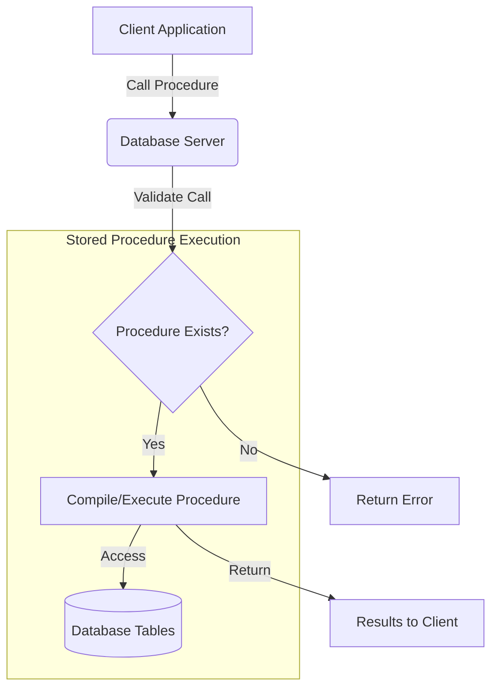

# SQL Creating Procedures

## Introduction

Stored procedures are a powerful feature in SQL databases that allow you to save and reuse blocks of SQL code. Think of them as functions or methods in traditional programming languages - they can accept parameters, perform operations, and return results. In this tutorial, we'll learn how to create stored procedures, understand their benefits, and see practical examples of how they can improve your database applications.

## What are Stored Procedures?

A stored procedure is a prepared SQL code that you can save and reuse. Once created, it's stored in the database and can be called by its name. Here's why stored procedures are essential:

- **Performance**: Procedures are precompiled, making them execute faster
- **Security**: Can control user access to underlying tables
- **Maintainability**: Centralize your SQL logic in one place
- **Reduced network traffic**: Only the procedure call is sent over the network, not all the SQL code

## Basic Syntax for Creating Procedures

The general syntax for creating a stored procedure varies slightly between database systems, but the concept remains similar. Let's look at the syntax for the most popular database systems:

### SQL Server Syntax

```sql
CREATE PROCEDURE procedure_name
    [ @parameter_name data_type [ = default ] [ OUT | OUTPUT ] ] 
    [ ,...n ]
AS
BEGIN
    -- SQL statements
END;
```

### MySQL Syntax

```sql
CREATE PROCEDURE procedure_name
    ([ parameter_mode ] [ parameter_name data_type ] [,...n])
BEGIN
    -- SQL statements
END;
```

### Oracle Syntax

```sql
CREATE [OR REPLACE] PROCEDURE procedure_name
    [( parameter_name [IN | OUT | IN OUT] data_type [, ...] )]
AS
BEGIN
    -- SQL statements
END;
```

Let's look at each part:

- **CREATE PROCEDURE**: This statement creates a new stored procedure
- **procedure_name**: A unique name for your procedure
- **parameters**: Input and output parameters that can be passed to the procedure
- **SQL statements**: The code that will be executed when the procedure is called

## Creating Your First Stored Procedure

Let's start with a simple example. Imagine we have a database with a `customers` table and we want to create a procedure to retrieve all customers from a specific country.

### Example 1: Basic Procedure Without Parameters

```sql
-- SQL Server syntax
CREATE PROCEDURE GetAllCustomers
AS
BEGIN
    SELECT * FROM customers;
END;
```

To call this procedure:

```sql
EXEC GetAllCustomers;
```

Output example:
```
customer_id  name            email                   country
-----------  --------------  ----------------------  -------
1            John Smith      john@example.com        USA
2            Maria Garcia    maria@example.com       Mexico
3            Liu Wei         liu@example.com         China
4            Anna Schmidt    anna@example.com        Germany
```

### Example 2: Procedure with Input Parameters

Let's modify our procedure to filter customers by country:

```sql
-- SQL Server syntax
CREATE PROCEDURE GetCustomersByCountry
    @CountryName VARCHAR(100)
AS
BEGIN
    SELECT * FROM customers
    WHERE country = @CountryName;
END;
```

To call this procedure with a parameter:

```sql
EXEC GetCustomersByCountry @CountryName = 'USA';
```

Output example:
```
customer_id  name            email                   country
-----------  --------------  ----------------------  -------
1            John Smith      john@example.com        USA
5            Sarah Johnson   sarah@example.com       USA
9            Michael Brown   michael@example.com     USA
```

### Example 3: Procedure with Output Parameters

Now, let's create a procedure that returns the total number of customers as an output parameter:

```sql
-- SQL Server syntax
CREATE PROCEDURE GetCustomerCount
    @TotalCustomers INT OUTPUT
AS
BEGIN
    SELECT @TotalCustomers = COUNT(*)
    FROM customers;
END;
```

To call this procedure with an output parameter:

```sql
DECLARE @CustomerCount INT;
EXEC GetCustomerCount @TotalCustomers = @CustomerCount OUTPUT;
SELECT @CustomerCount AS 'Total Customers';
```

Output example:
```
Total Customers
---------------
15
```

## Using Control Flow in Stored Procedures

You can use control flow statements like IF-ELSE, WHILE, and others within your procedures to make them more powerful:

### Example 4: Procedure with IF-ELSE Logic

```sql
-- SQL Server syntax
CREATE PROCEDURE UpdateCustomerStatus
    @CustomerId INT,
    @PurchaseAmount DECIMAL(10,2)
AS
BEGIN
    IF @PurchaseAmount > 1000
    BEGIN
        UPDATE customers
        SET status = 'Premium'
        WHERE customer_id = @CustomerId;
    END
    ELSE
    BEGIN
        UPDATE customers
        SET status = 'Regular'
        WHERE customer_id = @CustomerId;
    END
END;
```

To call this procedure:

```sql
EXEC UpdateCustomerStatus @CustomerId = 1, @PurchaseAmount = 1500;
```

## Modifying and Deleting Stored Procedures

### To Modify a Procedure

You can use the ALTER statement to modify an existing procedure:

```sql
-- SQL Server syntax
ALTER PROCEDURE GetCustomersByCountry
    @CountryName VARCHAR(100),
    @Status VARCHAR(50) = NULL  -- Adding new optional parameter
AS
BEGIN
    SELECT * FROM customers
    WHERE country = @CountryName
    AND (@Status IS NULL OR status = @Status);
END;
```

### To Delete a Procedure

You can use the DROP statement to delete a procedure:

```sql
-- SQL Server syntax
DROP PROCEDURE GetCustomersByCountry;
```

## Error Handling in Stored Procedures

Proper error handling is crucial for robust procedures. Here's how to implement it:

### Example 5: Procedure with Error Handling

```sql
-- SQL Server syntax
CREATE PROCEDURE InsertNewCustomer
    @Name VARCHAR(100),
    @Email VARCHAR(100),
    @Country VARCHAR(100)
AS
BEGIN
    BEGIN TRY
        BEGIN TRANSACTION;
            
            -- Check if email already exists
            IF EXISTS (SELECT 1 FROM customers WHERE email = @Email)
            BEGIN
                THROW 50001, 'Email already exists', 1;
            END
            
            -- Insert new customer
            INSERT INTO customers (name, email, country)
            VALUES (@Name, @Email, @Country);
            
        COMMIT TRANSACTION;
    END TRY
    BEGIN CATCH
        ROLLBACK TRANSACTION;
        
        DECLARE @ErrorMessage NVARCHAR(4000) = ERROR_MESSAGE();
        DECLARE @ErrorSeverity INT = ERROR_SEVERITY();
        DECLARE @ErrorState INT = ERROR_STATE();
        
        RAISERROR (@ErrorMessage, @ErrorSeverity, @ErrorState);
    END CATCH
END;
```

## Real-World Applications

Stored procedures are frequently used in business applications. Let's look at some practical examples:

### Example 6: Order Processing Procedure

This procedure handles the complete order processing flow:

```sql
CREATE PROCEDURE ProcessNewOrder
    @CustomerId INT,
    @OrderDate DATE,
    @TotalAmount DECIMAL(10,2),
    @NewOrderId INT OUTPUT
AS
BEGIN
    BEGIN TRY
        BEGIN TRANSACTION;
            
            -- Insert order header
            INSERT INTO orders (customer_id, order_date, total_amount, status)
            VALUES (@CustomerId, @OrderDate, @TotalAmount, 'Pending');
            
            -- Get the new order ID
            SET @NewOrderId = SCOPE_IDENTITY();
            
            -- Update customer's total purchases
            UPDATE customers
            SET total_purchases = total_purchases + @TotalAmount
            WHERE customer_id = @CustomerId;
            
            -- If order amount is large, create a follow-up task
            IF @TotalAmount > 5000
            BEGIN
                INSERT INTO follow_up_tasks (order_id, task_type, description, due_date)
                VALUES (@NewOrderId, 'High Value Order', 'Contact customer for feedback', DATEADD(day, 7, @OrderDate));
            END
            
        COMMIT TRANSACTION;
    END TRY
    BEGIN CATCH
        ROLLBACK TRANSACTION;
        THROW;
    END CATCH
END;
```

### Example 7: Data Analysis Procedure

This procedure generates a sales report:

```sql
CREATE PROCEDURE GenerateMonthlySalesReport
    @Year INT,
    @Month INT
AS
BEGIN
    -- Calculate month start and end dates
    DECLARE @StartDate DATE = DATEFROMPARTS(@Year, @Month, 1);
    DECLARE @EndDate DATE = DATEADD(DAY, -1, DATEADD(MONTH, 1, @StartDate));
    
    -- Generate sales summary
    SELECT 
        p.category,
        SUM(oi.quantity) AS total_units_sold,
        SUM(oi.quantity * oi.unit_price) AS total_sales
    FROM orders o
    JOIN order_items oi ON o.order_id = oi.order_id
    JOIN products p ON oi.product_id = p.product_id
    WHERE o.order_date BETWEEN @StartDate AND @EndDate
    GROUP BY p.category
    ORDER BY total_sales DESC;
    
    -- Generate top customer report
    SELECT TOP 5
        c.customer_id,
        c.name,
        SUM(o.total_amount) AS total_spend
    FROM orders o
    JOIN customers c ON o.customer_id = c.customer_id
    WHERE o.order_date BETWEEN @StartDate AND @EndDate
    GROUP BY c.customer_id, c.name
    ORDER BY total_spend DESC;
END;
```

## Process Flow Diagram

Here's a visual representation of how stored procedures work within a database system:



## Best Practices for Stored Procedures

1. **Use meaningful names**: Name your procedures according to what they do (e.g., `GetCustomersByCountry` not `proc1`)
2. **Document your code**: Add comments to explain the purpose and logic of your procedures
3. **Handle errors properly**: Always include error handling in your procedures
4. **Limit procedure size**: Keep procedures focused on specific tasks; if a procedure gets too large, consider breaking it down
5. **Use parameters effectively**: Use input parameters to make procedures flexible and output parameters when needed
6. **Avoid cursors when possible**: Set-based operations are typically more efficient than cursor-based row-by-row processing
7. **Test thoroughly**: Test your procedures with various inputs, including edge cases
8. **Consider performance**: Use execution plans to analyze and optimize procedure performance

## Security Considerations

Stored procedures can enhance security by:

1. **Limiting direct table access**: Users can be granted access to procedures without direct table access
2. **Input validation**: Validating inputs within procedures helps prevent SQL injection
3. **Role-based execution**: You can control who can execute specific procedures

Example of granting execution permission:

```sql
-- SQL Server syntax
GRANT EXECUTE ON GetCustomersByCountry TO SalesRole;
```

## Summary

Stored procedures are a powerful way to encapsulate and reuse SQL code in your database applications. They offer numerous benefits including improved performance, enhanced security, and better maintainability. In this tutorial, we've covered:

- How to create basic stored procedures
- Working with input and output parameters
- Using control flow statements within procedures
- Modifying and deleting procedures
- Error handling best practices
- Real-world applications and examples

By mastering stored procedures, you'll be able to build more efficient, secure, and maintainable database applications.

## Exercises

To reinforce your learning, try these exercises:

1. Create a stored procedure that retrieves all products below a specified price point
2. Modify the procedure to also filter by category (as an optional parameter)
3. Create a procedure that inserts a new employee record and assigns them to a department
4. Create a reporting procedure that shows monthly sales totals by product category
5. Implement proper error handling in all your procedures

## Additional Resources

- [Microsoft SQL Server Stored Procedures Documentation](https://learn.microsoft.com/en-us/sql/relational-databases/stored-procedures/create-a-stored-procedure)
- [MySQL Stored Procedures](https://dev.mysql.com/doc/refman/8.0/en/stored-procedures.html)
- [Oracle PL/SQL Procedures](https://docs.oracle.com/en/database/oracle/oracle-database/19/lnpls/plsql-subprograms.html)
- [PostgreSQL Stored Procedures](https://www.postgresql.org/docs/current/sql-createprocedure.html)