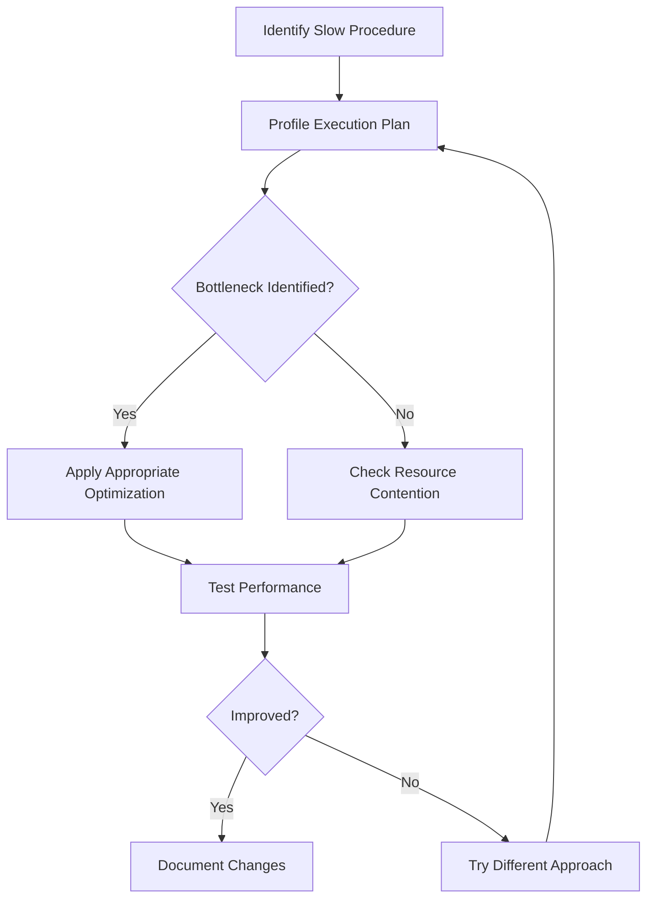

# SQL Procedure Optimization

## Introduction

Stored procedures are powerful database objects that encapsulate SQL logic for reuse and improved security. However, as your database grows and procedures become more complex, performance can suffer. This guide explores essential optimization techniques that will help you write more efficient stored procedures, reducing execution time and resource consumption.

Whether you're maintaining legacy code or developing new procedures, these optimization strategies will help you create faster, more scalable database solutions.

## Why Optimize Stored Procedures?

Before diving into specific techniques, let's understand why optimization matters:

1. **Improved Response Time**: Optimized procedures execute faster, leading to better application performance.
2. **Reduced Server Load**: Efficient procedures consume fewer CPU and memory resources.
3. **Better Scalability**: Optimized code handles larger data volumes without significant performance degradation.
4. **Lower Costs**: For cloud databases, optimized procedures can reduce billing costs by consuming fewer resources.

## Basic Optimization Techniques

### 1. Use Appropriate Indexing

Proper indexing is fundamental to stored procedure performance.

```sql
-- Without index (slow)
CREATE PROCEDURE GetUserOrders_Slow (@UserId INT)
AS
BEGIN
    SELECT o.OrderId, o.OrderDate, o.TotalAmount
    FROM Orders o
    WHERE o.UserId = @UserId
END

-- After adding index (much faster)
CREATE INDEX IX_Orders_UserId ON Orders(UserId)

CREATE PROCEDURE GetUserOrders_Fast (@UserId INT)
AS
BEGIN
    SELECT o.OrderId, o.OrderDate, o.TotalAmount
    FROM Orders o
    WHERE o.UserId = @UserId
END
```

**Input**: Call `GetUserOrders_Fast(42)` instead of `GetUserOrders_Slow(42)`

**Output**: Same result set, but potentially 10-100x faster execution for large tables

### 2. Avoid SELECT *

Always specify only the columns you need instead of using `SELECT *`.

```sql
-- Inefficient
CREATE PROCEDURE GetProductInfo_Inefficient (@ProductId INT)
AS
BEGIN
    SELECT * FROM Products WHERE ProductId = @ProductId
END

-- Optimized
CREATE PROCEDURE GetProductInfo_Optimized (@ProductId INT)
AS
BEGIN
    SELECT ProductId, ProductName, Price, Category
    FROM Products 
    WHERE ProductId = @ProductId
END
```

This reduces I/O operations and network traffic, especially for tables with many columns or BLOB data.

### 3. Use Table Variables Judiciously

For small result sets, table variables can be more efficient than temporary tables.

```sql
CREATE PROCEDURE ProcessRecentOrders
AS
BEGIN
    -- For small datasets (generally <1000 rows)
    DECLARE @RecentOrders TABLE (
        OrderId INT,
        OrderDate DATETIME,
        CustomerId INT
    )
    
    INSERT INTO @RecentOrders
    SELECT OrderId, OrderDate, CustomerId
    FROM Orders
    WHERE OrderDate > DATEADD(day, -7, GETDATE())
    
    -- Process the orders...
END
```

For larger datasets, consider using temporary tables with indexes.

## Intermediate Optimization Techniques

### 1. Schema Binding

Use SCHEMABINDING to prevent underlying table changes that could break your procedure:

```sql
CREATE PROCEDURE GetTotalSales_Optimized
WITH SCHEMABINDING
AS
BEGIN
    SELECT SUM(TotalAmount) AS TotalSales
    FROM dbo.Orders
    WHERE OrderStatus = 'Completed'
END
```

This not only prevents schema changes but can sometimes improve performance by allowing better query plan caching.

### 2. Optimize Joins

Choose the appropriate join type and join order:

```sql
-- Less efficient join order
CREATE PROCEDURE GetOrderDetails_Inefficient (@OrderDate DATE)
AS
BEGIN
    SELECT c.CustomerName, p.ProductName, o.Quantity
    FROM Orders o
    JOIN Customers c ON o.CustomerId = c.CustomerId
    JOIN OrderDetails od ON o.OrderId = od.OrderId
    JOIN Products p ON od.ProductId = p.ProductId
    WHERE o.OrderDate = @OrderDate
END

-- More efficient (assuming Orders is filtered to fewer rows first)
CREATE PROCEDURE GetOrderDetails_Optimized (@OrderDate DATE)
AS
BEGIN
    SELECT c.CustomerName, p.ProductName, od.Quantity
    FROM Orders o
    JOIN OrderDetails od ON o.OrderId = od.OrderId
    JOIN Products p ON od.ProductId = p.ProductId
    JOIN Customers c ON o.CustomerId = c.CustomerId
    WHERE o.OrderDate = @OrderDate
END
```

A good rule of thumb is to filter early and join from the smallest result set to the largest.

### 3. Use SET NOCOUNT ON

This suppresses the messages showing the count of affected rows, reducing network traffic:

```sql
CREATE PROCEDURE InsertNewOrder (@CustomerId INT, @OrderTotal DECIMAL(10,2))
AS
BEGIN
    SET NOCOUNT ON
    
    INSERT INTO Orders (CustomerId, OrderDate, TotalAmount)
    VALUES (@CustomerId, GETDATE(), @OrderTotal)
    
    RETURN SCOPE_IDENTITY()
END
```

## Advanced Optimization Techniques

### 1. Query Plan Reuse

Use parameterized queries to promote plan reuse:

```sql
-- Poor: Different execution plans for each literal value
CREATE PROCEDURE FindProducts_Inefficient
AS
BEGIN
    -- This forces a new execution plan for each different product name
    DECLARE @ProductName VARCHAR(50) = 'Laptop'
    EXEC('SELECT * FROM Products WHERE ProductName LIKE ''%' + @ProductName + '%''')
END

-- Better: Allows plan reuse
CREATE PROCEDURE FindProducts_Optimized (@SearchTerm VARCHAR(50))
AS
BEGIN
    -- This allows SQL Server to reuse the execution plan
    SELECT * FROM Products WHERE ProductName LIKE '%' + @SearchTerm + '%'
END
```

### 2. Use Table-Valued Parameters for Batch Operations

Instead of looping through many inserts, use TVPs for batch operations:

```sql
-- First, create a table type
CREATE TYPE OrderItemTableType AS TABLE (
    ProductId INT,
    Quantity INT,
    UnitPrice DECIMAL(10,2)
)
GO

-- Then use it in your procedure
CREATE PROCEDURE CreateOrderWithItems
    @CustomerId INT,
    @OrderItems OrderItemTableType READONLY
AS
BEGIN
    -- Create the order
    DECLARE @OrderId INT
    
    INSERT INTO Orders (CustomerId, OrderDate)
    VALUES (@CustomerId, GETDATE())
    
    SET @OrderId = SCOPE_IDENTITY()
    
    -- Insert all items in a single operation
    INSERT INTO OrderDetails (OrderId, ProductId, Quantity, UnitPrice)
    SELECT @OrderId, ProductId, Quantity, UnitPrice
    FROM @OrderItems
    
    RETURN @OrderId
END
```

Example usage from application code:
```csharp
// C# example
SqlParameter tvpParam = new SqlParameter("@OrderItems", SqlDbType.Structured);
tvpParam.Value = orderItemsDataTable;
tvpParam.TypeName = "OrderItemTableType";
```

### 3. Minimize Transaction Duration

Keep transactions as short as possible:

```sql
CREATE PROCEDURE ProcessOrder_Optimized (@OrderId INT)
AS
BEGIN
    -- Do all preparation work outside the transaction
    DECLARE @OrderTotal DECIMAL(10,2)
    SELECT @OrderTotal = SUM(Quantity * UnitPrice)
    FROM OrderDetails
    WHERE OrderId = @OrderId
    
    -- Keep the transaction as short as possible
    BEGIN TRANSACTION
        UPDATE Orders
        SET TotalAmount = @OrderTotal, Status = 'Processed'
        WHERE OrderId = @OrderId
        
        -- Critical atomic operations only in the transaction
        UPDATE Inventory
        SET StockLevel = StockLevel - (
            SELECT Quantity 
            FROM OrderDetails 
            WHERE OrderId = @OrderId AND ProductId = Inventory.ProductId
        )
        FROM Inventory
        JOIN OrderDetails od ON Inventory.ProductId = od.ProductId
        WHERE od.OrderId = @OrderId
    COMMIT TRANSACTION
END
```

## Performance Monitoring and Tuning

### Using Execution Plans

Learn to analyze execution plans to identify bottlenecks:

```sql
-- View the execution plan for a procedure
SET STATISTICS PROFILE ON
EXEC GetUserOrders 123
SET STATISTICS PROFILE OFF
```

Alternatively, in SQL Server Management Studio, you can enable "Include Actual Execution Plan" (Ctrl+M) before executing your procedure.

### Visualizing Stored Procedure Performance

You can use the following diagram to understand the optimization process:



## Real-World Example: Order Processing System

Let's optimize a complete order processing procedure:

```sql
-- Original version with several issues
CREATE PROCEDURE ProcessOrdersOriginal
AS
BEGIN
    -- Inefficient SELECT *
    SELECT * INTO #AllOrders FROM Orders WHERE Status = 'Pending'
    
    -- No indexing on temp table
    -- Cursor-based processing (slow)
    DECLARE @OrderId INT
    DECLARE OrderCursor CURSOR FOR SELECT OrderId FROM #AllOrders
    
    OPEN OrderCursor
    FETCH NEXT FROM OrderCursor INTO @OrderId
    
    WHILE @@FETCH_STATUS = 0
    BEGIN
        -- Repeated queries inside loop
        UPDATE OrderDetails SET Processed = 1 
        WHERE OrderId = @OrderId
        
        UPDATE Orders SET Status = 'Processed', ProcessedDate = GETDATE() 
        WHERE OrderId = @OrderId
        
        FETCH NEXT FROM OrderCursor INTO @OrderId
    END
    
    CLOSE OrderCursor
    DEALLOCATE OrderCursor
    
    DROP TABLE #AllOrders
END

-- Optimized version
CREATE PROCEDURE ProcessOrdersOptimized
AS
BEGIN
    SET NOCOUNT ON
    
    -- Create indexed temp table with only needed columns
    CREATE TABLE #PendingOrders (
        OrderId INT PRIMARY KEY,
        CustomerId INT
    )
    
    INSERT INTO #PendingOrders (OrderId, CustomerId)
    SELECT OrderId, CustomerId 
    FROM Orders WITH (NOLOCK)
    WHERE Status = 'Pending'
    
    -- Batch update OrderDetails
    UPDATE od
    SET od.Processed = 1
    FROM OrderDetails od
    JOIN #PendingOrders po ON od.OrderId = po.OrderId
    
    -- Batch update Orders
    UPDATE o
    SET o.Status = 'Processed', o.ProcessedDate = GETDATE()
    FROM Orders o
    JOIN #PendingOrders po ON o.OrderId = po.OrderId
    
    -- Notify customers (example of additional processing)
    INSERT INTO Notifications (CustomerId, Message, CreatedDate)
    SELECT CustomerId, 'Your order has been processed', GETDATE()
    FROM #PendingOrders
    
    -- Cleanup
    DROP TABLE #PendingOrders
END
```

The optimized version:
1. Uses only required columns
2. Creates a proper index on the temp table
3. Replaces cursor with set-based operations
4. Uses WITH (NOLOCK) for read operations (where appropriate)
5. Processes everything in batches

## Common Pitfalls to Avoid

1. **Scalar Functions in WHERE Clauses**: These prevent index usage.
2. **Implicit Conversions**: Ensure data types match to avoid conversions.
3. **Parameter Sniffing Issues**: Use local variables or query hints when necessary.
4. **Over-Indexing**: Too many indexes slow down writes.
5. **Outdated Statistics**: Make sure statistics are regularly updated.

## Summary

Optimizing SQL stored procedures is both an art and a science. The key principles to remember are:

1. **Use appropriate indexes** based on your query patterns
2. **Fetch only the data you need** by avoiding SELECT *
3. **Prefer set-based operations** over cursors and loops
4. **Keep transactions short** and focused
5. **Monitor and analyze** execution plans to identify bottlenecks
6. **Test performance** with realistic data volumes

By applying these optimization techniques, your stored procedures will be faster, more efficient, and better able to handle increasing workloads as your application grows.

## Exercises

1. Take an existing stored procedure from your codebase and identify at least three optimization opportunities.
2. Create a test procedure that demonstrates the performance difference between a cursor-based approach and a set-based approach.
3. Use the SQL Server Profiler to capture the execution of a slow procedure, then analyze its execution plan to find bottlenecks.

## Additional Resources

- [SQL Server Execution Plans](https://learn.microsoft.com/en-us/sql/relational-databases/performance/execution-plans)
- [SQL Server Query Tuning](https://learn.microsoft.com/en-us/sql/relational-databases/performance/query-processing-architecture-guide)
- [Index Design Fundamentals](https://learn.microsoft.com/en-us/sql/relational-databases/indexes/clustered-and-nonclustered-indexes-described)
- [Parameter Sniffing in SQL Server](https://www.sqlshack.com/query-optimization-techniques-in-sql-server-parameter-sniffing/)