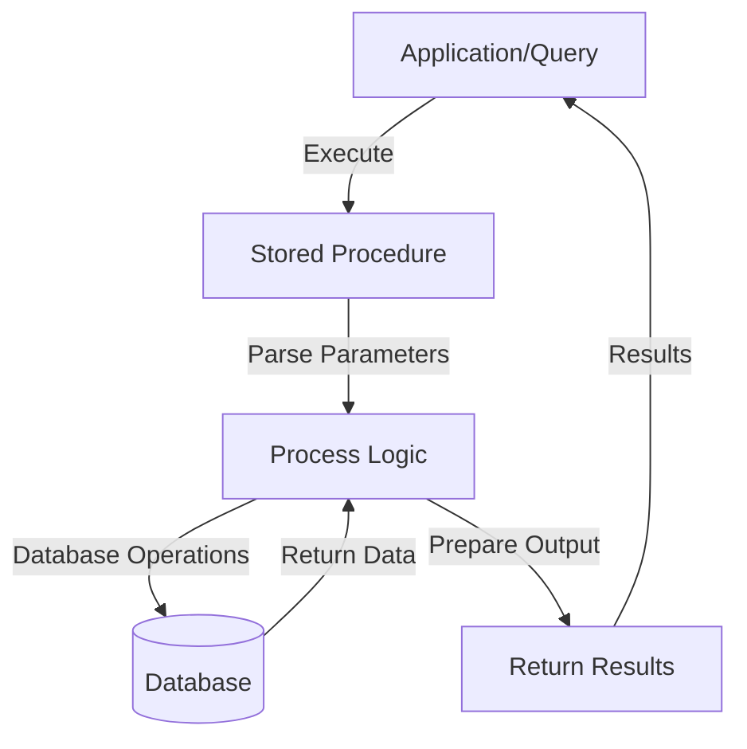

# SQL Executing Procedures

## Introduction

Stored procedures are precompiled collections of SQL statements saved in a database. Once created, these procedures can be executed to perform specific tasks. Executing stored procedures is a fundamental skill for database programmers as it allows you to run complex operations with minimal code, improving both efficiency and maintainability.

In this guide, we'll explore how to execute stored procedures in SQL, covering different execution methods, parameter handling, and practical applications. Whether you're calling simple procedures or working with complex parameter types, this tutorial will help you master procedure execution in SQL.

## Basic Execution of Stored Procedures

### Simple EXECUTE Command

The most straightforward way to execute a stored procedure is using the `EXECUTE` (or `EXEC`) command.

```sql
-- Basic syntax
EXECUTE procedure_name;

-- Or the shortened version
EXEC procedure_name;
```

#### Example

Let's say we have a simple procedure that returns all employees:

```sql
-- First, create a sample procedure
CREATE PROCEDURE GetAllEmployees
AS
BEGIN
    SELECT * FROM Employees;
END;

-- Now execute the procedure
EXEC GetAllEmployees;
```

**Output:**
```
EmployeeID | FirstName | LastName  | Department | Salary
---------------------------------------------------------
1          | John      | Smith     | IT         | 65000
2          | Sarah     | Johnson   | HR         | 55000
3          | Michael   | Williams  | Finance    | 70000
...
```

### Executing Procedures in Different Database Systems

The execution syntax varies slightly across different database systems:

**Microsoft SQL Server:**
```sql
EXEC GetAllEmployees;
```

**MySQL:**
```sql
CALL GetAllEmployees();
```

**Oracle:**
```sql
BEGIN
  GetAllEmployees;
END;
```

**PostgreSQL:**
```sql
CALL GetAllEmployees();
```

## Executing Procedures with Parameters

Most stored procedures accept parameters to make them more flexible and reusable.

### Input Parameters

Input parameters allow you to pass values into a stored procedure.

```sql
-- Syntax
EXEC procedure_name @parameter1 = value1, @parameter2 = value2;
```

#### Example: Procedure with Input Parameters

Let's create and execute a procedure that retrieves employees by department:

```sql
-- Create the procedure
CREATE PROCEDURE GetEmployeesByDepartment
    @DepartmentName VARCHAR(50)
AS
BEGIN
    SELECT * FROM Employees
    WHERE Department = @DepartmentName;
END;

-- Execute with parameter
EXEC GetEmployeesByDepartment @DepartmentName = 'IT';
```

**Output:**
```
EmployeeID | FirstName | LastName  | Department | Salary
---------------------------------------------------------
1          | John      | Smith     | IT         | 65000
4          | David     | Brown     | IT         | 68000
7          | Robert    | Lee       | IT         | 72000
...
```

### Different Ways to Pass Parameters

There are several ways to pass parameters to procedures:

**Named Parameters:**
```sql
EXEC GetEmployeesByDepartment @DepartmentName = 'IT';
```

**Positional Parameters:**
```sql
EXEC GetEmployeesByDepartment 'IT';
```

**Using Variables:**
```sql
DECLARE @dept VARCHAR(50) = 'IT';
EXEC GetEmployeesByDepartment @DepartmentName = @dept;
```

### Output Parameters

Output parameters allow procedures to return values back to the calling code.

```sql
-- Syntax for creating a procedure with output parameter
CREATE PROCEDURE procedure_name
    @inputParam datatype,
    @outputParam datatype OUTPUT
AS
BEGIN
    -- SQL statements that set @outputParam
END;

-- Syntax for executing with output parameter
DECLARE @result datatype;
EXEC procedure_name @inputParam = value, @outputParam = @result OUTPUT;
SELECT @result AS Result;
```

#### Example: Procedure with Output Parameter

```sql
-- Create a procedure that counts employees in a department
CREATE PROCEDURE CountEmployeesInDepartment
    @DepartmentName VARCHAR(50),
    @EmployeeCount INT OUTPUT
AS
BEGIN
    SELECT @EmployeeCount = COUNT(*) 
    FROM Employees
    WHERE Department = @DepartmentName;
END;

-- Execute with output parameter
DECLARE @Count INT;
EXEC CountEmployeesInDepartment 
    @DepartmentName = 'IT', 
    @EmployeeCount = @Count OUTPUT;

SELECT @Count AS 'Number of IT Employees';
```

**Output:**
```
Number of IT Employees
---------------------
3
```

## Return Values from Procedures

Procedures can also return status values using the `RETURN` statement.

```sql
-- Create a procedure with return value
CREATE PROCEDURE CheckDepartmentExists
    @DepartmentName VARCHAR(50)
AS
BEGIN
    IF EXISTS (SELECT 1 FROM Departments WHERE DepartmentName = @DepartmentName)
        RETURN 1;  -- Department exists
    ELSE
        RETURN 0;  -- Department doesn't exist
END;

-- Execute and capture return value
DECLARE @ReturnValue INT;
EXEC @ReturnValue = CheckDepartmentExists @DepartmentName = 'IT';

IF @ReturnValue = 1
    PRINT 'Department exists!';
ELSE
    PRINT 'Department does not exist!';
```

## Executing Procedures with Table-Valued Parameters

Some databases (like SQL Server) support table-valued parameters, which allow you to pass an entire table as a parameter.

```sql
-- First, create a table type
CREATE TYPE EmployeeTableType AS TABLE
(
    FirstName VARCHAR(50),
    LastName VARCHAR(50),
    Department VARCHAR(50)
);

-- Create a procedure that accepts a table parameter
CREATE PROCEDURE InsertEmployees
    @EmployeeTable EmployeeTableType READONLY
AS
BEGIN
    INSERT INTO Employees (FirstName, LastName, Department)
    SELECT FirstName, LastName, Department
    FROM @EmployeeTable;
END;

-- Execute with a table parameter
DECLARE @NewEmployees EmployeeTableType;

-- Insert values into the table variable
INSERT INTO @NewEmployees (FirstName, LastName, Department)
VALUES ('Jane', 'Doe', 'Marketing'),
       ('John', 'Doe', 'Sales');

-- Execute the procedure
EXEC InsertEmployees @EmployeeTable = @NewEmployees;
```

## Executing Procedures Dynamically

Sometimes you need to execute procedures dynamically based on runtime conditions.

```sql
-- Dynamic execution
DECLARE @ProcName VARCHAR(100) = 'GetEmployeesByDepartment';
DECLARE @ParmDefinition NVARCHAR(500) = '@DeptName VARCHAR(50)';
DECLARE @DeptName VARCHAR(50) = 'IT';

EXEC sp_executesql 
    N'EXEC @ProcName @DepartmentName = @DeptName',
    @ParmDefinition,
    @DeptName = @DeptName;
```

## Error Handling When Executing Procedures

It's important to handle errors when executing stored procedures:

```sql
BEGIN TRY
    EXEC GetEmployeesByDepartment @DepartmentName = 'IT';
    PRINT 'Procedure executed successfully.';
END TRY
BEGIN CATCH
    PRINT 'Error executing procedure:';
    PRINT ERROR_MESSAGE();
END CATCH;
```

## Nested Procedure Execution

Stored procedures can call other stored procedures:

```sql
CREATE PROCEDURE ProcessDepartment
    @DepartmentName VARCHAR(50)
AS
BEGIN
    -- Get employees in the department
    EXEC GetEmployeesByDepartment @DepartmentName = @DepartmentName;
    
    -- Count employees in the department
    DECLARE @Count INT;
    EXEC CountEmployeesInDepartment 
        @DepartmentName = @DepartmentName, 
        @EmployeeCount = @Count OUTPUT;
    
    PRINT 'Total employees in ' + @DepartmentName + ': ' + CAST(@Count AS VARCHAR);
END;

-- Execute the procedure
EXEC ProcessDepartment @DepartmentName = 'IT';
```

## Procedure Execution Workflow

The following diagram illustrates the typical workflow when executing a stored procedure:



## Practical Applications

### Application 1: Reporting System

A common use case for stored procedures is generating reports:

```sql
CREATE PROCEDURE GenerateMonthlySalesReport
    @Month INT,
    @Year INT
AS
BEGIN
    SELECT 
        p.ProductName,
        c.CategoryName,
        SUM(s.Quantity) AS TotalQuantitySold,
        SUM(s.Quantity * p.UnitPrice) AS TotalRevenue
    FROM 
        Sales s
        JOIN Products p ON s.ProductID = p.ProductID
        JOIN Categories c ON p.CategoryID = c.CategoryID
    WHERE 
        MONTH(s.SaleDate) = @Month AND
        YEAR(s.SaleDate) = @Year
    GROUP BY 
        p.ProductName, c.CategoryName
    ORDER BY 
        TotalRevenue DESC;
END;

-- Execute to generate a report
EXEC GenerateMonthlySalesReport @Month = 3, @Year = 2024;
```

### Application 2: Data Migration

Stored procedures are excellent for data migration tasks:

```sql
CREATE PROCEDURE MigrateCustomerData
    @BatchSize INT = 1000
AS
BEGIN
    DECLARE @ProcessedCount INT = 0;
    
    WHILE EXISTS (SELECT 1 FROM OldCustomers WHERE Migrated = 0)
    BEGIN
        BEGIN TRANSACTION;
        
        WITH CustomersToMigrate AS (
            SELECT TOP (@BatchSize) *
            FROM OldCustomers
            WHERE Migrated = 0
        )
        
        INSERT INTO NewCustomers (CustomerID, Name, Email, Address)
        SELECT CustomerID, Name, Email, Address
        FROM CustomersToMigrate;
        
        UPDATE OldCustomers
        SET Migrated = 1
        WHERE CustomerID IN (SELECT CustomerID FROM CustomersToMigrate);
        
        SET @ProcessedCount = @ProcessedCount + @@ROWCOUNT;
        
        COMMIT TRANSACTION;
        
        PRINT 'Migrated ' + CAST(@ProcessedCount AS VARCHAR) + ' customers so far.';
    END;
    
    PRINT 'Migration complete. Total customers migrated: ' + CAST(@ProcessedCount AS VARCHAR);
END;

-- Execute the migration
EXEC MigrateCustomerData @BatchSize = 500;
```

### Application 3: User Management System

Procedures can handle complex business logic like user management:

```sql
CREATE PROCEDURE CreateNewUser
    @Username VARCHAR(50),
    @Email VARCHAR(100),
    @Password VARCHAR(100),
    @UserID INT OUTPUT
AS
BEGIN
    -- Check if user already exists
    IF EXISTS (SELECT 1 FROM Users WHERE Username = @Username OR Email = @Email)
    BEGIN
        SET @UserID = -1;  -- Error code for duplicate user
        RETURN -1;
    END
    
    -- Hash the password (simplified example - use proper hashing in real applications)
    DECLARE @HashedPassword VARCHAR(100) = HASHBYTES('SHA2_256', @Password);
    
    -- Insert the new user
    INSERT INTO Users (Username, Email, PasswordHash, CreatedDate)
    VALUES (@Username, @Email, @HashedPassword, GETDATE());
    
    -- Get the new user ID
    SET @UserID = SCOPE_IDENTITY();
    
    -- Create default settings for the user
    INSERT INTO UserSettings (UserID, SettingName, SettingValue)
    VALUES 
        (@UserID, 'NotificationsEnabled', 'true'),
        (@UserID, 'Theme', 'default'),
        (@UserID, 'Language', 'en-US');
    
    RETURN 0;  -- Success
END;

-- Execute to create a new user
DECLARE @NewUserID INT;
DECLARE @ReturnCode INT;

EXEC @ReturnCode = CreateNewUser
    @Username = 'johndoe',
    @Email = 'john.doe@example.com',
    @Password = 'securepassword123',
    @UserID = @NewUserID OUTPUT;

IF @ReturnCode = 0
    PRINT 'User created successfully with ID: ' + CAST(@NewUserID AS VARCHAR);
ELSE
    PRINT 'Failed to create user. Error code: ' + CAST(@ReturnCode AS VARCHAR);
```

## Performance Considerations

When executing stored procedures, keep these performance tips in mind:

1. **Parameter Sniffing**: SQL Server caches execution plans based on the first parameter values. If your data distribution is uneven, consider using local variables within the procedure.

2. **Recompilation**: For procedures that handle varying data volumes, consider using `WITH RECOMPILE` or `OPTION (RECOMPILE)` to generate optimal plans each time.

3. **Large Result Sets**: Be careful with procedures that return large result sets. Consider pagination or filtering.

4. **Nested Procedures**: Excessive nesting can impact performance. Try to minimize nesting depth.

```sql
-- Using OPTION (RECOMPILE) for a procedure that needs optimal plans each time
EXEC GetEmployeesByDepartment @DepartmentName = 'IT' WITH RECOMPILE;
```

## Common Errors and Troubleshooting

| Error | Possible Cause | Solution |
|-------|----------------|----------|
| "Procedure not found" | Procedure doesn't exist or incorrect name | Check spelling and schema |
| "Incorrect parameter count" | Wrong number of parameters provided | Verify procedure definition |
| "Parameter type mismatch" | Passing wrong data type | Convert to correct type |
| "Timeout expired" | Procedure execution taking too long | Optimize procedure or increase timeout |

## Summary

Executing stored procedures is a core skill for SQL developers. In this guide, we've covered:

- Basic execution syntax across different database systems
- Working with input and output parameters
- Handling return values
- Using table-valued parameters
- Dynamic execution
- Error handling
- Practical applications in real-world scenarios

By mastering these techniques, you can effectively leverage the power of stored procedures to build robust, maintainable database applications.

## Additional Resources

1. **Exercises**:
   - Create a procedure that accepts multiple parameters and returns a result set
   - Implement a procedure with output parameters and return values
   - Build a system of nested procedures to handle a complex business process

2. **Further Reading**:
   - [Microsoft SQL Server Documentation on Stored Procedures](https://docs.microsoft.com/en-us/sql/relational-databases/stored-procedures/stored-procedures-database-engine)
   - [MySQL Stored Procedure Documentation](https://dev.mysql.com/doc/refman/8.0/en/stored-routines.html)
   - [Oracle PL/SQL Stored Procedures](https://docs.oracle.com/en/database/oracle/oracle-database/19/lnpls/stored-procedures-and-functions.html)

3. **Advanced Topics**:
   - Temporary stored procedures
   - CLR integration with stored procedures (SQL Server)
   - Security considerations with procedure execution