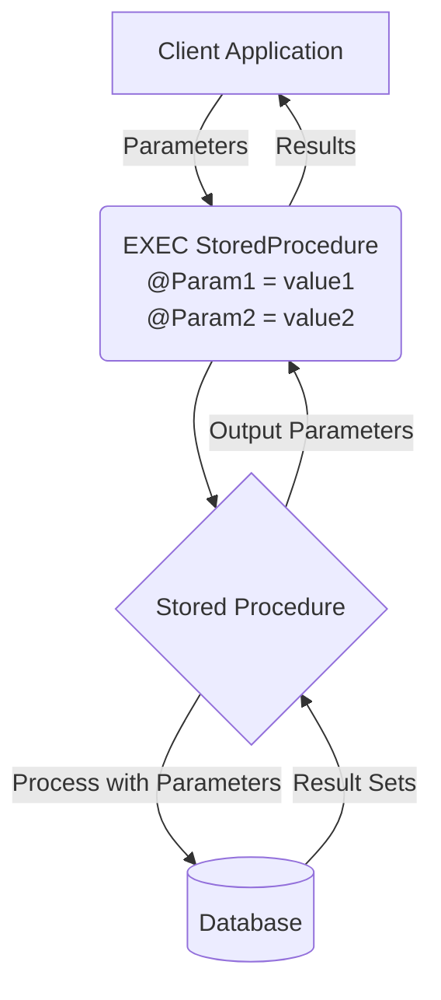

# SQL Parameters

## Introduction

When you're working with SQL stored procedures, one of the most powerful features is the ability to use parameters. Parameters allow your stored procedures to be flexible and reusable by accepting input values that can change each time the procedure runs.

Think of parameters like function arguments in programming languages - they let you pass values into your procedure, making it much more versatile than hardcoded SQL statements. In this guide, we'll explore what SQL parameters are, how to use them, and why they're crucial for writing efficient and secure database code.

## What Are SQL Parameters?

Parameters are variables declared in a stored procedure that allow you to pass values into the procedure when it's executed. Instead of hardcoding specific values in your SQL queries, you can use these parameters as placeholders, making your procedures more dynamic and reusable.

Here's a basic example of how a parameter looks in a stored procedure:

```sql
CREATE PROCEDURE GetEmployeesByDepartment
    @DepartmentName VARCHAR(50)
AS
BEGIN
    SELECT * FROM Employees
    WHERE Department = @DepartmentName
END
```

In this example, `@DepartmentName` is a parameter that will be replaced with an actual value when the procedure is called.

## Types of Parameters

In SQL stored procedures, there are primarily three types of parameters:

1. **Input Parameters**: These accept values passed into the procedure
2. **Output Parameters**: These return values from the procedure
3. **Input/Output Parameters**: These both accept input values and return output values

Let's explore each type with examples.

### Input Parameters

Input parameters are the most common type. They allow you to pass values into your stored procedure.

```sql
-- Creating a procedure with input parameters
CREATE PROCEDURE GetProductsByPriceRange
    @MinPrice DECIMAL(10,2),
    @MaxPrice DECIMAL(10,2)
AS
BEGIN
    SELECT 
        ProductName,
        Price,
        Category
    FROM 
        Products
    WHERE 
        Price >= @MinPrice AND Price <= @MaxPrice
    ORDER BY 
        Price ASC
END

-- Executing the procedure with parameter values
EXEC GetProductsByPriceRange @MinPrice = 10.00, @MaxPrice = 50.00
```

**Output:**
```
ProductName     Price     Category
--------------- --------- ----------
Coffee Mug      12.99     Kitchenware
Notebook        15.50     Stationery
Desk Lamp       29.99     Office
Bluetooth Mouse 45.00     Electronics
```

### Output Parameters

Output parameters allow your procedure to return values to the caller, in addition to any result sets.

```sql
-- Creating a procedure with an output parameter
CREATE PROCEDURE CountProductsInCategory
    @CategoryName VARCHAR(50),
    @ProductCount INT OUTPUT
AS
BEGIN
    SELECT @ProductCount = COUNT(*)
    FROM Products
    WHERE Category = @CategoryName
END

-- Executing the procedure and capturing the output
DECLARE @Result INT
EXEC CountProductsInCategory @CategoryName = 'Electronics', @ProductCount = @Result OUTPUT
SELECT @Result AS 'Number of Electronics Products'
```

**Output:**
```
Number of Electronics Products
-----------------------------
42
```

### Input/Output Parameters

These parameters serve both purposes - they accept an input value and can return a modified value:

```sql
-- Creating a procedure with an input/output parameter
CREATE PROCEDURE ApplyDiscount
    @Price DECIMAL(10,2) OUTPUT,
    @DiscountPercent INT = 10
AS
BEGIN
    SET @Price = @Price - (@Price * @DiscountPercent / 100)
END

-- Executing the procedure
DECLARE @OriginalPrice DECIMAL(10,2) = 100.00
EXEC ApplyDiscount @Price = @OriginalPrice OUTPUT, @DiscountPercent = 15
SELECT @OriginalPrice AS 'Discounted Price'
```

**Output:**
```
Discounted Price
---------------
85.00
```

## Default Parameter Values

SQL stored procedures also support default parameter values, which are used when a parameter is not explicitly provided:

```sql
-- Procedure with default parameter value
CREATE PROCEDURE GetRecentOrders
    @Days INT = 30
AS
BEGIN
    SELECT 
        OrderID,
        CustomerName,
        OrderDate,
        TotalAmount
    FROM 
        Orders
    WHERE 
        OrderDate >= DATEADD(day, -@Days, GETDATE())
    ORDER BY 
        OrderDate DESC
END

-- Calling the procedure without specifying the parameter
EXEC GetRecentOrders

-- Calling the procedure with a specific parameter value
EXEC GetRecentOrders @Days = 7
```

In the first execution, the procedure will use the default value of 30 days, while the second execution will use the specified value of 7 days.

## The Importance of Parameters for Security

One of the most critical reasons to use parameters is to prevent SQL injection attacks. When you use parameters instead of string concatenation to build SQL queries, the database engine treats the parameter values as data, not as executable code.

### Unsafe approach (vulnerable to SQL injection):

```sql
-- DO NOT DO THIS!
CREATE PROCEDURE UnsafeUserSearch
    @Username VARCHAR(50)
AS
BEGIN
    DECLARE @SQLQuery NVARCHAR(500)
    SET @SQLQuery = 'SELECT * FROM Users WHERE Username LIKE ''%' + @Username + '%'''
    EXEC(@SQLQuery)
END
```

### Safe approach (using parameters):

```sql
-- DO THIS INSTEAD
CREATE PROCEDURE SafeUserSearch
    @Username VARCHAR(50)
AS
BEGIN
    SELECT * FROM Users WHERE Username LIKE '%' + @Username + '%'
END
```

In the safe approach, the parameter value is treated as data, and any malicious SQL code injected as part of the parameter will not be executed.

## Practical Examples

Let's look at some real-world examples of how parameters make stored procedures more powerful.

### Example 1: Customer Order History

```sql
CREATE PROCEDURE GetCustomerOrderHistory
    @CustomerID INT,
    @StartDate DATE = NULL,
    @EndDate DATE = NULL
AS
BEGIN
    -- Set default dates if not provided
    SET @StartDate = ISNULL(@StartDate, DATEADD(YEAR, -1, GETDATE()))
    SET @EndDate = ISNULL(@EndDate, GETDATE())
    
    SELECT 
        o.OrderID,
        o.OrderDate,
        o.ShipDate,
        o.TotalAmount,
        COUNT(oi.ProductID) AS ItemCount
    FROM 
        Orders o
    JOIN 
        OrderItems oi ON o.OrderID = oi.OrderID
    WHERE 
        o.CustomerID = @CustomerID
        AND o.OrderDate BETWEEN @StartDate AND @EndDate
    GROUP BY 
        o.OrderID, o.OrderDate, o.ShipDate, o.TotalAmount
    ORDER BY 
        o.OrderDate DESC
END
```

This procedure allows you to look up a customer's order history with flexible date filtering, demonstrating how multiple parameters with default values can make a procedure more versatile.

### Example 2: Product Inventory Management

```sql
CREATE PROCEDURE UpdateProductInventory
    @ProductID INT,
    @QuantityChange INT,
    @LocationID INT,
    @TransactionType CHAR(1),  -- 'R' for Received, 'S' for Sold, 'T' for Transfer
    @Notes VARCHAR(200) = NULL,
    @NewQuantity INT OUTPUT
AS
BEGIN
    -- Validate transaction type
    IF @TransactionType NOT IN ('R', 'S', 'T')
    BEGIN
        RAISERROR('Invalid transaction type. Use R, S, or T.', 16, 1)
        RETURN
    END
    
    -- Update inventory
    UPDATE ProductInventory
    SET Quantity = Quantity + 
        CASE 
            WHEN @TransactionType = 'R' THEN @QuantityChange
            WHEN @TransactionType = 'S' THEN -@QuantityChange
            ELSE 0
        END
    WHERE 
        ProductID = @ProductID
        AND LocationID = @LocationID
    
    -- Log the transaction
    INSERT INTO InventoryTransactions 
        (ProductID, LocationID, QuantityChange, TransactionType, TransactionDate, Notes)
    VALUES
        (@ProductID, @LocationID, @QuantityChange, @TransactionType, GETDATE(), @Notes)
    
    -- Get the new quantity
    SELECT @NewQuantity = Quantity
    FROM ProductInventory
    WHERE 
        ProductID = @ProductID
        AND LocationID = @LocationID
END
```

This example shows a more complex procedure with multiple parameters of different types, including an output parameter to return the updated inventory quantity.

## Visualizing Parameter Flow

Here's a visualization of how parameters work in a stored procedure:



## Summary

SQL parameters are a fundamental feature of stored procedures that provide:

1. **Flexibility**: Make your procedures reusable for different input values
2. **Security**: Protect against SQL injection by properly handling user input
3. **Efficiency**: Improve performance through query plan caching
4. **Maintainability**: Create more readable and modular code

By using parameters effectively, you can write stored procedures that are more robust, secure, and versatile. The ability to pass values into procedures and receive output values makes them powerful tools for database application development.

## Exercises

To practice using SQL parameters, try these exercises:

1. Create a stored procedure that accepts a date range and returns all orders placed during that period
2. Modify an existing query to use parameters instead of hardcoded values
3. Create a procedure with an output parameter that returns the total value of orders for a given customer
4. Build a procedure that uses default parameter values to filter products by category and price range
5. Create a procedure that transfers inventory between locations and uses input/output parameters to verify the transaction

## Additional Resources

- [Microsoft SQL Server Parameter Documentation](https://docs.microsoft.com/en-us/sql/relational-databases/stored-procedures/specify-parameters)
- [MySQL Stored Procedure Parameters](https://dev.mysql.com/doc/refman/8.0/en/stored-programs-defining.html)
- [PostgreSQL Parameter Passing Modes](https://www.postgresql.org/docs/current/sql-createfunction.html)
- [SQL Injection Prevention](https://cheatsheetseries.owasp.org/cheatsheets/SQL_Injection_Prevention_Cheat_Sheet.html)