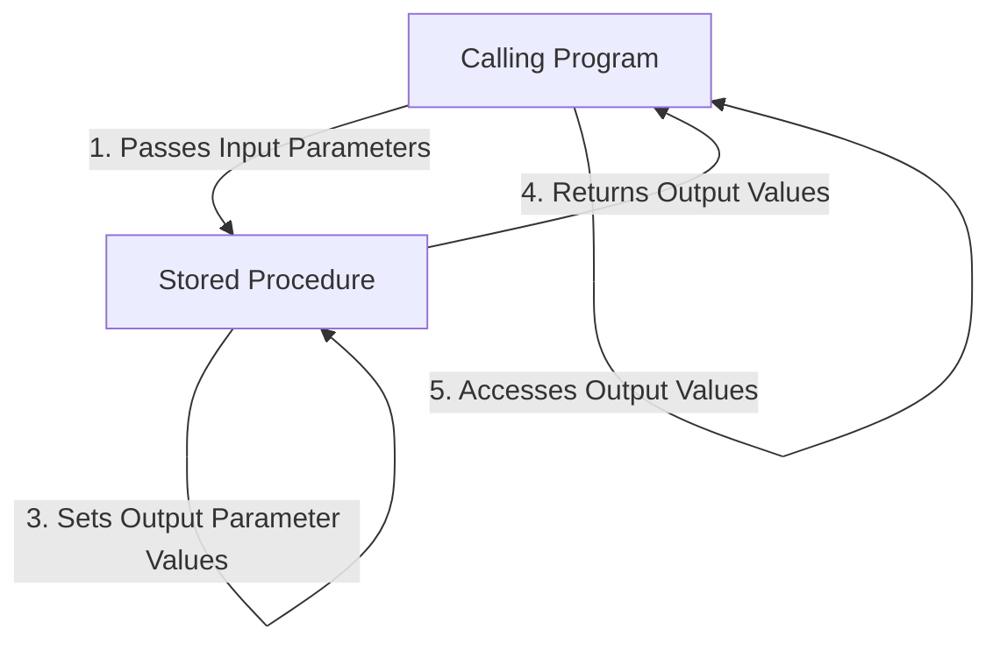

# SQL Output Parameters

## Introduction

When working with SQL stored procedures, you'll often need a way to return values back to the calling program. While stored procedures can return a result set through a `SELECT` statement, there are situations where you need to return specific values or status information. This is where **output parameters** come into play.

Output parameters allow stored procedures to "communicate back" to the calling program by passing values through specially designated parameters. Unlike regular (input) parameters that only send data into a procedure, output parameters can send data back out, making them a powerful tool for creating flexible database interactions.

## Understanding Output Parameters

### What Are Output Parameters?

Output parameters are variables that:

1. Are declared in a stored procedure's parameter list
2. Are specifically marked to allow data to flow back to the caller
3. Can be accessed by the calling application or batch after the procedure executes

Let's compare the different ways stored procedures can return data:

| Method | Use Case | Limitations |
|--------|----------|-------------|
| Result Sets (SELECT) | Returning multiple rows of data | No status information |
| Return Values | Status codes (success/error) | Only one integer value |
| Output Parameters | Multiple single values | More complex to implement |

### When to Use Output Parameters

Output parameters are particularly useful when:

- You need to return multiple single values (not entire tables)
- You want to return status information along with data
- You need to pass back calculated values
- You're working with data that shouldn't be in a result set

## Syntax for Creating Output Parameters

The syntax for declaring output parameters varies slightly between different database systems. Let's look at the most common ones:

### SQL Server Syntax

```sql
CREATE PROCEDURE procedure_name
    @input_param1 datatype,
    @output_param1 datatype OUTPUT,
    @output_param2 datatype OUTPUT
AS
BEGIN
    -- Procedure body
    SET @output_param1 = some_value;
    SET @output_param2 = some_other_value;
END
```

### MySQL Syntax

```sql
CREATE PROCEDURE procedure_name(
    IN input_param1 datatype,
    OUT output_param1 datatype,
    OUT output_param2 datatype
)
BEGIN
    -- Procedure body
    SET output_param1 = some_value;
    SET output_param2 = some_other_value;
END
```

### Oracle PL/SQL Syntax

```sql
CREATE OR REPLACE PROCEDURE procedure_name(
    input_param1 IN datatype,
    output_param1 OUT datatype,
    output_param2 OUT datatype
)
AS
BEGIN
    -- Procedure body
    output_param1 := some_value;
    output_param2 := some_other_value;
END;
```

## Basic Examples

Let's start with a simple example in SQL Server to understand how output parameters work:

### Example 1: Calculating and Returning a Value

```sql
-- Create a procedure that calculates the area of a rectangle
CREATE PROCEDURE CalculateRectangleArea
    @Length DECIMAL(10,2),
    @Width DECIMAL(10,2),
    @Area DECIMAL(10,2) OUTPUT
AS
BEGIN
    SET @Area = @Length * @Width;
END
```

### How to Execute and Retrieve the Output

```sql
-- Declare a variable to hold the output
DECLARE @RectangleArea DECIMAL(10,2);

-- Execute the procedure
EXEC CalculateRectangleArea 
    @Length = 5.0, 
    @Width = 3.0, 
    @Area = @RectangleArea OUTPUT;

-- Display the result
SELECT @RectangleArea AS 'Rectangle Area';
```

**Output:**
```
Rectangle Area
--------------
15.00
```

## Multiple Output Parameters

Stored procedures can have multiple output parameters, which is useful when you need to return several values.

### Example 2: Customer Statistics Procedure

```sql
CREATE PROCEDURE GetCustomerStats
    @CustomerID INT,
    @TotalOrders INT OUTPUT,
    @TotalSpent MONEY OUTPUT,
    @LastOrderDate DATE OUTPUT
AS
BEGIN
    -- Get total number of orders
    SELECT @TotalOrders = COUNT(*)
    FROM Orders
    WHERE CustomerID = @CustomerID;
    
    -- Get total amount spent
    SELECT @TotalSpent = SUM(TotalAmount)
    FROM Orders
    WHERE CustomerID = @CustomerID;
    
    -- Get last order date
    SELECT @LastOrderDate = MAX(OrderDate)
    FROM Orders
    WHERE CustomerID = @CustomerID;
END
```

### Executing with Multiple Outputs

```sql
DECLARE @OrderCount INT;
DECLARE @AmountSpent MONEY;
DECLARE @LastOrder DATE;

EXEC GetCustomerStats
    @CustomerID = 1001,
    @TotalOrders = @OrderCount OUTPUT,
    @TotalSpent = @AmountSpent OUTPUT,
    @LastOrderDate = @LastOrder OUTPUT;

SELECT 
    @OrderCount AS 'Total Orders',
    @AmountSpent AS 'Total Spent',
    @LastOrder AS 'Last Order Date';
```

**Output:**
```
Total Orders    Total Spent    Last Order Date
------------    -----------    ---------------
5               1250.75        2023-09-15
```

## Flow of Data with Output Parameters

Understanding how data flows with output parameters is essential. Let's visualize this process:



## Practical Applications

Output parameters have many practical applications in real-world database programming:

### Example 3: User Registration with Status

This procedure registers a new user and returns status information through output parameters:

```sql
CREATE PROCEDURE RegisterUser
    -- Input parameters
    @Username VARCHAR(50),
    @Email VARCHAR(100),
    @Password VARCHAR(100),
    -- Output parameters
    @UserID INT OUTPUT,
    @Status INT OUTPUT,
    @StatusMessage VARCHAR(100) OUTPUT
AS
BEGIN
    BEGIN TRY
        -- Check if email already exists
        IF EXISTS (SELECT 1 FROM Users WHERE Email = @Email)
        BEGIN
            SET @Status = 0; -- Error
            SET @StatusMessage = 'Email already registered';
            RETURN;
        END
        
        -- Insert new user
        INSERT INTO Users (Username, Email, Password, CreatedDate)
        VALUES (@Username, @Email, @Password, GETDATE());
        
        -- Get the new user ID
        SET @UserID = SCOPE_IDENTITY();
        SET @Status = 1; -- Success
        SET @StatusMessage = 'User registered successfully';
    END TRY
    BEGIN CATCH
        SET @Status = 0; -- Error
        SET @StatusMessage = 'Registration failed: ' + ERROR_MESSAGE();
    END CATCH
END
```

### Example 4: Inventory Management

This procedure updates inventory levels and returns information about the transaction:

```sql
CREATE PROCEDURE UpdateInventory
    -- Input parameters
    @ProductID INT,
    @Quantity INT,
    -- Output parameters
    @NewStockLevel INT OUTPUT,
    @ReorderRequired BIT OUTPUT,
    @TransactionSuccess BIT OUTPUT
AS
BEGIN
    DECLARE @MinStockLevel INT;
    
    BEGIN TRANSACTION;
    
    BEGIN TRY
        -- Update the inventory
        UPDATE Products
        SET StockQuantity = StockQuantity - @Quantity
        WHERE ProductID = @ProductID;
        
        -- Get the new stock level and minimum stock level
        SELECT 
            @NewStockLevel = StockQuantity,
            @MinStockLevel = MinStockLevel
        FROM Products
        WHERE ProductID = @ProductID;
        
        -- Check if reorder is required
        IF @NewStockLevel <= @MinStockLevel
            SET @ReorderRequired = 1;
        ELSE
            SET @ReorderRequired = 0;
            
        SET @TransactionSuccess = 1;
        COMMIT TRANSACTION;
    END TRY
    BEGIN CATCH
        ROLLBACK TRANSACTION;
        SET @TransactionSuccess = 0;
        SET @NewStockLevel = NULL;
        SET @ReorderRequired = NULL;
    END CATCH
END
```

## Output Parameters vs. Other Methods

Let's compare output parameters with other data return methods to understand when to use each approach:

### Comparison

| Feature | Output Parameters | Return Values | Result Sets |
|---------|-------------------|---------------|-------------|
| Number of values | Multiple | Single (int) | Multiple rows |
| Data types | Any SQL data type | Integer only | Any SQL data type |
| Process in loops | Yes | Yes | Requires cursor |
| Client access | Direct variable access | Return code | Result processing |
| Best for | Status + values | Status only | Data sets |

## Best Practices for Output Parameters

To use output parameters effectively:

1. **Name parameters clearly** - Use descriptive names that indicate direction (e.g., `@Out_TotalAmount`)

2. **Provide default values** - Initialize output parameters with default values in case a failure occurs

3. **Document parameter purpose** - Include comments explaining what each parameter returns

4. **Be consistent with data types** - Ensure parameters have appropriate data types for their values

5. **Consider NULL handling** - Determine how your procedure will handle NULL values in output parameters

6. **Test thoroughly** - Verify that output parameters return expected values under various conditions

## Common Gotchas and Solutions

When working with output parameters, be aware of these common issues:

### 1. Forgetting the OUTPUT Keyword

When calling a procedure, you must specify the `OUTPUT` keyword for each output parameter:

```sql
-- INCORRECT ❌
EXEC GetCustomerStats @CustomerID = 1001, @TotalOrders = @OrderCount;

-- CORRECT ✅
EXEC GetCustomerStats @CustomerID = 1001, @TotalOrders = @OrderCount OUTPUT;
```

### 2. Not Declaring Variables

Always declare variables before using them to hold output values:

```sql
-- INCORRECT ❌
EXEC CalculateRectangleArea @Length = 5.0, @Width = 3.0, @Area = @Result OUTPUT;

-- CORRECT ✅
DECLARE @Result DECIMAL(10,2);
EXEC CalculateRectangleArea @Length = 5.0, @Width = 3.0, @Area = @Result OUTPUT;
```

### 3. Data Type Mismatches

Ensure that the variables you use to capture output parameters have the same data types as the parameters defined in the procedure.

## Summary

Output parameters provide a powerful mechanism for stored procedures to return multiple values back to the calling program. They complement other return methods like result sets and return values, giving you more flexibility in your database programming.

Key takeaways:
- Output parameters allow procedures to return multiple values of various data types
- They're declared with the `OUTPUT` (SQL Server) or `OUT` (MySQL, Oracle) keyword
- They're useful for returning status information and calculated values
- They require explicit declaration and handling on both the procedure and caller sides
- They're ideal when you need to return discrete values rather than result sets

## Exercises

To practice working with output parameters, try these exercises:

1. Create a stored procedure called `CalculateCircleProperties` that takes a radius as input and returns the diameter, circumference, and area as output parameters.

2. Write a procedure called `GetEmployeeInfo` that accepts an employee ID and returns the employee's name, department, and years of service through output parameters.

3. Create a `ProcessOrder` procedure that takes an order ID and quantity, updates the appropriate tables, and returns the order total, new inventory level, and a status code as output parameters.

## Additional Resources

- [Microsoft SQL Server Documentation on OUTPUT Parameters](https://docs.microsoft.com/en-us/sql/relational-databases/stored-procedures/specify-parameters)
- [MySQL Documentation on OUT Parameters](https://dev.mysql.com/doc/refman/8.0/en/stored-programs-defining.html)
- [Oracle Documentation on PL/SQL Procedures](https://docs.oracle.com/en/database/oracle/oracle-database/19/lnpls/plsql-subprograms.html)