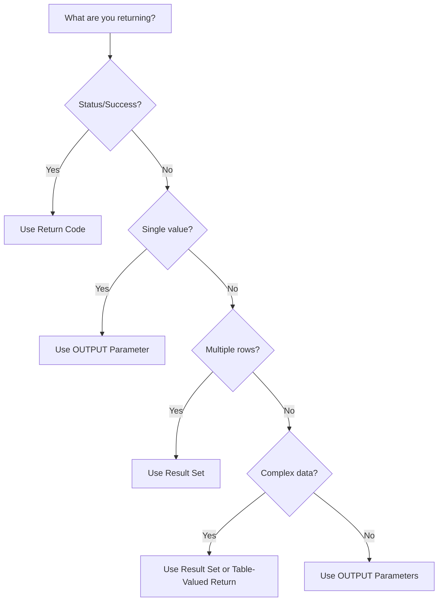

# SQL Return Values

## Introduction

When working with SQL stored procedures, you often need a way to send data back to the calling application or another procedure. SQL provides several mechanisms for returning values from stored procedures, allowing you to communicate results, status codes, or processed data. Understanding these return mechanisms is essential for building effective database applications.

In this tutorial, we'll explore the various ways stored procedures can return values, when to use each method, and how to implement them in your code. By the end, you'll have a solid understanding of how to retrieve and work with data returned from stored procedures.

## Understanding Return Values in Stored Procedures

Stored procedures are precompiled SQL code segments stored in the database that can accept parameters, perform operations, and return data. There are four primary ways a stored procedure can return values:

1. **Return codes/status values** - Integer values indicating success or failure
2. **OUTPUT parameters** - Passing values back through parameters
3. **Result sets** - Tables of data returned via SELECT statements
4. **Table-valued returns** - Returning entire tables (specific to some database systems)

Let's explore each method in detail.

## Return Codes

The simplest form of return value is a status code or return code, typically an integer that indicates whether the procedure executed successfully and, if not, the nature of the failure.

### Syntax and Basic Example

```sql
CREATE PROCEDURE dbo.UpdateCustomerStatus
    @CustomerID INT,
    @NewStatus VARCHAR(20)
AS
BEGIN
    BEGIN TRY
        UPDATE Customers
        SET Status = @NewStatus
        WHERE CustomerID = @CustomerID
        
        -- Check if any rows were affected
        IF @@ROWCOUNT > 0
            RETURN 0  -- Success
        ELSE
            RETURN 1  -- Customer not found
    END TRY
    BEGIN CATCH
        RETURN -1  -- Error occurred
    END CATCH
END
```

### How to Capture Return Codes

To capture a return code in SQL Server:

```sql
DECLARE @ReturnValue INT

EXEC @ReturnValue = dbo.UpdateCustomerStatus 
    @CustomerID = 1001, 
    @NewStatus = 'Active'

SELECT 
    CASE @ReturnValue
        WHEN 0 THEN 'Success'
        WHEN 1 THEN 'Customer not found'
        WHEN -1 THEN 'Error occurred'
        ELSE 'Unknown return value'
    END AS Result
```

### Best Practices for Return Codes

- Use consistent return codes across your application:
  - 0 for success
  - Positive numbers for expected business rule failures
  - Negative numbers for unexpected errors
- Document the meaning of each return code
- Use return codes primarily for status indication, not for returning data values

## OUTPUT Parameters

When you need to return actual data values from a procedure (not just status codes), OUTPUT parameters provide a structured way to pass data back to the caller.

### Syntax and Example

```sql
CREATE PROCEDURE dbo.GetCustomerDetails
    @CustomerID INT,
    @CustomerName VARCHAR(100) OUTPUT,
    @CustomerEmail VARCHAR(100) OUTPUT,
    @CustomerExists BIT OUTPUT
AS
BEGIN
    IF EXISTS (SELECT 1 FROM Customers WHERE CustomerID = @CustomerID)
    BEGIN
        SELECT 
            @CustomerName = Name,
            @CustomerEmail = Email
        FROM Customers
        WHERE CustomerID = @CustomerID
        
        SET @CustomerExists = 1
        RETURN 0  -- Success
    END
    ELSE
    BEGIN
        SET @CustomerExists = 0
        RETURN 1  -- Customer not found
    END
END
```

### How to Use OUTPUT Parameters

```sql
DECLARE @Name VARCHAR(100)
DECLARE @Email VARCHAR(100)
DECLARE @Exists BIT
DECLARE @ReturnCode INT

EXEC @ReturnCode = dbo.GetCustomerDetails
    @CustomerID = 1001,
    @CustomerName = @Name OUTPUT,
    @CustomerEmail = @Email OUTPUT,
    @CustomerExists = @Exists OUTPUT

IF @Exists = 1
BEGIN
    PRINT 'Customer Name: ' + @Name
    PRINT 'Customer Email: ' + @Email
END
ELSE
BEGIN
    PRINT 'Customer not found!'
END

PRINT 'Return Code: ' + CAST(@ReturnCode AS VARCHAR(10))
```

### When to Use OUTPUT Parameters

OUTPUT parameters are ideal when:
- You need to return a small number of specific values
- You want to combine status codes with actual data returns
- You need to return values that might be NULL
- You want to clearly define the structure of the returned data

## Result Sets

Result sets are the most flexible way to return data from stored procedures. They allow you to return complete tables of data using SELECT statements.

### Basic Example

```sql
CREATE PROCEDURE dbo.GetCustomerOrders
    @CustomerID INT
AS
BEGIN
    SELECT 
        OrderID,
        OrderDate,
        TotalAmount
    FROM Orders
    WHERE CustomerID = @CustomerID
    ORDER BY OrderDate DESC
END
```

### Executing a Procedure that Returns a Result Set

```sql
-- This will display the result set
EXEC dbo.GetCustomerOrders @CustomerID = 1001
```

### Multiple Result Sets

A single stored procedure can return multiple result sets:

```sql
CREATE PROCEDURE dbo.GetCustomerSummary
    @CustomerID INT
AS
BEGIN
    -- First result set: Customer details
    SELECT 
        CustomerID,
        Name,
        Email,
        RegistrationDate
    FROM Customers
    WHERE CustomerID = @CustomerID
    
    -- Second result set: Recent orders
    SELECT TOP 5
        OrderID,
        OrderDate,
        TotalAmount
    FROM Orders
    WHERE CustomerID = @CustomerID
    ORDER BY OrderDate DESC
    
    -- Third result set: Order statistics
    SELECT 
        COUNT(*) AS TotalOrders,
        SUM(TotalAmount) AS TotalSpent,
        AVG(TotalAmount) AS AverageOrderValue
    FROM Orders
    WHERE CustomerID = @CustomerID
END
```

### Working with Result Sets in Applications

When working with result sets in an application, you need to handle the data appropriately:

```csharp
// C# example
using (SqlConnection connection = new SqlConnection(connectionString))
{
    SqlCommand command = new SqlCommand("dbo.GetCustomerSummary", connection);
    command.CommandType = CommandType.StoredProcedure;
    command.Parameters.AddWithValue("@CustomerID", 1001);
    
    connection.Open();
    SqlDataReader reader = command.ExecuteReader();
    
    // Process first result set (Customer details)
    if (reader.Read())
    {
        string customerName = reader["Name"].ToString();
        string customerEmail = reader["Email"].ToString();
        // Process other fields...
    }
    
    // Move to second result set (Recent orders)
    reader.NextResult();
    while (reader.Read())
    {
        int orderId = Convert.ToInt32(reader["OrderID"]);
        DateTime orderDate = Convert.ToDateTime(reader["OrderDate"]);
        decimal totalAmount = Convert.ToDecimal(reader["TotalAmount"]);
        // Process order data...
    }
    
    // Move to third result set (Order statistics)
    reader.NextResult();
    if (reader.Read())
    {
        int totalOrders = Convert.ToInt32(reader["TotalOrders"]);
        decimal totalSpent = Convert.ToDecimal(reader["TotalSpent"]);
        decimal averageValue = Convert.ToDecimal(reader["AverageOrderValue"]);
        // Process statistics...
    }
}
```

### When to Use Result Sets

Result sets are best when:
- You need to return multiple rows of data
- The data naturally fits a tabular structure
- You need to return a large amount of data
- The result structure might vary based on parameters or conditions

## Table-Valued Parameters and Returns

Some database systems (like SQL Server) support table-valued parameters and returns, allowing you to pass and return entire tables.

### Table-Valued Returns (SQL Server)

```sql
-- First, define a table type
CREATE TYPE dbo.OrderSummaryType AS TABLE (
    OrderID INT,
    OrderDate DATE,
    TotalAmount DECIMAL(10, 2)
)
GO

-- Create a function that returns a table
CREATE FUNCTION dbo.GetCustomerOrdersTable(@CustomerID INT)
RETURNS @OrdersTable TABLE (
    OrderID INT,
    OrderDate DATE,
    TotalAmount DECIMAL(10, 2)
)
AS
BEGIN
    INSERT INTO @OrdersTable
    SELECT 
        OrderID,
        OrderDate,
        TotalAmount
    FROM Orders
    WHERE CustomerID = @CustomerID
    ORDER BY OrderDate DESC
    
    RETURN
END
GO

-- Using the function
SELECT * FROM dbo.GetCustomerOrdersTable(1001)
```

## Choosing the Right Return Method

Here's a quick guide to help you choose the most appropriate return method:



## Combining Return Methods

For complex scenarios, you can combine multiple return methods:

```sql
CREATE PROCEDURE dbo.ProcessOrder
    @OrderID INT,
    @ProcessedBy VARCHAR(50),
    @NewStatus VARCHAR(20) OUTPUT,
    @ProcessedDate DATETIME OUTPUT
AS
BEGIN
    BEGIN TRY
        -- Update order
        UPDATE Orders
        SET 
            Status = @NewStatus,
            ProcessedDate = GETDATE(),
            ProcessedBy = @ProcessedBy
        WHERE OrderID = @OrderID
        
        -- Return values through OUTPUT parameters
        SET @ProcessedDate = GETDATE()
        
        -- Return affected items as a result set
        SELECT 
            i.ItemID,
            i.ProductName,
            i.Quantity,
            i.Price
        FROM OrderItems i
        WHERE i.OrderID = @OrderID
        
        -- Return success code
        RETURN 0
    END TRY
    BEGIN CATCH
        -- Return error information through OUTPUT parameters
        SET @NewStatus = 'Error'
        SET @ProcessedDate = NULL
        
        -- Return error code
        RETURN -1
    END CATCH
END
```

## Real-World Application Example

Let's look at a practical example of using different return values in a customer management system:

### Order Processing System

```sql
-- Create stored procedure for order processing
CREATE PROCEDURE dbo.ProcessCustomerOrder
    @OrderID INT,
    @CustomerID INT,
    @UpdatedBy VARCHAR(50),
    
    -- OUTPUT parameters
    @OrderProcessed BIT OUTPUT,
    @OrderTotal DECIMAL(10, 2) OUTPUT,
    @ShipmentDate DATE OUTPUT
AS
BEGIN
    DECLARE @OrderExists BIT
    DECLARE @CustomerExists BIT
    DECLARE @StockAvailable BIT = 1
    
    -- Check if order exists
    IF EXISTS (SELECT 1 FROM Orders WHERE OrderID = @OrderID)
        SET @OrderExists = 1
    ELSE
    BEGIN
        SET @OrderExists = 0
        SET @OrderProcessed = 0
        RETURN 1  -- Order not found
    END
    
    -- Check if customer exists
    IF EXISTS (SELECT 1 FROM Customers WHERE CustomerID = @CustomerID)
        SET @CustomerExists = 1
    ELSE
    BEGIN
        SET @OrderProcessed = 0
        RETURN 2  -- Customer not found
    END
    
    -- Check if all items are in stock
    IF EXISTS (
        SELECT 1 
        FROM OrderItems oi
        JOIN Inventory i ON oi.ProductID = i.ProductID
        WHERE oi.OrderID = @OrderID AND oi.Quantity > i.QuantityInStock
    )
    BEGIN
        SET @StockAvailable = 0
        SET @OrderProcessed = 0
        
        -- Return items that are out of stock as a result set
        SELECT 
            p.ProductID,
            p.ProductName,
            oi.Quantity AS OrderedQuantity,
            i.QuantityInStock AS AvailableQuantity
        FROM OrderItems oi
        JOIN Products p ON oi.ProductID = p.ProductID
        JOIN Inventory i ON p.ProductID = i.ProductID
        WHERE oi.OrderID = @OrderID AND oi.Quantity > i.QuantityInStock
        
        RETURN 3  -- Insufficient stock
    END
    
    BEGIN TRANSACTION
    BEGIN TRY
        -- Update order status
        UPDATE Orders
        SET 
            Status = 'Processed',
            ProcessedDate = GETDATE(),
            ProcessedBy = @UpdatedBy,
            EstimatedShipDate = DATEADD(day, 2, GETDATE())
        WHERE OrderID = @OrderID
        
        -- Update inventory
        UPDATE i
        SET i.QuantityInStock = i.QuantityInStock - oi.Quantity
        FROM Inventory i
        JOIN OrderItems oi ON i.ProductID = oi.ProductID
        WHERE oi.OrderID = @OrderID
        
        -- Set OUTPUT parameters
        SELECT @OrderTotal = TotalAmount FROM Orders WHERE OrderID = @OrderID
        SET @ShipmentDate = DATEADD(day, 2, GETDATE())
        SET @OrderProcessed = 1
        
        COMMIT TRANSACTION
        
        -- Return processed order details as a result set
        SELECT 
            o.OrderID,
            o.OrderDate,
            o.TotalAmount,
            o.Status,
            o.EstimatedShipDate,
            c.Name AS CustomerName,
            c.Email AS CustomerEmail
        FROM Orders o
        JOIN Customers c ON o.CustomerID = c.CustomerID
        WHERE o.OrderID = @OrderID
        
        -- Return order items as another result set
        SELECT 
            oi.ItemID,
            p.ProductName,
            oi.Quantity,
            oi.UnitPrice,
            (oi.Quantity * oi.UnitPrice) AS TotalPrice
        FROM OrderItems oi
        JOIN Products p ON oi.ProductID = p.ProductID
        WHERE oi.OrderID = @OrderID
        
        RETURN 0  -- Success
    END TRY
    BEGIN CATCH
        ROLLBACK TRANSACTION
        
        SET @OrderProcessed = 0
        SET @ShipmentDate = NULL
        
        -- Return error details as a result set
        SELECT 
            ERROR_NUMBER() AS ErrorNumber,
            ERROR_SEVERITY() AS ErrorSeverity,
            ERROR_STATE() AS ErrorState,
            ERROR_PROCEDURE() AS ErrorProcedure,
            ERROR_LINE() AS ErrorLine,
            ERROR_MESSAGE() AS ErrorMessage
        
        RETURN -1  -- Error during processing
    END CATCH
END
```

### How to Use This Procedure

```sql
DECLARE @OrderProcessed BIT
DECLARE @OrderTotal DECIMAL(10, 2)
DECLARE @ShipDate DATE
DECLARE @ReturnValue INT

EXEC @ReturnValue = dbo.ProcessCustomerOrder
    @OrderID = 5001,
    @CustomerID = 1001,
    @UpdatedBy = 'System',
    @OrderProcessed = @OrderProcessed OUTPUT,
    @OrderTotal = @OrderTotal OUTPUT,
    @ShipmentDate = @ShipDate OUTPUT

-- Check return value
SELECT 
    CASE @ReturnValue
        WHEN 0 THEN 'Success'
        WHEN 1 THEN 'Order not found'
        WHEN 2 THEN 'Customer not found'
        WHEN 3 THEN 'Insufficient stock'
        WHEN -1 THEN 'Processing error'
        ELSE 'Unknown return value'
    END AS ProcessingResult

-- If successful, display order details
IF @OrderProcessed = 1
BEGIN
    PRINT 'Order processed successfully'
    PRINT 'Order Total: $' + CAST(@OrderTotal AS VARCHAR(20))
    PRINT 'Estimated Ship Date: ' + CONVERT(VARCHAR(10), @ShipDate, 101)
END
```

## Summary

SQL stored procedures can return values in several ways:

1. **Return Codes**: Integer values typically used to indicate success or failure status
2. **OUTPUT Parameters**: Variables that can pass data back to the calling procedure or application
3. **Result Sets**: Tables of data returned via SELECT statements
4. **Table-Valued Returns**: Full tables returned from functions (in supported databases)

Choosing the right return method depends on your specific needs:
- Use return codes for simple status indicators
- Use OUTPUT parameters for returning specific values
- Use result sets for returning multiple rows or complex data
- Combine methods for comprehensive solutions

By understanding these mechanisms, you can build more effective and flexible database applications.

## Exercises

1. Create a stored procedure named `CalculateOrderTotal` that accepts an OrderID parameter and returns:
   - The total order amount as an OUTPUT parameter
   - A return code indicating success (0) or failure (non-zero)
   - A result set with detailed line items

2. Modify the `GetCustomerDetails` procedure to return customer contact information and a list of their recent orders.

3. Create a stored procedure that processes a customer payment, updates the database, and returns appropriate success/failure information using multiple return methods.

## Additional Resources

- [Microsoft SQL Server Documentation on Stored Procedures](https://docs.microsoft.com/en-us/sql/relational-databases/stored-procedures/create-a-stored-procedure)
- [PostgreSQL Documentation on Functions and Procedures](https://www.postgresql.org/docs/current/sql-createprocedure.html)
- [MySQL Stored Procedure Documentation](https://dev.mysql.com/doc/refman/8.0/en/stored-programs-defining.html)
- [Advanced Stored Procedure Patterns](https://www.sqlshack.com/advanced-stored-procedure-patterns-and-practices/)
- [Error Handling in SQL Server Stored Procedures](https://docs.microsoft.com/en-us/sql/t-sql/language-elements/try-catch-transact-sql)