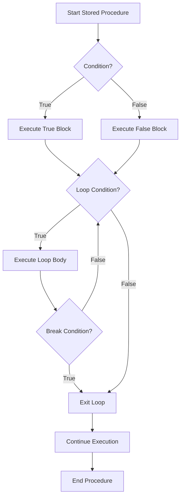

# SQL Control Flow

## Introduction

Control flow statements are essential building blocks in programming that allow you to control the execution path of your code based on conditions. In SQL stored procedures, control flow statements enable you to create dynamic and powerful database operations by making decisions, repeating actions, and handling different scenarios.

This guide will introduce you to the main control flow statements available in SQL stored procedures, including conditional statements, loops, and case expressions. By mastering these concepts, you'll be able to write more sophisticated stored procedures that can adapt to different situations and handle complex business logic directly within your database.

## Why Use Control Flow in SQL?

Before diving into the syntax, let's understand why control flow is valuable in SQL:

1. **Decision making** - Execute different SQL statements based on conditions
2. **Process automation** - Create repeatable workflows that can handle different scenarios
3. **Error handling** - Gracefully manage exceptions and errors
4. **Data validation** - Check data quality and enforce business rules
5. **Complex calculations** - Perform iterative operations that require multiple steps

## Conditional Statements

### IF...ELSE Statements

The `IF...ELSE` statement allows you to execute code blocks conditionally based on whether a specified condition is true or false.

#### Syntax

```sql
IF condition
   -- SQL statements executed when condition is TRUE
ELSE
   -- SQL statements executed when condition is FALSE
END IF;
```

#### Example: Customer Discount Calculation

```sql
CREATE PROCEDURE CalculateDiscount(
    IN customerId INT,
    OUT discountPercent DECIMAL(5,2)
)
BEGIN
    DECLARE totalPurchases DECIMAL(10,2);
    
    -- Get the total purchases for this customer
    SELECT SUM(amount) INTO totalPurchases 
    FROM orders 
    WHERE customer_id = customerId;
    
    -- Apply different discount based on total purchases
    IF totalPurchases > 10000 THEN
        SET discountPercent = 15.00;
    ELSEIF totalPurchases > 5000 THEN
        SET discountPercent = 10.00;
    ELSEIF totalPurchases > 1000 THEN
        SET discountPercent = 5.00;
    ELSE
        SET discountPercent = 0.00;
    END IF;
    
    -- Log the discount calculation
    INSERT INTO discount_log (customer_id, total_purchases, discount_rate, created_at)
    VALUES (customerId, totalPurchases, discountPercent, NOW());
END;
```

**Example Usage:**

```sql
CALL CalculateDiscount(1001, @discount);
SELECT @discount AS 'Discount Percentage';
```

**Output:**
```
Discount Percentage
------------------
10.00
```

### CASE Statements

The `CASE` statement provides a way to perform conditional logic in SQL. It's similar to a switch statement in other programming languages.

#### Syntax

```sql
CASE
    WHEN condition1 THEN result1
    WHEN condition2 THEN result2
    ...
    ELSE default_result
END
```

#### Example: Order Status Classification

```sql
CREATE PROCEDURE ClassifyOrders()
BEGIN
    SELECT 
        order_id,
        total_amount,
        CASE
            WHEN total_amount < 50 THEN 'Small Order'
            WHEN total_amount BETWEEN 50 AND 250 THEN 'Medium Order'
            WHEN total_amount BETWEEN 251 AND 1000 THEN 'Large Order'
            ELSE 'VIP Order'
        END AS order_category
    FROM orders
    ORDER BY total_amount DESC;
END;
```

**Example Usage:**

```sql
CALL ClassifyOrders();
```

**Output:**
```
order_id    total_amount    order_category
-----------------------------------------
10045       1250.00         VIP Order
10032       876.50          Large Order
10018       150.75          Medium Order
10001       35.25           Small Order
```

## Loops and Iteration

Loops allow you to execute a block of code repeatedly. SQL provides several types of loops for different scenarios.

### WHILE Loops

The `WHILE` loop continues executing a block of statements as long as the specified condition is true.

#### Syntax

```sql
WHILE condition DO
    -- SQL statements
END WHILE;
```

#### Example: Generate Date Dimension Table

```sql
CREATE PROCEDURE GenerateDateDimension(
    IN startDate DATE,
    IN endDate DATE
)
BEGIN
    DECLARE currentDate DATE;
    SET currentDate = startDate;
    
    -- Create temporary table for dates
    CREATE TEMPORARY TABLE IF NOT EXISTS date_dimension (
        date_id INT AUTO_INCREMENT PRIMARY KEY,
        full_date DATE,
        day_of_week INT,
        day_name VARCHAR(10),
        month_number INT,
        month_name VARCHAR(10),
        quarter INT,
        year INT
    );
    
    -- Populate the date dimension table
    WHILE currentDate <= endDate DO
        INSERT INTO date_dimension (
            full_date,
            day_of_week,
            day_name,
            month_number,
            month_name,
            quarter,
            year
        ) VALUES (
            currentDate,
            DAYOFWEEK(currentDate),
            DAYNAME(currentDate),
            MONTH(currentDate),
            MONTHNAME(currentDate),
            QUARTER(currentDate),
            YEAR(currentDate)
        );
        
        -- Move to next day
        SET currentDate = DATE_ADD(currentDate, INTERVAL 1 DAY);
    END WHILE;
    
    -- Display results
    SELECT * FROM date_dimension LIMIT 10;
    
    -- Clean up
    DROP TEMPORARY TABLE date_dimension;
END;
```

**Example Usage:**

```sql
CALL GenerateDateDimension('2023-01-01', '2023-01-10');
```

**Output:**
```
date_id  full_date    day_of_week  day_name   month_number  month_name  quarter  year
--------------------------------------------------------------------------------
1        2023-01-01   1            Sunday      1             January     1        2023
2        2023-01-02   2            Monday      1             January     1        2023
3        2023-01-03   3            Tuesday     1             January     1        2023
4        2023-01-04   4            Wednesday   1             January     1        2023
5        2023-01-05   5            Thursday    1             January     1        2023
6        2023-01-06   6            Friday      1             January     1        2023
7        2023-01-07   7            Saturday    1             January     1        2023
8        2023-01-08   1            Sunday      1             January     1        2023
9        2023-01-09   2            Monday      1             January     1        2023
10       2023-01-10   3            Tuesday     1             January     1        2023
```

### REPEAT Loops

The `REPEAT` loop executes a block of statements until a condition is true.

#### Syntax

```sql
REPEAT
    -- SQL statements
UNTIL condition
END REPEAT;
```

#### Example: Calculate Compound Interest

```sql
CREATE PROCEDURE CalculateCompoundInterest(
    IN principal DECIMAL(10,2),
    IN rate DECIMAL(5,2),
    IN targetAmount DECIMAL(10,2),
    OUT years INT
)
BEGIN
    DECLARE balance DECIMAL(10,2);
    SET balance = principal;
    SET years = 0;
    
    REPEAT
        -- Apply yearly interest
        SET balance = balance * (1 + rate/100);
        SET years = years + 1;
        
    UNTIL balance >= targetAmount
    END REPEAT;
    
    -- Display growth table for illustration
    SELECT 
        0 AS year, 
        principal AS balance 
    UNION ALL
    SELECT 
        n.year, 
        ROUND(principal * POWER(1 + rate/100, n.year), 2) AS balance
    FROM (
        SELECT 1 AS year
        UNION SELECT 2
        UNION SELECT 3
        UNION SELECT 4
        UNION SELECT 5
    ) n
    WHERE n.year <= years
    ORDER BY year;
END;
```

**Example Usage:**

```sql
CALL CalculateCompoundInterest(10000, 5, 15000, @years);
SELECT @years AS 'Years to Target';
```

**Output:**
```
Years to Target
--------------
9

year    balance
---------------
0       10000.00
1       10500.00
2       11025.00
3       11576.25
4       12155.06
5       12762.81
6       13400.95
7       14071.00
8       14774.55
9       15513.28
```

### LOOP with LEAVE and ITERATE

The `LOOP` construct provides a more flexible way to create loops where you explicitly control when to exit or skip iterations.

#### Syntax

```sql
loop_label: LOOP
    -- SQL statements
    IF condition THEN
        LEAVE loop_label;    -- Exit the loop
    END IF;
    
    IF another_condition THEN
        ITERATE loop_label;  -- Skip to next iteration
    END IF;
    
    -- More SQL statements
END LOOP loop_label;
```

#### Example: Process Customer Orders

```sql
CREATE PROCEDURE ProcessOrders(IN batchSize INT)
BEGIN
    DECLARE orderId INT;
    DECLARE orderStatus VARCHAR(20);
    DECLARE processedCount INT DEFAULT 0;
    DECLARE errorCount INT DEFAULT 0;
    DECLARE done BOOLEAN DEFAULT FALSE;
    
    -- Declare cursor for pending orders
    DECLARE orderCursor CURSOR FOR
        SELECT order_id, status
        FROM orders
        WHERE status = 'PENDING'
        ORDER BY created_at
        LIMIT batchSize;
    
    -- Declare handler for cursor
    DECLARE CONTINUE HANDLER FOR NOT FOUND SET done = TRUE;
    
    -- Open cursor
    OPEN orderCursor;
    
    -- Process orders
    process_loop: LOOP
        -- Fetch next order
        FETCH orderCursor INTO orderId, orderStatus;
        
        -- Exit if no more orders or reached batch size
        IF done OR processedCount >= batchSize THEN
            LEAVE process_loop;
        END IF;
        
        -- Begin transaction for this order
        START TRANSACTION;
        
        BEGIN
            -- Declare handler for errors
            DECLARE CONTINUE HANDLER FOR SQLEXCEPTION
            BEGIN
                -- Handle error
                ROLLBACK;
                SET errorCount = errorCount + 1;
                
                -- Log error
                INSERT INTO error_log (order_id, error_message, created_at)
                VALUES (orderId, 'Error processing order', NOW());
                
                -- Skip to next order
                ITERATE process_loop;
            END;
            
            -- Process the order (example logic)
            UPDATE orders SET status = 'PROCESSING', updated_at = NOW() WHERE order_id = orderId;
            
            -- Update inventory
            UPDATE inventory i
            JOIN order_items oi ON i.product_id = oi.product_id
            SET i.quantity = i.quantity - oi.quantity
            WHERE oi.order_id = orderId;
            
            -- Final order update
            UPDATE orders SET status = 'PROCESSED', updated_at = NOW() WHERE order_id = orderId;
            
            -- Commit transaction
            COMMIT;
            
            -- Increment count
            SET processedCount = processedCount + 1;
        END;
    END LOOP process_loop;
    
    -- Close cursor
    CLOSE orderCursor;
    
    -- Return processing summary
    SELECT 
        processedCount AS 'Orders Processed',
        errorCount AS 'Orders With Errors',
        processedCount + errorCount AS 'Total Orders Attempted';
END;
```

**Example Usage:**

```sql
CALL ProcessOrders(10);
```

**Output:**
```
Orders Processed    Orders With Errors    Total Orders Attempted
--------------------------------------------------------------
8                   2                      10
```

## Control Flow Diagram

Here's a flowchart showing how control flow works in SQL stored procedures:



## Error Handling

Control flow statements are also essential for error handling in SQL stored procedures. Using the `DECLARE HANDLER` statement, you can control what happens when errors occur.

### Types of Handlers

1. **CONTINUE** - Execution continues after handling the error
2. **EXIT** - Execution terminates after handling the error

### Example: Error Handling in Stored Procedure

```sql
CREATE PROCEDURE SafeUpdateCustomer(
    IN customerId INT,
    IN newEmail VARCHAR(100),
    OUT updateStatus VARCHAR(50)
)
BEGIN
    -- Declare error handler
    DECLARE CONTINUE HANDLER FOR SQLEXCEPTION
    BEGIN
        SET updateStatus = 'ERROR';
        -- Get error details
        GET DIAGNOSTICS CONDITION 1
            @sqlstate = RETURNED_SQLSTATE,
            @errorMsg = MESSAGE_TEXT;
        
        -- Log error
        INSERT INTO error_log (procedure_name, error_code, error_message, created_at)
        VALUES ('SafeUpdateCustomer', @sqlstate, @errorMsg, NOW());
    END;
    
    -- Initialize status
    SET updateStatus = 'PENDING';
    
    -- Begin transaction
    START TRANSACTION;
    
    -- Update customer email
    UPDATE customers
    SET 
        email = newEmail,
        updated_at = NOW()
    WHERE customer_id = customerId;
    
    -- Check if customer exists
    IF ROW_COUNT() = 0 THEN
        SET updateStatus = 'NOT_FOUND';
        ROLLBACK;
    ELSE
        SET updateStatus = 'SUCCESS';
        COMMIT;
    END IF;
END;
```

**Example Usage:**

```sql
CALL SafeUpdateCustomer(1001, 'newemail@example.com', @status);
SELECT @status AS 'Update Status';
```

**Output:**
```
Update Status
-------------
SUCCESS
```

## Real-World Applications

Let's explore how SQL control flow can be applied in practical scenarios:

### 1. Order Processing System

```sql
CREATE PROCEDURE ProcessNewOrder(
    IN customerId INT,
    IN orderAmount DECIMAL(10,2),
    OUT orderStatus VARCHAR(50)
)
BEGIN
    DECLARE customerCredit DECIMAL(10,2);
    DECLARE shippingMethod VARCHAR(50);
    
    -- Initialize status
    SET orderStatus = 'STARTED';
    
    -- Get customer credit information
    SELECT credit_limit INTO customerCredit
    FROM customers
    WHERE customer_id = customerId;
    
    -- Check credit limit
    IF orderAmount > customerCredit THEN
        SET orderStatus = 'REJECTED_CREDIT';
    ELSE
        -- Determine shipping method based on order amount
        CASE
            WHEN orderAmount > 1000 THEN
                SET shippingMethod = 'PREMIUM';
            WHEN orderAmount > 500 THEN
                SET shippingMethod = 'EXPRESS';
            ELSE
                SET shippingMethod = 'STANDARD';
        END CASE;
        
        -- Create the order
        INSERT INTO orders (
            customer_id,
            order_amount,
            shipping_method,
            status,
            created_at
        ) VALUES (
            customerId,
            orderAmount,
            shippingMethod,
            'PENDING',
            NOW()
        );
        
        -- Decrease available credit
        UPDATE customers
        SET available_credit = available_credit - orderAmount
        WHERE customer_id = customerId;
        
        SET orderStatus = 'CREATED';
    END IF;
END;
```

### 2. Data Migration Utility

```sql
CREATE PROCEDURE MigrateCustomerData(
    IN batchSize INT,
    OUT migrationSummary VARCHAR(1000)
)
BEGIN
    DECLARE done BOOLEAN DEFAULT FALSE;
    DECLARE customerId INT;
    DECLARE processingStatus VARCHAR(20);
    DECLARE successCount INT DEFAULT 0;
    DECLARE errorCount INT DEFAULT 0;
    DECLARE startTime DATETIME;
    DECLARE endTime DATETIME;
    
    -- Cursor for old customer records
    DECLARE customerCursor CURSOR FOR
        SELECT customer_id
        FROM legacy_customers
        WHERE migration_status = 'PENDING'
        LIMIT batchSize;
    
    -- Handler for cursor
    DECLARE CONTINUE HANDLER FOR NOT FOUND SET done = TRUE;
    
    -- Record start time
    SET startTime = NOW();
    
    -- Open cursor
    OPEN customerCursor;
    
    -- Begin migration
    migration_loop: LOOP
        FETCH customerCursor INTO customerId;
        
        IF done THEN
            LEAVE migration_loop;
        END IF;
        
        -- Set initial status
        SET processingStatus = 'PENDING';
        
        -- Start transaction for this customer
        START TRANSACTION;
        
        BEGIN
            -- Error handler
            DECLARE CONTINUE HANDLER FOR SQLEXCEPTION
            BEGIN
                SET processingStatus = 'ERROR';
                ROLLBACK;
            END;
            
            -- Migrate customer data
            INSERT INTO new_customers (
                customer_id,
                first_name,
                last_name,
                email,
                phone,
                address,
                migrated_at
            )
            SELECT
                customer_id,
                first_name,
                last_name,
                email,
                phone,
                address,
                NOW()
            FROM legacy_customers
            WHERE customer_id = customerId;
            
            -- Migrate orders
            INSERT INTO new_orders (
                order_id,
                customer_id,
                order_date,
                amount,
                migrated_at
            )
            SELECT
                order_id,
                customer_id,
                order_date,
                amount,
                NOW()
            FROM legacy_orders
            WHERE customer_id = customerId;
            
            -- Update migration status
            UPDATE legacy_customers
            SET migration_status = 'COMPLETED'
            WHERE customer_id = customerId;
            
            -- Commit if successful
            COMMIT;
            SET processingStatus = 'SUCCESS';
        END;
        
        -- Track results
        IF processingStatus = 'SUCCESS' THEN
            SET successCount = successCount + 1;
        ELSE
            SET errorCount = errorCount + 1;
            
            -- Log error
            INSERT INTO migration_errors (
                customer_id,
                error_date,
                notes
            ) VALUES (
                customerId,
                NOW(),
                'Failed to migrate customer data'
            );
        END IF;
    END LOOP;
    
    -- Close cursor
    CLOSE customerCursor;
    
    -- Record end time
    SET endTime = NOW();
    
    -- Prepare summary
    SET migrationSummary = CONCAT(
        'Migration completed at ', DATE_FORMAT(endTime, '%Y-%m-%d %H:%i:%s'), 
        '. Successfully migrated ', successCount, ' customers. ',
        'Failed to migrate ', errorCount, ' customers. ',
        'Total time: ', TIMESTAMPDIFF(SECOND, startTime, endTime), ' seconds.'
    );
END;
```

## Summary

SQL control flow statements provide powerful tools for creating dynamic and intelligent stored procedures. By using conditional statements, loops, and error handling, you can build robust database operations that respond to different conditions and handle complex business logic.

In this guide, you've learned:

1. **IF...ELSE statements** - For making decisions based on conditions
2. **CASE statements** - For handling multiple conditions elegantly
3. **WHILE, REPEAT, and LOOP** - For repeating operations until certain conditions are met
4. **Error handling** - For managing exceptions and errors gracefully
5. **Real-world applications** - Practical examples of control flow in action

Control flow is what transforms stored procedures from simple scripts into powerful database programs. By mastering these concepts, you'll be able to create more sophisticated and responsive database applications.

## Additional Resources

### Practice Exercises

1. **Exercise 1**: Create a stored procedure that calculates the grade (A, B, C, D, F) for students based on their score using IF...ELSE statements.

2. **Exercise 2**: Build a stored procedure that generates a Fibonacci sequence up to a specified number using a WHILE loop.

3. **Exercise 3**: Implement a stored procedure that processes customer refunds with different approval workflows based on the refund amount using CASE statements.

### Further Reading

- [MySQL Control Flow Functions](https://dev.mysql.com/doc/refman/8.0/en/control-flow-functions.html)
- [SQL Server CASE Expressions](https://docs.microsoft.com/en-us/sql/t-sql/language-elements/case-transact-sql)
- [PostgreSQL Conditional Expressions](https://www.postgresql.org/docs/current/functions-conditional.html)
- [Oracle PL/SQL Control Structures](https://docs.oracle.com/en/database/oracle/oracle-database/19/lnpls/plsql-control-statements.html)

Remember that while the basic concepts of control flow are similar across different database systems, the exact syntax may vary. Always refer to the documentation for your specific database management system for the most accurate information.