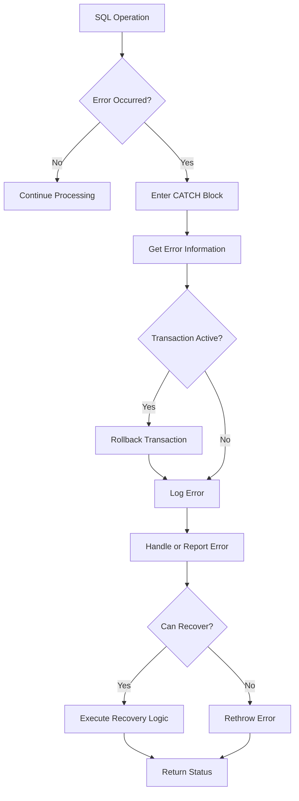

# SQL Error Handling

## Introduction

When writing SQL stored procedures, things don't always go as planned. Database connections might fail, data might violate constraints, or calculations might produce unexpected results. Without proper error handling, these issues can cause your applications to crash or behave unpredictably.

Error handling in SQL allows you to:
- Detect when something goes wrong
- Respond appropriately to different types of errors
- Provide meaningful feedback to users or applications
- Maintain data integrity even when errors occur
- Create more robust and reliable database applications

In this guide, we'll explore how to implement effective error handling in SQL stored procedures, focusing primarily on SQL Server's TRY-CATCH mechanism, but also covering approaches for other database systems.

## Basic Concepts of SQL Error Handling

### What is an SQL Error?

In SQL, errors (sometimes called exceptions) occur when the database engine encounters a problem that prevents it from completing an operation. Common causes include:

- Syntax errors in SQL statements
- Constraint violations (e.g., unique, foreign key, check constraints)
- Divide-by-zero errors
- Conversion errors (e.g., trying to convert text to a number)
- Deadlocks or timeouts
- Permission issues

### Error Information in SQL Server

SQL Server provides several system functions to retrieve information about errors:

- `ERROR_NUMBER()`: Returns the error number
- `ERROR_SEVERITY()`: Returns the error severity (0-25)
- `ERROR_STATE()`: Returns the error state
- `ERROR_PROCEDURE()`: Returns the name of the stored procedure where the error occurred
- `ERROR_LINE()`: Returns the line number where the error occurred
- `ERROR_MESSAGE()`: Returns the complete error message text

## The TRY-CATCH Mechanism

The most common approach to error handling in SQL Server is the TRY-CATCH mechanism, which works similarly to try-catch blocks in programming languages like C# or Java.

### Basic Syntax

```sql
BEGIN TRY
    -- SQL statements that might cause an error
END TRY
BEGIN CATCH
    -- Error handling code
END CATCH
```

### Simple Example

Here's a basic example of a stored procedure that uses TRY-CATCH:

```sql
CREATE PROCEDURE DivideNumbers
    @Numerator INT,
    @Denominator INT,
    @Result DECIMAL(10, 2) OUTPUT
AS
BEGIN
    BEGIN TRY
        SET @Result = @Numerator / @Denominator;
        PRINT 'Division successful';
    END TRY
    BEGIN CATCH
        PRINT 'Error occurred during division';
        PRINT 'Error message: ' + ERROR_MESSAGE();
        SET @Result = NULL;
    END CATCH
END;
```

**Input:**
```sql
DECLARE @Answer DECIMAL(10, 2);
EXEC DivideNumbers @Numerator = 10, @Denominator = 2, @Result = @Answer OUTPUT;
SELECT @Answer AS Result;
```

**Output:**
```
Division successful
Result
-----------
5.00
```

**Input with error:**
```sql
DECLARE @Answer DECIMAL(10, 2);
EXEC DivideNumbers @Numerator = 10, @Denominator = 0, @Result = @Answer OUTPUT;
SELECT @Answer AS Result;
```

**Output:**
```
Error occurred during division
Error message: Divide by zero error encountered.
Result
-----------
NULL
```

## Advanced Error Handling Techniques

### Rethrowing Errors

Sometimes you want to handle an error but then pass it up to the calling procedure. You can do this with the `THROW` statement (SQL Server 2012 and later):

```sql
CREATE PROCEDURE UpdateProductPrice
    @ProductID INT,
    @NewPrice DECIMAL(10, 2)
AS
BEGIN
    BEGIN TRY
        -- Attempt to update the product price
        UPDATE Products
        SET Price = @NewPrice
        WHERE ProductID = @ProductID;
        
        -- Check if any rows were affected
        IF @@ROWCOUNT = 0
        BEGIN
            -- No matching product found, raise custom error
            THROW 50001, 'Product not found', 1;
        END
    END TRY
    BEGIN CATCH
        -- Log the error (could write to a table)
        INSERT INTO ErrorLog (ErrorNumber, ErrorMessage, ErrorTime)
        VALUES (ERROR_NUMBER(), ERROR_MESSAGE(), GETDATE());
        
        -- Rethrow the error
        THROW;
    END CATCH
END;
```

### Transaction Management in Error Handling

Combining error handling with transactions ensures your database remains consistent:

```sql
CREATE PROCEDURE TransferFunds
    @FromAccount INT,
    @ToAccount INT,
    @Amount DECIMAL(10, 2)
AS
BEGIN
    DECLARE @ErrorMessage NVARCHAR(4000);
    
    BEGIN TRY
        -- Start a transaction
        BEGIN TRANSACTION;
        
        -- Withdraw from source account
        UPDATE Accounts
        SET Balance = Balance - @Amount
        WHERE AccountID = @FromAccount;
        
        -- Deposit to destination account
        UPDATE Accounts
        SET Balance = Balance + @Amount
        WHERE AccountID = @ToAccount;
        
        -- Check for sufficient funds
        IF (SELECT Balance FROM Accounts WHERE AccountID = @FromAccount) < 0
        BEGIN
            THROW 50002, 'Insufficient funds for transfer', 1;
        END
        
        -- Commit the transaction if everything is successful
        COMMIT TRANSACTION;
    END TRY
    BEGIN CATCH
        -- Roll back the transaction if an error occurred
        IF @@TRANCOUNT > 0
            ROLLBACK TRANSACTION;
            
        -- Get the error details
        SET @ErrorMessage = 
            'Error ' + CONVERT(VARCHAR(50), ERROR_NUMBER()) +
            ', Severity ' + CONVERT(VARCHAR(5), ERROR_SEVERITY()) +
            ': ' + ERROR_MESSAGE();
            
        -- Return the error to the caller
        RAISERROR(@ErrorMessage, 16, 1);
    END CATCH
END;
```

## Custom Error Handling

### Creating Custom Errors

SQL Server allows you to define custom errors using `RAISERROR` (legacy) or `THROW` (newer):

```sql
-- Using THROW (SQL Server 2012 and later)
THROW 50001, 'Custom error message', 1;

-- Using RAISERROR
RAISERROR('Custom error message', 16, 1);
```

### Severity Levels

SQL Server error severity levels range from 0 to 25:
- 0-10: Informational messages
- 11-16: Errors that can be fixed by the user
- 17-19: Software errors that cannot be fixed by the user
- 20-25: System problems that might terminate the connection

### Creating a Custom Error Handler

Let's create a reusable error handling procedure:

```sql
CREATE PROCEDURE HandleError
    @ProcedureName NVARCHAR(128)
AS
BEGIN
    DECLARE @ErrorNumber INT = ERROR_NUMBER();
    DECLARE @ErrorSeverity INT = ERROR_SEVERITY();
    DECLARE @ErrorState INT = ERROR_STATE();
    DECLARE @ErrorLine INT = ERROR_LINE();
    DECLARE @ErrorMessage NVARCHAR(4000) = ERROR_MESSAGE();
    
    -- Log error to table
    INSERT INTO ErrorLog (
        ErrorNumber,
        ErrorSeverity,
        ErrorState,
        ErrorProcedure,
        ErrorLine,
        ErrorMessage,
        ErrorTime
    )
    VALUES (
        @ErrorNumber,
        @ErrorSeverity,
        @ErrorState,
        @ProcedureName,
        @ErrorLine,
        @ErrorMessage,
        GETDATE()
    );
    
    -- Return error information to the client
    DECLARE @Message NVARCHAR(4000) = 
        'Error ' + CONVERT(NVARCHAR(10), @ErrorNumber) + 
        ' occurred in ' + @ProcedureName + 
        ' at line ' + CONVERT(NVARCHAR(10), @ErrorLine) + 
        ': ' + @ErrorMessage;
        
    RAISERROR(@Message, @ErrorSeverity, @ErrorState);
END;
```

You can use this procedure in your CATCH blocks:

```sql
BEGIN TRY
    -- Code that might generate an error
END TRY
BEGIN CATCH
    EXEC HandleError 'ProcedureName';
END CATCH
```

## Error Handling in Other Database Systems

While the examples above focus on SQL Server, let's briefly look at error handling in other popular database systems:

### MySQL Error Handling

MySQL uses a DECLARE...HANDLER structure:

```sql
CREATE PROCEDURE DivideNumbers(
    IN p_numerator INT,
    IN p_denominator INT,
    OUT p_result DECIMAL(10,2)
)
BEGIN
    -- Declare error handlers
    DECLARE CONTINUE HANDLER FOR SQLEXCEPTION
    BEGIN
        SET p_result = NULL;
        SELECT 'Error occurred' AS message;
    END;
    
    -- Attempt division
    SET p_result = p_numerator / p_denominator;
END;
```

### PostgreSQL Error Handling

PostgreSQL uses a block structure with EXCEPTION:

```sql
CREATE OR REPLACE FUNCTION divide_numbers(
    p_numerator INT,
    p_denominator INT
) 
RETURNS DECIMAL AS $$
DECLARE
    result DECIMAL(10,2);
BEGIN
    BEGIN
        result := p_numerator / p_denominator;
        RETURN result;
    EXCEPTION WHEN division_by_zero THEN
        RAISE NOTICE 'Division by zero detected';
        RETURN NULL;
    END;
END;
$$ LANGUAGE plpgsql;
```

## Real-World Example: Order Processing System

Let's look at a more comprehensive example that implements error handling in an order processing system:

```sql
CREATE PROCEDURE ProcessOrder
    @OrderID INT,
    @CustomerID INT,
    @OrderItems OrderItemType READONLY  -- Table type for order items
AS
BEGIN
    SET NOCOUNT ON;
    
    DECLARE @ErrorMessage NVARCHAR(4000);
    DECLARE @OrderTotal DECIMAL(10, 2) = 0;
    
    BEGIN TRY
        -- Start a transaction for the entire order process
        BEGIN TRANSACTION;
        
        -- Validate customer exists
        IF NOT EXISTS (SELECT 1 FROM Customers WHERE CustomerID = @CustomerID)
        BEGIN
            THROW 50010, 'Customer does not exist', 1;
        END
        
        -- Create the order header
        INSERT INTO Orders (OrderID, CustomerID, OrderDate, TotalAmount)
        VALUES (@OrderID, @CustomerID, GETDATE(), 0);
        
        -- Process each order item
        INSERT INTO OrderDetails (OrderID, ProductID, Quantity, UnitPrice)
        SELECT 
            @OrderID,
            ProductID,
            Quantity,
            (SELECT Price FROM Products WHERE ProductID = OrderItems.ProductID)
        FROM @OrderItems;
        
        -- Update inventory
        UPDATE p
        SET p.StockQuantity = p.StockQuantity - oi.Quantity
        FROM Products p
        INNER JOIN @OrderItems oi ON p.ProductID = oi.ProductID;
        
        -- Check if any products now have negative inventory
        IF EXISTS (SELECT 1 FROM Products WHERE StockQuantity < 0)
        BEGIN
            THROW 50011, 'Insufficient inventory for one or more products', 1;
        END
        
        -- Calculate and update order total
        SELECT @OrderTotal = SUM(Quantity * UnitPrice)
        FROM OrderDetails
        WHERE OrderID = @OrderID;
        
        UPDATE Orders
        SET TotalAmount = @OrderTotal
        WHERE OrderID = @OrderID;
        
        -- Commit the transaction
        COMMIT TRANSACTION;
        
        -- Return success
        SELECT 'Order processed successfully' AS Result, @OrderTotal AS OrderTotal;
    END TRY
    BEGIN CATCH
        -- Something went wrong, roll back the transaction
        IF @@TRANCOUNT > 0
            ROLLBACK TRANSACTION;
            
        -- Get error details
        SET @ErrorMessage = 
            'Error ' + CONVERT(VARCHAR(50), ERROR_NUMBER()) +
            ': ' + ERROR_MESSAGE();
            
        -- Log the error
        INSERT INTO ErrorLog (ErrorMessage, ErrorProcedure, ErrorTime)
        VALUES (@ErrorMessage, 'ProcessOrder', GETDATE());
        
        -- Return error information
        SELECT 'Error processing order' AS Result, @ErrorMessage AS ErrorDetails;
    END CATCH
END;
```

## Error Handling Best Practices

1. **Always use transactions with error handling** to maintain data consistency.
2. **Log errors** to a table for monitoring and troubleshooting.
3. **Provide meaningful error messages** that help identify the problem.
4. **Use appropriate error severity levels** to indicate the seriousness of the issue.
5. **Consider recovery actions** where appropriate (e.g., retries for deadlocks).
6. **Test error scenarios** as part of your development process.
7. **Don't expose internal error details** to end users in production environments.

## Visualizing the Error Handling Flow



## Summary

Effective error handling is essential for building robust and reliable SQL stored procedures. By using TRY-CATCH blocks, managing transactions properly, and implementing a consistent approach to error logging and reporting, you can create database applications that gracefully handle unexpected situations.

The key points to remember:
- Use TRY-CATCH blocks to catch and handle errors
- Combine error handling with transactions to maintain data consistency
- Collect error information using system functions like ERROR_MESSAGE()
- Log errors for later analysis and debugging
- Provide meaningful feedback to users or calling applications
- Consider different approaches for different database systems

## Additional Resources

- [Microsoft SQL Server Documentation on Error Handling](https://docs.microsoft.com/en-us/sql/t-sql/language-elements/try-catch-transact-sql)
- [PostgreSQL Error Handling Documentation](https://www.postgresql.org/docs/current/plpgsql-control-structures.html#PLPGSQL-ERROR-TRAPPING)
- [MySQL Error Handling Documentation](https://dev.mysql.com/doc/refman/8.0/en/declare-handler.html)

## Exercises

1. Create a stored procedure that attempts to insert a record into a table with a primary key constraint, and handle the potential duplicate key error.

2. Modify the `TransferFunds` procedure to include additional validation to ensure both accounts exist before attempting the transfer.

3. Create an error logging table and a generic error handling procedure that logs detailed error information.

4. Implement a retry mechanism for a stored procedure that might encounter deadlocks.

5. Write a stored procedure that performs multiple operations within a transaction and properly handles errors at each step, rolling back the entire transaction if any step fails.