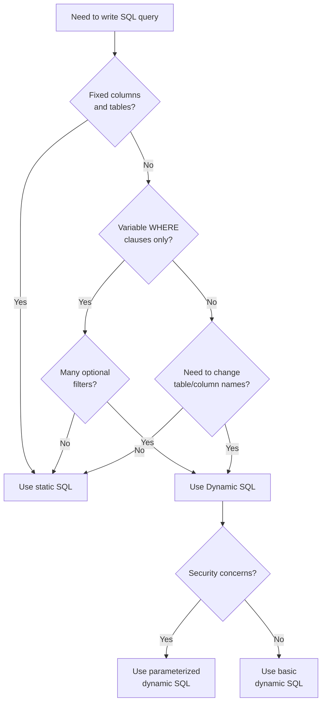

# SQL Dynamic SQL

## Introduction

Dynamic SQL is a powerful programming technique that allows you to build SQL statements dynamically at runtime, rather than writing them as static text in your code. In the context of stored procedures, dynamic SQL enables you to create flexible queries that can adapt to different conditions and requirements without having to modify the procedure's code.

Unlike regular SQL statements that are fixed at the time of writing, dynamic SQL lets you:

- Construct queries based on user input or application requirements
- Create tables, columns, and other database objects on-the-fly
- Execute SQL statements that aren't known until runtime
- Work around limitations of static SQL in stored procedures

In this tutorial, we'll explore how to effectively use dynamic SQL within stored procedures, understand its benefits and potential risks, and learn best practices for implementation.

## Basic Concepts of Dynamic SQL

Dynamic SQL refers to SQL statements that are constructed at runtime. Instead of writing a fixed query, you create a string variable that contains your SQL statement, which can be modified based on various conditions before execution.

### Why Use Dynamic SQL?

- **Flexibility**: Build queries that can adapt to different conditions
- **Reusability**: Create generic procedures that work with various tables or columns
- **Functionality**: Perform operations not possible with static SQL
- **Performance**: In some cases, optimize queries based on data characteristics

### When to Use Dynamic SQL

Dynamic SQL is particularly useful in scenarios such as:

- Creating generic stored procedures that can work with multiple tables
- Implementing search functions with optional search criteria
- Generating complex queries based on user selections
- Creating, altering, or dropping database objects programmatically

## Implementing Dynamic SQL

Let's look at the basic syntax for implementing dynamic SQL in various database systems.

### SQL Server Implementation

In SQL Server, you use the `EXEC` or `sp_executesql` command to execute dynamically created SQL statements.

#### Basic Example Using EXEC

```sql
CREATE PROCEDURE GetEmployeesByDepartment
    @DepartmentName VARCHAR(50)
AS
BEGIN
    DECLARE @SQL NVARCHAR(1000)
    
    SET @SQL = 'SELECT * FROM Employees WHERE Department = ''' + @DepartmentName + ''''
    
    EXEC (@SQL)
END
```

Input:
```sql
EXEC GetEmployeesByDepartment 'Marketing'
```

Output:
```
EmployeeID | FirstName | LastName | Department | Salary
-----------+-----------+----------+------------+-------
1          | John      | Smith    | Marketing  | 65000
4          | Sarah     | Johnson  | Marketing  | 72000
9          | Michael   | Brown    | Marketing  | 58000
```

#### Using sp_executesql (Recommended)

The `sp_executesql` approach is generally preferred as it supports parameterization, which helps prevent SQL injection:

```sql
CREATE PROCEDURE GetEmployeesByDepartment
    @DepartmentName VARCHAR(50)
AS
BEGIN
    DECLARE @SQL NVARCHAR(1000)
    
    SET @SQL = 'SELECT * FROM Employees WHERE Department = @Dept'
    
    EXEC sp_executesql @SQL, N'@Dept VARCHAR(50)', @Dept = @DepartmentName
END
```

### MySQL Implementation

In MySQL, you use the `PREPARE` and `EXECUTE` statements:

```sql
DELIMITER //
CREATE PROCEDURE GetEmployeesByDepartment(IN departmentName VARCHAR(50))
BEGIN
    SET @sql = CONCAT('SELECT * FROM Employees WHERE Department = "', departmentName, '"');
    PREPARE stmt FROM @sql;
    EXECUTE stmt;
    DEALLOCATE PREPARE stmt;
END //
DELIMITER ;
```

Input:
```sql
CALL GetEmployeesByDepartment('Marketing');
```

Output:
```
EmployeeID | FirstName | LastName | Department | Salary
-----------+-----------+----------+------------+-------
1          | John      | Smith    | Marketing  | 65000
4          | Sarah     | Johnson  | Marketing  | 72000
9          | Michael   | Brown    | Marketing  | 58000
```

## Practical Examples

Let's explore some practical examples of dynamic SQL in stored procedures.

### Example 1: Dynamic Sorting

This procedure allows users to sort a table by any column in either ascending or descending order:

```sql
CREATE PROCEDURE GetSortedEmployees
    @SortColumn VARCHAR(50),
    @SortDirection VARCHAR(4) = 'ASC'
AS
BEGIN
    -- Validate input to prevent SQL injection
    IF @SortColumn NOT IN ('EmployeeID', 'FirstName', 'LastName', 'Department', 'Salary')
    BEGIN
        RAISERROR('Invalid sort column specified', 16, 1)
        RETURN
    END
    
    IF @SortDirection NOT IN ('ASC', 'DESC')
    BEGIN
        RAISERROR('Sort direction must be ASC or DESC', 16, 1)
        RETURN
    END
    
    DECLARE @SQL NVARCHAR(1000)
    
    SET @SQL = 'SELECT * FROM Employees ORDER BY ' + QUOTENAME(@SortColumn) + ' ' + @SortDirection
    
    EXEC (@SQL)
END
```

Input:
```sql
EXEC GetSortedEmployees 'Salary', 'DESC'
```

Output:
```
EmployeeID | FirstName | LastName  | Department | Salary
-----------+-----------+-----------+------------+-------
8          | David     | Williams  | Finance    | 95000
4          | Sarah     | Johnson   | Marketing  | 72000
1          | John      | Smith     | Marketing  | 65000
9          | Michael   | Brown     | Marketing  | 58000
```

### Example 2: Flexible Search Procedure

This procedure allows for searching employees with multiple optional criteria:

```sql
CREATE PROCEDURE SearchEmployees
    @FirstName VARCHAR(50) = NULL,
    @LastName VARCHAR(50) = NULL,
    @Department VARCHAR(50) = NULL,
    @MinSalary DECIMAL(10,2) = NULL,
    @MaxSalary DECIMAL(10,2) = NULL
AS
BEGIN
    DECLARE @SQL NVARCHAR(2000)
    DECLARE @Params NVARCHAR(1000)
    
    SET @SQL = 'SELECT * FROM Employees WHERE 1=1'
    
    IF @FirstName IS NOT NULL
        SET @SQL = @SQL + ' AND FirstName LIKE @FirstName + ''%'''
        
    IF @LastName IS NOT NULL
        SET @SQL = @SQL + ' AND LastName LIKE @LastName + ''%'''
        
    IF @Department IS NOT NULL
        SET @SQL = @SQL + ' AND Department = @Department'
        
    IF @MinSalary IS NOT NULL
        SET @SQL = @SQL + ' AND Salary >= @MinSalary'
        
    IF @MaxSalary IS NOT NULL
        SET @SQL = @SQL + ' AND Salary <= @MaxSalary'
    
    SET @Params = '@FirstName VARCHAR(50), @LastName VARCHAR(50), @Department VARCHAR(50), @MinSalary DECIMAL(10,2), @MaxSalary DECIMAL(10,2)'
    
    EXEC sp_executesql @SQL, @Params, @FirstName, @LastName, @Department, @MinSalary, @MaxSalary
END
```

Input:
```sql
EXEC SearchEmployees @Department = 'Marketing', @MinSalary = 60000
```

Output:
```
EmployeeID | FirstName | LastName | Department | Salary
-----------+-----------+----------+------------+-------
1          | John      | Smith    | Marketing  | 65000
4          | Sarah     | Johnson  | Marketing  | 72000
```

### Example 3: Dynamic Pivot Table

This procedure creates a pivot table dynamically based on departments:

```sql
CREATE PROCEDURE GetDepartmentSalarySummary
AS
BEGIN
    -- Get the list of departments dynamically
    DECLARE @DepartmentList NVARCHAR(MAX)
    
    SELECT @DepartmentList = COALESCE(@DepartmentList + ', ', '') + 
           QUOTENAME(Department)
    FROM (SELECT DISTINCT Department FROM Employees) AS Departments
    
    -- Create the pivot query
    DECLARE @SQL NVARCHAR(MAX)
    SET @SQL = '
    SELECT 
        ''Average'' AS Statistic, ' +
        @DepartmentList + '
    FROM
    (
        SELECT Department, Salary
        FROM Employees
    ) AS SourceData
    PIVOT
    (
        AVG(Salary)
        FOR Department IN (' + @DepartmentList + ')
    ) AS PivotTable
    
    UNION ALL
    
    SELECT 
        ''Maximum'' AS Statistic, ' +
        @DepartmentList + '
    FROM
    (
        SELECT Department, Salary
        FROM Employees
    ) AS SourceData
    PIVOT
    (
        MAX(Salary)
        FOR Department IN (' + @DepartmentList + ')
    ) AS PivotTable'
    
    EXEC (@SQL)
END
```

Input:
```sql
EXEC GetDepartmentSalarySummary
```

Output:
```
Statistic | Marketing | Finance | IT       | HR
----------+-----------+---------+----------+--------
Average   | 65000.00  | 85000.00| 78000.00 | 62000.00
Maximum   | 72000.00  | 95000.00| 88000.00 | 62000.00
```

## Best Practices and Security Considerations

### Preventing SQL Injection

SQL injection is a serious security risk when using dynamic SQL. Always follow these practices:

1. **Use Parameterized Queries**: Use `sp_executesql` with parameters instead of string concatenation
2. **Validate Input**: Check that input values are valid before using them
3. **Use QUOTENAME() or QUOTEDIDENTIFIER()**: For object names like tables or columns
4. **Limit Permissions**: Execute dynamic SQL under users with minimal required permissions

Here's a comparison of unsafe vs. safe dynamic SQL:

#### Unsafe (Vulnerable to SQL Injection)
```sql
-- DON'T DO THIS
SET @SQL = 'SELECT * FROM Employees WHERE Department = ''' + @DepartmentName + ''''
```

#### Safe Approach
```sql
-- DO THIS INSTEAD
SET @SQL = 'SELECT * FROM Employees WHERE Department = @Dept'
EXEC sp_executesql @SQL, N'@Dept VARCHAR(50)', @Dept = @DepartmentName
```

### Performance Considerations

Dynamic SQL can impact performance due to:

1. **Query Plan Caching**: Dynamic SQL results in new query plans that aren't cached
2. **Parsing Overhead**: Each dynamic SQL statement needs to be parsed at runtime
3. **Execution Context**: Dynamic SQL runs in a different context than the caller

To mitigate these issues:

- Use dynamic SQL only when necessary
- Keep dynamic SQL as simple as possible
- Consider using plan guides for frequently used dynamic SQL
- Monitor the plan cache for excessive compilations

## Decision Flow for Using Dynamic SQL

Here's a flowchart to help decide when to use dynamic SQL:



## Summary

Dynamic SQL is a powerful technique that allows you to create flexible, adaptable database queries at runtime. When used correctly, it enables you to build versatile stored procedures that can handle a wide range of scenarios without code duplication.

Key takeaways:

- Dynamic SQL lets you build SQL statements at runtime
- It's useful for creating flexible queries with variable conditions
- Always use parameterized queries to prevent SQL injection
- Consider performance implications, especially with cached query plans
- Use dynamic SQL only when static SQL doesn't provide the flexibility you need

## Additional Resources

For further learning about Dynamic SQL:

- [Microsoft SQL Server Documentation on Dynamic SQL](https://docs.microsoft.com/en-us/sql/relational-databases/system-stored-procedures/sp-executesql-transact-sql)
- [MySQL Documentation on Prepared Statements](https://dev.mysql.com/doc/refman/8.0/en/sql-prepared-statements.html)
- Book: "The Art of SQL" by Stephane Faroult
- Book: "SQL Server Dynamic SQL: Applications, Performance, and Security" by Edward Pollack

## Exercises

1. Create a stored procedure that allows users to search products by any combination of: name, category, price range, and availability.
2. Modify the `GetSortedEmployees` procedure to allow sorting by multiple columns.
3. Create a dynamic SQL procedure that generates a report showing the count of employees by department and job title, with the departments as columns and job titles as rows.
4. Build a stored procedure that can perform CRUD operations on any table using dynamic SQL.
5. Implement a stored procedure that can generate CREATE TABLE statements dynamically based on user specifications.