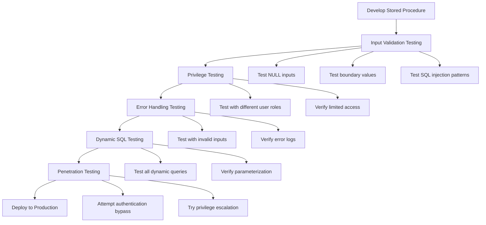

# SQL Procedure Security

## Introduction

When working with stored procedures in SQL, security is a critical consideration. Stored procedures offer numerous advantages - they encapsulate business logic, improve performance, and promote code reuse. However, they also provide powerful access to your database, making them potential security vulnerabilities if not properly secured.

This guide explores essential security practices for SQL stored procedures, helping you protect your database from common threats like SQL injection attacks and unauthorized access. By implementing these security measures, you'll create robust stored procedures that maintain data integrity while preventing malicious exploitation.

## Why Security Matters for Stored Procedures

Stored procedures often have elevated permissions to perform their operations efficiently. This elevated access creates potential risks:

1. **Direct Data Access**: Procedures can modify, delete, or expose sensitive data
2. **SQL Injection Vulnerabilities**: Improperly coded procedures may allow malicious code execution
3. **Privilege Escalation**: Insecure procedures might enable users to perform unauthorized actions

Let's explore best practices to mitigate these risks.

## Principle #1: Input Validation and Parameterization

The most critical security practice for stored procedures is proper input validation and parameterization. This prevents SQL injection attacks, where attackers insert malicious SQL code into your procedure.

### ❌ Unsafe Approach (Vulnerable to SQL Injection)

```sql
-- This procedure is VULNERABLE to SQL injection
CREATE PROCEDURE GetEmployeesByDepartment
    @DepartmentName VARCHAR(50)
AS
BEGIN
    -- Dangerous dynamic SQL without parameterization
    DECLARE @SQL NVARCHAR(MAX)
    SET @SQL = 'SELECT * FROM Employees WHERE Department = ''' + @DepartmentName + ''''
    EXEC(@SQL)
END
```

If a user supplies a value like `'Finance' OR 1=1; DROP TABLE Employees; --`, this procedure could execute destructive commands.

### ✅ Secure Approach (Using Parameters)

```sql
-- This procedure is SECURE against SQL injection
CREATE PROCEDURE GetEmployeesByDepartment
    @DepartmentName VARCHAR(50)
AS
BEGIN
    -- Safe parameterized query
    SELECT * FROM Employees WHERE Department = @DepartmentName
END
```

When using dynamic SQL is necessary:

```sql
-- Secure dynamic SQL with parameterization
CREATE PROCEDURE GetEmployeesByColumn
    @ColumnName NVARCHAR(128),
    @SearchValue NVARCHAR(100)
AS
BEGIN
    -- Validate column name against system metadata
    IF NOT EXISTS (SELECT 1 FROM sys.columns 
                  WHERE object_id = OBJECT_ID('Employees') 
                  AND name = @ColumnName)
    BEGIN
        RAISERROR('Invalid column name', 16, 1)
        RETURN
    END
    
    DECLARE @SQL NVARCHAR(MAX)
    DECLARE @Params NVARCHAR(MAX)
    
    SET @SQL = N'SELECT * FROM Employees WHERE ' + QUOTENAME(@ColumnName) + ' = @SearchValue'
    SET @Params = N'@SearchValue NVARCHAR(100)'
    
    EXEC sp_executesql @SQL, @Params, @SearchValue = @SearchValue
END
```

## Principle #2: Implement Least Privilege

Always assign the minimum necessary permissions to your stored procedures and the users who execute them.

### Creating Procedures with Appropriate Permissions

```sql
-- Create a procedure with specific permissions
CREATE PROCEDURE UpdateEmployeeSalary
    @EmployeeID INT,
    @NewSalary DECIMAL(10,2)
WITH EXECUTE AS OWNER
AS
BEGIN
    -- This procedure only updates salary, nothing else
    UPDATE Employees
    SET Salary = @NewSalary
    WHERE EmployeeID = @EmployeeID
END
```

### Granting Minimal Access to Users

```sql
-- Grant execute permission only (not direct table access)
GRANT EXECUTE ON UpdateEmployeeSalary TO HRManager;
DENY SELECT, INSERT, UPDATE, DELETE ON Employees TO HRManager;
```

## Principle #3: Use Schema Qualification

Always fully qualify object names with their schemas to prevent confusion and potential security issues.

### ❌ Unqualified Object Names (Potentially Insecure)

```sql
CREATE PROCEDURE GetProducts
AS
BEGIN
    -- Unqualified table name could be ambiguous
    SELECT * FROM Products
END
```

### ✅ Schema-Qualified Names (More Secure)

```sql
CREATE PROCEDURE dbo.GetProducts
AS
BEGIN
    -- Fully qualified table name prevents ambiguity
    SELECT * FROM dbo.Products
END
```

## Principle #4: Implement Error Handling

Proper error handling prevents information leakage while maintaining security.

```sql
CREATE PROCEDURE InsertNewEmployee
    @FirstName NVARCHAR(50),
    @LastName NVARCHAR(50),
    @Email NVARCHAR(100),
    @DepartmentID INT
AS
BEGIN
    BEGIN TRY
        -- Input validation
        IF @Email NOT LIKE '%_@__%.__%' 
        BEGIN
            THROW 50000, 'Invalid email format', 1;
        END
        
        -- Business logic
        INSERT INTO dbo.Employees (FirstName, LastName, Email, DepartmentID)
        VALUES (@FirstName, @LastName, @Email, @DepartmentID)
        
    END TRY
    BEGIN CATCH
        -- Log the error (to a secure table)
        INSERT INTO dbo.ErrorLog (ErrorNumber, ErrorMessage, ProcedureName, ErrorDate)
        VALUES (ERROR_NUMBER(), ERROR_MESSAGE(), 'InsertNewEmployee', GETDATE())
        
        -- Return a generic error to the user (avoiding information leakage)
        THROW 50000, 'An error occurred while processing your request', 1;
    END CATCH
END
```

## Principle #5: Encryption and Sensitive Data

When working with sensitive data, consider these additional security measures:

### Encrypting Sensitive Data

```sql
-- Procedure to securely store user password
CREATE PROCEDURE CreateUserAccount
    @Username NVARCHAR(50),
    @Password NVARCHAR(100),
    @Email NVARCHAR(100)
AS
BEGIN
    -- Never store plaintext passwords
    DECLARE @Salt UNIQUEIDENTIFIER = NEWID()
    
    INSERT INTO dbo.Users (Username, PasswordHash, PasswordSalt, Email)
    VALUES (
        @Username,
        HASHBYTES('SHA2_512', @Password + CAST(@Salt AS NVARCHAR(36))),
        @Salt,
        @Email
    )
END
```

### Handling Connection Strings Securely

```sql
-- Bad practice: hardcoding connection strings
CREATE PROCEDURE ConnectToExternalSystem_Insecure
AS
BEGIN
    DECLARE @ConnectionString NVARCHAR(MAX) = 'Server=external;Database=data;User=admin;Password=password123'
    -- Use connection string for operations
END

-- Better practice: use secure storage
CREATE PROCEDURE ConnectToExternalSystem_Secure
AS
BEGIN
    -- Retrieve encrypted connection string from secure table
    DECLARE @EncryptedConnectionString VARBINARY(MAX)
    SELECT @EncryptedConnectionString = EncryptedValue 
    FROM dbo.SecureConfig 
    WHERE ConfigKey = 'ExternalSystemConnection'
    
    -- Decrypt connection string using certificate or key
    DECLARE @ConnectionString NVARCHAR(MAX) = CAST(
        DECRYPTBYKEY(@EncryptedConnectionString) AS NVARCHAR(MAX)
    )
    
    -- Use decrypted connection string
END
```

## Practical Example: Secure Customer Data Access Procedure

Let's create a comprehensive procedure that implements all these security principles:

```sql
CREATE PROCEDURE dbo.GetCustomerData
    @CustomerID INT,
    @UserRole NVARCHAR(50)
WITH ENCRYPTION -- Encrypts the procedure definition
AS
BEGIN
    SET NOCOUNT ON;
    
    BEGIN TRY
        -- Input validation
        IF @CustomerID <= 0
        BEGIN
            THROW 50000, 'Invalid customer ID', 1;
        END
        
        -- Role-based access control
        IF @UserRole = 'Administrator'
        BEGIN
            -- Admins see all customer data
            SELECT 
                CustomerID,
                FirstName,
                LastName,
                Email,
                Phone,
                CreditLimit,
                CreatedDate,
                LastModified
            FROM dbo.Customers
            WHERE CustomerID = @CustomerID;
        END
        ELSE IF @UserRole = 'SalesRep'
        BEGIN
            -- Sales reps see limited customer data
            SELECT 
                CustomerID,
                FirstName,
                LastName,
                Email,
                Phone,
                CreatedDate
            FROM dbo.Customers
            WHERE CustomerID = @CustomerID;
        END
        ELSE
        BEGIN
            -- Basic users see minimal data
            SELECT 
                CustomerID,
                FirstName,
                LastName
            FROM dbo.Customers
            WHERE CustomerID = @CustomerID;
        END
        
        -- Audit logging
        INSERT INTO dbo.AccessLog (UserRole, AccessedTable, AccessedID, AccessTime)
        VALUES (@UserRole, 'Customers', @CustomerID, GETDATE());
        
    END TRY
    BEGIN CATCH
        -- Log the error securely
        INSERT INTO dbo.ErrorLog (
            ErrorNumber,
            ErrorSeverity,
            ErrorState,
            ErrorProcedure,
            ErrorLine,
            ErrorMessage,
            ErrorTime
        )
        VALUES (
            ERROR_NUMBER(),
            ERROR_SEVERITY(),
            ERROR_STATE(),
            ERROR_PROCEDURE(),
            ERROR_LINE(),
            ERROR_MESSAGE(),
            GETDATE()
        );
        
        -- Return a generic error message
        THROW 50000, 'An error occurred while retrieving customer data', 1;
    END CATCH
END
```

## Security Testing for Stored Procedures

To ensure your procedures are secure, implement these testing practices:



## Best Practices Summary

1. **Always use parameterized queries** to prevent SQL injection
2. **Implement least privilege principles** for procedures and users
3. **Use schema qualification** for all database objects
4. **Implement comprehensive error handling** to prevent information leakage
5. **Encrypt sensitive data** and secure connection strings
6. **Audit and log access** to track procedure usage
7. **Test procedures thoroughly** for security vulnerabilities
8. **Consider procedure encryption** for highly sensitive logic

## Common Security Pitfalls to Avoid

| Pitfall | Risk | Prevention |
|---------|------|------------|
| String concatenation in SQL | SQL Injection | Use parameterized queries |
| Excessive permissions | Privilege escalation | Apply least privilege principle |
| Revealing error details | Information leakage | Implement proper error handling |
| Unencrypted sensitive data | Data exposure | Use encryption for sensitive data |
| Hardcoded credentials | Credential exposure | Use secure credential storage |
| No input validation | Invalid data processing | Validate all inputs |
| Unaudited access | Undetected misuse | Implement access logging |

## Exercises

1. **Basic**: Create a secure stored procedure that retrieves employee information by ID with proper input validation.

2. **Intermediate**: Modify an existing procedure that uses dynamic SQL to make it secure against SQL injection.

3. **Advanced**: Create a stored procedure that implements role-based access control, allowing different user roles to see different levels of customer data.

4. **Challenge**: Develop a comprehensive security audit script that can analyze your database's stored procedures for common security vulnerabilities.

## Additional Resources

- [OWASP SQL Injection Prevention Cheat Sheet](https://cheatsheetseries.owasp.org/cheatsheets/SQL_Injection_Prevention_Cheat_Sheet.html)
- [Microsoft SQL Server Security Best Practices](https://docs.microsoft.com/en-us/sql/relational-databases/security/security-center-for-sql-server-database-engine-and-azure-sql-database)
- [The Principle of Least Privilege in Database Security](https://www.cisecurity.org/insights/white-papers/implementing-the-critical-security-control-least-privilege)

## Conclusion

Implementing proper security measures for SQL stored procedures is essential for protecting your database and the sensitive data it contains. By following the principles of input validation, least privilege, schema qualification, proper error handling, and data encryption, you can create secure stored procedures that resist common attacks while providing the functionality your applications need.

Remember that security is an ongoing process, not a one-time implementation. Regularly review and audit your stored procedures to ensure they remain secure as your database evolves and new security threats emerge.