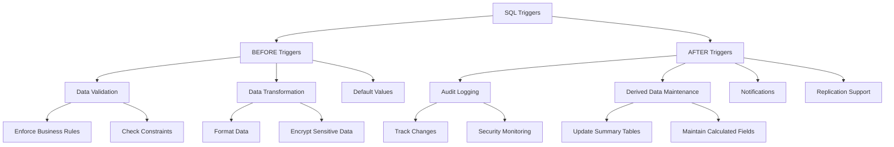

# SQL Triggers Basics

## Introduction

SQL triggers are special types of stored procedures that automatically execute (or are "triggered") in response to specific events occurring in the database. Think of triggers as watchful guardians that spring into action when certain database operations happen—like inserting a new record, updating existing data, or deleting information.

Triggers are powerful tools that allow you to implement complex business rules, maintain data integrity, enforce constraints, and automate processes directly at the database level. They're especially useful for tasks that should always happen consistently whenever data changes.

## What Are SQL Triggers?

A trigger is a database object that is associated with a table and activates when a particular event (such as INSERT, UPDATE, DELETE) occurs on that table. When the specified event happens, the database automatically executes the trigger code without requiring explicit calls from applications.

### Key Characteristics of Triggers

- **Event-Driven**: They execute automatically in response to predefined events
- **Table Association**: Each trigger is associated with a specific table
- **Timing Options**: Can run BEFORE or AFTER the triggering event
- **Row or Statement Level**: Can execute once per modified row or once per SQL statement
- **Invisible to Applications**: Applications don't need to know triggers exist

## Types of Triggers

Triggers are classified based on:

1. The triggering event (what action causes the trigger to fire)
2. The timing (when the trigger executes relative to the triggering event)

### Trigger Events

The most common events that can activate triggers are:

- **INSERT**: When new data is added to a table
- **UPDATE**: When existing data in a table is modified
- **DELETE**: When records are removed from a table

### Trigger Timing

Triggers can execute at different times relative to the triggering event:

- **BEFORE triggers**: Execute before the triggering event (useful for validating or modifying data before it's committed)
- **AFTER triggers**: Execute after the triggering event (useful for logging changes or cascading updates)

### Row-Level vs. Statement-Level Triggers

- **Row-Level Triggers**: Execute once for each row affected by the triggering SQL statement
- **Statement-Level Triggers**: Execute once for each triggering SQL statement, regardless of how many rows are affected

## Basic Trigger Syntax

The basic syntax for creating a trigger varies slightly between database systems, but generally follows this pattern:

```sql
CREATE TRIGGER trigger_name
{BEFORE | AFTER} {INSERT | UPDATE | DELETE} ON table_name
[FOR EACH ROW]
BEGIN
    -- Trigger body: SQL statements to execute
END;
```

Let's break down the key components:

- `CREATE TRIGGER trigger_name`: Names your trigger
- `{BEFORE | AFTER}`: Specifies when the trigger should execute
- `{INSERT | UPDATE | DELETE}`: Defines what event activates the trigger
- `ON table_name`: Identifies which table the trigger monitors
- `[FOR EACH ROW]`: Optional clause that makes it a row-level trigger (if omitted, it's a statement-level trigger)
- `BEGIN...END`: Contains the SQL statements to execute when the trigger fires

## Basic Examples

Let's look at some practical examples to understand how triggers work.

### Example 1: Logging Changes with an AFTER INSERT Trigger

This trigger records information about new employees added to an `employees` table:

```sql
CREATE TRIGGER log_new_employee
AFTER INSERT ON employees
FOR EACH ROW
BEGIN
    INSERT INTO employee_audit (employee_id, action, change_date)
    VALUES (NEW.employee_id, 'INSERT', NOW());
END;
```

**What happens:**
1. When a new record is inserted into the `employees` table
2. The trigger automatically fires after the insertion completes
3. It adds a new record to an `employee_audit` table with:
   - The ID of the newly inserted employee
   - The action type ('INSERT')
   - The current timestamp

**Input (what would trigger this):**
```sql
INSERT INTO employees (employee_id, first_name, last_name, hire_date)
VALUES (1001, 'John', 'Smith', '2023-06-15');
```

**Output (what gets automatically added to the audit table):**
```
employee_id | action | change_date
-----------+--------+---------------------
1001       | INSERT | 2023-06-15 14:32:45
```

### Example 2: Data Validation with a BEFORE UPDATE Trigger

This trigger prevents salary updates that exceed a 20% increase:

```sql
CREATE TRIGGER validate_salary_increase
BEFORE UPDATE ON employees
FOR EACH ROW
BEGIN
    IF NEW.salary > OLD.salary * 1.2 THEN
        SIGNAL SQLSTATE '45000' 
        SET MESSAGE_TEXT = 'Salary increase cannot exceed 20%';
    END IF;
END;
```

**What happens:**
1. Before any update to the `employees` table is committed
2. The trigger compares the new salary value to the old one
3. If the increase exceeds 20%, it raises an error and prevents the update

**Input (attempt that would be blocked):**
```sql
-- Assuming current salary is $50,000
UPDATE employees 
SET salary = 75000  -- This is a 50% increase
WHERE employee_id = 1001;
```

**Output (error returned to user):**
```
Error: Salary increase cannot exceed 20%
```

### Example 3: Maintaining Derived Data with AFTER UPDATE Trigger

This trigger automatically updates a department's total salary budget whenever an employee's salary changes:

```sql
CREATE TRIGGER update_dept_budget
AFTER UPDATE OF salary ON employees
FOR EACH ROW
BEGIN
    UPDATE departments
    SET total_salary_budget = (
        SELECT SUM(salary) 
        FROM employees 
        WHERE department_id = NEW.department_id
    )
    WHERE department_id = NEW.department_id;
END;
```

**What happens:**
1. After an employee's salary is updated
2. The trigger recalculates the total salary for all employees in that department
3. It updates the department's budget field with the new total

## Practical Applications of Triggers

Triggers have numerous practical applications in real-world database systems:

### 1. Audit Trails

Triggers can maintain comprehensive audit trails by recording who changed what data and when:

```sql
CREATE TRIGGER audit_customer_changes
AFTER UPDATE ON customers
FOR EACH ROW
BEGIN
    INSERT INTO audit_log (
        table_name,
        record_id,
        column_name,
        old_value,
        new_value,
        changed_by,
        changed_at
    )
    SELECT 
        'customers',
        NEW.customer_id,
        column_name,
        old_value,
        new_value,
        CURRENT_USER(),
        NOW()
    FROM (
        SELECT 'name' as column_name, OLD.name as old_value, NEW.name as new_value
        WHERE OLD.name != NEW.name
        UNION ALL
        SELECT 'email', OLD.email, NEW.email
        WHERE OLD.email != NEW.email
        UNION ALL
        SELECT 'phone', OLD.phone, NEW.phone
        WHERE OLD.phone != NEW.phone
    ) changed_columns;
END;
```

### 2. Enforcing Business Rules

Triggers can enforce complex business rules that go beyond simple constraints:

```sql
CREATE TRIGGER check_credit_limit
BEFORE INSERT ON orders
FOR EACH ROW
BEGIN
    DECLARE customer_balance DECIMAL(10,2);
    DECLARE customer_limit DECIMAL(10,2);
    
    SELECT current_balance, credit_limit 
    INTO customer_balance, customer_limit
    FROM customers 
    WHERE customer_id = NEW.customer_id;
    
    IF (customer_balance + NEW.order_amount) > customer_limit THEN
        SIGNAL SQLSTATE '45000'
        SET MESSAGE_TEXT = 'Order exceeds available credit';
    END IF;
END;
```

### 3. Cascading Updates

Triggers can maintain referential integrity by automatically propagating changes:

```sql
CREATE TRIGGER cascade_department_name_change
AFTER UPDATE OF department_name ON departments
FOR EACH ROW
BEGIN
    UPDATE employee_details
    SET department_name = NEW.department_name
    WHERE department_id = NEW.department_id;
END;
```

### 4. Automatic Timestamps

Triggers can automatically maintain created and modified timestamps:

```sql
CREATE TRIGGER set_timestamp
BEFORE UPDATE ON articles
FOR EACH ROW
BEGIN
    SET NEW.last_modified = NOW();
END;
```

## Trigger Design Considerations

When implementing triggers, keep these important considerations in mind:

### 1. Performance Impact

Triggers execute automatically and can affect the performance of the triggering operations. Complex trigger logic on frequently modified tables can lead to performance issues.

### 2. Trigger Chains

Triggers can activate other triggers, potentially creating a chain reaction. Be cautious about designing triggers that might trigger each other to avoid infinite loops.

### 3. Maintainability

Because triggers execute invisibly to applications, they can make debugging more challenging. Document your triggers thoroughly and use them judiciously.

### 4. Transaction Handling

Understand how triggers interact with transactions. If a trigger fails, it typically causes the entire transaction to roll back.

## Managing Triggers

### Viewing Existing Triggers

Most database systems provide ways to view existing triggers:

```sql
-- MySQL/MariaDB
SHOW TRIGGERS;

-- PostgreSQL
SELECT * FROM information_schema.triggers;

-- SQL Server
SELECT * FROM sys.triggers;

-- Oracle
SELECT * FROM user_triggers;
```

### Dropping Triggers

If you need to remove a trigger:

```sql
DROP TRIGGER trigger_name ON table_name;
```

### Disabling/Enabling Triggers

Some database systems allow you to temporarily disable triggers:

```sql
-- SQL Server
DISABLE TRIGGER trigger_name ON table_name;
ENABLE TRIGGER trigger_name ON table_name;

-- Oracle
ALTER TRIGGER trigger_name DISABLE;
ALTER TRIGGER trigger_name ENABLE;
```

## Common Trigger Use Cases

Here's a flowchart showing common use cases for different types of triggers:



## Summary

SQL triggers are powerful database objects that automatically execute in response to specific events. They enforce data integrity, implement business rules, maintain audit trails, and automate various database operations.

Key points to remember:
- Triggers are associated with tables and fire in response to INSERT, UPDATE, or DELETE operations
- They can execute BEFORE or AFTER the triggering event
- Triggers can be row-level (executing once per affected row) or statement-level
- They're useful for audit logging, data validation, maintaining derived data, and enforcing complex business rules
- While powerful, they should be used judiciously with consideration for performance and maintainability

## Exercises

1. Create a trigger that automatically sets a `last_updated` timestamp whenever a record is modified in a `products` table.

2. Design a trigger to maintain a running total of orders for each customer in a `customer_stats` table whenever new orders are added.

3. Implement an audit trigger that logs all deletions from an `employees` table, recording the deleted data and who performed the deletion.

4. Create a trigger that enforces a business rule where premium customers can place orders with higher values than regular customers.

## Additional Resources

- [MySQL Trigger Documentation](https://dev.mysql.com/doc/refman/8.0/en/trigger-syntax.html)
- [PostgreSQL Trigger Documentation](https://www.postgresql.org/docs/current/trigger-definition.html)
- [SQL Server Trigger Documentation](https://docs.microsoft.com/en-us/sql/t-sql/statements/create-trigger-transact-sql)
- [Oracle Trigger Documentation](https://docs.oracle.com/en/database/oracle/oracle-database/19/lnpls/CREATE-TRIGGER-statement.html)