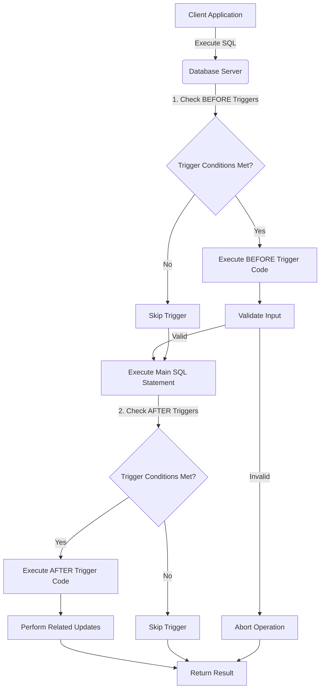

# SQL Creating Triggers

## Introduction

Triggers are special stored procedures in SQL that automatically execute in response to specific events on a particular table or view in a database. Think of triggers as guardians that are always watching your database, ready to take action when certain things happen. They're powerful tools for automating tasks, enforcing business rules, and maintaining data integrity.

In this tutorial, you'll learn:
- What SQL triggers are and why they're useful
- The syntax for creating triggers
- Different types of triggers and when to use them
- How to implement triggers with practical examples

## Understanding Triggers

Before we dive into creating triggers, let's understand what they are and when they're useful.

### What is a Trigger?

A trigger is a database object that is associated with a table and automatically executes (or "fires") when a specified event occurs on that table. These events include:

- **INSERT**: When new rows are added to a table
- **UPDATE**: When existing rows are modified
- **DELETE**: When rows are removed from a table

Triggers can execute **BEFORE** or **AFTER** these events, giving you precise control over when your code runs.

### Why Use Triggers?

Triggers serve several important purposes in database management:

1. **Data Validation**: Enforce complex business rules beyond simple constraints
2. **Auditing**: Track changes to your data automatically
3. **Automation**: Perform cascading updates or calculations automatically
4. **Data Integrity**: Ensure related tables stay synchronized

## Basic Trigger Syntax

While the exact syntax varies slightly between database systems (MySQL, PostgreSQL, SQL Server, Oracle), the core concepts remain similar. Let's look at the general structure:

```sql
CREATE TRIGGER trigger_name
{BEFORE | AFTER} {INSERT | UPDATE | DELETE} ON table_name
[FOR EACH ROW]
BEGIN
    -- Trigger logic goes here
END;
```

Let's break this down:

- `CREATE TRIGGER trigger_name`: Defines a new trigger with a unique name
- `{BEFORE | AFTER}`: Specifies when the trigger should fire
- `{INSERT | UPDATE | DELETE}`: Specifies which action activates the trigger
- `ON table_name`: Specifies which table the trigger monitors
- `[FOR EACH ROW]`: Makes the trigger fire once for each affected row (a "row-level trigger")
- `BEGIN ... END`: Contains the SQL statements to execute when the trigger fires

## Creating Different Types of Triggers

Let's explore how to create different types of triggers with examples.

### BEFORE INSERT Trigger

A BEFORE INSERT trigger executes before new records are inserted into a table. This is perfect for validating or modifying data before it enters your table.

#### Example: Validate Email Format

```sql
CREATE TRIGGER validate_email
BEFORE INSERT ON customers
FOR EACH ROW
BEGIN
    IF NEW.email NOT LIKE '%_@__%.__%' THEN
        SIGNAL SQLSTATE '45000' 
        SET MESSAGE_TEXT = 'Invalid email format';
    END IF;
END;
```

**What this does**: Before a new customer record is inserted, this trigger checks if the email follows a basic format. If not, it prevents the insertion and returns an error message.

**Input**:
```sql
INSERT INTO customers (name, email) VALUES ('John Doe', 'invalid-email');
```

**Output**:
```
Error: Invalid email format
```

### AFTER INSERT Trigger

An AFTER INSERT trigger runs after new records have been successfully inserted. This is useful for tasks that should happen after data is already stored.

#### Example: Create Audit Log

```sql
CREATE TRIGGER audit_new_customer
AFTER INSERT ON customers
FOR EACH ROW
BEGIN
    INSERT INTO customer_audit_log (
        customer_id, 
        action, 
        action_date
    ) VALUES (
        NEW.customer_id, 
        'INSERT', 
        NOW()
    );
END;
```

**What this does**: After a new customer is added, this trigger automatically creates an entry in an audit log table, recording who was added and when.

**Input**:
```sql
INSERT INTO customers (name, email) VALUES ('Jane Smith', 'jane@example.com');
```

**Result in audit_log table**:
```
| customer_id | action | action_date           |
|-------------|--------|------------------------|
| 15          | INSERT | 2023-05-14 10:23:47   |
```

### BEFORE UPDATE Trigger

A BEFORE UPDATE trigger runs before records are modified, allowing you to validate changes or modify the incoming data.

#### Example: Prevent Price Drops Over 50%

```sql
CREATE TRIGGER prevent_large_price_drop
BEFORE UPDATE ON products
FOR EACH ROW
BEGIN
    IF NEW.price < (OLD.price * 0.5) THEN
        SIGNAL SQLSTATE '45000' 
        SET MESSAGE_TEXT = 'Price cannot be reduced by more than 50%';
    END IF;
END;
```

**What this does**: Before a product price is updated, this trigger checks if the new price is less than half of the old price. If so, it prevents the update.

**Input**:
```sql
-- Original price is $100
UPDATE products SET price = 40 WHERE product_id = 123;
```

**Output**:
```
Error: Price cannot be reduced by more than 50%
```

### AFTER UPDATE Trigger

An AFTER UPDATE trigger executes after records have been modified, useful for responding to changes that have already occurred.

#### Example: Track Price History

```sql
CREATE TRIGGER track_price_changes
AFTER UPDATE ON products
FOR EACH ROW
BEGIN
    IF OLD.price != NEW.price THEN
        INSERT INTO price_history (
            product_id, 
            old_price, 
            new_price, 
            change_date
        ) VALUES (
            NEW.product_id, 
            OLD.price, 
            NEW.price, 
            NOW()
        );
    END IF;
END;
```

**What this does**: After a product price is updated, this trigger records the old and new prices in a price history table.

**Input**:
```sql
UPDATE products SET price = 110 WHERE product_id = 123;
```

**Result in price_history table**:
```
| product_id | old_price | new_price | change_date          |
|------------|-----------|-----------|----------------------|
| 123        | 100       | 110       | 2023-05-14 11:45:22  |
```

### BEFORE DELETE Trigger

A BEFORE DELETE trigger runs before records are removed, allowing you to validate the deletion or perform related actions.

#### Example: Prevent Deletion of Active Orders

```sql
CREATE TRIGGER prevent_active_order_deletion
BEFORE DELETE ON orders
FOR EACH ROW
BEGIN
    IF OLD.status = 'active' THEN
        SIGNAL SQLSTATE '45000' 
        SET MESSAGE_TEXT = 'Cannot delete active orders';
    END IF;
END;
```

**What this does**: Before an order is deleted, this trigger checks if it's active. If so, it prevents the deletion.

**Input**:
```sql
DELETE FROM orders WHERE order_id = 1001;
-- Assuming order 1001 has status = 'active'
```

**Output**:
```
Error: Cannot delete active orders
```

### AFTER DELETE Trigger

An AFTER DELETE trigger executes after records have been removed, useful for cleanup or logging.

#### Example: Archive Deleted Customer Data

```sql
CREATE TRIGGER archive_customer_data
AFTER DELETE ON customers
FOR EACH ROW
BEGIN
    INSERT INTO deleted_customers (
        customer_id,
        name,
        email,
        deletion_date
    ) VALUES (
        OLD.customer_id,
        OLD.name,
        OLD.email,
        NOW()
    );
END;
```

**What this does**: After a customer record is deleted, this trigger preserves their information in an archive table.

**Input**:
```sql
DELETE FROM customers WHERE customer_id = 42;
```

**Result in deleted_customers table**:
```
| customer_id | name      | email             | deletion_date        |
|-------------|-----------|-------------------|----------------------|
| 42          | John Doe  | john@example.com  | 2023-05-14 14:22:56  |
```

## Multi-Event Triggers

Some database systems allow you to create triggers that respond to multiple events.

### Example: Audit Trail for Multiple Events

In PostgreSQL, you can create a trigger for multiple events:

```sql
CREATE TRIGGER customer_audit
AFTER INSERT OR UPDATE OR DELETE ON customers
FOR EACH ROW
EXECUTE FUNCTION customer_audit_function();
```

Then define the function:

```sql
CREATE OR REPLACE FUNCTION customer_audit_function()
RETURNS TRIGGER AS $$
BEGIN
    IF TG_OP = 'INSERT' THEN
        INSERT INTO audit_log VALUES (NEW.customer_id, 'INSERT', NOW());
        RETURN NEW;
    ELSIF TG_OP = 'UPDATE' THEN
        INSERT INTO audit_log VALUES (NEW.customer_id, 'UPDATE', NOW());
        RETURN NEW;
    ELSIF TG_OP = 'DELETE' THEN
        INSERT INTO audit_log VALUES (OLD.customer_id, 'DELETE', NOW());
        RETURN OLD;
    END IF;
    RETURN NULL;
END;
$$ LANGUAGE plpgsql;
```

## Real-World Application: Inventory Management System

Let's build a practical example: an inventory management system that uses triggers to:
1. Automatically update stock levels when orders are placed
2. Alert when inventory falls below minimum levels
3. Keep a price history for reporting

### Step 1: Create necessary tables

```sql
-- Products table
CREATE TABLE products (
    product_id INT PRIMARY KEY,
    name VARCHAR(100),
    price DECIMAL(10,2),
    stock_quantity INT,
    min_stock_level INT
);

-- Orders table
CREATE TABLE orders (
    order_id INT PRIMARY KEY,
    order_date DATETIME
);

-- Order items table
CREATE TABLE order_items (
    order_id INT,
    product_id INT,
    quantity INT,
    PRIMARY KEY (order_id, product_id),
    FOREIGN KEY (order_id) REFERENCES orders(order_id),
    FOREIGN KEY (product_id) REFERENCES products(product_id)
);

-- Inventory alerts table
CREATE TABLE inventory_alerts (
    alert_id INT AUTO_INCREMENT PRIMARY KEY,
    product_id INT,
    message VARCHAR(200),
    alert_date DATETIME,
    FOREIGN KEY (product_id) REFERENCES products(product_id)
);

-- Price history table
CREATE TABLE price_history (
    history_id INT AUTO_INCREMENT PRIMARY KEY,
    product_id INT,
    old_price DECIMAL(10,2),
    new_price DECIMAL(10,2),
    change_date DATETIME,
    FOREIGN KEY (product_id) REFERENCES products(product_id)
);
```

### Step 2: Create triggers for the system

#### Update Stock Trigger

```sql
CREATE TRIGGER update_stock_after_order
AFTER INSERT ON order_items
FOR EACH ROW
BEGIN
    -- Reduce stock quantity
    UPDATE products 
    SET stock_quantity = stock_quantity - NEW.quantity
    WHERE product_id = NEW.product_id;
END;
```

#### Low Stock Alert Trigger

```sql
CREATE TRIGGER check_stock_level
AFTER UPDATE ON products
FOR EACH ROW
BEGIN
    -- Check if stock is below minimum level
    IF NEW.stock_quantity < NEW.min_stock_level AND OLD.stock_quantity >= OLD.min_stock_level THEN
        INSERT INTO inventory_alerts (
            product_id,
            message,
            alert_date
        ) VALUES (
            NEW.product_id,
            CONCAT('Low stock alert: ', NEW.name, ' (', NEW.stock_quantity, ' remaining)'),
            NOW()
        );
    END IF;
END;
```

#### Price Change History Trigger

```sql
CREATE TRIGGER track_price_history
AFTER UPDATE ON products
FOR EACH ROW
BEGIN
    -- If price changed, record it
    IF OLD.price != NEW.price THEN
        INSERT INTO price_history (
            product_id,
            old_price,
            new_price,
            change_date
        ) VALUES (
            NEW.product_id,
            OLD.price,
            NEW.price,
            NOW()
        );
    END IF;
END;
```

### Step 3: Watch the system in action

```sql
-- Add a product
INSERT INTO products VALUES (1, 'Laptop', 1200.00, 20, 5);

-- Create an order
INSERT INTO orders VALUES (101, NOW());

-- Add items to the order
INSERT INTO order_items VALUES (101, 1, 3);

-- The update_stock_after_order trigger automatically reduces stock to 17

-- Let's reduce stock further
INSERT INTO orders VALUES (102, NOW());
INSERT INTO order_items VALUES (102, 1, 13);

-- Now stock = 4, which is below min_stock_level (5)
-- The check_stock_level trigger automatically creates an alert

-- Update price
UPDATE products SET price = 1299.99 WHERE product_id = 1;

-- The track_price_history trigger automatically records this change
```

## Viewing Triggers

To see what triggers exist in your database, you can use system tables or views. The command varies by database system:

**MySQL**:
```sql
SHOW TRIGGERS;
```

**PostgreSQL**:
```sql
SELECT * FROM information_schema.triggers;
```

**SQL Server**:
```sql
SELECT * FROM sys.triggers;
```

**Oracle**:
```sql
SELECT * FROM USER_TRIGGERS;
```

## Dropping Triggers

If you need to remove a trigger, use the DROP TRIGGER command:

```sql
DROP TRIGGER trigger_name ON table_name;
```

## Best Practices for Using Triggers

When implementing triggers, follow these best practices:

1. **Keep them simple**: Complex logic in triggers can be hard to debug
2. **Document extensively**: Comment your trigger code and keep external documentation
3. **Be cautious with recursive triggers**: Triggers that cause other triggers to fire can lead to unintended consequences
4. **Use appropriate timing**: Choose BEFORE triggers for validation and AFTER triggers for related updates
5. **Consider performance**: Triggers execute for each affected row, so they can impact performance with large operations
6. **Don't overuse**: Not everything needs to be a trigger; consider stored procedures for complex operations

## Visualizing Trigger Execution Flow

Here's a diagram showing the typical flow of trigger execution:



## Summary

SQL triggers are powerful tools for automating database actions and enforcing business rules. In this tutorial, you've learned:

- Triggers are database objects that execute automatically in response to specific events
- How to create different types of triggers (BEFORE and AFTER for INSERT, UPDATE, and DELETE)
- Real-world applications of triggers, including inventory management
- Best practices for implementing triggers effectively

By using triggers appropriately, you can create more intelligent, self-maintaining database systems that enforce your business rules automatically.

## Additional Resources and Exercises

### Resources

- [MySQL Triggers Documentation](https://dev.mysql.com/doc/refman/8.0/en/triggers.html)
- [PostgreSQL Triggers Documentation](https://www.postgresql.org/docs/current/trigger-definition.html)
- [SQL Server Triggers Documentation](https://learn.microsoft.com/en-us/sql/t-sql/statements/create-trigger-transact-sql)

### Exercises

1. **Basic Trigger**: Create a BEFORE INSERT trigger on a users table that automatically converts email addresses to lowercase.

2. **Data Validation**: Create a trigger that ensures a product's price cannot be set to zero or negative.

3. **Audit System**: Implement a complete audit system for a customers table that tracks all changes (inserts, updates, and deletes) to the table.

4. **Challenge**: Implement a trigger-based inventory system that automatically creates a purchase order when stock falls below a certain threshold.