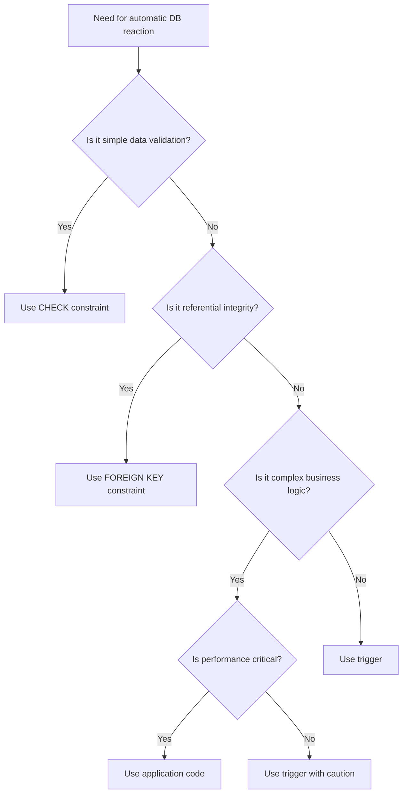

# SQL Trigger Best Practices

## Introduction

SQL triggers are powerful database objects that automatically execute when specific events occur in a database table. They can be invaluable for enforcing business rules, maintaining data integrity, and automating tasks. However, with great power comes great responsibility! Poorly implemented triggers can lead to performance issues, unexpected behavior, and maintenance nightmares.

This guide explores best practices for designing, implementing, and maintaining SQL triggers to ensure they enhance—rather than hinder—your database applications.

## Fundamental Trigger Concepts Recap

Before diving into best practices, let's quickly review what triggers are and how they work:

- **Definition**: A trigger is a stored procedure that automatically executes in response to certain events on a particular table.
- **Events**: Typically INSERT, UPDATE, or DELETE operations.
- **Timing**: Triggers can run BEFORE, AFTER, or INSTEAD OF the triggering event.
- **Scope**: Row-level triggers execute once for each affected row, while statement-level triggers execute once per triggering statement.

## Best Practices for Trigger Design

### 1. Use Triggers Sparingly

**Best Practice**: Implement triggers only when absolutely necessary.

```sql
-- ❌ Bad practice: Using a trigger for simple data transformation
CREATE TRIGGER trg_ConvertToUppercase
BEFORE INSERT ON customers
FOR EACH ROW
SET NEW.customer_name = UPPER(NEW.customer_name);

-- ✅ Better approach: Handle this in the application code or use a computed column
```

**Why it matters**: Every trigger adds processing overhead to DML operations. The more triggers you have, the slower your database operations become. Consider alternatives like:
- Check constraints
- Foreign key constraints
- Application-level validation
- Stored procedures

### 2. Keep Triggers Lightweight and Focused

**Best Practice**: Each trigger should have a single, clear responsibility.

```sql
-- ❌ Bad practice: A trigger doing multiple unrelated tasks
CREATE TRIGGER trg_CustomerChanges
AFTER UPDATE ON customers
FOR EACH ROW
BEGIN
    INSERT INTO audit_log VALUES (NEW.customer_id, 'Updated', NOW());
    UPDATE statistics SET customer_updates = customer_updates + 1;
    IF NEW.status = 'Premium' THEN
        INSERT INTO premium_customers VALUES (NEW.customer_id);
    END IF;
END;

-- ✅ Better approach: Separate triggers for each distinct purpose
CREATE TRIGGER trg_CustomerAudit
AFTER UPDATE ON customers
FOR EACH ROW
    INSERT INTO audit_log VALUES (NEW.customer_id, 'Updated', NOW());
```

**Why it matters**: Focused triggers are easier to understand, debug, and maintain.

### 3. Avoid Recursive or Cascading Triggers

**Best Practice**: Design triggers to avoid recursion and minimize cascading effects.

```sql
-- ❌ Dangerous pattern that could cause recursion
CREATE TRIGGER trg_UpdateModifiedDate
AFTER UPDATE ON products
FOR EACH ROW
    UPDATE products SET last_modified = NOW() WHERE id = NEW.id; -- This causes the trigger to fire again!

-- ✅ Better approach: Use the NEW value directly in the trigger
CREATE TRIGGER trg_SetModifiedDate
BEFORE UPDATE ON products
FOR EACH ROW
    SET NEW.last_modified = NOW();
```

**Why it matters**: Recursive triggers can cause infinite loops and crash your database server. In most database systems, there's a default recursion limit, but hitting it will cause errors.

### 4. Document Triggers Thoroughly

**Best Practice**: Include detailed comments explaining the trigger's purpose, logic, and any dependencies.

```sql
-- ✅ Good practice: Well-documented trigger
/*
 * Trigger: trg_EnforceOrderTotal
 * Purpose: Ensures the order_total is always equal to the sum of all line items
 * Created: 2023-04-15 by Jane Smith
 * Modified: 2023-10-22 by John Doe - Added tax calculation
 * Tables affected: orders, order_items
 * Notes: This trigger recalculates the total instead of trusting the provided value
 */
CREATE TRIGGER trg_EnforceOrderTotal
BEFORE INSERT ON orders
FOR EACH ROW
BEGIN
    DECLARE calculated_total DECIMAL(10,2);
    
    SELECT SUM(price * quantity) INTO calculated_total
    FROM order_items
    WHERE order_id = NEW.id;
    
    SET NEW.order_total = calculated_total + (calculated_total * NEW.tax_rate);
END;
```

**Why it matters**: Triggers often work "behind the scenes," making their behavior non-obvious to developers who didn't create them. Good documentation is crucial for maintainability.

## Performance Optimization

### 5. Minimize Database Queries Within Triggers

**Best Practice**: Avoid complex or numerous database queries inside triggers.

```sql
-- ❌ Bad practice: Complex query in a row-level trigger
CREATE TRIGGER trg_CheckInventory
AFTER INSERT ON order_items
FOR EACH ROW
BEGIN
    DECLARE available INT;
    SELECT inventory_count INTO available 
    FROM products 
    WHERE product_id = NEW.product_id;
    
    IF available < NEW.quantity THEN
        SIGNAL SQLSTATE '45000' 
        SET MESSAGE_TEXT = 'Insufficient inventory';
    END IF;
    
    UPDATE products 
    SET inventory_count = inventory_count - NEW.quantity 
    WHERE product_id = NEW.product_id;
END;

-- ✅ Better approach: Use a single statement-level trigger or handle in a stored procedure
```

**Why it matters**: For operations affecting many rows, row-level triggers with queries can execute hundreds or thousands of unnecessary database operations.

### 6. Consider Statement-Level vs. Row-Level Triggers

**Best Practice**: Use statement-level triggers when possible, especially for operations affecting many rows.

```sql
-- In PostgreSQL, a statement-level trigger example:
CREATE TRIGGER trg_AuditBulkUpdates
AFTER UPDATE ON products
EXECUTE PROCEDURE log_bulk_updates();
```

**Why it matters**: Statement-level triggers execute once per statement, regardless of how many rows are affected, making them more efficient for bulk operations.

### 7. Be Mindful of Trigger Order

**Best Practice**: Understand and control the order in which multiple triggers on the same table execute.

```sql
-- In SQL Server, specifying trigger order
CREATE TRIGGER trg_FirstToExecute
ON customers
AFTER UPDATE
WITH EXECUTE AS CALLER
AS
BEGIN
    -- Logic here
END;
GO

-- Make this trigger execute first
EXEC sp_settriggerorder 
    @triggername = 'trg_FirstToExecute', 
    @order = 'First', 
    @stmttype = 'UPDATE';
```

**Why it matters**: When multiple triggers are defined for the same event on the same table, the execution order matters and can lead to subtle bugs if not controlled.

## Error Handling and Testing

### 8. Implement Proper Error Handling

**Best Practice**: Include error handling in your triggers, especially for more complex logic.

```sql
-- In MySQL
CREATE TRIGGER trg_ValidateContact
BEFORE INSERT ON contacts
FOR EACH ROW
BEGIN
    DECLARE error_msg VARCHAR(255);
    
    IF NEW.email IS NULL AND NEW.phone IS NULL THEN
        SET error_msg = 'Either email or phone must be provided';
        SIGNAL SQLSTATE '45000' SET MESSAGE_TEXT = error_msg;
    END IF;
END;
```

**Why it matters**: Without proper error handling, triggers may fail silently or with generic errors that are difficult to troubleshoot.

### 9. Thoroughly Test Triggers

**Best Practice**: Create comprehensive tests for your triggers, including edge cases.

Test scenarios should include:
- Single row operations
- Bulk operations
- Boundary conditions
- Error scenarios
- Concurrent operations

**Why it matters**: Triggers execute automatically and may not be immediately visible in application logs, making runtime issues difficult to diagnose without prior testing.

## Practical Examples

### Example 1: Audit Logging Best Practice

```sql
-- ✅ Good audit logging trigger
CREATE TRIGGER trg_CustomerAudit
AFTER INSERT OR UPDATE OR DELETE ON customers
FOR EACH ROW
BEGIN
    DECLARE operation VARCHAR(10);
    
    IF TG_OP = 'INSERT' THEN
        operation := 'INSERT';
        INSERT INTO audit_log (table_name, record_id, operation, changed_at, changed_by, old_data, new_data)
        VALUES ('customers', NEW.id, operation, NOW(), current_user, NULL, row_to_json(NEW));
    ELSIF TG_OP = 'UPDATE' THEN
        operation := 'UPDATE';
        INSERT INTO audit_log (table_name, record_id, operation, changed_at, changed_by, old_data, new_data)
        VALUES ('customers', NEW.id, operation, NOW(), current_user, row_to_json(OLD), row_to_json(NEW));
    ELSIF TG_OP = 'DELETE' THEN
        operation := 'DELETE';
        INSERT INTO audit_log (table_name, record_id, operation, changed_at, changed_by, old_data, new_data)
        VALUES ('customers', OLD.id, operation, NOW(), current_user, row_to_json(OLD), NULL);
    END IF;
END;
```

This trigger efficiently logs all changes to the customers table with minimal code duplication and comprehensive data capture.

### Example 2: Data Validation Best Practice

```sql
-- ✅ Good validation trigger
CREATE TRIGGER trg_ValidateOrder
BEFORE INSERT OR UPDATE ON orders
FOR EACH ROW
BEGIN
    -- Check for negative totals
    IF NEW.total_amount < 0 THEN
        SIGNAL SQLSTATE '45000' 
        SET MESSAGE_TEXT = 'Order total cannot be negative';
    END IF;
    
    -- Ensure order date is not in the future
    IF NEW.order_date > CURRENT_DATE THEN
        SIGNAL SQLSTATE '45000' 
        SET MESSAGE_TEXT = 'Order date cannot be in the future';
    END IF;
    
    -- Validate discount percentage
    IF NEW.discount_percent < 0 OR NEW.discount_percent > 100 THEN
        SIGNAL SQLSTATE '45000' 
        SET MESSAGE_TEXT = 'Discount must be between 0 and 100 percent';
    END IF;
END;
```

This trigger performs multiple validations in a single, focused trigger with clear error messages.

## When to Avoid Triggers

Triggers are not always the best solution. Consider alternatives in these scenarios:

1. **Simple referential integrity**: Use foreign keys instead
2. **Data validation**: Consider CHECK constraints for simple validations
3. **Application-specific logic**: May be better handled in application code
4. **Complex business rules**: Consider stored procedures that can be explicitly called
5. **High-volume OLTP systems**: Triggers add overhead that may impact performance



## Maintenance and Monitoring

### 10. Regularly Review and Refactor Triggers

**Best Practice**: Periodically review your triggers to ensure they're still necessary and optimized.

Questions to ask during review:
- Is this trigger still needed?
- Could it be replaced with a simpler alternative?
- Has performance degraded as data volume increased?
- Is the logic still correct given any business rule changes?

**Why it matters**: Over time, triggers can become outdated or unnecessary as requirements change.

### 11. Monitor Trigger Performance

**Best Practice**: Include triggers in your database performance monitoring strategy.

```sql
-- In PostgreSQL, finding slow triggers
SELECT trigger_name, execution_time
FROM pg_stat_user_triggers
ORDER BY execution_time DESC;
```

**Why it matters**: Performance issues with triggers can be difficult to diagnose without specific monitoring.

## Summary

SQL triggers are powerful tools that can enhance database functionality when used appropriately. By following these best practices, you can harness their power while avoiding common pitfalls:

1. Use triggers sparingly and only when necessary
2. Keep triggers lightweight and focused on a single responsibility
3. Avoid recursive or cascading triggers
4. Document triggers thoroughly
5. Minimize database queries within triggers
6. Consider statement-level vs. row-level triggers based on your needs
7. Be mindful of trigger execution order
8. Implement proper error handling
9. Thoroughly test triggers with various scenarios
10. Regularly review and refactor your triggers
11. Monitor trigger performance as part of your database maintenance

Remember that the best trigger is often the one you don't need to write. Always consider simpler alternatives before implementing a trigger.

## Additional Resources

- [PostgreSQL Trigger Documentation](https://www.postgresql.org/docs/current/triggers.html)
- [MySQL Trigger Documentation](https://dev.mysql.com/doc/refman/8.0/en/triggers.html)
- [SQL Server Trigger Documentation](https://docs.microsoft.com/en-us/sql/t-sql/statements/create-trigger-transact-sql)
- [Oracle Trigger Documentation](https://docs.oracle.com/en/database/oracle/oracle-database/19/lnpls/CREATE-TRIGGER-statement.html)

## Exercises

1. **Review Exercise**: Examine the following trigger and identify three ways it could be improved:
   ```sql
   CREATE TRIGGER update_everything
   AFTER UPDATE ON customers
   FOR EACH ROW
   BEGIN
       UPDATE orders SET last_modified = NOW() WHERE customer_id = NEW.id;
       UPDATE shipping SET status = 'REVIEW' WHERE order_id IN 
           (SELECT id FROM orders WHERE customer_id = NEW.id);
       INSERT INTO customer_log VALUES (NEW.id, 'Updated', NOW());
   END;
   ```

2. **Design Exercise**: Design a trigger that would maintain a running total of inventory value (price × quantity) in a summary table whenever products are added, updated, or removed from inventory.

3. **Refactoring Exercise**: Convert this row-level trigger to a more efficient statement-level trigger:
   ```sql
   CREATE TRIGGER log_each_change
   AFTER UPDATE ON employee_salaries
   FOR EACH ROW
   BEGIN
       INSERT INTO salary_change_log (employee_id, old_salary, new_salary, change_date)
       VALUES (NEW.employee_id, OLD.salary, NEW.salary, CURRENT_DATE);
   END;
   ```

4. **Testing Exercise**: Write a test plan for a trigger that enforces business hours (9 AM to 5 PM) for certain operations in a banking system.