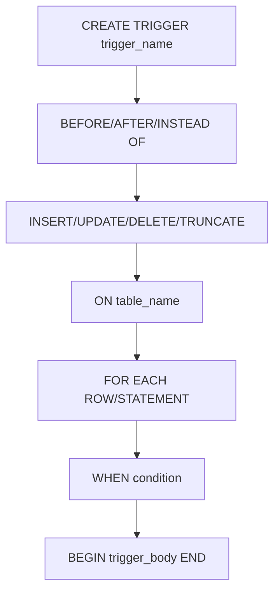

# SQL Types of Triggers

## Introduction

Triggers are special stored procedures in SQL that automatically execute in response to specific events on a particular table or view in a database. They are powerful tools that help maintain data integrity, enforce business rules, audit changes, and automate processes.

In this tutorial, we'll explore the various types of SQL triggers, their use cases, and how to implement them with practical examples. By the end, you'll have a solid understanding of when and how to use different trigger types in your database applications.

## Types of SQL Triggers

SQL triggers can be categorized based on two main criteria:

1. **When they execute**: `BEFORE`, `AFTER`, or `INSTEAD OF` an event
2. **What level they operate on**: Row-level or Statement-level

Let's examine each type in detail.

### Timing: When Triggers Execute

#### BEFORE Triggers

BEFORE triggers execute before the triggering event (INSERT, UPDATE, or DELETE) occurs. They are useful for:

- Validating or modifying input data before it's written to the database
- Enforcing complex business rules that can't be handled by constraints alone
- Automatically setting values for certain columns

```sql
-- Example: BEFORE INSERT trigger to validate email format
CREATE TRIGGER validate_email_before_insert
BEFORE INSERT ON users
FOR EACH ROW
BEGIN
  IF NEW.email NOT REGEXP '^[A-Za-z0-9._%+-]+@[A-Za-z0-9.-]+\.[A-Za-z]{2,}$' THEN
    SIGNAL SQLSTATE '45000'
    SET MESSAGE_TEXT = 'Invalid email format';
  END IF;
END;
```

When you try to insert a record with an invalid email:

```sql
INSERT INTO users (username, email) VALUES ('john_doe', 'invalid-email');
```

Output:
```
Error: Invalid email format
```

#### AFTER Triggers

AFTER triggers execute after the triggering event completes successfully. They are ideal for:

- Maintaining summary tables or calculated fields
- Logging changes for audit purposes
- Initiating additional processes after data changes

```sql
-- Example: AFTER INSERT trigger to update a count in another table
CREATE TRIGGER update_product_count
AFTER INSERT ON products
FOR EACH ROW
BEGIN
  UPDATE category_stats
  SET product_count = product_count + 1
  WHERE category_id = NEW.category_id;
END;
```

When you insert a new product:

```sql
INSERT INTO products (name, price, category_id) 
VALUES ('Widget Pro', 29.99, 3);
```

The `category_stats` table is automatically updated to increment the count for category 3.

#### INSTEAD OF Triggers

INSTEAD OF triggers replace the triggering action with custom logic. They are primarily used with views that aren't directly updatable. These triggers allow you to:

- Provide update capabilities to complex views
- Redirect operations to different tables
- Implement custom insert/update/delete logic

```sql
-- Example: INSTEAD OF INSERT trigger on a view
CREATE VIEW employee_department_view AS
SELECT e.id, e.name, e.salary, d.name as department
FROM employees e
JOIN departments d ON e.department_id = d.id;

CREATE TRIGGER employee_view_insert
INSTEAD OF INSERT ON employee_department_view
FOR EACH ROW
BEGIN
  -- First get the department_id or create a new department
  DECLARE dept_id INT;
  
  SELECT id INTO dept_id FROM departments 
  WHERE name = NEW.department LIMIT 1;
  
  IF dept_id IS NULL THEN
    INSERT INTO departments (name) VALUES (NEW.department);
    SET dept_id = LAST_INSERT_ID();
  END IF;
  
  -- Then insert the employee with the proper department_id
  INSERT INTO employees (name, salary, department_id)
  VALUES (NEW.name, NEW.salary, dept_id);
END;
```

When you insert into the view:

```sql
INSERT INTO employee_department_view (name, salary, department)
VALUES ('Jane Smith', 75000, 'Marketing');
```

The trigger handles the actual insertion into the underlying tables.

### Level: Row vs Statement Triggers

#### Row-Level Triggers

Row-level triggers (denoted by `FOR EACH ROW`) execute once for each row affected by the triggering statement. They:

- Have access to the OLD and NEW values of the row
- Can examine or modify the data being inserted/updated
- Execute multiple times if multiple rows are affected

```sql
-- Example: Row-level trigger to maintain a price history
CREATE TRIGGER track_price_changes
AFTER UPDATE ON products
FOR EACH ROW
BEGIN
  IF OLD.price != NEW.price THEN
    INSERT INTO price_history (product_id, old_price, new_price, change_date)
    VALUES (NEW.id, OLD.price, NEW.price, NOW());
  END IF;
END;
```

#### Statement-Level Triggers

Statement-level triggers execute once per triggering SQL statement, regardless of how many rows are affected. They:

- Cannot access the OLD or NEW values of individual rows
- Are more efficient when you don't need to examine individual rows
- Execute only once per statement

```sql
-- Example: Statement-level trigger (in PostgreSQL syntax)
CREATE TRIGGER log_bulk_delete
AFTER DELETE ON customers
EXECUTE PROCEDURE log_customer_deletion();

-- The associated function
CREATE OR REPLACE FUNCTION log_customer_deletion()
RETURNS TRIGGER AS $$
BEGIN
  INSERT INTO admin_logs (action, table_name, timestamp, user_id)
  VALUES ('BULK DELETE', 'customers', NOW(), current_user);
  RETURN NULL;
END;
$$ LANGUAGE plpgsql;
```

## Trigger Activation Events

Triggers can respond to the following events:

- **INSERT**: When new data is added to a table
- **UPDATE**: When existing data is modified
- **DELETE**: When data is removed from a table
- **TRUNCATE**: When a table is truncated (in some database systems)

You can also create triggers that activate on multiple events:

```sql
-- Example: Trigger that activates on both INSERT and UPDATE
CREATE TRIGGER check_salary_changes
BEFORE INSERT OR UPDATE ON employees
FOR EACH ROW
BEGIN
  IF NEW.salary < 0 THEN
    SIGNAL SQLSTATE '45000' 
    SET MESSAGE_TEXT = 'Salary cannot be negative';
  END IF;
END;
```

## Trigger Anatomy and Syntax

The general syntax for creating triggers varies slightly between database systems, but typically follows this pattern:



Let's break down a complete trigger definition:

```sql
CREATE TRIGGER update_last_modified
BEFORE UPDATE ON articles
FOR EACH ROW
WHEN (OLD.content != NEW.content)
BEGIN
  SET NEW.last_modified = CURRENT_TIMESTAMP;
  SET NEW.version = OLD.version + 1;
END;
```

Key components:
- **Name**: `update_last_modified`
- **Timing**: `BEFORE`
- **Event**: `UPDATE`
- **Table**: `articles`
- **Level**: `FOR EACH ROW` (row-level)
- **Condition**: `WHEN (OLD.content != NEW.content)`
- **Action**: Updates timestamp and increments version

## Special Trigger Variables

Most database systems provide special variables or references that allow triggers to access the data being modified:

- **NEW**: References the new row for INSERT and UPDATE operations
- **OLD**: References the existing row for UPDATE and DELETE operations

Different databases may use slightly different syntax:
- MySQL/MariaDB: `NEW.column_name` and `OLD.column_name`
- PostgreSQL: `NEW.column_name` and `OLD.column_name`
- Oracle: `:new.column_name` and `:old.column_name`
- SQL Server: `inserted.column_name` and `deleted.column_name`

## Practical Examples of Triggers

### 1. Audit Trail Trigger

This trigger maintains an audit trail of all changes to a sensitive table:

```sql
CREATE TABLE employees (
  id INT PRIMARY KEY,
  name VARCHAR(100),
  position VARCHAR(100),
  salary DECIMAL(10,2)
);

CREATE TABLE employee_audit (
  audit_id INT AUTO_INCREMENT PRIMARY KEY,
  employee_id INT,
  action VARCHAR(20),
  changed_by VARCHAR(100),
  change_timestamp DATETIME,
  old_values TEXT,
  new_values TEXT
);

-- Audit trigger for INSERT
CREATE TRIGGER employee_audit_insert
AFTER INSERT ON employees
FOR EACH ROW
BEGIN
  INSERT INTO employee_audit (
    employee_id, action, changed_by, change_timestamp, old_values, new_values
  )
  VALUES (
    NEW.id, 
    'INSERT', 
    CURRENT_USER(), 
    NOW(),
    NULL, 
    CONCAT('{"name":"', NEW.name, '", "position":"', NEW.position, '", "salary":', NEW.salary, '}')
  );
END;

-- Audit trigger for UPDATE
CREATE TRIGGER employee_audit_update
AFTER UPDATE ON employees
FOR EACH ROW
BEGIN
  INSERT INTO employee_audit (
    employee_id, action, changed_by, change_timestamp, old_values, new_values
  )
  VALUES (
    NEW.id, 
    'UPDATE', 
    CURRENT_USER(), 
    NOW(),
    CONCAT('{"name":"', OLD.name, '", "position":"', OLD.position, '", "salary":', OLD.salary, '}'),
    CONCAT('{"name":"', NEW.name, '", "position":"', NEW.position, '", "salary":', NEW.salary, '}')
  );
END;

-- Audit trigger for DELETE
CREATE TRIGGER employee_audit_delete
AFTER DELETE ON employees
FOR EACH ROW
BEGIN
  INSERT INTO employee_audit (
    employee_id, action, changed_by, change_timestamp, old_values, new_values
  )
  VALUES (
    OLD.id, 
    'DELETE', 
    CURRENT_USER(), 
    NOW(),
    CONCAT('{"name":"', OLD.name, '", "position":"', OLD.position, '", "salary":', OLD.salary, '}'),
    NULL
  );
END;
```

### 2. Automatic Inventory Management

This example shows how triggers can help maintain inventory levels:

```sql
CREATE TABLE products (
  id INT PRIMARY KEY,
  name VARCHAR(100),
  price DECIMAL(10,2),
  stock_quantity INT
);

CREATE TABLE orders (
  id INT PRIMARY KEY,
  customer_id INT,
  order_date DATETIME DEFAULT NOW()
);

CREATE TABLE order_items (
  order_id INT,
  product_id INT,
  quantity INT,
  PRIMARY KEY (order_id, product_id),
  FOREIGN KEY (order_id) REFERENCES orders(id),
  FOREIGN KEY (product_id) REFERENCES products(id)
);

-- Trigger to update inventory when order is placed
CREATE TRIGGER update_inventory
AFTER INSERT ON order_items
FOR EACH ROW
BEGIN
  UPDATE products
  SET stock_quantity = stock_quantity - NEW.quantity
  WHERE id = NEW.product_id;
  
  -- Optional: Check if we need to reorder
  IF (SELECT stock_quantity FROM products WHERE id = NEW.product_id) < 10 THEN
    INSERT INTO reorder_alerts (product_id, alert_date, current_stock)
    VALUES (NEW.product_id, NOW(), (SELECT stock_quantity FROM products WHERE id = NEW.product_id));
  END IF;
END;
```

### 3. Maintaining Calculated Fields

This trigger keeps a calculated field up-to-date:

```sql
CREATE TABLE order_details (
  order_id INT,
  product_id INT,
  quantity INT,
  unit_price DECIMAL(10,2),
  PRIMARY KEY (order_id, product_id)
);

CREATE TABLE orders (
  id INT PRIMARY KEY,
  customer_id INT,
  order_date DATETIME,
  total_amount DECIMAL(10,2) DEFAULT 0
);

-- Trigger to update order total on insert
CREATE TRIGGER update_order_total_insert
AFTER INSERT ON order_details
FOR EACH ROW
BEGIN
  UPDATE orders
  SET total_amount = total_amount + (NEW.quantity * NEW.unit_price)
  WHERE id = NEW.order_id;
END;

-- Trigger to update order total on update
CREATE TRIGGER update_order_total_update
AFTER UPDATE ON order_details
FOR EACH ROW
BEGIN
  UPDATE orders
  SET total_amount = total_amount - (OLD.quantity * OLD.unit_price) + (NEW.quantity * NEW.unit_price)
  WHERE id = NEW.order_id;
END;

-- Trigger to update order total on delete
CREATE TRIGGER update_order_total_delete
AFTER DELETE ON order_details
FOR EACH ROW
BEGIN
  UPDATE orders
  SET total_amount = total_amount - (OLD.quantity * OLD.unit_price)
  WHERE id = OLD.order_id;
END;
```

## Database-Specific Variations

Different database systems have their own implementations of triggers with unique features:

### MySQL/MariaDB

- Supports `BEFORE` and `AFTER` triggers
- Uses `NEW` and `OLD` references
- Doesn't support statement-level triggers (all are row-level)

```sql
DELIMITER //
CREATE TRIGGER example_mysql_trigger
BEFORE INSERT ON table_name
FOR EACH ROW
BEGIN
  -- Trigger logic here
END//
DELIMITER ;
```

### PostgreSQL

- Supports `BEFORE`, `AFTER`, and `INSTEAD OF` triggers
- Can have statement-level or row-level triggers
- Uses functions to define trigger actions

```sql
CREATE OR REPLACE FUNCTION trigger_function()
RETURNS TRIGGER AS $$
BEGIN
  -- Trigger logic here
  RETURN NEW;
END;
$$ LANGUAGE plpgsql;

CREATE TRIGGER example_trigger
BEFORE INSERT ON table_name
FOR EACH ROW
EXECUTE FUNCTION trigger_function();
```

### SQL Server

- Uses `INSTEAD OF` and `AFTER` triggers (no explicit `BEFORE` triggers)
- References changed rows through `inserted` and `deleted` tables
- Supports `FOR EACH ROW` through cursor operations

```sql
CREATE TRIGGER example_sql_server_trigger
ON table_name
AFTER INSERT
AS
BEGIN
  -- Trigger logic referencing inserted table
END;
```

### Oracle

- Supports `BEFORE`, `AFTER`, and `INSTEAD OF` triggers
- Uses `:new` and `:old` with colon prefix
- Provides additional timing points with `BEFORE STATEMENT`, `BEFORE EACH ROW`, etc.

```sql
CREATE OR REPLACE TRIGGER example_oracle_trigger
BEFORE INSERT ON table_name
FOR EACH ROW
BEGIN
  -- Trigger logic using :new references
END;
```

## Best Practices for Triggers

1. **Use sparingly**: Triggers can make database behavior less transparent. Use them only when necessary.

2. **Keep them simple**: Complex logic in triggers can cause performance issues and make debugging difficult.

3. **Avoid infinite loops**: Be careful not to create triggers that might trigger themselves (directly or indirectly).

4. **Document thoroughly**: Since triggers execute automatically, make sure to document their purpose and behavior.

5. **Consider alternatives**: Check if constraints, stored procedures, or application logic might be better solutions.

6. **Test thoroughly**: Triggers can have unexpected side effects, so test all possible scenarios.

7. **Avoid long-running operations**: Triggers should execute quickly to avoid locking issues.

8. **Be mindful of transaction context**: Triggers execute within the same transaction as the triggering statement.

## Common Trigger Pitfalls

1. **Recursive triggers**: When triggers modify tables that have triggers of their own, potentially causing infinite loops.

2. **Performance impact**: Heavy trigger logic on frequently updated tables can severely impact performance.

3. **Hidden business logic**: Critical business rules hidden in triggers can be overlooked by developers.

4. **Trigger order**: When multiple triggers exist for the same event, the execution order may not be guaranteed in all database systems.

## Summary

SQL triggers are powerful database objects that automatically execute in response to specific events on tables or views. They can be categorized based on when they execute (BEFORE, AFTER, INSTEAD OF) and what level they operate on (row-level or statement-level).

Key points to remember:
- BEFORE triggers are useful for validation and modification of data before it's written
- AFTER triggers are ideal for maintaining summary tables and logging changes
- INSTEAD OF triggers enable operations on complex views
- Row-level triggers execute once for each affected row
- Statement-level triggers execute once per SQL statement
- Different database systems have variations in trigger syntax and capabilities

Triggers help maintain data integrity, enforce business rules, and automate processes, but should be used judiciously due to their impact on performance and transparency.

## Additional Resources

- [MySQL Trigger Documentation](https://dev.mysql.com/doc/refman/8.0/en/trigger-syntax.html)
- [PostgreSQL Trigger Documentation](https://www.postgresql.org/docs/current/trigger-definition.html)
- [SQL Server Trigger Documentation](https://docs.microsoft.com/en-us/sql/t-sql/statements/create-trigger-transact-sql)
- [Oracle Trigger Documentation](https://docs.oracle.com/en/database/oracle/oracle-database/19/lnpls/CREATE-TRIGGER-statement.html)

## Exercises

1. Create a trigger that automatically updates a `last_modified` timestamp whenever a record is updated in a blog posts table.

2. Design a set of triggers that maintain a running average of review scores for products in an e-commerce database.

3. Implement a trigger-based solution to prevent deletion of users who have active orders in a system.

4. Create an audit system using triggers that logs all changes to a customer information table including who made the change and when.

5. Design a trigger that validates email addresses during insertion and update operations on a users table.