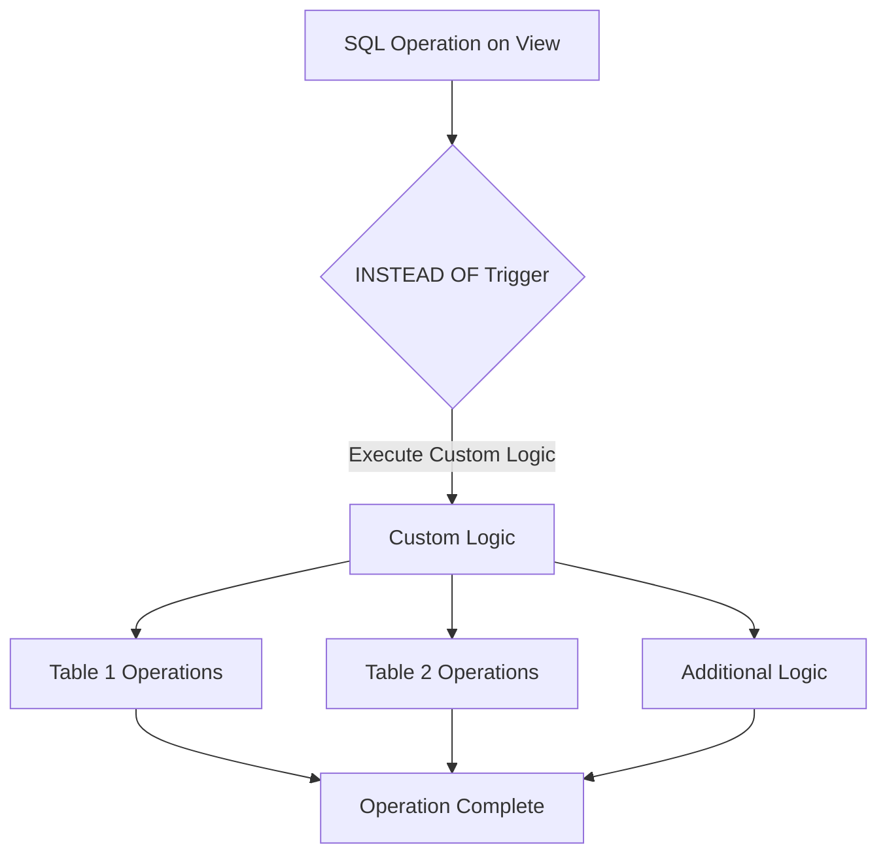

# SQL INSTEAD OF Triggers

## Introduction

When working with SQL databases, you may encounter situations where you need more control over operations on views, especially when they involve multiple tables. This is where **INSTEAD OF triggers** come into play. Unlike standard AFTER or BEFORE triggers that run after or before an event, INSTEAD OF triggers completely replace (or override) the original operation with custom actions you define.

INSTEAD OF triggers are primarily designed to work with views, allowing you to make non-updatable views updatable by defining custom logic for INSERT, UPDATE, and DELETE operations. This tutorial will walk you through the concept, syntax, and practical applications of INSTEAD OF triggers.

## What Are INSTEAD OF Triggers?

An INSTEAD OF trigger is a special type of SQL trigger that intercepts an INSERT, UPDATE, or DELETE operation on a view and executes custom code *instead of* the original operation. This is particularly useful because:

1. Views that join multiple tables are usually not directly updatable
2. Complex views often have limitations on the operations they support
3. You may need to implement special business rules or data validation when updating through a view

## Basic Syntax

The basic syntax for creating an INSTEAD OF trigger looks like this:

```sql
CREATE TRIGGER trigger_name
INSTEAD OF [INSERT | UPDATE | DELETE]
ON view_name
FOR EACH ROW
BEGIN
    -- Custom actions to perform instead of the original operation
END;
```

## When to Use INSTEAD OF Triggers

INSTEAD OF triggers are especially useful in the following scenarios:

1. Making complex views updatable
2. Implementing custom logic for view modifications
3. Distributing an operation on a view to multiple underlying tables
4. Validating and transforming data during view operations
5. Implementing business rules when data is modified through a view

## INSTEAD OF INSERT Trigger Example

Let's start with a practical example. Imagine we have a database for a bookstore with two tables: `authors` and `books`. We create a view that joins these tables:

```sql
-- Create the authors table
CREATE TABLE authors (
    author_id INT PRIMARY KEY,
    author_name VARCHAR(100) NOT NULL
);

-- Create the books table
CREATE TABLE books (
    book_id INT PRIMARY KEY,
    title VARCHAR(200) NOT NULL,
    author_id INT,
    price DECIMAL(10, 2),
    FOREIGN KEY (author_id) REFERENCES authors(author_id)
);

-- Create a view that joins authors and books
CREATE VIEW book_details AS
SELECT b.book_id, b.title, b.price, a.author_id, a.author_name
FROM books b
JOIN authors a ON b.author_id = a.author_id;
```

Now, if we try to insert data directly into this view, we'll get an error because the view spans multiple tables. Here's where an INSTEAD OF trigger helps:

```sql
CREATE TRIGGER insert_book_details
INSTEAD OF INSERT ON book_details
FOR EACH ROW
BEGIN
    -- Check if the author exists
    DECLARE author_exists INT;
    SELECT COUNT(*) INTO author_exists FROM authors WHERE author_id = NEW.author_id;
    
    -- If author doesn't exist, insert new author
    IF author_exists = 0 THEN
        INSERT INTO authors (author_id, author_name)
        VALUES (NEW.author_id, NEW.author_name);
    END IF;
    
    -- Insert the book
    INSERT INTO books (title, author_id, price)
    VALUES (NEW.title, NEW.author_id, NEW.price);
END;
```

With this trigger in place, we can now insert data directly into the view, and the trigger will handle distributing the data to the appropriate tables:

```sql
-- This will now work thanks to our INSTEAD OF trigger
INSERT INTO book_details (title, price, author_id, author_name)
VALUES ('Database Design Basics', 29.99, 101, 'Jane Smith');
```

**Result:**
- A new author (Jane Smith) is added to the `authors` table if author_id 101 doesn't exist
- A new book (Database Design Basics) is added to the `books` table
- The view `book_details` will now show the new book with its author

## INSTEAD OF UPDATE Trigger

Similarly, we can create an INSTEAD OF UPDATE trigger to handle updates to our view:

```sql
CREATE TRIGGER update_book_details
INSTEAD OF UPDATE ON book_details
FOR EACH ROW
BEGIN
    -- Update the book information
    UPDATE books
    SET title = NEW.title,
        price = NEW.price,
        author_id = NEW.author_id
    WHERE book_id = NEW.book_id;
    
    -- Update author information if needed
    UPDATE authors
    SET author_name = NEW.author_name
    WHERE author_id = NEW.author_id;
END;
```

Now we can update the view, and the changes will be properly applied to both underlying tables:

```sql
-- Update a book's price and author
UPDATE book_details
SET price = 34.99, author_name = 'Jane D. Smith'
WHERE book_id = 1;
```

**Result:**
- The book's price is updated in the `books` table
- The author's name is updated in the `authors` table
- The view reflects all these changes

## INSTEAD OF DELETE Trigger

Finally, let's implement an INSTEAD OF DELETE trigger:

```sql
CREATE TRIGGER delete_book_details
INSTEAD OF DELETE ON book_details
FOR EACH ROW
BEGIN
    -- Delete the book
    DELETE FROM books 
    WHERE book_id = OLD.book_id;
    
    -- Optionally, you might want to delete the author if they have no more books
    -- (this is just an example of potential business logic)
    DELETE FROM authors
    WHERE author_id = OLD.author_id
    AND NOT EXISTS (SELECT 1 FROM books WHERE author_id = OLD.author_id);
END;
```

Now we can delete from the view:

```sql
-- Delete a book from the view
DELETE FROM book_details
WHERE book_id = 1;
```

**Result:**
- The book is deleted from the `books` table
- If the author has no other books, they're also removed from the `authors` table
- The record no longer appears in the view

## Visual Representation of INSTEAD OF Triggers



## INSTEAD OF Triggers vs. Regular Triggers

Here's how INSTEAD OF triggers differ from regular (AFTER or BEFORE) triggers:

| Feature | INSTEAD OF Triggers | AFTER/BEFORE Triggers |
|---------|---------------------|------------------------|
| When they execute | Replace the original operation | Execute after/before the operation |
| Target objects | Primarily for views | Tables (and sometimes views) |
| Main purpose | Make non-updatable views updatable | Enforce business rules, audit changes |
| Access to changed data | Through NEW and OLD | Through NEW and OLD |
| Can prevent the operation | Inherently (by not performing it) | Only BEFORE triggers can |

## Real-World Application: Implementing a Shopping Cart

Let's explore a more complex real-world example: a shopping cart system that needs to handle inventory and orders.

```sql
-- Create tables
CREATE TABLE products (
    product_id INT PRIMARY KEY,
    product_name VARCHAR(100),
    stock_quantity INT,
    price DECIMAL(10, 2)
);

CREATE TABLE orders (
    order_id INT PRIMARY KEY,
    order_date DATETIME DEFAULT CURRENT_TIMESTAMP
);

CREATE TABLE order_items (
    order_id INT,
    product_id INT,
    quantity INT,
    price_at_order DECIMAL(10, 2),
    PRIMARY KEY (order_id, product_id),
    FOREIGN KEY (order_id) REFERENCES orders(order_id),
    FOREIGN KEY (product_id) REFERENCES products(product_id)
);

-- Create a view for the shopping cart
CREATE VIEW shopping_cart AS
SELECT p.product_id, p.product_name, p.price, oi.order_id, oi.quantity
FROM products p
LEFT JOIN order_items oi ON p.product_id = oi.product_id
LEFT JOIN orders o ON oi.order_id = o.order_id;
```

Now, let's create an INSTEAD OF trigger to handle the checkout process:

```sql
CREATE TRIGGER checkout_cart
INSTEAD OF INSERT ON shopping_cart
FOR EACH ROW
BEGIN
    DECLARE available_stock INT;
    DECLARE new_order_id INT;
    
    -- Check if we have enough stock
    SELECT stock_quantity INTO available_stock 
    FROM products 
    WHERE product_id = NEW.product_id;
    
    IF available_stock >= NEW.quantity THEN
        -- Create a new order if order_id is null
        IF NEW.order_id IS NULL THEN
            INSERT INTO orders (order_date) VALUES (CURRENT_TIMESTAMP);
            SET new_order_id = LAST_INSERT_ID();
        ELSE
            SET new_order_id = NEW.order_id;
        END IF;
        
        -- Add item to order
        INSERT INTO order_items (order_id, product_id, quantity, price_at_order)
        VALUES (new_order_id, NEW.product_id, NEW.quantity, NEW.price);
        
        -- Update product stock
        UPDATE products
        SET stock_quantity = stock_quantity - NEW.quantity
        WHERE product_id = NEW.product_id;
    ELSE
        SIGNAL SQLSTATE '45000'
        SET MESSAGE_TEXT = 'Not enough items in stock';
    END IF;
END;
```

With this trigger, when a user tries to add an item to their cart:

```sql
-- Add product to cart
INSERT INTO shopping_cart (product_id, product_name, price, quantity)
VALUES (101, 'SQL Guide Book', 45.99, 2);
```

The trigger will automatically:
1. Check if enough stock is available
2. Create a new order if needed
3. Add the item to the order
4. Update the inventory stock
5. Return an error if there's not enough stock

## Common Pitfalls and Best Practices

When working with INSTEAD OF triggers, keep these best practices in mind:

1. **Avoid Infinite Loops**: Be careful not to create recursive trigger situations where your trigger logic could end up calling itself.

2. **Handle NULL Values**: Remember to handle NULL values appropriately, especially for columns that might be optional.

3. **Error Handling**: Implement proper error handling to ensure your trigger fails gracefully.

4. **Performance Considerations**: INSTEAD OF triggers can impact performance, especially with complex logic. Use them judiciously.

5. **Document Your Triggers**: Always document what your triggers do, as they can make debugging more challenging.

6. **Transaction Management**: Ensure your trigger logic respects transaction boundaries and doesn't cause unexpected commits or rollbacks.

## Summary

INSTEAD OF triggers are powerful tools that allow you to customize how SQL operations work on views. They're especially valuable when:

- You need to make complex views updatable
- You want to implement specific business logic when data is modified through a view
- You need to distribute operations across multiple tables

By intercepting and replacing the default behavior of INSERT, UPDATE, and DELETE operations, INSTEAD OF triggers give you granular control over how your database responds to changes made through views.

## Additional Resources and Exercises

### Additional Resources
- [SQL Server Documentation on INSTEAD OF Triggers](https://docs.microsoft.com/en-us/sql/t-sql/statements/create-trigger-transact-sql)
- [Oracle Documentation on INSTEAD OF Triggers](https://docs.oracle.com/en/database/oracle/oracle-database/19/lnpls/CREATE-TRIGGER-statement.html)
- [PostgreSQL Documentation on Rules and Views](https://www.postgresql.org/docs/current/rules-views.html)

### Exercises

1. **Basic Exercise**: Create two tables, `departments` and `employees`, and a view that joins them. Then create an INSTEAD OF INSERT trigger that allows you to insert into this view.

2. **Intermediate Exercise**: Extend the shopping cart example to include an INSTEAD OF UPDATE trigger that allows users to modify the quantity of items in their cart while ensuring stock levels are respected.

3. **Advanced Exercise**: Create a logging system that uses INSTEAD OF triggers to audit all changes made through a set of views while also implementing the actual changes to the underlying tables.

4. **Challenge**: Design a view and INSTEAD OF triggers to implement a soft-delete system where records appear to be deleted but are actually marked as inactive in the underlying tables.