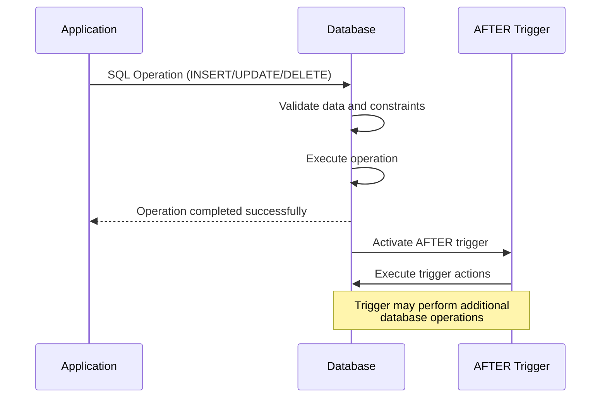

# SQL AFTER Triggers

## Introduction

SQL AFTER triggers are special types of stored procedures that automatically execute after specific events occur in a database. Unlike BEFORE triggers which run before an operation completes, AFTER triggers run only after the triggering SQL statement has been successfully executed. These powerful database objects help maintain data integrity, automate processes, and implement business rules without modifying application code.

In this tutorial, you'll learn how AFTER triggers work, how to create them, and explore practical use cases that demonstrate their value in real-world applications.

## What Are AFTER Triggers?

AFTER triggers, as the name suggests, execute after a specific database event occurs. These events typically include:

- `INSERT` operations - when new rows are added to a table
- `UPDATE` operations - when existing rows are modified
- `DELETE` operations - when rows are removed from a table

The key characteristics of AFTER triggers include:

- They execute only if the triggering operation completes successfully
- They can access the data that was modified by the operation
- They cannot modify the data in the same table that activated the trigger (to prevent recursion)
- They can affect other tables or external processes

## Syntax for Creating AFTER Triggers

Here's the basic syntax for creating an AFTER trigger:

```sql
CREATE TRIGGER trigger_name
AFTER { INSERT | UPDATE | DELETE }
ON table_name
FOR EACH ROW
BEGIN
    -- Trigger logic goes here
END;
```

Let's break down the components:

- `CREATE TRIGGER trigger_name`: Defines the name of your trigger
- `AFTER { INSERT | UPDATE | DELETE }`: Specifies when the trigger should execute
- `ON table_name`: Identifies which table the trigger monitors
- `FOR EACH ROW`: Makes the trigger fire once for each row affected by the operation
- `BEGIN...END`: Contains the SQL statements to execute when the trigger activates

## Creating Your First AFTER Trigger

Let's create a simple example. Consider a situation where we have two tables: `customers` and `customer_audit`. We want to log all changes to the customer table for auditing purposes.

First, let's create our tables:

```sql
CREATE TABLE customers (
    customer_id INT PRIMARY KEY AUTO_INCREMENT,
    name VARCHAR(100),
    email VARCHAR(100),
    created_at TIMESTAMP DEFAULT CURRENT_TIMESTAMP
);

CREATE TABLE customer_audit (
    audit_id INT PRIMARY KEY AUTO_INCREMENT,
    customer_id INT,
    action_type VARCHAR(10),
    action_date TIMESTAMP DEFAULT CURRENT_TIMESTAMP,
    old_name VARCHAR(100),
    new_name VARCHAR(100),
    old_email VARCHAR(100),
    new_email VARCHAR(100)
);
```

Now, let's create an AFTER trigger that logs updates to the customer table:

```sql
CREATE TRIGGER after_customer_update
AFTER UPDATE ON customers
FOR EACH ROW
BEGIN
    INSERT INTO customer_audit 
        (customer_id, action_type, old_name, new_name, old_email, new_email)
    VALUES
        (OLD.customer_id, 'UPDATE', OLD.name, NEW.name, OLD.email, NEW.email);
END;
```

### How It Works

When a customer record is updated:
1. The update operation completes successfully
2. The trigger activates
3. It captures both the old values (using `OLD.column_name`) and new values (using `NEW.column_name`)
4. It inserts a new record into the audit table with these values

### Testing the Trigger

Let's see the trigger in action:

```sql
-- Insert a new customer
INSERT INTO customers (name, email) VALUES ('John Doe', 'john@example.com');

-- Update the customer
UPDATE customers SET email = 'john.doe@company.com' WHERE customer_id = 1;

-- Check the audit table
SELECT * FROM customer_audit;
```

Output:

```
audit_id | customer_id | action_type | action_date           | old_name  | new_name  | old_email         | new_email
---------|-------------|-------------|------------------------|-----------|-----------|-------------------|---------------------
1        | 1           | UPDATE      | 2023-05-10 14:22:31   | John Doe  | John Doe  | john@example.com  | john.doe@company.com
```

## Multiple Events in a Single Trigger

You can create a trigger that responds to multiple events:

```sql
CREATE TRIGGER after_customer_changes
AFTER INSERT OR UPDATE OR DELETE ON customers
FOR EACH ROW
BEGIN
    CASE
        WHEN TG_OP = 'INSERT' THEN
            INSERT INTO customer_audit (customer_id, action_type, new_name, new_email)
            VALUES (NEW.customer_id, 'INSERT', NEW.name, NEW.email);
        WHEN TG_OP = 'UPDATE' THEN
            INSERT INTO customer_audit (customer_id, action_type, old_name, new_name, old_email, new_email)
            VALUES (OLD.customer_id, 'UPDATE', OLD.name, NEW.name, OLD.email, NEW.email);
        WHEN TG_OP = 'DELETE' THEN
            INSERT INTO customer_audit (customer_id, action_type, old_name, old_email)
            VALUES (OLD.customer_id, 'DELETE', OLD.name, OLD.email);
    END CASE;
END;
```

Note: The syntax for handling multiple events may vary slightly between database systems. The example above uses PostgreSQL syntax with `TG_OP` to determine the operation type.

## Real-World Applications of AFTER Triggers

AFTER triggers have numerous practical applications in database management. Here are some common use cases:

### 1. Audit Trails

As shown in our example above, AFTER triggers are perfect for maintaining audit trails that track who changed what and when. This is essential for compliance with regulations like GDPR, HIPAA, or SOX.

### 2. Data Synchronization

AFTER triggers can keep multiple tables in sync by automatically propagating changes from one table to another:

```sql
CREATE TRIGGER after_product_update
AFTER UPDATE ON products
FOR EACH ROW
BEGIN
    -- Update the product_catalog table with the new information
    UPDATE product_catalog
    SET name = NEW.name, price = NEW.price, description = NEW.description
    WHERE product_id = NEW.product_id;
END;
```

### 3. Notification Systems

AFTER triggers can be used to create notifications when important data changes:

```sql
CREATE TRIGGER after_order_status_change
AFTER UPDATE ON orders
FOR EACH ROW
BEGIN
    IF OLD.status != NEW.status AND NEW.status = 'shipped' THEN
        INSERT INTO notifications (user_id, message, created_at)
        VALUES (NEW.customer_id, CONCAT('Your order #', NEW.order_id, ' has been shipped!'), NOW());
    END IF;
END;
```

### 4. Denormalization for Performance

AFTER triggers can maintain denormalized data for performance optimization:

```sql
CREATE TRIGGER after_order_detail_change
AFTER INSERT OR UPDATE OR DELETE ON order_details
FOR EACH ROW
BEGIN
    -- Recalculate the total amount for the order
    UPDATE orders
    SET total_amount = (
        SELECT SUM(quantity * price)
        FROM order_details
        WHERE order_id = CASE
            WHEN TG_OP = 'DELETE' THEN OLD.order_id
            ELSE NEW.order_id
        END
    )
    WHERE order_id = CASE
        WHEN TG_OP = 'DELETE' THEN OLD.order_id
        ELSE NEW.order_id
    END;
END;
```

## Visualizing AFTER Triggers

Here's a diagram showing how AFTER triggers fit into the database operation flow:



## Best Practices for Using AFTER Triggers

1. **Keep triggers simple**: Complex trigger logic can be difficult to debug and maintain.

2. **Be cautious with cascading triggers**: Triggers that activate other triggers can lead to unexpected behavior and performance issues.

3. **Add comments**: Document the purpose of your triggers and how they work.

4. **Use error handling**: Implement appropriate error handling to deal with exceptions.

5. **Monitor performance**: Triggers add overhead to database operations, so monitor their impact.

6. **Avoid infinite loops**: Be careful not to create situations where triggers can recursively activate themselves.

## AFTER vs. BEFORE Triggers: When to Use Each

| Aspect | AFTER Triggers | BEFORE Triggers |
|--------|---------------|----------------|
| Timing | Execute after the operation | Execute before the operation |
| Data Access | Can access final state after changes | Can access and modify data before changes |
| Usage | Auditing, notifications, syncing other tables | Data validation, value modification |
| Error Handling | Can't prevent the operation (already completed) | Can prevent operation by raising an error |

Choose AFTER triggers when you need to react to changes that have already occurred, and BEFORE triggers when you need to validate or modify data before it's saved.

## Common AFTER Trigger Errors and Solutions

### 1. Mutating Table Errors

**Problem**: In some database systems (like Oracle), you can't modify the same table that fired the trigger.

**Solution**: Use a compound trigger or deferred triggers, or implement the logic in a different way.

### 2. Infinite Recursion

**Problem**: A trigger that modifies a table which then activates the same trigger again.

**Solution**: Add conditions to prevent recursion or redesign your trigger logic.

```sql
CREATE TRIGGER after_employee_update
AFTER UPDATE ON employees
FOR EACH ROW
BEGIN
    -- Prevent recursion by checking if this is a trigger-initiated update
    IF NOT updating_from_trigger THEN
        -- Set a flag to indicate we're in a trigger
        SET updating_from_trigger = TRUE;
        
        -- Perform the operation
        UPDATE employee_history SET last_updated = NOW() 
        WHERE employee_id = NEW.employee_id;
        
        -- Reset the flag
        SET updating_from_trigger = FALSE;
    END IF;
END;
```

## Summary

SQL AFTER triggers are powerful tools that execute automatically following database operations. They provide an elegant way to implement business logic, maintain data integrity, create audit trails, and automate related tasks without modifying application code.

Key points to remember:
- AFTER triggers execute only after the triggering operation completes successfully
- They can access both old and new data values using the OLD and NEW references
- Common applications include auditing, synchronization, and notifications
- They should be designed carefully to avoid performance issues and infinite loops

By mastering AFTER triggers, you can create more robust and automated database systems that maintain data integrity while reducing the burden on application code.

## Exercises

1. Create an AFTER INSERT trigger that automatically adds a welcome message to a notifications table when a new user registers.

2. Design an AFTER DELETE trigger that moves deleted records to an archive table instead of losing the data completely.

3. Implement an AFTER UPDATE trigger that tracks price changes in a products table and calculates the percentage of the price change.

4. Create a trigger that maintains a count of orders per customer in a summary table whenever orders are added or deleted.

## Additional Resources

- [MySQL Trigger Documentation](https://dev.mysql.com/doc/refman/8.0/en/trigger-syntax.html)
- [PostgreSQL Trigger Documentation](https://www.postgresql.org/docs/current/trigger-definition.html)
- [SQL Server Trigger Documentation](https://docs.microsoft.com/en-us/sql/t-sql/statements/create-trigger-transact-sql)
- [Oracle Trigger Documentation](https://docs.oracle.com/en/database/oracle/oracle-database/19/lnpls/CREATE-TRIGGER-statement.html)