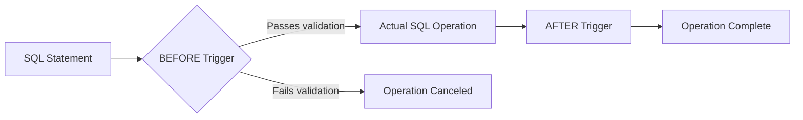

# SQL BEFORE Triggers

## Introduction

When working with databases, there are often scenarios where you want certain actions to automatically occur before data is modified. This is where SQL BEFORE triggers come into play. A BEFORE trigger is a special type of database trigger that executes automatically before a specified SQL operation (INSERT, UPDATE, or DELETE) is performed on a table.

In this tutorial, we'll explore BEFORE triggers in SQL, understand their purpose, learn how to create them, and see practical applications through examples. BEFORE triggers are particularly useful for data validation, enforcing business rules, and maintaining data integrity before changes are committed to the database.

## Understanding BEFORE Triggers

### What is a BEFORE Trigger?

A BEFORE trigger is a database object that executes automatically before a specified DML (Data Manipulation Language) operation occurs. These operations include:

- INSERT: Before new data is added to a table
- UPDATE: Before existing data in a table is modified
- DELETE: Before data is removed from a table

The key characteristic of a BEFORE trigger is its timing - it runs **before** the actual database operation takes place, which allows you to:

1. Validate or modify the data before it's written to the database
2. Cancel the operation if certain conditions aren't met
3. Automatically set values or make calculations before data is stored

### BEFORE Trigger vs. AFTER Trigger

It's important to understand the distinction between BEFORE and AFTER triggers:

| BEFORE Trigger | AFTER Trigger |
|----------------|---------------|
| Executes before the operation | Executes after the operation |
| Can modify data before it's written | Can't modify the data being written |
| Can prevent the operation from occurring | Cannot prevent the operation (it's already happened) |
| Useful for validation and data preparation | Useful for auditing and maintaining related tables |



## Creating BEFORE Triggers

The syntax for creating a BEFORE trigger varies slightly between database systems, but the core concept remains the same. Let's look at examples in MySQL, PostgreSQL, and Oracle.

### MySQL Syntax

```sql
CREATE TRIGGER trigger_name
BEFORE INSERT|UPDATE|DELETE ON table_name
FOR EACH ROW
BEGIN
    -- trigger logic here
END;
```

### PostgreSQL Syntax

```sql
CREATE TRIGGER trigger_name
BEFORE INSERT OR UPDATE OR DELETE ON table_name
FOR EACH ROW
EXECUTE FUNCTION trigger_function_name();
```

### Oracle Syntax

```sql
CREATE OR REPLACE TRIGGER trigger_name
BEFORE INSERT OR UPDATE OR DELETE ON table_name
FOR EACH ROW
BEGIN
    -- trigger logic here
END;
```

## Practical Examples

Let's explore some practical examples of BEFORE triggers to see how they can be used in real-world scenarios.

### Example 1: Data Validation

One of the most common uses of BEFORE triggers is to validate data before it's inserted or updated in a table.

Consider a scenario where we have a `students` table and want to ensure that:
1. Student ages are between 16 and 60
2. Email addresses contain an '@' symbol

Here's how we can implement this using a BEFORE trigger in MySQL:

```sql
-- Create the students table
CREATE TABLE students (
    student_id INT AUTO_INCREMENT PRIMARY KEY,
    name VARCHAR(100) NOT NULL,
    age INT,
    email VARCHAR(100)
);

-- Create a BEFORE trigger for validation
DELIMITER //
CREATE TRIGGER validate_student
BEFORE INSERT ON students
FOR EACH ROW
BEGIN
    -- Validate age
    IF NEW.age < 16 OR NEW.age > 60 THEN
        SIGNAL SQLSTATE '45000'
        SET MESSAGE_TEXT = 'Student age must be between 16 and 60';
    END IF;
    
    -- Validate email
    IF NEW.email NOT LIKE '%@%' THEN
        SIGNAL SQLSTATE '45000'
        SET MESSAGE_TEXT = 'Invalid email format';
    END IF;
END //
DELIMITER ;
```

Let's test our trigger with some example data:

```sql
-- This should work
INSERT INTO students (name, age, email) VALUES ('John Doe', 20, 'john@example.com');

-- This should fail due to age validation
INSERT INTO students (name, age, email) VALUES ('Young Student', 12, 'young@example.com');

-- This should fail due to email validation
INSERT INTO students (name, age, email) VALUES ('Bad Email', 25, 'bademailexample.com');
```

**Output:**
```
Query OK, 1 row affected (0.01 sec)

ERROR 1644 (45000): Student age must be between 16 and 60

ERROR 1644 (45000): Invalid email format
```

### Example 2: Automatic Value Generation

BEFORE triggers can automatically generate or modify values before they're inserted:

```sql
-- Create a products table
CREATE TABLE products (
    product_id INT AUTO_INCREMENT PRIMARY KEY,
    name VARCHAR(100) NOT NULL,
    price DECIMAL(10, 2),
    created_at DATETIME,
    updated_at DATETIME,
    price_with_tax DECIMAL(10, 2)
);

-- Create a BEFORE trigger to set timestamps and calculate tax
DELIMITER //
CREATE TRIGGER before_product_insert
BEFORE INSERT ON products
FOR EACH ROW
BEGIN
    -- Set the timestamps
    SET NEW.created_at = NOW();
    SET NEW.updated_at = NOW();
    
    -- Calculate price with tax (assuming 10% tax)
    SET NEW.price_with_tax = NEW.price * 1.10;
END //
DELIMITER ;

-- Create a BEFORE trigger for updates
CREATE TRIGGER before_product_update
BEFORE UPDATE ON products
FOR EACH ROW
BEGIN
    -- Update the timestamp
    SET NEW.updated_at = NOW();
    
    -- Recalculate price with tax if price changed
    IF NEW.price != OLD.price THEN
        SET NEW.price_with_tax = NEW.price * 1.10;
    END IF;
END //
DELIMITER ;
```

Let's test our triggers:

```sql
-- Insert a new product
INSERT INTO products (name, price) VALUES ('Laptop', 999.99);

-- Check the result
SELECT * FROM products;

-- Update the price
UPDATE products SET price = 1099.99 WHERE product_id = 1;

-- Check the result after update
SELECT * FROM products;
```

**Output:**
```
-- After INSERT
product_id | name    | price   | created_at          | updated_at          | price_with_tax
-----------|---------|---------|---------------------|---------------------|---------------
1          | Laptop  | 999.99  | 2023-07-12 14:25:00 | 2023-07-12 14:25:00 | 1099.99

-- After UPDATE
product_id | name    | price    | created_at          | updated_at          | price_with_tax
-----------|---------|----------|---------------------|---------------------|---------------
1          | Laptop  | 1099.99  | 2023-07-12 14:25:00 | 2023-07-12 14:26:30 | 1209.99
```

### Example 3: Preventing Operations

BEFORE triggers can prevent operations based on business rules:

```sql
-- Create an orders table
CREATE TABLE orders (
    order_id INT AUTO_INCREMENT PRIMARY KEY,
    customer_id INT NOT NULL,
    order_date DATE,
    total_amount DECIMAL(10, 2),
    is_closed BOOLEAN DEFAULT FALSE
);

-- Create a BEFORE trigger to prevent updates on closed orders
DELIMITER //
CREATE TRIGGER prevent_closed_order_update
BEFORE UPDATE ON orders
FOR EACH ROW
BEGIN
    IF OLD.is_closed = TRUE THEN
        SIGNAL SQLSTATE '45000'
        SET MESSAGE_TEXT = 'Cannot update a closed order';
    END IF;
END //
DELIMITER ;
```

Let's test our trigger:

```sql
-- Insert a sample order
INSERT INTO orders (customer_id, order_date, total_amount) 
VALUES (101, '2023-07-10', 250.00);

-- Update the order (should work)
UPDATE orders SET total_amount = 300.00 WHERE order_id = 1;

-- Close the order
UPDATE orders SET is_closed = TRUE WHERE order_id = 1;

-- Try to update the closed order (should fail)
UPDATE orders SET total_amount = 350.00 WHERE order_id = 1;
```

**Output:**
```
Query OK, 1 row affected (0.01 sec)

Query OK, 1 row affected (0.01 sec)

Query OK, 1 row affected (0.01 sec)

ERROR 1644 (45000): Cannot update a closed order
```

## Common Use Cases for BEFORE Triggers

BEFORE triggers are particularly useful in the following scenarios:

1. **Data Validation and Integrity**
   - Enforcing complex business rules that can't be handled by simple constraints
   - Validating data formats and relationships before they're stored

2. **Automatic Data Enrichment**
   - Setting default values for missing fields
   - Generating timestamps or tracking information
   - Computing derived values

3. **Security and Access Control**
   - Enforcing row-level security policies
   - Validating user permissions before allowing modifications

4. **Preventing Invalid Operations**
   - Blocking changes during specific time periods
   - Preventing modifications to historical data

## Best Practices for BEFORE Triggers

When working with BEFORE triggers, keep these best practices in mind:

1. **Keep Triggers Lightweight**
   - Triggers execute for every row affected by an operation
   - Heavy processing in triggers can significantly slow down operations

2. **Document Your Triggers**
   - Triggers can easily become "hidden logic" in your database
   - Ensure they're well-documented for other developers

3. **Consider Alternatives**
   - For simple validations, check if database constraints could be used instead
   - For complex logic, consider if application-level validation might be clearer

4. **Error Handling**
   - Provide clear error messages when rejecting operations
   - Consider logging validation failures for debugging

5. **Testing**
   - Thoroughly test triggers with various scenarios, including edge cases
   - Verify behavior with bulk operations (multiple rows)

## Common Mistakes to Avoid

1. **Infinite Recursion**
   - Avoid having triggers that modify the same table in a way that fires the trigger again
   - This can lead to infinite recursion and crash your database

2. **Performance Issues**
   - Be cautious with triggers that query other tables
   - Each row processed might lead to additional queries

3. **Loss of Portability**
   - Trigger syntax varies between database systems
   - Heavily relying on triggers can make database migration difficult

4. **Debugging Complexity**
   - Errors in triggers can be hard to debug
   - Start with simple triggers and gradually add complexity

## Summary

BEFORE triggers are powerful tools in SQL that allow you to execute custom logic before data changes are committed to the database. They're particularly valuable for:

- Validating data before it's written
- Automatically setting or modifying values
- Enforcing business rules that go beyond simple constraints
- Preventing invalid operations based on complex conditions

By understanding when and how to use BEFORE triggers, you can enhance your database design and ensure data integrity at the database level.

## Exercises

To practice your understanding of BEFORE triggers, try the following exercises:

1. Create a BEFORE INSERT trigger that automatically converts product names to uppercase before they're stored in a table.

2. Create a BEFORE UPDATE trigger that prevents salary decreases in an employees table.

3. Implement a BEFORE INSERT trigger that generates a unique customer code based on the customer's name and region.

4. Create a BEFORE trigger that ensures the start date of a project is always before its end date.

5. Design a BEFORE trigger system that maintains an audit trail of attempted changes that were rejected by validation rules.

## Additional Resources

- [MySQL Trigger Documentation](https://dev.mysql.com/doc/refman/8.0/en/trigger-syntax.html)
- [PostgreSQL Trigger Documentation](https://www.postgresql.org/docs/current/trigger-definition.html)
- [Oracle Trigger Documentation](https://docs.oracle.com/en/database/oracle/oracle-database/19/lnpls/CREATE-TRIGGER-statement.html)
- [SQL Trigger Best Practices](https://www.sqlshack.com/sql-triggers-best-practices/)