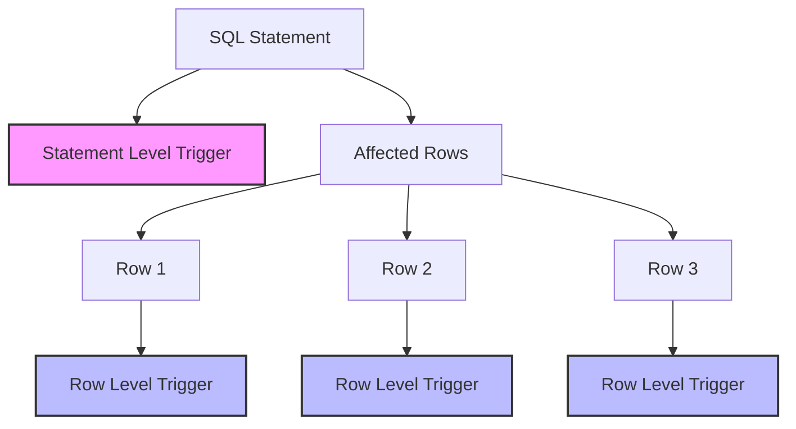

# SQL Row Level Triggers

## Introduction

Row level triggers are a powerful feature in SQL databases that allow you to automatically execute code when specific data manipulation events occur on individual rows in a table. Unlike statement level triggers (which fire once per SQL statement), row level triggers fire once for each row affected by the triggering statement.

These triggers serve as a mechanism to enforce complex business rules, maintain data integrity, audit changes, and automate related tasks whenever data is modified at the row level.

## What Are Row Level Triggers?

A row level trigger is a special type of stored procedure that automatically executes when a specified data modification event (INSERT, UPDATE, or DELETE) occurs on a particular table. The key characteristic of row level triggers is that they activate **once per affected row** rather than once per statement.

### Key Characteristics

- **Row-by-Row Processing**: Executes once for each row affected by the triggering DML statement
- **Access to Old and New Data**: Can access both the previous values (OLD) and new values (NEW) of the data
- **Timing Options**: Can be configured to fire BEFORE, AFTER, or INSTEAD OF the triggering event
- **Conditional Execution**: Can include conditions to determine whether the trigger action should execute

## Row Level vs. Statement Level Triggers

Before diving deeper, it's important to understand the difference between row level and statement level triggers:



| Feature | Row Level Trigger | Statement Level Trigger |
|---------|-------------------|-------------------------|
| Execution Frequency | Once for each row affected | Once per SQL statement |
| Performance Impact | Higher (for multiple rows) | Lower |
| Access to Data | Can reference OLD and NEW values for each row | Works with the statement as a whole |
| Use Case | Complex business rules on individual records | Logging, auditing on entire operations |

## Creating Row Level Triggers

The syntax for creating row level triggers varies slightly across different database systems. Let's look at examples in popular SQL database platforms:

### MySQL Syntax

```sql
CREATE TRIGGER trigger_name
{BEFORE | AFTER} {INSERT | UPDATE | DELETE} ON table_name
FOR EACH ROW
BEGIN
    -- Trigger logic here using OLD and NEW references
END;
```

### PostgreSQL Syntax

```sql
CREATE TRIGGER trigger_name
{BEFORE | AFTER} {INSERT | UPDATE | DELETE} ON table_name
FOR EACH ROW
EXECUTE FUNCTION trigger_function_name();
```

### SQL Server Syntax

```sql
CREATE TRIGGER trigger_name
ON table_name
{AFTER | INSTEAD OF} {INSERT | UPDATE | DELETE}
AS
BEGIN
    -- Trigger logic here using inserted and deleted tables
END;
```

### Oracle Syntax

```sql
CREATE OR REPLACE TRIGGER trigger_name
{BEFORE | AFTER} {INSERT | UPDATE | DELETE} ON table_name
FOR EACH ROW
BEGIN
    -- Trigger logic here using :OLD and :NEW references
END;
```

## Working with Row Values: OLD and NEW References

A key feature of row level triggers is the ability to access both the previous and new values of the affected rows:

| Reference | Description | Available in |
|-----------|-------------|--------------|
| OLD or :OLD | Contains the original values before the change | UPDATE and DELETE triggers |
| NEW or :NEW | Contains the new values after the change | INSERT and UPDATE triggers |

For SQL Server, instead of OLD and NEW, the special tables `deleted` and `inserted` are used.

## Practical Examples

Let's explore some practical examples of row level triggers using MySQL syntax.

### Example 1: Audit Trail for Employee Salary Changes

```sql
-- Create employees table
CREATE TABLE employees (
    employee_id INT PRIMARY KEY,
    first_name VARCHAR(50),
    last_name VARCHAR(50),
    salary DECIMAL(10, 2)
);

-- Create salary audit table
CREATE TABLE salary_audit (
    audit_id INT AUTO_INCREMENT PRIMARY KEY,
    employee_id INT,
    old_salary DECIMAL(10, 2),
    new_salary DECIMAL(10, 2),
    changed_by VARCHAR(50),
    change_date TIMESTAMP DEFAULT CURRENT_TIMESTAMP
);

-- Create row level trigger
DELIMITER //
CREATE TRIGGER salary_change_audit
AFTER UPDATE ON employees
FOR EACH ROW
BEGIN
    IF OLD.salary != NEW.salary THEN
        INSERT INTO salary_audit(employee_id, old_salary, new_salary, changed_by)
        VALUES(NEW.employee_id, OLD.salary, NEW.salary, CURRENT_USER());
    END IF;
END//
DELIMITER ;

-- Example usage
INSERT INTO employees VALUES(1, 'John', 'Doe', 50000);
UPDATE employees SET salary = 55000 WHERE employee_id = 1;

-- Result in salary_audit
-- | audit_id | employee_id | old_salary | new_salary | changed_by | change_date        |
-- |----------|-------------|------------|------------|------------|---------------------|
-- | 1        | 1           | 50000.00   | 55000.00   | root@localhost | 2023-08-15 14:23:42 |
```

In this example, whenever an employee's salary is updated, the trigger automatically creates an audit record that tracks who made the change and when it occurred.

### Example 2: Enforcing Business Rules with BEFORE Triggers

```sql
-- Create inventory table
CREATE TABLE products (
    product_id INT PRIMARY KEY,
    product_name VARCHAR(100),
    stock_quantity INT,
    min_stock_level INT
);

-- Create reorder log table
CREATE TABLE reorder_log (
    log_id INT AUTO_INCREMENT PRIMARY KEY,
    product_id INT,
    reorder_quantity INT,
    log_date TIMESTAMP DEFAULT CURRENT_TIMESTAMP
);

-- Create row level trigger
DELIMITER //
CREATE TRIGGER check_inventory_level
BEFORE UPDATE ON products
FOR EACH ROW
BEGIN
    -- Prevent negative stock
    IF NEW.stock_quantity < 0 THEN
        SET NEW.stock_quantity = 0;
    END IF;
    
    -- Auto create reorder log when stock falls below minimum
    IF NEW.stock_quantity < NEW.min_stock_level 
       AND OLD.stock_quantity >= OLD.min_stock_level THEN
        INSERT INTO reorder_log(product_id, reorder_quantity)
        VALUES(NEW.product_id, NEW.min_stock_level * 2 - NEW.stock_quantity);
    END IF;
END//
DELIMITER ;

-- Example usage
INSERT INTO products VALUES(101, 'Laptop', 20, 5);
UPDATE products SET stock_quantity = 3 WHERE product_id = 101;

-- Result in reorder_log
-- | log_id | product_id | reorder_quantity | log_date            |
-- |--------|------------|------------------|---------------------|
-- | 1      | 101        | 7                | 2023-08-15 14:30:22 |
```

This example demonstrates two business rules enforced by a BEFORE row trigger:
1. Preventing negative inventory levels
2. Automatically creating reorder logs when stock falls below the minimum level

### Example 3: Cascading Changes Across Related Tables

```sql
-- Create customer table
CREATE TABLE customers (
    customer_id INT PRIMARY KEY,
    customer_name VARCHAR(100),
    status VARCHAR(20) DEFAULT 'active'
);

-- Create orders table
CREATE TABLE orders (
    order_id INT PRIMARY KEY,
    customer_id INT,
    order_date DATE,
    status VARCHAR(20) DEFAULT 'pending',
    FOREIGN KEY (customer_id) REFERENCES customers(customer_id)
);

-- Create row level trigger
DELIMITER //
CREATE TRIGGER update_customer_orders
AFTER UPDATE ON customers
FOR EACH ROW
BEGIN
    IF NEW.status = 'inactive' AND OLD.status = 'active' THEN
        UPDATE orders 
        SET status = 'cancelled' 
        WHERE customer_id = NEW.customer_id AND status = 'pending';
    END IF;
END//
DELIMITER ;

-- Example usage
INSERT INTO customers VALUES(1, 'Acme Corp', 'active');
INSERT INTO orders VALUES(101, 1, CURRENT_DATE, 'pending');
INSERT INTO orders VALUES(102, 1, CURRENT_DATE, 'pending');
UPDATE customers SET status = 'inactive' WHERE customer_id = 1;

-- Result in orders table
-- | order_id | customer_id | order_date | status    |
-- |----------|-------------|------------|-----------|
-- | 101      | 1           | 2023-08-15 | cancelled |
-- | 102      | 1           | 2023-08-15 | cancelled |
```

This example shows how a row level trigger can maintain data consistency across related tables by automatically cancelling pending orders when a customer becomes inactive.

## Best Practices for Row Level Triggers

To ensure your row level triggers are efficient and maintainable, follow these best practices:

1. **Keep Triggers Simple**: Minimize the amount of code in triggers to improve performance. Complex logic is better placed in stored procedures.

2. **Avoid Infinite Loops**: Be careful when triggers modify tables that have other triggers, as this can cause infinite loops.

3. **Handle Errors**: Include error handling in your triggers to prevent database operations from failing silently.

4. **Document Your Triggers**: Add comments explaining the purpose and logic of each trigger.

5. **Optimize for Performance**: Remember that row level triggers execute once per affected row, so be mindful of their impact on large operations.

6. **Consider Alternatives**: For some scenarios, constraints or application logic might be more appropriate than triggers.

## Common Challenges and Troubleshooting

### Trigger Performance Issues

When a statement affects many rows, row level triggers can significantly impact performance. To mitigate this:

- Optimize the trigger code
- Consider using statement level triggers instead
- Use conditional logic to execute only when necessary

### Debugging Triggers

Debugging triggers can be challenging since they execute automatically. Some approaches include:

- Adding logging statements to record trigger activity
- Using database-specific debugging tools
- Testing with small data sets first

### Trigger Ordering

When multiple triggers are defined on the same table for the same event, understanding the execution order is important:

- In MySQL, you can specify FOLLOWS and PRECEDES to control trigger order
- In PostgreSQL, triggers fire in alphabetical order by name
- In SQL Server, you can specify the first and last triggers using sp_settriggerorder

## Real-World Applications

Row level triggers are commonly used for:

1. **Data Auditing**: Track changes to sensitive data like financial records or personal information.

2. **Enforcing Complex Business Rules**: Implement checks that go beyond simple constraints.

3. **Maintaining Derived Data**: Keep calculated fields or summary tables up-to-date automatically.

4. **Integration**: Synchronize data with external systems or services.

5. **Security**: Implement row-level security by validating changes against user permissions.

## Summary

Row level triggers are a powerful SQL feature that allows for automatic execution of code in response to data changes at the individual row level. They provide a way to enforce business rules, maintain data integrity, and automate related tasks directly within the database.

Key points to remember:

- Row level triggers execute once for each affected row
- They can access both old and new values of the data
- Different database systems have slightly different syntax
- While powerful, they should be used judiciously with attention to performance impacts

By following best practices and understanding the nuances of how row level triggers work in your specific database system, you can effectively leverage them to build robust, consistent database applications.

## Exercises

1. Create a row level trigger that maintains a running total in a summary table whenever records are inserted, updated, or deleted in a details table.

2. Implement a trigger that enforces a business rule where premium customers cannot have their service level downgraded without manager approval (hint: use a separate approvals table).

3. Design a trigger-based audit system that tracks all changes to a customer information table, storing who made each change and when.

4. Create a trigger that automatically updates the "last_modified" timestamp on a table whenever any field in a row is changed.

5. Implement a stock management system using triggers that automatically creates purchase orders when inventory falls below a threshold.

## Additional Resources

- [MySQL Trigger Documentation](https://dev.mysql.com/doc/refman/8.0/en/trigger-syntax.html)
- [PostgreSQL Trigger Documentation](https://www.postgresql.org/docs/current/trigger-definition.html)
- [SQL Server Trigger Documentation](https://docs.microsoft.com/en-us/sql/t-sql/statements/create-trigger-transact-sql)
- [Oracle Trigger Documentation](https://docs.oracle.com/en/database/oracle/oracle-database/19/lnpls/CREATE-TRIGGER-statement.html)
- Book: "SQL Triggers and Stored Procedures" by Kevin Loney
- Online Course: "Advanced SQL: Triggers, Stored Procedures, and Functions" on various learning platforms